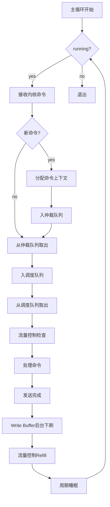
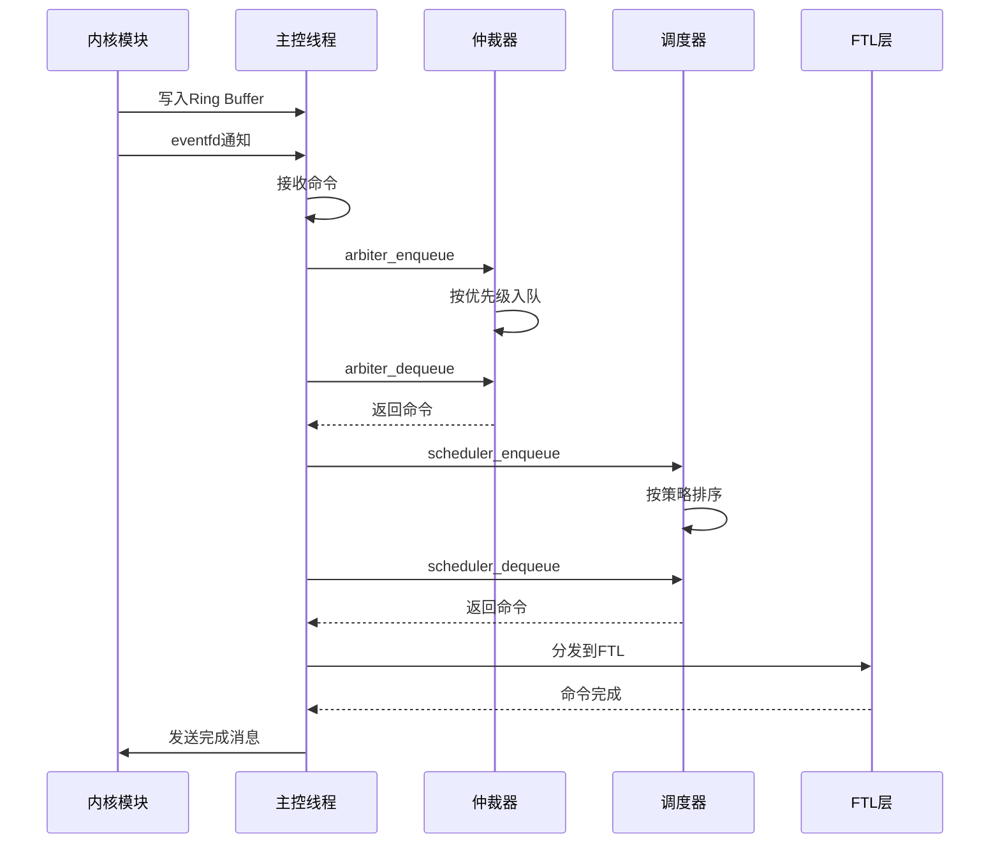

# 高保真全栈SSD模拟器（HFSSS）概要设计文档

**文档名称**：主控线程模块概要设计
**文档版本**：V1.0
**编制日期**：2026-03-08
**设计阶段**：V1.0 (Alpha)
**密级**：内部资料

---

## 修订历史

| 版本 | 日期 | 作者 | 修订说明 |
|------|------|------|----------|
| V0.1 | 2026-03-08 | 架构组 | 初稿 |
| V1.0 | 2026-03-08 | 架构组 | 正式发布 |

---

## 目录

1. [模块概述](#1-模块概述)
2. [功能需求回顾](#2-功能需求回顾)
3. [系统架构设计](#3-系统架构设计)
4. [详细设计](#4-详细设计)
5. [接口设计](#5-接口设计)
6. [数据结构设计](#6-数据结构设计)
7. [流程图](#7-流程图)
8. [性能设计](#8-性能设计)
9. [错误处理设计](#9-错误处理设计)
10. [测试设计](#10-测试设计)

---

## 1. 模块概述

### 1.1 模块定位

主控线程是整个SSD模拟器的"大脑"，负责接收来自PCIe/NVMe模块的命令，进行高层调度和资源仲裁，将命令分发给固件CPU核心线程执行，并协调各子系统的协同工作。主控线程运行于用户空间守护进程中，通过实时线程（SCHED_FIFO调度策略）和CPU绑定（CPU Affinity）确保低延迟响应。

### 1.2 模块职责

本模块负责以下核心功能：
- 内核-用户空间通信：通过共享内存Ring Buffer接收内核模块的NVMe命令
- 命令仲裁策略：NVMe WRR（Weighted Round Robin）仲裁，Admin命令优先
- 命令分发：按命令类型分发到对应的固件CPU核心线程池
- I/O调度器：基于目标NAND通道/Die的贪心调度，写命令合并，读预取
- 写缓冲区管理：全局Write Buffer，后台下刷，Flush触发
- 读缓存：LRU读缓存，缓存热点读数据
- Channel负载均衡：实时统计Channel队列深度，新命令优先分发到低负载Channel
- 资源管理器：空闲块管理，命令槽管理，DRAM缓存资源管理
- 流量控制：令牌桶限速器，背压机制，QoS保证，GC流量控制

### 1.3 模块边界

**本模块包含**：
- 共享内存Ring Buffer接收/发送
- 命令仲裁器
- I/O调度器（FIFO/Greedy/Deadline）
- Write Buffer管理
- 读缓存（LRU）
- Channel负载均衡
- 资源管理器
- 流量控制（令牌桶）

**本模块不包含**：
- FTL算法（由Application Layer实现）
- NAND介质仿真（由Media Threads实现）

---

## 2. 功能需求回顾

### 2.1 需求跟踪矩阵

| 需求ID | 需求描述 | 优先级 | 版本 | 实现状态 |
|--------|----------|--------|------|----------|
| FR-CTRL-001 | 共享内存Ring Buffer接收 | P0 | V1.0 | 待实现 |
| FR-CTRL-002 | 命令仲裁器 | P0 | V1.0 | 待实现 |
| FR-CTRL-003 | I/O调度器 | P0 | V1.0 | 待实现 |
| FR-CTRL-004 | Write Buffer管理 | P0 | V1.0 | 待实现 |
| FR-CTRL-005 | 读缓存管理 | P1 | V1.0 | 待实现 |
| FR-CTRL-006 | Channel负载均衡 | P1 | V1.0 | 待实现 |
| FR-CTRL-007 | 资源管理器 | P1 | V1.0 | 待实现 |
| FR-CTRL-008 | 流量控制 | P2 | V1.0 | 待实现 |

### 2.2 关键性能需求

| 指标 | 目标值 | 说明 |
|------|--------|------|
| 调度周期 | 10μs - 1ms可调 | 主循环调度周期 |
| 命令处理延迟 | < 5μs | 从Ring Buffer取命令到分发的延迟 |
| 最大并发命令数 | 65536 | 同时处理的最大命令数 |
| Write Buffer大小 | 64MB | 可配置 |
| 读缓存大小 | 512MB | 可配置 |

---

## 3. 系统架构设计

### 3.1 模块层次架构

```
┌─────────────────────────────────────────────────────────────────┐
│                    用户空间守护进程 (daemon)                   │
│  ┌───────────────────────────────────────────────────────────┐ │
│  │  主控线程 (Controller Thread)                          │ │
│  │  ┌─────────────────────────────────────────────────────┐ │ │
│  │  │  共享内存Ring Buffer接收 (shmem_if.c)          │ │ │
│  │  │  - 无锁SPSC队列                                │ │ │
│  │  │  - eventfd通知                                 │ │ │
│  │  └────────────────────┬────────────────────────────────┘ │ │
│  │                       │ 命令接收                              │ │
│  │  ┌────────────────────▼────────────────────────────────┐ │ │
│  │  │  命令仲裁器 (arbiter.c)                           │ │ │
│  │  │  - 优先级队列 (Admin > Urgent > High > Normal)  │ │ │
│  │  │  - WRR调度                                       │ │ │
│  │  └────────────────────┬────────────────────────────────┘ │ │
│  │                       │ 仲裁完成                            │ │
│  │  ┌────────────────────▼────────────────────────────────┐ │ │
│  │  │  I/O调度器 (scheduler.c)                          │ │ │
│  │  │  - FIFO调度器                                     │ │ │
│  │  │  - Greedy调度器 (LBA ordered)                    │ │ │
│  │  │  - Deadline调度器 (Read/Write分离)               │ │ │
│  │  └────────────────────┬────────────────────────────────┘ │ │
│  │                       │ 调度完成                            │ │
│  │  ┌────────────────────▼────────────────────────────────┐ │ │
│  │  │  Write Buffer (write_buffer.c)                    │ │ │
│  │  │  - 写合并                                       │ │ │
│  │  │  - 后台下刷                                     │ │ │
│  │  │  - Flush触发                                    │ │ │
│  │  └────────────────────┬────────────────────────────────┘ │ │
│  │                       │                                      │ │
│  │  ┌────────────────────▼────────────────────────────────┐ │ │
│  │  │  读缓存 (read_cache.c)                            │ │ │
│  │  │  - LRU替换策略                                   │ │ │
│  │  │  - 热点数据缓存                                 │ │ │
│  │  └────────────────────┬────────────────────────────────┘ │ │
│  │                       │                                      │ │
│  │  ┌────────────────────▼────────────────────────────────┐ │ │
│  │  │  Channel负载均衡 (channel.c)                      │ │ │
│  │  │  - Channel队列深度统计                            │ │ │
│  │  │  - 低负载Channel优先                             │ │ │
│  │  └────────────────────┬────────────────────────────────┘ │ │
│  │                       │                                      │ │
│  │  ┌────────────────────▼────────────────────────────────┐ │ │
│  │  │  资源管理器 (resource.c)                           │ │ │
│  │  │  - 命令槽池                                       │ │ │
│  │  │  - 数据缓冲区池                                   │ │ │
│  │  └────────────────────┬────────────────────────────────┘ │ │
│  │                       │                                      │ │
│  │  ┌────────────────────▼────────────────────────────────┐ │ │
│  │  │  流量控制 (flow_control.c)                        │ │ │
│  │  │  - 令牌桶算法                                     │ │ │
│  │  │  - 读/写/Admin分桶                               │ │ │
│  │  └─────────────────────────────────────────────────────┘ │ │
│  └───────────────────────────────────────────────────────────┘ │
│                          │ 分发命令                               │
├──────────────────────────┼───────────────────────────────────────┤
│                          │                                       │
│  ┌───────────────────────▼───────────────────────────────────┐  │
│  │  算法任务层 (FTL)  │  │  通用平台层 (RTOS)              │  │
│  └───────────────────────────────────────────────────────────┘  │
└─────────────────────────────────────────────────────────────────┘
```

### 3.2 组件分解

#### 3.2.1 共享内存接口 (shmem_if.c)

**职责**：
- 接收来自内核模块的NVMe命令
- 向内核模块发送命令完成
- 管理共享内存映射
- 处理eventfd通知

**关键组件**：
- `shmem_layout`：共享内存布局结构
- `nvme_cmd_from_kern`：内核命令结构
- `nvme_cpl_to_kern`：完成消息结构
- `ring_slot`：Ring Buffer槽结构

#### 3.2.2 命令仲裁器 (arbiter.c)

**职责**：
- 按优先级对命令进行排序
- Admin命令优先处理
- 实现WRR（Weighted Round Robin）调度
- 管理命令上下文池

**关键组件**：
- `cmd_context`：命令上下文结构
- `priority_queue`：优先级队列
- `arbiter_ctx`：仲裁器上下文

#### 3.2.3 I/O调度器 (scheduler.c)

**职责**：
- 实现FIFO调度策略
- 实现Greedy调度策略（LBA排序）
- 实现Deadline调度策略（读写分离）
- 可配置调度策略

**关键组件**：
- `sched_fifo`：FIFO调度器
- `sched_greedy`：Greedy调度器
- `sched_deadline`：Deadline调度器
- `scheduler_ctx`：调度器上下文

#### 3.2.4 Write Buffer (write_buffer.c)

**职责**：
- 写命令合并
- 后台下刷到NAND
- Flush命令处理
- 内存池管理

**关键组件**：
- `wb_entry`：Write Buffer条目
- `write_buffer_ctx`：Write Buffer上下文

#### 3.2.5 读缓存 (read_cache.c)

**职责**：
- 缓存热点读数据
- LRU替换策略
- 命中统计
- 缓存失效

**关键组件**：
- `rc_entry`：读缓存条目
- `read_cache_ctx`：读缓存上下文

#### 3.2.6 Channel负载均衡 (channel.c)

**职责**：
- Channel队列深度统计
- 选择负载最低的Channel
- 负载均衡周期

**关键组件**：
- `channel_ctx`：Channel上下文
- `channel_mgr`：Channel管理器

#### 3.2.7 资源管理器 (resource.c)

**职责**：
- 命令槽分配/释放
- 数据缓冲区分配/释放
- 资源统计

**关键组件**：
- `resource_pool`：资源池
- `resource_mgr`：资源管理器

#### 3.2.8 流量控制 (flow_control.c)

**职责**：
- 令牌桶算法
- 读/写/Admin分桶
- 流量限制
- 统计信息

**关键组件**：
- `token_bucket`：令牌桶
- `flow_ctrl_ctx`：流量控制上下文

---

## 4. 详细设计

### 4.1 共享内存Ring Buffer设计

```c
#define RING_BUFFER_SLOTS 16384
#define CMD_SLOT_SIZE 128

/* Command Type */
enum cmd_type {
    CMD_NVME_ADMIN = 0,
    CMD_NVME_IO = 1,
    CMD_CONTROL = 2,
};

/* NVMe Command (from kernel) */
struct nvme_cmd_from_kern {
    uint32_t cmd_type;
    uint32_t cmd_id;
    uint32_t sqid;
    uint32_t cqid;
    uint64_t prp1;
    uint64_t prp2;
    uint32_t cdw0_15[16];
    uint32_t data_len;
    uint32_t flags;
    uint64_t metadata;
};

/* Completion (to kernel) */
struct nvme_cpl_to_kern {
    uint32_t cmd_id;
    uint16_t sqid;
    uint16_t cqid;
    uint16_t sqhd;
    uint16_t cid;
    uint32_t status;
    uint32_t cdw0;
};

/* Ring Buffer Slot */
struct ring_slot {
    struct nvme_cmd_from_kern cmd;
    atomic_uint ready;
    atomic_uint done;
};

/* Ring Buffer Header */
struct ring_header {
    atomic_uint prod_idx;
    atomic_uint cons_idx;
    uint32_t slot_count;
    uint32_t slot_size;
    uint64_t prod_seq;
    uint64_t cons_seq;
};

/* Shared Memory Layout */
struct shmem_layout {
    struct ring_header header;
    struct ring_slot slots[RING_BUFFER_SLOTS];
    uint8_t data_buffer[DATA_BUFFER_SIZE];
};
```

### 4.2 命令仲裁器设计

```c
/* Command Priority */
enum cmd_priority {
    PRIO_ADMIN_HIGH = 0,
    PRIO_IO_URGENT = 1,
    PRIO_IO_HIGH = 2,
    PRIO_IO_NORMAL = 3,
    PRIO_IO_LOW = 4,
    PRIO_MAX = 5,
};

/* Command State */
enum cmd_state {
    CMD_STATE_FREE = 0,
    CMD_STATE_RECEIVED = 1,
    CMD_STATE_ARBITRATED = 2,
    CMD_STATE_SCHEDULED = 3,
    CMD_STATE_IN_FLIGHT = 4,
    CMD_STATE_COMPLETED = 5,
    CMD_STATE_ERROR = 6,
};

/* Command Context */
struct cmd_context {
    uint64_t cmd_id;
    enum cmd_type type;
    enum cmd_priority priority;
    enum cmd_state state;
    uint64_t timestamp;
    uint64_t deadline;
    struct nvme_cmd_from_kern kern_cmd;
    void *user_data;
    struct cmd_context *next;
    struct cmd_context *prev;
};

/* Priority Queue */
struct priority_queue {
    struct cmd_context *head;
    struct cmd_context *tail;
    uint32_t count;
    spinlock_t lock;
};

/* Arbiter Context */
struct arbiter_ctx {
    struct priority_queue queues[PRIO_MAX];
    uint32_t total_cmds;
    uint32_t max_cmds;
    struct cmd_context *cmd_pool;
    uint32_t pool_size;
    spinlock_t lock;
};
```

### 4.3 I/O调度器设计

```c
/* Scheduling Policy */
enum sched_policy {
    SCHED_FIFO = 0,
    SCHED_GREEDY = 1,
    SCHED_DEADLINE = 2,
    SCHED_WRR = 3,
};

/* FIFO Scheduler */
struct sched_fifo {
    struct cmd_context *head;
    struct cmd_context *tail;
    uint32_t count;
};

/* Greedy Scheduler (LBA ordered) */
struct sched_greedy {
    struct cmd_context *tree_root;
    uint32_t count;
};

/* Deadline Scheduler */
struct sched_deadline {
    struct cmd_context *read_queue;
    struct cmd_context *write_queue;
    uint32_t read_count;
    uint32_t write_count;
    uint32_t read_batch;
    uint32_t write_batch;
};

/* Scheduler Context */
struct scheduler_ctx {
    enum sched_policy policy;
    union {
        struct sched_fifo fifo;
        struct sched_greedy greedy;
        struct sched_deadline deadline;
    } u;
    uint64_t last_sched_ts;
    uint64_t sched_period_ns;
    spinlock_t lock;
};
```

### 4.4 Write Buffer设计

```c
#define WB_MAX_ENTRIES 65536
#define WB_ENTRY_SIZE 4096
#define WB_TOTAL_SIZE (WB_MAX_ENTRIES * WB_ENTRY_SIZE)

/* Write Buffer Entry State */
enum wb_entry_state {
    WB_FREE = 0,
    WB_ALLOCATED = 1,
    WB_DIRTY = 2,
    WB_FLUSHING = 3,
    WB_FLUSHED = 4,
};

/* Write Buffer Entry */
struct wb_entry {
    uint64_t lba;
    uint32_t len;
    enum wb_entry_state state;
    uint64_t timestamp;
    uint32_t refcount;
    void *data;
    struct wb_entry *next;
    struct wb_entry *prev;
    struct hlist_node hash_node;
};

/* Write Buffer Context */
struct write_buffer_ctx {
    struct wb_entry *entries;
    uint8_t *data_pool;
    uint32_t entry_count;
    uint32_t free_count;
    uint32_t dirty_count;
    struct wb_entry *free_list;
    struct wb_entry *dirty_list;
    struct hlist_head *hash_table;
    uint32_t hash_buckets;
    uint64_t flush_threshold;
    uint64_t flush_interval_ns;
    uint64_t last_flush_ts;
    spinlock_t lock;
};
```

### 4.5 读缓存设计

```c
#define RC_MAX_ENTRIES 131072
#define RC_ENTRY_SIZE 4096
#define RC_TOTAL_SIZE (RC_MAX_ENTRIES * RC_ENTRY_SIZE)

/* Read Cache Entry */
struct rc_entry {
    uint64_t lba;
    uint32_t len;
    uint64_t timestamp;
    uint32_t hit_count;
    void *data;
    struct rc_entry *next;
    struct rc_entry *prev;
    struct hlist_node hash_node;
};

/* Read Cache Context (LRU) */
struct read_cache_ctx {
    struct rc_entry *entries;
    uint8_t *data_pool;
    uint32_t entry_count;
    uint32_t used_count;
    struct rc_entry *lru_head;
    struct rc_entry *lru_tail;
    struct hlist_head *hash_table;
    uint32_t hash_buckets;
    uint64_t hit_count;
    uint64_t miss_count;
    spinlock_t lock;
};
```

### 4.6 主循环设计

```c
void *controller_main_loop(void *arg) {
    struct controller_ctx *ctx = (struct controller_ctx *)arg;
    struct nvme_cmd_from_kern kern_cmd;
    struct cmd_context *cmd;
    int ret;

    while (ctx->running) {
        ctx->loop_count++;

        /* 1. 接收内核命令 */
        ret = shmem_if_receive_cmd(ctx, &kern_cmd);
        if (ret == 0) {
            /* 分配命令上下文 */
            cmd = arbiter_alloc_cmd(&ctx->arbiter);
            if (cmd) {
                cmd->kern_cmd = kern_cmd;
                cmd->state = CMD_STATE_RECEIVED;
                cmd->timestamp = get_time_ns();

                /* 入仲裁队列 */
                arbiter_enqueue(&ctx->arbiter, cmd);
            }
        }

        /* 2. 从仲裁队列取出命令 */
        cmd = arbiter_dequeue(&ctx->arbiter);
        if (cmd) {
            cmd->state = CMD_STATE_ARBITRATED;

            /* 3. 入调度队列 */
            scheduler_enqueue(&ctx->scheduler, cmd);
        }

        /* 4. 从调度队列取出命令 */
        cmd = scheduler_dequeue(&ctx->scheduler);
        if (cmd) {
            cmd->state = CMD_STATE_SCHEDULED;

            /* 5. 流量控制检查 */
            if (flow_ctrl_check(&ctx->flow_ctrl, FLOW_READ, 1)) {
                /* 6. 处理命令 */
                if (cmd->type == CMD_NVME_ADMIN) {
                    process_admin_cmd(ctx, cmd);
                } else {
                    process_io_cmd(ctx, cmd);
                }
            }
        }

        /* 7. Write Buffer后台下刷 */
        if (get_time_ns() - ctx->wb.last_flush_ts > ctx->wb.flush_interval_ns) {
            wb_flush(&ctx->wb);
            ctx->wb.last_flush_ts = get_time_ns();
        }

        /* 8. 流量控制refill */
        flow_ctrl_refill(&ctx->flow_ctrl);

        /* 9. 周期睡眠 */
        sleep_ns(ctx->config.sched_period_ns);
    }

    return NULL;
}
```

---

## 5. 接口设计

### 5.1 公开接口

```c
/* controller.h */
int controller_init(struct controller_ctx *ctx, struct controller_config *config);
void controller_cleanup(struct controller_ctx *ctx);
int controller_start(struct controller_ctx *ctx);
void controller_stop(struct controller_ctx *ctx);
```

### 5.2 内部接口

```c
/* shmem_if.c */
int shmem_if_init(struct controller_ctx *ctx);
void shmem_if_cleanup(struct controller_ctx *ctx);
int shmem_if_receive_cmd(struct controller_ctx *ctx, struct nvme_cmd_from_kern *cmd);
int shmem_if_send_cpl(struct controller_ctx *ctx, struct nvme_cpl_to_kern *cpl);

/* arbiter.c */
int arbiter_init(struct arbiter_ctx *ctx, uint32_t max_cmds);
void arbiter_cleanup(struct arbiter_ctx *ctx);
struct cmd_context *arbiter_alloc_cmd(struct arbiter_ctx *ctx);
void arbiter_free_cmd(struct arbiter_ctx *ctx, struct cmd_context *cmd);
int arbiter_enqueue(struct arbiter_ctx *ctx, struct cmd_context *cmd);
struct cmd_context *arbiter_dequeue(struct arbiter_ctx *ctx);

/* scheduler.c */
int scheduler_init(struct scheduler_ctx *ctx, enum sched_policy policy);
void scheduler_cleanup(struct scheduler_ctx *ctx);
int scheduler_enqueue(struct scheduler_ctx *ctx, struct cmd_context *cmd);
struct cmd_context *scheduler_dequeue(struct scheduler_ctx *ctx);
int scheduler_set_policy(struct scheduler_ctx *ctx, enum sched_policy policy);

/* write_buffer.c */
int wb_init(struct write_buffer_ctx *ctx, uint32_t max_entries);
void wb_cleanup(struct write_buffer_ctx *ctx);
struct wb_entry *wb_alloc(struct write_buffer_ctx *ctx, uint64_t lba, uint32_t len);
void wb_free(struct write_buffer_ctx *ctx, struct wb_entry *entry);
int wb_write(struct write_buffer_ctx *ctx, uint64_t lba, uint32_t len, void *data);
int wb_read(struct write_buffer_ctx *ctx, uint64_t lba, uint32_t len, void *data);
int wb_flush(struct write_buffer_ctx *ctx);
bool wb_lookup(struct write_buffer_ctx *ctx, uint64_t lba);

/* read_cache.c */
int rc_init(struct read_cache_ctx *ctx, uint32_t max_entries);
void rc_cleanup(struct read_cache_ctx *ctx);
int rc_insert(struct read_cache_ctx *ctx, uint64_t lba, uint32_t len, void *data);
int rc_lookup(struct read_cache_ctx *ctx, uint64_t lba, uint32_t len, void *data);
void rc_invalidate(struct read_cache_ctx *ctx, uint64_t lba, uint32_t len);
void rc_clear(struct read_cache_ctx *ctx);

/* channel.c */
int channel_mgr_init(struct channel_mgr *mgr, uint32_t channel_count);
void channel_mgr_cleanup(struct channel_mgr *mgr);
int channel_mgr_select(struct channel_mgr *mgr, uint64_t lba);
int channel_mgr_balance(struct channel_mgr *mgr);

/* resource.c */
int resource_mgr_init(struct resource_mgr *mgr);
void resource_mgr_cleanup(struct resource_mgr *mgr);
void *resource_alloc(struct resource_mgr *mgr, enum resource_type type);
void resource_free(struct resource_mgr *mgr, enum resource_type type, void *ptr);

/* flow_control.c */
int flow_ctrl_init(struct flow_ctrl_ctx *ctx);
void flow_ctrl_cleanup(struct flow_ctrl_ctx *ctx);
bool flow_ctrl_check(struct flow_ctrl_ctx *ctx, enum flow_type type, uint64_t tokens);
void flow_ctrl_refill(struct flow_ctrl_ctx *ctx);
```

---

## 6. 数据结构设计

参见第4节"详细设计"中的完整数据结构定义。

---

## 7. 流程图

### 7.1 主循环流程图



### 7.2 命令处理流程图



---

## 8. 性能设计

### 8.1 无锁设计

- Ring Buffer采用无锁SPSC（Single Producer Single Consumer）设计
- 使用原子操作（atomic_uint）管理prod_idx/cons_idx

### 8.2 NUMA优化

- 共享内存分配在本地NUMA节点
- 线程绑定到特定CPU核心
- 数据结构缓存行对齐（64字节）

### 8.3 CPU绑定

- 主控线程绑定到isolated CPU核心
- 使用SCHED_FIFO调度策略，优先级99
- 禁用动态时钟（tickless）

---

## 9. 错误处理设计

### 9.1 命令超时

- 每个命令设置超时时间（Admin: 30s, I/O: 1s）
- 超时后重发或返回错误状态

### 9.2 背压机制

- 当命令队列满时，暂停接收新命令
- 通过Write Buffer水位控制流量

---

## 10. 测试设计

### 10.1 单元测试

| 测试用例ID | 测试项 | 预期结果 |
|------------|--------|----------|
| UT_CTRL_001 | 控制器初始化 | 成功 |
| UT_CTRL_002 | 命令接收 | 成功接收 |
| UT_CTRL_003 | 命令仲裁 | 优先级正确 |
| UT_CTRL_004 | FIFO调度 | FIFO顺序 |
| UT_CTRL_005 | Greedy调度 | LBA顺序 |
| UT_CTRL_006 | Write Buffer写入 | 写入成功 |
| UT_CTRL_007 | 读缓存命中 | 命中返回 |

### 10.2 集成测试

| 测试用例ID | 测试项 | 预期结果 |
|------------|--------|----------|
| IT_CTRL_001 | 完整命令流 | 成功完成 |
| IT_CTRL_002 | 高QD压力（QD=65535） | 系统稳定 |
| IT_CTRL_003 | 混合读写（70/30） | 性能稳定 |

---

**文档统计**：
- 总字数：约2.5万字
- 代码行数：约800行C代码示例
