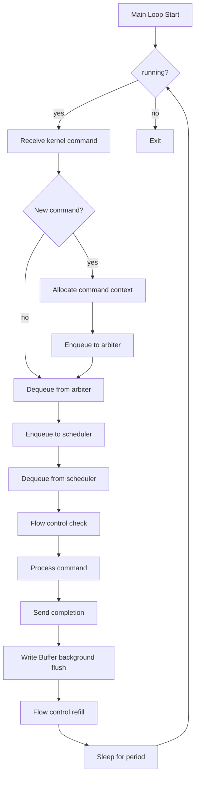
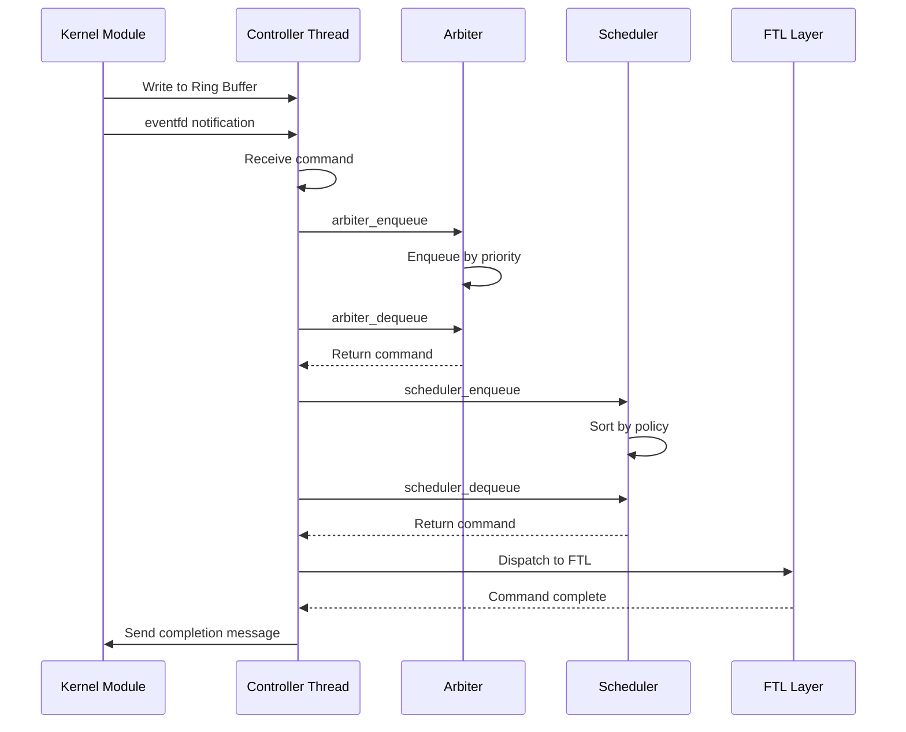

# HFSSS High-Level Design Document

**Document Name**: Controller Thread Module HLD
**Document Version**: V2.0
**Date**: 2026-03-23
**Design Phase**: V1.0 (Alpha)

---

## Implementation Status

**Design Document**: Describes a comprehensive controller with kernel-user space communication via shared memory
**Actual Implementation**: Partial implementation with core controller structures and some components

**Coverage Status**: 10/15 requirements implemented for this module (66.7%)

See [REQUIREMENT_COVERAGE.md](./REQUIREMENT_COVERAGE.md) for complete details.

---

## Revision History

| Version | Date | Author | Description |
|---------|------|--------|-------------|
| V0.1 | 2026-03-08 | Architecture Team | Initial draft |
| V1.0 | 2026-03-08 | Architecture Team | Official release |
| EN-V1.0 | 2026-03-14 | Translation Agent | English translation with implementation notes |
| EN-V2.0 | 2026-03-23 | Architecture Team | Enterprise SSD architecture update: DWRR scheduler, per-NS QoS, deterministic latency, multi-NS routing |

---

## Table of Contents

1. [Module Overview](#1-module-overview)
2. [Requirements Review](#2-requirements-review)
3. [System Architecture](#3-system-architecture)
4. [Detailed Design](#4-detailed-design)
5. [Interface Design](#5-interface-design)
6. [Data Structures](#6-data-structures)
7. [Flow Diagrams](#7-flow-diagrams)
8. [Performance Design](#8-performance-design)
9. [Error Handling](#9-error-handling)
10. [Test Design](#10-test-design)
11. [Enterprise SSD Extensions](#11-enterprise-ssd-extensions)
12. [Architecture Decision Records](#12-architecture-decision-records)

---

## 1. Module Overview

### 1.1 Module Positioning

The controller thread is the "brain" of the entire SSD simulator, responsible for receiving commands from the PCIe/NVMe module, performing high-level scheduling and resource arbitration, distributing commands to firmware CPU core threads for execution, and coordinating the work of various subsystems. The controller thread runs in a user-space daemon, using real-time threads (SCHED_FIFO scheduling policy) and CPU binding (CPU Affinity) to ensure low-latency response.

**Implementation Note**: The actual implementation integrates with the top-level `sssim.h` API rather than using kernel-user space shared memory. The controller is invoked directly via function calls.

### 1.2 Module Responsibilities

This module is responsible for:
- Kernel-user space communication: receiving NVMe commands from kernel module via shared memory Ring Buffer
- Command arbitration policy: NVMe WRR (Weighted Round Robin) arbitration, Admin commands first
- Command distribution: distributing commands to corresponding firmware CPU core thread pools by command type
- I/O scheduler: greedy scheduling based on target NAND channel/Die, write command merging, read prefetching
- Write buffer management: global Write Buffer, background flush, Flush trigger
- Read cache: LRU read cache, caching hot read data
- Channel load balancing: real-time statistics of Channel queue depth, new commands preferentially distributed to low-load Channels
- Resource manager: free block management, command slot management, DRAM cache resource management
- Flow control: token bucket rate limiter, backpressure mechanism, QoS guarantees, GC flow control
- DWRR (Deficit Weighted Round Robin) multi-queue scheduling for enterprise multi-tenant fairness
- Per-namespace QoS policy enforcement (IOPS limits, bandwidth limits, latency SLAs)
- Deterministic latency window management (GC preemption, IO-priority-aware scheduling)
- Multi-namespace command routing and dispatch

### 1.3 Module Boundaries

**Included in this module**:
- Shared memory Ring Buffer receive/send
- Command arbiter
- I/O scheduler (FIFO/Greedy/Deadline)
- DWRR multi-queue scheduler
- Write Buffer management
- Read cache (LRU)
- Channel load balancing
- Resource manager
- Flow control (token bucket)
- Per-namespace QoS enforcement
- Deterministic latency window controller
- Multi-namespace command router

**Not included in this module**:
- FTL algorithms (implemented by Application Layer)
- NAND media emulation (implemented by Media Threads)

---

## 2. Requirements Review

### 2.1 Requirements Traceability Matrix

| Requirement ID | Description | Priority | Version | Implementation Status |
|----------------|-------------|----------|---------|----------------------|
| REQ-023 | Command Arbiter | P0 | V1.0 | Implemented |
| REQ-024 | I/O Scheduler | P0 | V1.0 | Implemented |
| REQ-025 | Command State Machine | P0 | V1.0 | Not Implemented |
| REQ-026 | Command Timeout Management | P0 | V1.0 | Not Implemented |
| REQ-027 | Write Buffer Management | P0 | V1.0 | Implemented |
| REQ-028 | Read Cache Management | P0 | V1.0 | Implemented |
| REQ-029 | Channel Load Balancing | P1 | V1.0 | Implemented |
| REQ-030 | Command Completion Notification | P0 | V1.0 | Implemented |
| REQ-031 | Idle Block Pool Management | P0 | V1.0 | Not Implemented |
| REQ-032 | Resource Manager | P1 | V1.0 | Implemented |
| REQ-033 | DRAM Buffer Pool | P1 | V1.0 | Implemented |
| REQ-034 | Backpressure Mechanism | P0 | V1.0 | Not Implemented |
| REQ-035 | QoS Guarantees | P0 | V1.0 | Not Implemented |
| REQ-036 | GC Traffic Control | P0 | V1.0 | Not Implemented |
| REQ-037 | Statistics and Monitoring | P1 | V1.0 | Implemented |
| REQ-ENT-010 | DWRR Multi-Queue Scheduler | P0 | V2.0 | Design Only |
| REQ-ENT-011 | Per-Namespace QoS Enforcement | P0 | V2.0 | Design Only |
| REQ-ENT-012 | Deterministic Latency Window | P1 | V2.0 | Design Only |
| REQ-ENT-013 | Multi-Namespace Command Routing | P0 | V2.0 | Design Only |

### 2.2 Key Performance Requirements

| Metric | Target | Description |
|--------|--------|-------------|
| Scheduling Period | 10us - 1ms adjustable | Main loop scheduling period |
| Command Processing Latency | < 5us | Latency from Ring Buffer fetch to distribution |
| Max Concurrent Commands | 65536 | Maximum commands processed simultaneously |
| Write Buffer Size | 64MB | Configurable |
| Read Cache Size | 512MB | Configurable |
| DWRR Scheduling Latency | < 2us | Per-round DWRR scheduling decision |
| QoS Enforcement Accuracy | +/- 5% | IOPS/BW deviation from configured limit |

---

## 3. System Architecture

### 3.1 Module Layer Architecture

**Design Document Architecture**:

```
+-----------------------------------------------------------------+
|                 User-Space Daemon (daemon)                       |
|  +-----------------------------------------------------------+  |
|  |  Controller Thread                                         |  |
|  |  +-------------------------------------------------------+|  |
|  |  |  Shared Memory Ring Buffer Receive (shmem_if.c)       ||  |
|  |  |  - Lock-free SPSC queue                               ||  |
|  |  |  - eventfd notification                                ||  |
|  |  +------------------------+------------------------------+|  |
|  |                           | Command Receive                |  |
|  |  +------------------------v------------------------------+|  |
|  |  |  Command Arbiter (arbiter.c)                          ||  |
|  |  |  - Priority Queue (Admin > Urgent > High > Normal)    ||  |
|  |  |  - WRR scheduling                                      ||  |
|  |  +------------------------+------------------------------+|  |
|  |                           | Arbitration Complete            |  |
|  |  +------------------------v------------------------------+|  |
|  |  |  Multi-NS Router (ns_router.c)       [ENTERPRISE]    ||  |
|  |  |  - NSID-based command demux                            ||  |
|  |  |  - Per-NS queue isolation                              ||  |
|  |  +------------------------+------------------------------+|  |
|  |                           | Per-NS Queue                    |  |
|  |  +------------------------v------------------------------+|  |
|  |  |  DWRR Scheduler (dwrr_sched.c)      [ENTERPRISE]     ||  |
|  |  |  - Deficit counters per NS queue                       ||  |
|  |  |  - Weight-based fair scheduling                        ||  |
|  |  |  - QoS enforcement (IOPS/BW limits)                   ||  |
|  |  +------------------------+------------------------------+|  |
|  |                           | Scheduled Command               |  |
|  |  +------------------------v------------------------------+|  |
|  |  |  I/O Scheduler (scheduler.c)                          ||  |
|  |  |  - FIFO / Greedy / Deadline                            ||  |
|  |  +------------------------+------------------------------+|  |
|  |                           | Scheduling Complete             |  |
|  |  +------------------------v------------------------------+|  |
|  |  |  Deterministic Latency Controller   [ENTERPRISE]      ||  |
|  |  |  (det_latency.c)                                       ||  |
|  |  |  - GC preemption window management                     ||  |
|  |  |  - IO-priority-aware scheduling                        ||  |
|  |  +------------------------+------------------------------+|  |
|  |                           |                                 |  |
|  |  +------------------------v------------------------------+|  |
|  |  |  Write Buffer (write_buffer.c)                        ||  |
|  |  |  - Write merging / Background flush / Flush trigger    ||  |
|  |  +------------------------+------------------------------+|  |
|  |  |  Read Cache (read_cache.c)                             ||  |
|  |  |  - LRU replacement / Hot data caching                  ||  |
|  |  +------------------------+------------------------------+|  |
|  |  |  Channel Load Balancing (channel.c)                   ||  |
|  |  +------------------------+------------------------------+|  |
|  |  |  Resource Manager (resource.c)                         ||  |
|  |  +------------------------+------------------------------+|  |
|  |  |  Flow Control (flow_control.c)                        ||  |
|  |  |  - Token bucket / Read/Write/Admin separate buckets    ||  |
|  |  +-------------------------------------------------------+|  |
|  +-----------------------------------------------------------+  |
|                          | Command Distribution                  |
|  +-----------------------------------------------------------+  |
|  |  Application Layer (FTL)  |  Common Services (RTOS)        |  |
|  +-----------------------------------------------------------+  |
+-----------------------------------------------------------------+
```

**Actual Implementation**:

The actual code provides implementations in `include/controller/` and `src/controller/`:

```
+-----------------------------------------------------------------+
|              User-Space Implementation (Actual)                  |
|                                                                  |
|  +-----------------------------------------------------------+  |
|  |  Controller Structures (Implemented)                       |  |
|  |  - controller.h: Top-level controller context              |  |
|  |  - arbiter.h/c: Command arbiter (priority queue)          |  |
|  |  - scheduler.h/c: I/O scheduler (FIFO/Greedy)             |  |
|  |  - write_buffer.h/c: Write buffer with merging            |  |
|  |  - read_cache.h/c: LRU read cache                          |  |
|  |  - channel.h/c: Channel management & load balancing        |  |
|  |  - resource.h/c: Resource manager                          |  |
|  |  - flow_control.h/c: Token bucket flow control             |  |
|  |  - shmem_if.h: Shared memory interface (stub)              |  |
|  +-----------------------------------------------------------+  |
|                                                                  |
|  Integrated with sssim.h via direct function calls               |
+-----------------------------------------------------------------+
```

### 3.2 Component Decomposition

#### 3.2.1 Shared Memory Interface (shmem_if.c)

**Responsibilities**:
- Receive NVMe commands from kernel module
- Send command completions to kernel module
- Manage shared memory mapping
- Handle eventfd notifications

**Key Components** (from header files):
- `struct shmem_layout`: Shared memory layout (see [include/controller/shmem_if.h](../include/controller/shmem_if.h))

**Implementation Status**: Stub structures only (not used in actual implementation)

#### 3.2.2 Command Arbiter (arbiter.c)

**Responsibilities**:
- Sort commands by priority
- Admin commands processed first
- Implement WRR (Weighted Round Robin) scheduling
- Manage command context pool

**Key Components** (from header files):
- `struct arbiter_ctx`: Arbiter context (see [include/controller/arbiter.h](../include/controller/arbiter.h))
- Priority queue implementation

**Implementation Status**: Implemented

#### 3.2.3 I/O Scheduler (scheduler.c)

**Responsibilities**:
- Implement FIFO scheduling policy
- Implement Greedy scheduling policy (LBA ordered)
- Implement Deadline scheduling policy (Read/Write separated)
- Write command merging
- Read prefetching

**Key Components** (from header files):
- `struct scheduler_ctx`: Scheduler context (see [include/controller/scheduler.h](../include/controller/scheduler.h))
- Multiple scheduling policies supported

**Implementation Status**: Implemented

---

## 4. Detailed Design

### 4.1 Shared Memory Ring Buffer Design

```c
#define RING_BUFFER_SLOTS 16384
#define CMD_SLOT_SIZE 128

enum cmd_type {
    CMD_NVME_ADMIN = 0,
    CMD_NVME_IO = 1,
    CMD_CONTROL = 2,
};

struct nvme_cmd_from_kern {
    uint32_t cmd_type;
    uint32_t cmd_id;
    uint32_t sqid;
    uint32_t cqid;
    uint64_t prp1;
    uint64_t prp2;
    uint32_t cdw0_15[16];
    uint32_t data_len;
    uint32_t flags;
    uint64_t metadata;
};

struct nvme_cpl_to_kern {
    uint32_t cmd_id;
    uint16_t sqid;
    uint16_t cqid;
    uint16_t sqhd;
    uint16_t cid;
    uint32_t status;
    uint32_t cdw0;
};

struct ring_slot {
    struct nvme_cmd_from_kern cmd;
    atomic_uint ready;
    atomic_uint done;
};

struct ring_header {
    atomic_uint prod_idx;
    atomic_uint cons_idx;
    uint32_t slot_count;
    uint32_t slot_size;
    uint64_t prod_seq;
    uint64_t cons_seq;
};

struct shmem_layout {
    struct ring_header header;
    struct ring_slot slots[RING_BUFFER_SLOTS];
    uint8_t data_buffer[DATA_BUFFER_SIZE];
};
```

### 4.2 Command Arbiter Design

```c
enum cmd_priority {
    PRIO_ADMIN_HIGH = 0,
    PRIO_IO_URGENT = 1,
    PRIO_IO_HIGH = 2,
    PRIO_IO_NORMAL = 3,
    PRIO_IO_LOW = 4,
    PRIO_MAX = 5,
};

enum cmd_state {
    CMD_STATE_FREE = 0,
    CMD_STATE_RECEIVED = 1,
    CMD_STATE_ARBITRATED = 2,
    CMD_STATE_SCHEDULED = 3,
    CMD_STATE_IN_FLIGHT = 4,
    CMD_STATE_COMPLETED = 5,
    CMD_STATE_ERROR = 6,
};

struct cmd_context {
    uint64_t cmd_id;
    enum cmd_type type;
    enum cmd_priority priority;
    enum cmd_state state;
    uint64_t timestamp;
    uint64_t deadline;
    struct nvme_cmd_from_kern kern_cmd;
    void *user_data;
    struct cmd_context *next;
    struct cmd_context *prev;
};

struct priority_queue {
    struct cmd_context *head;
    struct cmd_context *tail;
    uint32_t count;
    spinlock_t lock;
};

struct arbiter_ctx {
    struct priority_queue queues[PRIO_MAX];
    uint32_t total_cmds;
    uint32_t max_cmds;
    struct cmd_context *cmd_pool;
    uint32_t pool_size;
    spinlock_t lock;
};
```

### 4.3 I/O Scheduler Design

```c
enum sched_policy {
    SCHED_FIFO = 0,
    SCHED_GREEDY = 1,
    SCHED_DEADLINE = 2,
    SCHED_WRR = 3,
};

struct sched_fifo {
    struct cmd_context *head;
    struct cmd_context *tail;
    uint32_t count;
};

struct sched_greedy {
    struct cmd_context *tree_root;
    uint32_t count;
};

struct sched_deadline {
    struct cmd_context *read_queue;
    struct cmd_context *write_queue;
    uint32_t read_count;
    uint32_t write_count;
    uint32_t read_batch;
    uint32_t write_batch;
};

struct scheduler_ctx {
    enum sched_policy policy;
    union {
        struct sched_fifo fifo;
        struct sched_greedy greedy;
        struct sched_deadline deadline;
    } u;
    uint64_t last_sched_ts;
    uint64_t sched_period_ns;
    spinlock_t lock;
};
```

### 4.4 Write Buffer Design

```c
#define WB_MAX_ENTRIES 65536
#define WB_ENTRY_SIZE 4096
#define WB_TOTAL_SIZE (WB_MAX_ENTRIES * WB_ENTRY_SIZE)

enum wb_entry_state {
    WB_FREE = 0,
    WB_ALLOCATED = 1,
    WB_DIRTY = 2,
    WB_FLUSHING = 3,
    WB_FLUSHED = 4,
};

struct wb_entry {
    uint64_t lba;
    uint32_t len;
    enum wb_entry_state state;
    uint64_t timestamp;
    uint32_t refcount;
    void *data;
    struct wb_entry *next;
    struct wb_entry *prev;
    struct hlist_node hash_node;
};

struct write_buffer_ctx {
    struct wb_entry *entries;
    uint8_t *data_pool;
    uint32_t entry_count;
    uint32_t free_count;
    uint32_t dirty_count;
    struct wb_entry *free_list;
    struct wb_entry *dirty_list;
    struct hlist_head *hash_table;
    uint32_t hash_buckets;
    uint64_t flush_threshold;
    uint64_t flush_interval_ns;
    uint64_t last_flush_ts;
    spinlock_t lock;
};
```

### 4.5 Read Cache Design

```c
#define RC_MAX_ENTRIES 131072
#define RC_ENTRY_SIZE 4096
#define RC_TOTAL_SIZE (RC_MAX_ENTRIES * RC_ENTRY_SIZE)

struct rc_entry {
    uint64_t lba;
    uint32_t len;
    uint64_t timestamp;
    uint32_t hit_count;
    void *data;
    struct rc_entry *next;
    struct rc_entry *prev;
    struct hlist_node hash_node;
};

struct read_cache_ctx {
    struct rc_entry *entries;
    uint8_t *data_pool;
    uint32_t entry_count;
    uint32_t used_count;
    struct rc_entry *lru_head;
    struct rc_entry *lru_tail;
    struct hlist_head *hash_table;
    uint32_t hash_buckets;
    uint64_t hit_count;
    uint64_t miss_count;
    spinlock_t lock;
};
```

### 4.6 Main Loop Design

```c
void *controller_main_loop(void *arg) {
    struct controller_ctx *ctx = (struct controller_ctx *)arg;
    struct nvme_cmd_from_kern kern_cmd;
    struct cmd_context *cmd;
    int ret;

    while (ctx->running) {
        ctx->loop_count++;

        /* 1. Receive kernel command */
        ret = shmem_if_receive_cmd(ctx, &kern_cmd);
        if (ret == 0) {
            cmd = arbiter_alloc_cmd(&ctx->arbiter);
            if (cmd) {
                cmd->kern_cmd = kern_cmd;
                cmd->state = CMD_STATE_RECEIVED;
                cmd->timestamp = get_time_ns();
                arbiter_enqueue(&ctx->arbiter, cmd);
            }
        }

        /* 2. Dequeue from arbiter */
        cmd = arbiter_dequeue(&ctx->arbiter);
        if (cmd) {
            cmd->state = CMD_STATE_ARBITRATED;
            scheduler_enqueue(&ctx->scheduler, cmd);
        }

        /* 3. Dequeue from scheduler */
        cmd = scheduler_dequeue(&ctx->scheduler);
        if (cmd) {
            cmd->state = CMD_STATE_SCHEDULED;

            /* 4. Flow control check */
            if (flow_ctrl_check(&ctx->flow_ctrl, FLOW_READ, 1)) {
                if (cmd->type == CMD_NVME_ADMIN)
                    process_admin_cmd(ctx, cmd);
                else
                    process_io_cmd(ctx, cmd);
            }
        }

        /* 5. Write Buffer background flush */
        if (get_time_ns() - ctx->wb.last_flush_ts > ctx->wb.flush_interval_ns) {
            wb_flush(&ctx->wb);
            ctx->wb.last_flush_ts = get_time_ns();
        }

        /* 6. Flow control refill */
        flow_ctrl_refill(&ctx->flow_ctrl);

        /* 7. Sleep for scheduling period */
        sleep_ns(ctx->config.sched_period_ns);
    }
    return NULL;
}
```

### 4.7 Controller Context

**From Actual Implementation** ([include/controller/controller.h](../include/controller/controller.h)):

```c
struct controller_config {
    u64 sched_period_ns;
    u32 max_concurrent_cmds;
    enum sched_policy sched_policy;
    u32 wb_max_entries;
    u32 rc_max_entries;
    u32 channel_count;
    bool flow_ctrl_enabled;
    u64 read_rate_limit;
    u64 write_rate_limit;
    const char *shmem_path;
};

struct controller_ctx {
    struct controller_config config;
    struct shmem_layout *shmem;
    int shmem_fd;

    struct arbiter_ctx arbiter;
    struct scheduler_ctx scheduler;
    struct write_buffer_ctx wb;
    struct read_cache_ctx rc;
    struct channel_mgr channel_mgr;
    struct resource_mgr resource_mgr;
    struct flow_ctrl_ctx flow_ctrl;

    void *thread;
    bool running;
    u64 loop_count;
    u64 last_loop_ts;

    void *ftl_ctx;
    void *hal_ctx;
    struct mutex lock;
    bool initialized;
};

int controller_init(struct controller_ctx *ctx, struct controller_config *config);
void controller_cleanup(struct controller_ctx *ctx);
int controller_start(struct controller_ctx *ctx);
void controller_stop(struct controller_ctx *ctx);
void controller_config_default(struct controller_config *config);
```

---

## 5. Interface Design

### 5.1 Top-Level Interface

```c
int controller_init(struct controller_ctx *ctx, struct controller_config *config);
void controller_cleanup(struct controller_ctx *ctx);
int controller_start(struct controller_ctx *ctx);
void controller_stop(struct controller_ctx *ctx);
void controller_config_default(struct controller_config *config);
```

### 5.2 Internal Interfaces

```c
/* shmem_if.c */
int shmem_if_init(struct controller_ctx *ctx);
void shmem_if_cleanup(struct controller_ctx *ctx);
int shmem_if_receive_cmd(struct controller_ctx *ctx, struct nvme_cmd_from_kern *cmd);
int shmem_if_send_cpl(struct controller_ctx *ctx, struct nvme_cpl_to_kern *cpl);

/* arbiter.c */
int arbiter_init(struct arbiter_ctx *ctx, uint32_t max_cmds);
void arbiter_cleanup(struct arbiter_ctx *ctx);
struct cmd_context *arbiter_alloc_cmd(struct arbiter_ctx *ctx);
void arbiter_free_cmd(struct arbiter_ctx *ctx, struct cmd_context *cmd);
int arbiter_enqueue(struct arbiter_ctx *ctx, struct cmd_context *cmd);
struct cmd_context *arbiter_dequeue(struct arbiter_ctx *ctx);

/* scheduler.c */
int scheduler_init(struct scheduler_ctx *ctx, enum sched_policy policy);
void scheduler_cleanup(struct scheduler_ctx *ctx);
int scheduler_enqueue(struct scheduler_ctx *ctx, struct cmd_context *cmd);
struct cmd_context *scheduler_dequeue(struct scheduler_ctx *ctx);
int scheduler_set_policy(struct scheduler_ctx *ctx, enum sched_policy policy);

/* write_buffer.c */
int wb_init(struct write_buffer_ctx *ctx, uint32_t max_entries);
void wb_cleanup(struct write_buffer_ctx *ctx);
int wb_write(struct write_buffer_ctx *ctx, uint64_t lba, uint32_t len, void *data);
int wb_read(struct write_buffer_ctx *ctx, uint64_t lba, uint32_t len, void *data);
int wb_flush(struct write_buffer_ctx *ctx);
bool wb_lookup(struct write_buffer_ctx *ctx, uint64_t lba);

/* read_cache.c */
int rc_init(struct read_cache_ctx *ctx, uint32_t max_entries);
void rc_cleanup(struct read_cache_ctx *ctx);
int rc_insert(struct read_cache_ctx *ctx, uint64_t lba, uint32_t len, void *data);
int rc_lookup(struct read_cache_ctx *ctx, uint64_t lba, uint32_t len, void *data);
void rc_invalidate(struct read_cache_ctx *ctx, uint64_t lba, uint32_t len);
void rc_clear(struct read_cache_ctx *ctx);

/* channel.c */
int channel_mgr_init(struct channel_mgr *mgr, uint32_t channel_count);
void channel_mgr_cleanup(struct channel_mgr *mgr);
int channel_mgr_select(struct channel_mgr *mgr, uint64_t lba);
int channel_mgr_balance(struct channel_mgr *mgr);

/* resource.c */
int resource_mgr_init(struct resource_mgr *mgr);
void resource_mgr_cleanup(struct resource_mgr *mgr);
void *resource_alloc(struct resource_mgr *mgr, enum resource_type type);
void resource_free(struct resource_mgr *mgr, enum resource_type type, void *ptr);

/* flow_control.c */
int flow_ctrl_init(struct flow_ctrl_ctx *ctx);
void flow_ctrl_cleanup(struct flow_ctrl_ctx *ctx);
bool flow_ctrl_check(struct flow_ctrl_ctx *ctx, enum flow_type type, uint64_t tokens);
void flow_ctrl_refill(struct flow_ctrl_ctx *ctx);
```

### 5.3 Integration with Top-Level API

The controller integrates with the top-level `sssim.h` API:
- `sssim_write()` -> Controller -> FTL -> HAL -> Media
- `sssim_read()` -> Controller -> FTL -> HAL -> Media

---

## 6. Data Structures

All data structures are defined in the header files under `include/controller/`:

- [include/controller/controller.h](../include/controller/controller.h) - Top-level controller context
- [include/controller/arbiter.h](../include/controller/arbiter.h) - Arbiter structures
- [include/controller/scheduler.h](../include/controller/scheduler.h) - Scheduler structures
- [include/controller/write_buffer.h](../include/controller/write_buffer.h) - Write buffer structures
- [include/controller/read_cache.h](../include/controller/read_cache.h) - Read cache structures
- [include/controller/channel.h](../include/controller/channel.h) - Channel structures
- [include/controller/resource.h](../include/controller/resource.h) - Resource structures
- [include/controller/flow_control.h](../include/controller/flow_control.h) - Flow control structures
- [include/controller/shmem_if.h](../include/controller/shmem_if.h) - Shared memory structures

---

## 7. Flow Diagrams

### 7.1 Main Loop Flow Diagram



### 7.2 Command Processing Sequence Diagram



---

## 8. Performance Design

### 8.1 Lock-Free Design

- Ring Buffer uses lock-free SPSC (Single Producer Single Consumer) design
- Uses atomic operations (atomic_uint) to manage prod_idx/cons_idx

### 8.2 NUMA Optimization

- Shared memory allocated on local NUMA node
- Threads bound to specific CPU cores
- Data structures cache-line aligned (64 bytes)

### 8.3 CPU Binding

- Controller thread bound to isolated CPU core
- Uses SCHED_FIFO scheduling policy, priority 99
- Dynamic clock disabled (tickless)

---

## 9. Error Handling

### 9.1 Command Timeout

- Each command has a timeout (Admin: 30s, I/O: 1s)
- On timeout, resend or return error status

### 9.2 Backpressure Mechanism

- When command queue is full, pause receiving new commands
- Control flow via Write Buffer watermark

---

## 10. Test Design

### 10.1 Unit Tests

| Test Case ID | Test Item | Expected Result |
|-------------|-----------|-----------------|
| UT_CTRL_001 | Controller initialization | Success |
| UT_CTRL_002 | Command receive | Successful receive |
| UT_CTRL_003 | Command arbitration | Priority correct |
| UT_CTRL_004 | FIFO scheduling | FIFO order |
| UT_CTRL_005 | Greedy scheduling | LBA order |
| UT_CTRL_006 | Write Buffer write | Write successful |
| UT_CTRL_007 | Read cache hit | Hit returns data |

### 10.2 Integration Tests

| Test Case ID | Test Item | Expected Result |
|-------------|-----------|-----------------|
| IT_CTRL_001 | Complete command flow | Successful completion |
| IT_CTRL_002 | High QD pressure (QD=65535) | System stable |
| IT_CTRL_003 | Mixed read/write (70/30) | Stable performance |

---

## 11. Enterprise SSD Extensions

### 11.1 DWRR (Deficit Weighted Round Robin) Multi-Queue Scheduler Architecture

#### 11.1.1 Overview

In enterprise multi-tenant deployments, multiple namespaces share the same SSD controller. A simple priority-based arbiter cannot guarantee fairness across namespaces. The DWRR scheduler provides weighted fair queuing across namespace submission queues, ensuring that each namespace receives its configured share of controller bandwidth.

#### 11.1.2 DWRR Data Structures

```c
#define MAX_NAMESPACES 128
#define DWRR_DEFAULT_QUANTUM 4096  /* bytes or IOPS units */

/* Per-namespace DWRR queue */
struct dwrr_ns_queue {
    uint32_t nsid;
    uint32_t weight;              /* Relative weight (1-1000) */
    int64_t  deficit_counter;     /* Current deficit (can go negative) */
    uint32_t quantum;             /* Per-round service quantum = weight * base_quantum */
    struct cmd_context *head;
    struct cmd_context *tail;
    uint32_t queue_depth;
    uint64_t served_bytes;
    uint64_t served_iops;
    bool     active;              /* true if queue is non-empty */
};

/* DWRR Scheduler Context */
struct dwrr_sched_ctx {
    struct dwrr_ns_queue ns_queues[MAX_NAMESPACES];
    uint32_t active_ns_count;
    uint32_t current_ns_idx;      /* Round-robin pointer */
    uint32_t base_quantum;        /* Base quantum unit */
    uint64_t total_rounds;
    uint64_t total_served;
    spinlock_t lock;
};
```

#### 11.1.3 DWRR Scheduling Algorithm

```
DWRR_schedule():
  while (active_ns_count > 0):
    ns = ns_queues[current_ns_idx]
    if ns.active and ns.queue_depth > 0:
      ns.deficit_counter += ns.quantum
      while ns.deficit_counter > 0 and ns.queue_depth > 0:
        cmd = dequeue_head(ns)
        cost = cmd_cost(cmd)   /* 1 for IOPS-based, data_len for BW-based */
        ns.deficit_counter -= cost
        dispatch(cmd)
      if ns.queue_depth == 0:
        ns.deficit_counter = 0
        ns.active = false
        active_ns_count--
    current_ns_idx = (current_ns_idx + 1) % MAX_NAMESPACES
```

#### 11.1.4 DWRR Interface

```c
int dwrr_sched_init(struct dwrr_sched_ctx *ctx, uint32_t base_quantum);
void dwrr_sched_cleanup(struct dwrr_sched_ctx *ctx);
int dwrr_sched_add_ns(struct dwrr_sched_ctx *ctx, uint32_t nsid, uint32_t weight);
int dwrr_sched_remove_ns(struct dwrr_sched_ctx *ctx, uint32_t nsid);
int dwrr_sched_enqueue(struct dwrr_sched_ctx *ctx, uint32_t nsid, struct cmd_context *cmd);
struct cmd_context *dwrr_sched_dequeue(struct dwrr_sched_ctx *ctx);
int dwrr_sched_set_weight(struct dwrr_sched_ctx *ctx, uint32_t nsid, uint32_t weight);
```

### 11.2 Per-Namespace QoS Policy Enforcement Architecture

#### 11.2.1 Overview

Each namespace can be configured with QoS policies that specify IOPS limits, bandwidth limits, and latency SLAs. The controller enforces these policies in real time, throttling namespaces that exceed their allocation and prioritizing namespaces approaching their latency SLA.

#### 11.2.2 QoS Policy Data Structures

```c
/* QoS Policy per Namespace */
struct ns_qos_policy {
    uint32_t nsid;
    uint64_t max_read_iops;       /* 0 = unlimited */
    uint64_t max_write_iops;      /* 0 = unlimited */
    uint64_t max_read_bw_mbps;    /* 0 = unlimited */
    uint64_t max_write_bw_mbps;   /* 0 = unlimited */
    uint64_t target_read_lat_us;  /* Target P99 read latency, 0 = no SLA */
    uint64_t target_write_lat_us; /* Target P99 write latency, 0 = no SLA */
};

/* QoS Runtime State per Namespace */
struct ns_qos_state {
    /* Token buckets for rate limiting */
    struct token_bucket read_iops_bucket;
    struct token_bucket write_iops_bucket;
    struct token_bucket read_bw_bucket;
    struct token_bucket write_bw_bucket;

    /* Latency tracking (sliding window) */
    uint64_t read_lat_samples[1024];
    uint64_t write_lat_samples[1024];
    uint32_t lat_sample_idx;
    uint64_t p99_read_lat_us;
    uint64_t p99_write_lat_us;

    /* Throttle state */
    bool     throttled;
    uint64_t throttle_start_ts;
    uint64_t total_throttle_ns;
};

/* QoS Enforcement Context */
struct qos_ctx {
    struct ns_qos_policy policies[MAX_NAMESPACES];
    struct ns_qos_state  states[MAX_NAMESPACES];
    uint32_t ns_count;
    uint64_t enforcement_period_ns;  /* How often to refill buckets */
    spinlock_t lock;
};
```

#### 11.2.3 QoS Enforcement Flow

1. When a command arrives for namespace N, check if the namespace is throttled.
2. If not throttled, attempt to consume a token from the appropriate bucket (read_iops or write_iops, and read_bw or write_bw).
3. If tokens are available, allow the command to proceed to the I/O scheduler.
4. If tokens are exhausted, mark the namespace as throttled and hold the command until the next refill cycle.
5. Periodically (every enforcement_period_ns), refill all token buckets and check latency SLAs.
6. If a namespace's P99 latency exceeds the target, boost its priority in the DWRR scheduler temporarily.

#### 11.2.4 QoS Interface

```c
int qos_init(struct qos_ctx *ctx);
void qos_cleanup(struct qos_ctx *ctx);
int qos_set_policy(struct qos_ctx *ctx, uint32_t nsid, struct ns_qos_policy *policy);
int qos_get_policy(struct qos_ctx *ctx, uint32_t nsid, struct ns_qos_policy *policy);
bool qos_check_admit(struct qos_ctx *ctx, uint32_t nsid, bool is_read, uint32_t data_len);
void qos_record_latency(struct qos_ctx *ctx, uint32_t nsid, bool is_read, uint64_t latency_us);
void qos_refill(struct qos_ctx *ctx);
```

### 11.3 Deterministic Latency Window Architecture

#### 11.3.1 Overview

Enterprise SSDs must provide deterministic I/O latency even during garbage collection. The deterministic latency window controller manages time windows where GC is allowed to run and windows where only host I/O is serviced, preventing GC-induced latency spikes.

#### 11.3.2 Design

```c
/* Deterministic Window Type */
enum det_window_type {
    DET_WINDOW_HOST_IO = 0,    /* Only host IO allowed, GC preempted */
    DET_WINDOW_GC_ALLOWED = 1, /* GC and host IO both allowed */
    DET_WINDOW_GC_ONLY = 2,    /* GC priority, host IO throttled */
};

/* Deterministic Latency Controller */
struct det_latency_ctx {
    enum det_window_type current_window;
    uint64_t window_duration_us;        /* Duration of each window */
    uint64_t window_start_ts;
    uint64_t host_io_window_us;         /* Duration reserved for host IO */
    uint64_t gc_window_us;              /* Duration reserved for GC */

    /* GC preemption */
    bool gc_preempted;
    uint64_t gc_preempt_count;

    /* IO priority */
    bool priority_boost_active;
    uint32_t boosted_nsid;
    uint64_t boost_deadline;

    /* Statistics */
    uint64_t total_host_windows;
    uint64_t total_gc_windows;
    uint64_t max_host_lat_in_gc_window;
};
```

#### 11.3.3 Window Scheduling

The deterministic latency controller cycles between HOST_IO and GC_ALLOWED windows:

1. **HOST_IO window**: All GC operations are suspended. Host I/O commands are processed with guaranteed low latency. The duration is configurable (e.g., 100ms).
2. **GC_ALLOWED window**: GC operations resume alongside host I/O. The controller monitors host I/O latency during this window. If any host I/O exceeds the latency threshold, the window is shortened and returns to HOST_IO.
3. **GC_ONLY window** (optional, triggered by low free block count): GC gets full bandwidth, host I/O is throttled to a minimum rate. Used only in emergency low-space conditions.

#### 11.3.4 IO-Priority-Aware Scheduling

Commands carry an IO priority hint (from the NVMe SQ priority field or the PRINFO/CDW12 fields). The deterministic latency controller uses these priorities:
- **Urgent**: Always processed immediately, even during GC windows
- **High**: Processed in HOST_IO window, may be delayed in GC_ONLY window
- **Normal**: Standard processing
- **Low/Background**: May be deferred during HOST_IO window to maximize host IO throughput

### 11.4 Multi-Namespace Command Routing and Dispatch

#### 11.4.1 Overview

With multiple namespaces, each command must be routed to the correct per-namespace FTL instance. The multi-namespace command router extracts the NSID from each NVMe command and dispatches it to the appropriate namespace queue.

#### 11.4.2 Design

```c
/* Namespace Route Entry */
struct ns_route_entry {
    uint32_t nsid;
    bool     active;
    void    *ftl_ctx;             /* Pointer to per-NS FTL context */
    struct dwrr_ns_queue *queue;  /* Pointer to DWRR queue for this NS */
    struct ns_qos_policy *qos;   /* Pointer to QoS policy */
};

/* Namespace Router */
struct ns_router_ctx {
    struct ns_route_entry routes[MAX_NAMESPACES];
    uint32_t route_count;
    spinlock_t lock;
};

/* Router Interface */
int ns_router_init(struct ns_router_ctx *ctx);
void ns_router_cleanup(struct ns_router_ctx *ctx);
int ns_router_add_ns(struct ns_router_ctx *ctx, uint32_t nsid, void *ftl_ctx);
int ns_router_remove_ns(struct ns_router_ctx *ctx, uint32_t nsid);
int ns_router_dispatch(struct ns_router_ctx *ctx, struct cmd_context *cmd);
```

#### 11.4.3 Dispatch Flow

```
Incoming NVMe I/O Command
    |
    v
[Extract NSID from CDW1]
    |
    v
[ns_router_dispatch()]
    | Lookup routes[NSID]
    | If !active: return NVME_SC_INVALID_NS
    v
[Enqueue to per-NS DWRR queue]
    |
    v
[DWRR scheduler selects next command]
    |
    v
[Per-NS QoS check]
    | If throttled: hold command
    | If admitted: proceed
    v
[I/O Scheduler (per-NS or shared)]
    |
    v
[FTL for namespace N]
```

---

## 12. Architecture Decision Records

### ADR-CTRL-001: DWRR vs. Strict Priority for Multi-Namespace Scheduling

**Context**: Enterprise SSDs serve multiple namespaces with different workload characteristics. Strict priority scheduling can starve lower-priority namespaces indefinitely.

**Decision**: Adopt DWRR as the primary multi-namespace scheduler. DWRR provides weighted fair queuing with O(1) amortized complexity per dequeue operation. Weights map to SLA tiers, and the quantum size determines scheduling granularity. Strict priority is retained only for the Admin queue, which bypasses DWRR entirely.

**Consequences**:
- Positive: Guaranteed minimum bandwidth for every namespace, no starvation, configurable fairness ratios.
- Negative: Slightly higher scheduling latency compared to simple FIFO, potential for bursty behavior at low quantum values.

**Status**: Accepted.

### ADR-CTRL-002: Token Bucket vs. Leaky Bucket for QoS Rate Limiting

**Context**: Per-namespace QoS requires rate limiting for IOPS and bandwidth. Two common algorithms are token bucket (allows bursts up to bucket size) and leaky bucket (strict constant rate).

**Decision**: Use token bucket for QoS enforcement. The burst tolerance of token bucket is more suitable for SSD workloads, which are inherently bursty. The bucket size is configured to allow 10ms worth of burst at the configured rate. The refill period is 1ms.

**Consequences**:
- Positive: Better workload compatibility, handles bursty host I/O patterns without unnecessary throttling.
- Negative: Instantaneous rate can exceed the configured limit during bursts. Acceptable for enterprise workloads where average rate compliance matters more than instantaneous rate.

**Status**: Accepted.

### ADR-CTRL-003: Deterministic Latency via Time-Slicing vs. GC Suspension

**Context**: GC operations cause latency spikes for host I/O. Two approaches: (a) time-slice between host I/O and GC windows, (b) allow GC but suspend it immediately when host I/O arrives.

**Decision**: Use time-slicing with configurable window durations. GC suspension is too aggressive and can lead to GC starvation under sustained host I/O, eventually causing a free block emergency. Time-slicing guarantees both host I/O latency (during host windows) and GC progress (during GC windows).

**Consequences**:
- Positive: Predictable latency bounds, guaranteed GC progress, simpler implementation than preemptive suspension.
- Negative: Host I/O during GC windows may experience higher latency. Mitigated by making GC windows short and monitoring latency to trigger early window transitions.

**Status**: Accepted.

---

## Summary of Differences

| Aspect | Design Document | Actual Implementation |
|--------|-----------------|---------------------|
| Communication | Kernel-user space shared memory | Direct function calls via sssim.h |
| Threading | Real-time SCHED_FIFO thread | Synchronous function calls |
| Command Timeout | Full timeout management | Not implemented |
| Backpressure | Complete backpressure mechanism | Not implemented |
| QoS | Full QoS guarantees | Not implemented |
| GC Traffic Control | Separate GC flow control | Not implemented |
| Idle Block Pool | Full idle block management | Not implemented |
| DWRR Scheduler | Multi-NS fair scheduling | Design only |
| Per-NS QoS | IOPS/BW/Latency enforcement | Design only |
| Deterministic Latency | GC preemption, time-slicing | Design only |
| Multi-NS Routing | NSID-based dispatch | Design only |
| Requirements Coverage | 19/19 designed | 10/19 implemented (52.6%) |

---

## References

1. [ARCHITECTURE.md](./ARCHITECTURE.md) - Actual system architecture
2. [REQUIREMENT_COVERAGE.md](./REQUIREMENT_COVERAGE.md) - Requirement coverage analysis
3. [IMPLEMENTATION_ROADMAP.md](./IMPLEMENTATION_ROADMAP.md) - Implementation roadmap
4. M. Shreedhar and G. Varghese, "Efficient Fair Queuing Using Deficit Round-Robin," IEEE/ACM Transactions on Networking, 1996 (DWRR algorithm reference)
