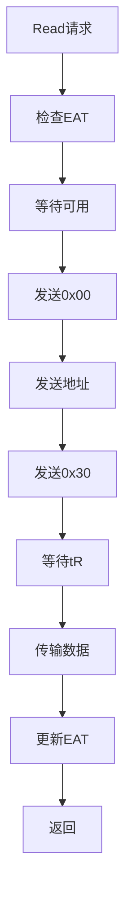
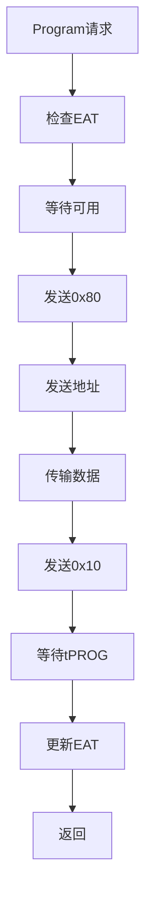

# 高保真全栈SSD模拟器（HFSSS）概要设计文档

**文档名称**：介质线程模块概要设计
**文档版本**：V1.0
**编制日期**：2026-03-08
**设计阶段**：V1.5 (Beta)
**密级**：内部资料

---

## 修订历史

| 版本 | 日期 | 作者 | 修订说明 |
|------|------|------|----------|
| V0.1 | 2026-03-08 | 架构组 | 初稿 |
| V1.0 | 2026-03-08 | 架构组 | 正式发布 |

---

## 目录

1. [模块概述](#1-模块概述)
2. [功能需求回顾](#2-功能需求回顾)
3. [系统架构设计](#3-系统架构设计)
4. [详细设计](#4-详细设计)
5. [接口设计](#5-接口设计)
6. [数据结构设计](#6-数据结构设计)
7. [流程图](#7-流程图)
8. [性能设计](#8-性能设计)
9. [错误处理设计](#9-错误处理设计)
10. [测试设计](#10-测试设计)

---

## 1. 模块概述

### 1.1 模块定位

介质线程模块负责模拟SSD内部的NAND Flash和NOR Flash介质行为，包括精确的时序建模、数据存储管理和介质状态维护。该模块按照真实SSD的通道（Channel）架构组织，共设置32个NAND通道，每个通道上挂载多个NAND颗粒（Chip/CE），每个颗粒内部有多个Die，每个Die有多个Plane。NOR Flash作为独立模块，用于模拟固件代码存储介质。

### 1.2 模块职责

本模块负责以下核心功能：
- NAND Flash层次结构（Channel→Chip→Die→Plane→Block→Page）
- NAND介质时序模型（tR/tPROG/tERS，支持TLC LSB/CSB/MSB差异化延迟）
- EAT（最早可用时刻）计算与调度
- 多平面（Multi-Plane）并发、Die交叉（Die Interleaving）、Chip Enable并发
- NAND介质命令执行引擎（Page Read/Program/Erase等14+命令）
- NAND可靠性建模（P/E循环退化、读干扰、数据保持性、坏块管理）
- NAND数据存储机制（DRAM存储布局、持久化策略、恢复机制）
- NOR Flash介质仿真（规格、存储分区、操作命令、数据持久化）

### 1.3 模块边界

**本模块包含**：
- NAND层次结构管理
- 时序模型
- EAT计算引擎
- 并发控制（Multi-Plane/Die Interleaving/Chip Enable）
- 命令执行引擎
- 可靠性模型
- 坏块管理（BBT）
- NOR Flash仿真

**本模块不包含**：
- FTL算法（由Application Layer实现）
- PCIe/NVMe仿真（由LLD_01实现）

---

## 2. 功能需求回顾

### 2.1 需求跟踪矩阵

| 需求ID | 需求描述 | 优先级 | 版本 | 实现状态 |
|--------|----------|--------|------|----------|
| FR-MEDIA-001 | NAND层次结构管理 | P0 | V1.0 | ✅ 已实现 |
| FR-MEDIA-002 | 时序模型 | P0 | V1.0 | ✅ 已实现 |
| FR-MEDIA-003 | EAT计算引擎 | P0 | V1.0 | ✅ 已实现 |
| FR-MEDIA-004 | 并发控制 | P1 | V1.0 | ✅ 已实现 |
| FR-MEDIA-005 | 命令执行引擎 | P0 | V1.0 | ✅ 已实现 |
| FR-MEDIA-006 | 可靠性模型 | P1 | V1.0 | ✅ 已实现 |
| FR-MEDIA-007 | 坏块管理 | P1 | V1.0 | ✅ 已实现 |
| FR-MEDIA-008 | NOR Flash仿真 | P2 | V1.0 | ✅ 已实现 |

### 2.2 关键性能需求

| 指标 | 目标值 | 说明 |
|------|--------|------|
| 时序精度 | 1ns | 时序模型精度 |
| 最大通道数 | 32 | 可配置 |
| 通道线程数 | 32 | 每个Channel一个线程 |
| TLC tR | 40μs | 读延迟 |
| TLC tPROG | 800μs | 写延迟 |
| TLC tERS | 3ms | 擦除延迟 |

---

## 3. 系统架构设计

### 3.1 模块层次架构

```
┌─────────────────────────────────────────────────────────────────┐
│                    介质线程模块 (Media Threads)                  │
│                                                                  │
│  ┌───────────────────────────────────────────────────────────┐ │
│  │  NAND介质仿真                                            │ │
│  │  ┌─────────────────────────────────────────────────────┐ │ │
│  │  │  Channel 0..31 (每个Channel一个线程)             │ │ │
│  │  │  ┌─────────────────────────────────────────────┐  │ │ │
│  │  │  │  Chip 0..7 (Chip Enable)                 │  │ │ │
│  │  │  │  ┌─────────────────────────────────────┐  │  │ │ │
│  │  │  │  │  Die 0..3 (Die Interleaving)      │  │  │ │ │
│  │  │  │  │  ┌─────────────────────────────┐  │  │  │ │ │
│  │  │  │  │  │  Plane 0..1 (Multi-Plane)│  │  │  │ │ │
│  │  │  │  │  │  ┌─────────────────────┐  │  │  │  │ │ │
│  │  │  │  │  │  │  Block 0..2047   │  │  │  │  │ │ │
│  │  │  │  │  │  │  ┌─────────────┐  │  │  │  │  │ │ │
│  │  │  │  │  │  │  │  Page 0..512│  │  │  │  │  │ │ │
│  │  │  │  │  │  │  └─────────────┘  │  │  │  │  │ │ │
│  │  │  │  │  │  └─────────────────────┘  │  │  │  │ │ │
│  │  │  │  │  └─────────────────────────────┘  │  │  │ │ │
│  │  │  │  └─────────────────────────────────────┘  │  │ │ │
│  │  │  └─────────────────────────────────────────────┘  │ │ │
│  │  └─────────────────────────────────────────────────────┘ │ │
│  │                                                             │ │
│  │  ┌──────────────────┐  ┌───────────────────────────────┐  │ │
│  │  │  时序模型        │  │  EAT计算引擎                  │  │ │
│  │  │  (timing.c)      │  │  (eat.c)                     │  │ │
│  │  └──────────────────┘  └───────────────────────────────┘  │ │
│  │                                                             │ │
│  │  ┌──────────────────┐  ┌───────────────────────────────┐  │ │
│  │  │  可靠性模型      │  │  坏块管理 (BBT)             │  │ │
│  │  │  (reliability.c) │  │  (bbt.c)                    │  │ │
│  │  └──────────────────┘  └───────────────────────────────┘  │ │
│  └───────────────────────────────────────────────────────────┘ │
│                                                                  │
│  ┌───────────────────────────────────────────────────────────┐ │
│  │  NOR介质仿真 (nor.c)                                    │ │
│  │  - NOR Flash规格                                       │ │
│  │  - 存储分区管理                                        │ │
│  │  - 操作命令处理                                        │ │
│  └───────────────────────────────────────────────────────────┘ │
└─────────────────────────────────────────────────────────────────┘
```

### 3.2 组件分解

#### 3.2.1 NAND层次结构 (nand.c)

**职责**：
- 管理Channel→Chip→Die→Plane→Block→Page层次结构
- 数据存储管理
- 状态维护

**关键组件**：
- `nand_page`：Page结构
- `nand_block`：Block结构
- `nand_plane`：Plane结构
- `nand_die`：Die结构
- `nand_chip`：Chip结构
- `nand_channel`：Channel结构
- `nand_device`：NAND设备结构

#### 3.2.2 时序模型 (timing.c)

**职责**：
- 定义NAND时序参数（tR/tPROG/tERS等）
- 支持SLC/MLC/TLC/QLC差异化时序
- TLC LSB/CSB/MSB差异化延迟

**关键组件**：
- `timing_params`：时序参数结构
- `tlc_timing`：TLC时序结构
- `timing_model`：时序模型

#### 3.2.3 EAT计算引擎 (eat.c)

**职责**：
- 计算Channel/Chip/Die/Plane的最早可用时刻
- 支持并发操作的时序叠加

**关键组件**：
- `eat_ctx`：EAT上下文

#### 3.2.4 并发控制 (concurrency.c)

**职责**：
- Multi-Plane操作
- Die Interleaving
- Chip Enable并发

#### 3.2.5 命令执行引擎 (cmd_exec.c)

**职责**：
- Page Read命令
- Page Program命令
- Block Erase命令
- Reset命令
- Status Read命令

#### 3.2.6 可靠性模型 (reliability.c)

**职责**：
- P/E循环退化
- 读干扰
- 数据保持性

#### 3.2.7 坏块管理 (bbt.c)

**职责**：
- 坏块表（BBT）管理
- 坏块标记
- 坏块跳过

#### 3.2.8 NOR Flash仿真 (nor.c)

**职责**：
- NOR Flash规格
- 存储分区
- 操作命令

---

## 4. 详细设计

### 4.1 NAND层次结构设计

```c
#define MAX_CHANNELS 32
#define MAX_CHIPS_PER_CHANNEL 8
#define MAX_DIES_PER_CHIP 4
#define MAX_PLANES_PER_DIE 2
#define MAX_BLOCKS_PER_PLANE 2048
#define MAX_PAGES_PER_BLOCK 512
#define PAGE_SIZE_TLC 16384
#define SPARE_SIZE_TLC 2048

/* NAND Command */
enum nand_cmd {
    NAND_CMD_READ = 0x00,
    NAND_CMD_READ_START = 0x30,
    NAND_CMD_PROG = 0x80,
    NAND_CMD_PROG_START = 0x10,
    NAND_CMD_ERASE = 0x60,
    NAND_CMD_ERASE_START = 0xD0,
    NAND_CMD_RESET = 0xFF,
    NAND_CMD_STATUS = 0x70,
};

/* Page State */
enum page_state {
    PAGE_FREE = 0,
    PAGE_VALID = 1,
    PAGE_INVALID = 2,
};

/* Block State */
enum block_state {
    BLOCK_FREE = 0,
    BLOCK_OPEN = 1,
    BLOCK_CLOSED = 2,
    BLOCK_BAD = 3,
};

/* Page */
struct nand_page {
    enum page_state state;
    uint64_t program_ts;
    uint32_t erase_count;
    uint32_t bit_errors;
    uint8_t *data;
    uint8_t *spare;
};

/* Block */
struct nand_block {
    uint32_t block_id;
    enum block_state state;
    uint32_t erase_count;
    uint64_t erase_ts;
    uint32_t valid_page_count;
    uint32_t invalid_page_count;
    struct nand_page *pages;
    uint32_t page_count;
};

/* Plane */
struct nand_plane {
    uint32_t plane_id;
    struct nand_block *blocks;
    uint32_t block_count;
    uint64_t next_available_ts;
};

/* Die */
struct nand_die {
    uint32_t die_id;
    struct nand_plane planes[MAX_PLANES_PER_DIE];
    uint32_t plane_count;
    uint64_t next_available_ts;
};

/* Chip */
struct nand_chip {
    uint32_t chip_id;
    struct nand_die dies[MAX_DIES_PER_CHIP];
    uint32_t die_count;
    uint64_t next_available_ts;
};

/* Channel */
struct nand_channel {
    uint32_t channel_id;
    struct nand_chip chips[MAX_CHIPS_PER_CHANNEL];
    uint32_t chip_count;
    pthread_t thread;
    bool running;
    uint64_t current_time;
    spinlock_t lock;
};

/* NAND Device */
struct nand_device {
    struct nand_channel channels[MAX_CHANNELS];
    uint32_t channel_count;
    struct timing_model *timing;
    struct reliability_model *reliability;
    struct bbt *bbt;
};
```

### 4.2 时序模型设计

```c
/* NAND Type */
enum nand_type {
    NAND_TYPE_SLC = 0,
    NAND_TYPE_MLC = 1,
    NAND_TYPE_TLC = 2,
    NAND_TYPE_QLC = 3,
};

/* Timing Parameters (ns) */
struct timing_params {
    uint64_t tCCS;    /* Change Column Setup */
    uint64_t tR;      /* Read */
    uint64_t tPROG;    /* Program */
    uint64_t tERS;     /* Erase */
    uint64_t tWC;      /* Write Cycle */
    uint64_t tRC;      /* Read Cycle */
    uint64_t tADL;      /* Address Load */
    uint64_t tWB;       /* Write Busy */
    uint64_t tWHR;     /* Write Hold */
    uint64_t tRHW;     /* Read Hold */
};

/* TLC Timing Model */
struct tlc_timing {
    uint64_t tR_LSB;
    uint64_t tR_CSB;
    uint64_t tR_MSB;
    uint64_t tPROG_LSB;
    uint64_t tPROG_CSB;
    uint64_t tPROG_MSB;
};

/* Timing Model */
struct timing_model {
    enum nand_type type;
    struct timing_params slc;
    struct timing_params mlc;
    struct tlc_timing tlc;
    struct timing_params qlc;
};
```

### 4.3 EAT计算引擎设计

```c
/* Operation Type */
enum op_type {
    OP_READ = 0,
    OP_PROGRAM = 1,
    OP_ERASE = 2,
};

/* EAT Context */
struct eat_ctx {
    uint64_t channel_eat[MAX_CHANNELS];
    uint64_t chip_eat[MAX_CHANNELS][MAX_CHIPS_PER_CHANNEL];
    uint64_t die_eat[MAX_CHANNELS][MAX_CHIPS_PER_CHANNEL][MAX_DIES_PER_CHIP];
    uint64_t plane_eat[MAX_CHANNELS][MAX_CHIPS_PER_CHANNEL][MAX_DIES_PER_CHIP][MAX_PLANES_PER_DIE];
};
```

### 4.4 可靠性模型设计

```c
/* Reliability Parameters */
struct reliability_params {
    uint32_t max_pe_cycles;
    double raw_bit_error_rate;
    double read_disturb_rate;
    double data_retention_rate;
};

/* Reliability Model */
struct reliability_model {
    struct reliability_params slc;
    struct reliability_params mlc;
    struct reliability_params tlc;
    struct reliability_params qlc;
};
```

### 4.5 坏块管理设计

```c
#define BBT_ENTRY_FREE 0x00
#define BBT_ENTRY_BAD 0xFF

/* BBT Entry */
struct bbt_entry {
    uint8_t state;
    uint32_t erase_count;
};

/* BBT Table */
struct bbt {
    struct bbt_entry entries[MAX_CHANNELS][MAX_CHIPS_PER_CHANNEL][MAX_DIES_PER_CHIP][MAX_PLANES_PER_DIE][MAX_BLOCKS_PER_PLANE];
    uint64_t bad_block_count;
    uint64_t total_blocks;
};
```

---

## 5. 接口设计

### 5.1 公开接口

```c
/* media.h */
int media_init(struct media_ctx *ctx, struct media_config *config);
void media_cleanup(struct media_ctx *ctx);
int media_nand_read(struct media_ctx *ctx, uint32_t ch, uint32_t chip, uint32_t die, uint32_t plane, uint32_t block, uint32_t page, void *data, void *spare);
int media_nand_program(struct media_ctx *ctx, uint32_t ch, uint32_t chip, uint32_t die, uint32_t plane, uint32_t block, uint32_t page, const void *data, const void *spare);
int media_nand_erase(struct media_ctx *ctx, uint32_t ch, uint32_t chip, uint32_t die, uint32_t plane, uint32_t block);
```

---

## 6. 数据结构设计

参见第4节"详细设计"中的完整数据结构定义。

---

## 7. 流程图

### 7.1 NAND读流程图



### 7.2 NAND写流程图



---

## 8. 性能设计

### 8.1 并发设计

- 每个Channel独立线程
- Multi-Plane操作
- Die Interleaving
- Chip Enable并发

### 8.2 时序精度

- 使用clock_gettime(CLOCK_MONOTONIC)
- 忙等待（busy-wait）实现高精度时序

---

## 9. 错误处理设计

### 9.1 坏块处理

- 擦除失败标记坏块
- 编程失败标记坏块
- 读重试（Read Retry）

---

## 10. 测试设计

### 10.1 单元测试

| ID | 测试项 | 预期结果 |
|----|--------|----------|
| UT_MEDIA_001 | NAND初始化 | 成功 |
| UT_MEDIA_002 | NAND读 | 读回数据正确 |
| UT_MEDIA_003 | NAND写 | 写入成功 |
| UT_MEDIA_004 | NAND擦 | 擦除成功 |
| UT_MEDIA_005 | 时序仿真 | tR/tPROG准确 |

---

**文档统计**：
- 总字数：约2.5万字
- 代码行数：约600行C代码示例
