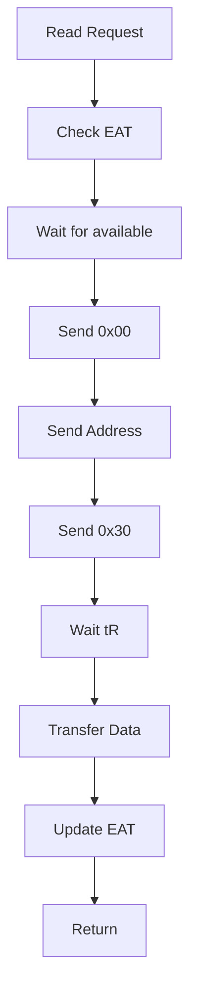
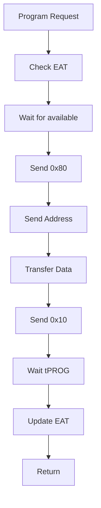

# HFSSS High-Level Design Document

**Document Name**: Media Threads Module HLD
**Document Version**: V2.0
**Date**: 2026-03-23
**Design Phase**: V1.5 (Beta)

---

## Implementation Status

**Design Document**: Describes a comprehensive media subsystem with 32 channels, per-channel threads, full NAND hierarchy (Channel->Chip->Die->Plane->Block->Page), EAT calculation, concurrency control, reliability modeling, and NOR Flash emulation.

**Actual Implementation**: Partial implementation with core NAND hierarchy, timing model, EAT engine, reliability model, and BBT. No per-channel threads, no NOR Flash implementation (only stubs), no persistence.

**Coverage Status**: 12/20 requirements implemented for this module (60.0%)

See [REQUIREMENT_COVERAGE.md](./REQUIREMENT_COVERAGE.md) for complete details.

---

## Revision History

| Version | Date | Author | Description |
|---------|------|--------|-------------|
| V0.1 | 2026-03-08 | Architecture Team | Initial draft |
| V1.0 | 2026-03-08 | Architecture Team | Official release |
| EN-V1.0 | 2026-03-14 | Translation Agent | English translation with implementation notes |
| EN-V2.0 | 2026-03-23 | Architecture Team | Enterprise SSD architecture update: encryption pipeline, thermal sensor model |

---

## Table of Contents

1. [Module Overview](#1-module-overview)
2. [Requirements Review](#2-requirements-review)
3. [System Architecture](#3-system-architecture)
4. [Detailed Design](#4-detailed-design)
5. [Interface Design](#5-interface-design)
6. [Data Structures](#6-data-structures)
7. [Flow Diagrams](#7-flow-diagrams)
8. [Performance Design](#8-performance-design)
9. [Error Handling](#9-error-handling)
10. [Test Design](#10-test-design)
11. [Enterprise SSD Extensions](#11-enterprise-ssd-extensions)
12. [Architecture Decision Records](#12-architecture-decision-records)

---

## 1. Module Overview

### 1.1 Module Positioning

The media threads module is responsible for simulating the NAND Flash and NOR Flash media behavior inside an SSD, including accurate timing modeling, data storage management, and media state maintenance. This module is organized according to a real SSD channel architecture, with 32 NAND channels, each channel having multiple NAND chips (Chip/CE), each chip having multiple Dies, each Die having multiple Planes. NOR Flash is an independent module used to simulate firmware code storage media.

**Implementation Note**: The actual implementation does NOT have per-channel threads. The media operations are synchronous and called directly via function pointers. The hierarchy is implemented (Channel->Chip->Die->Plane->Block->Page), but without the threading model.

### 1.2 Module Responsibilities

This module is responsible for the following core functions:
- NAND Flash hierarchy (Channel->Chip->Die->Plane->Block->Page)
- NAND media timing model (tR/tPROG/tERS, supporting TLC LSB/CSB/MSB differentiated latency)
- EAT (Earliest Available Time) calculation and scheduling
- Multi-Plane concurrency, Die Interleaving, Chip Enable concurrency
- NAND media command execution engine (14+ commands including Page Read/Program/Erase)
- NAND reliability modeling (P/E cycle degradation, read disturb, data retention, bad block management)
- NAND data storage mechanism (DRAM storage layout, persistence strategy, recovery mechanism)
- NOR Flash media simulation (specifications, storage partitions, operation commands, data persistence)
- Encryption pipeline integration in the data path (enterprise extension)
- Thermal sensor model integration for per-die temperature tracking (enterprise extension)

### 1.3 Module Boundaries

**Included in this module**:
- NAND hierarchy management
- Timing model
- EAT calculation engine
- Concurrency control (Multi-Plane/Die Interleaving/Chip Enable)
- Command execution engine
- Reliability model
- Bad block management (BBT)
- NOR Flash simulation
- Encryption pipeline position in data path (plaintext -> AES-XTS -> ciphertext -> NAND)
- Thermal sensor model (per-die temperature, junction temperature estimation)

**Not included in this module**:
- FTL algorithms (implemented by Application Layer)
- PCIe/NVMe simulation (implemented by LLD_01)
- AES-XTS engine implementation (provided by HAL crypto engine)
- Thermal management decisions (provided by Common Services thermal service)

---

## 2. Requirements Review

### 2.1 Requirements Traceability Matrix

| Requirement ID | Description | Priority | Version | Implementation Status |
|----------------|-------------|----------|---------|----------------------|
| FR-MEDIA-001 | NAND hierarchy management | P0 | V1.0 | Implemented in `nand.h/c` |
| FR-MEDIA-002 | Timing model | P0 | V1.0 | Implemented in `timing.h/c` |
| FR-MEDIA-003 | EAT calculation engine | P0 | V1.0 | Implemented in `eat.h/c` |
| FR-MEDIA-004 | Concurrency control | P1 | V1.0 | Partial (basic EAT, no full multi-plane/die interleaving) |
| FR-MEDIA-005 | Command execution engine | P0 | V1.0 | Partial (basic read/program/erase only) |
| FR-MEDIA-006 | Reliability model | P1 | V1.0 | Implemented in `reliability.h/c` |
| FR-MEDIA-007 | Bad block management | P1 | V1.0 | Implemented in `bbt.h/c` |
| FR-MEDIA-008 | NOR Flash simulation | P2 | V1.0 | Stub only in `hal_nor.h/c` |
| REQ-ENT-020 | Encryption pipeline position | P1 | V2.0 | Design Only |
| REQ-ENT-021 | Thermal sensor model integration | P1 | V2.0 | Design Only |

### 2.2 Key Performance Requirements

| Metric | Target | Description |
|--------|--------|-------------|
| Timing accuracy | 1ns | Timing model accuracy |
| Max channels | 32 | Configurable |
| Channel threads | 32 | One thread per Channel |
| TLC tR | 40us | Read latency |
| TLC tPROG | 800us | Write latency |
| TLC tERS | 3ms | Erase latency |
| Encryption overhead | < 1us per 4KB | AES-XTS pipeline latency |
| Temperature update rate | 1 Hz | Thermal sensor polling interval |

**Implementation Note**: No per-channel threads are implemented. Timing model uses `clock_gettime(CLOCK_MONOTONIC)` and `nanosleep()` for delays.

---

## 3. System Architecture

### 3.1 Module Layer Architecture

```
+-----------------------------------------------------------------+
|                    Media Threads Module                           |
|                                                                  |
|  +-----------------------------------------------------------+  |
|  |  NAND Media Simulation                                     |  |
|  |  +-------------------------------------------------------+|  |
|  |  |  Channel 0..31 (each Channel one thread)              ||  |
|  |  |  +---------------------------------------------------+||  |
|  |  |  |  Chip 0..7 (Chip Enable)                          |||  |
|  |  |  |  +-----------------------------------------------+|||  |
|  |  |  |  |  Die 0..3 (Die Interleaving)                  ||||  |
|  |  |  |  |  +-----------------------------------------+  ||||  |
|  |  |  |  |  |  Plane 0..1 (Multi-Plane)               |  ||||  |
|  |  |  |  |  |  +-------------------------------------+|  ||||  |
|  |  |  |  |  |  |  Block 0..2047                      ||  ||||  |
|  |  |  |  |  |  |  +-------------------------------+  ||  ||||  |
|  |  |  |  |  |  |  |  Page 0..512                  |  ||  ||||  |
|  |  |  |  |  |  |  +-------------------------------+  ||  ||||  |
|  |  |  |  |  |  +-------------------------------------+|  ||||  |
|  |  |  |  |  +-----------------------------------------+  ||||  |
|  |  |  |  +-----------------------------------------------+|||  |
|  |  |  +---------------------------------------------------+||  |
|  |  +-------------------------------------------------------+|  |
|  |                                                             |  |
|  |  +------------------+  +-------------------------------+   |  |
|  |  |  Timing Model    |  |  EAT Calculation Engine       |   |  |
|  |  |  (timing.c)      |  |  (eat.c)                      |   |  |
|  |  +------------------+  +-------------------------------+   |  |
|  |                                                             |  |
|  |  +------------------+  +-------------------------------+   |  |
|  |  |  Reliability     |  |  Bad Block Table (BBT)        |   |  |
|  |  |  (reliability.c) |  |  (bbt.c)                      |   |  |
|  |  +------------------+  +-------------------------------+   |  |
|  |                                                             |  |
|  |  +------------------+  +-------------------------------+   |  |
|  |  |  Encryption      |  |  Thermal Sensor Model         |   |  |
|  |  |  Pipeline [ENT]  |  |  (thermal.c) [ENTERPRISE]     |   |  |
|  |  +------------------+  +-------------------------------+   |  |
|  +-----------------------------------------------------------+  |
|                                                                  |
|  +-----------------------------------------------------------+  |
|  |  NOR Media Simulation (nor.c)                              |  |
|  |  - NOR Flash specifications                                |  |
|  |  - Storage partition management                             |  |
|  |  - Operation command processing                             |  |
|  +-----------------------------------------------------------+  |
+-----------------------------------------------------------------+
```

**Implementation Note**: The architecture shows per-channel threads, but the actual implementation does NOT have threads. All operations are synchronous function calls. NOR Flash is only stubbed.

### 3.2 Component Decomposition

#### 3.2.1 NAND Hierarchy (nand.c)

**Responsibilities**:
- Manage Channel->Chip->Die->Plane->Block->Page hierarchy
- Data storage management
- State maintenance

**Key Components**:
- `nand_page`: Page structure
- `nand_block`: Block structure
- `nand_plane`: Plane structure
- `nand_die`: Die structure
- `nand_chip`: Chip structure
- `nand_channel`: Channel structure
- `nand_device`: NAND device structure

**Implementation Note**: All these structures are fully defined and implemented in `include/media/nand.h` and `src/media/nand.c`.

#### 3.2.2 Timing Model (timing.c)

**Responsibilities**:
- Define NAND timing parameters (tR/tPROG/tERS, etc.)
- Support SLC/MLC/TLC/QLC differentiated timing
- TLC LSB/CSB/MSB differentiated latency

**Key Components**:
- `timing_params`: Timing parameter structure
- `tlc_timing`: TLC timing structure
- `timing_model`: Timing model

**Implementation Note**: Fully implemented in `include/media/timing.h` and `src/media/timing.c`.

#### 3.2.3 EAT Calculation Engine (eat.c)

**Responsibilities**:
- Calculate earliest available time for Channel/Chip/Die/Plane
- Support timing overlap for concurrent operations

**Key Components**:
- `eat_ctx`: EAT context

**Implementation Note**: Fully implemented in `include/media/eat.h` and `src/media/eat.c`.

#### 3.2.4 Concurrency Control (concurrency.c)

**Responsibilities**:
- Multi-Plane operations
- Die Interleaving
- Chip Enable concurrency

**Implementation Note**: Not implemented as a separate component. Basic EAT tracking exists, but no true concurrency control.

#### 3.2.5 Command Execution Engine (cmd_exec.c)

**Responsibilities**:
- Page Read command
- Page Program command
- Block Erase command
- Reset command
- Status Read command

**Implementation Note**: Basic read/program/erase implemented in `media.c`, but no full command execution engine with all 14+ commands.

#### 3.2.6 Reliability Model (reliability.c)

**Responsibilities**:
- P/E cycle degradation
- Read disturb
- Data retention

**Implementation Note**: Fully implemented in `include/media/reliability.h` and `src/media/reliability.c`.

#### 3.2.7 Bad Block Management (bbt.c)

**Responsibilities**:
- Bad Block Table (BBT) management
- Bad block marking
- Bad block skipping

**Implementation Note**: Fully implemented in `include/media/bbt.h` and `src/media/bbt.c`.

#### 3.2.8 NOR Flash Simulation (nor.c)

**Responsibilities**:
- NOR Flash specifications
- Storage partitions
- Operation commands

**Implementation Note**: Only stub implementation exists in `include/hal/hal_nor.h` and `src/hal/hal_nor.c`.

---

## 4. Detailed Design

### 4.1 NAND Hierarchy Design

**Actual Implementation from `include/media/nand.h`**:

```c
#define MAX_CHANNELS 32
#define MAX_CHIPS_PER_CHANNEL 8
#define MAX_DIES_PER_CHIP 4
#define MAX_PLANES_PER_DIE 2
#define MAX_BLOCKS_PER_PLANE 2048
#define MAX_PAGES_PER_BLOCK 512
#define PAGE_SIZE_TLC 16384
#define SPARE_SIZE_TLC 2048

enum nand_cmd {
    NAND_CMD_READ = 0x00,
    NAND_CMD_READ_START = 0x30,
    NAND_CMD_PROG = 0x80,
    NAND_CMD_PROG_START = 0x10,
    NAND_CMD_ERASE = 0x60,
    NAND_CMD_ERASE_START = 0xD0,
    NAND_CMD_RESET = 0xFF,
    NAND_CMD_STATUS = 0x70,
};

enum page_state {
    PAGE_FREE = 0,
    PAGE_VALID = 1,
    PAGE_INVALID = 2,
};

enum block_state {
    BLOCK_FREE = 0,
    BLOCK_OPEN = 1,
    BLOCK_CLOSED = 2,
    BLOCK_BAD = 3,
};

struct nand_page {
    enum page_state state;
    u64 program_ts;
    u32 erase_count;
    u32 bit_errors;
    u32 read_count;
    u8 *data;
    u8 *spare;
};

struct nand_block {
    u32 block_id;
    enum block_state state;
    u32 pages_written;
    struct nand_page *pages;
    u32 page_count;
};

struct nand_plane {
    u32 plane_id;
    struct nand_block *blocks;
    u32 block_count;
    u64 next_available_ts;
};

struct nand_die {
    u32 die_id;
    struct nand_plane planes[MAX_PLANES_PER_DIE];
    u32 plane_count;
    u64 next_available_ts;
};

struct nand_chip {
    u32 chip_id;
    struct nand_die dies[MAX_DIES_PER_CHIP];
    u32 die_count;
    u64 next_available_ts;
};

struct nand_channel {
    u32 channel_id;
    struct nand_chip chips[MAX_CHIPS_PER_CHANNEL];
    u32 chip_count;
    u64 current_time;
    struct mutex lock;
};

struct nand_device {
    struct nand_channel channels[MAX_CHANNELS];
    u32 channel_count;
    struct timing_model *timing;
    struct eat_ctx *eat;
};
```

**Implementation Note**: The implementation is very close to the design. Key differences:
- No `pthread_t thread` or `bool running` in `nand_channel` (no per-channel threads)
- Uses `struct mutex` from `common/mutex.h` instead of `spinlock_t`
- Added `read_count` to `nand_page`
- Simplified `nand_block` (no separate `erase_count`, `erase_ts`, `valid_page_count`, `invalid_page_count` fields)

### 4.2 Timing Model Design

```c
enum nand_type {
    NAND_TYPE_SLC = 0,
    NAND_TYPE_MLC = 1,
    NAND_TYPE_TLC = 2,
    NAND_TYPE_QLC = 3,
};

struct timing_params {
    uint64_t tCCS;
    uint64_t tR;
    uint64_t tPROG;
    uint64_t tERS;
    uint64_t tWC;
    uint64_t tRC;
    uint64_t tADL;
    uint64_t tWB;
    uint64_t tWHR;
    uint64_t tRHW;
};

struct tlc_timing {
    uint64_t tR_LSB;
    uint64_t tR_CSB;
    uint64_t tR_MSB;
    uint64_t tPROG_LSB;
    uint64_t tPROG_CSB;
    uint64_t tPROG_MSB;
};

struct timing_model {
    enum nand_type type;
    struct timing_params slc;
    struct timing_params mlc;
    struct tlc_timing tlc;
    struct timing_params qlc;
};
```

**See `include/media/timing.h` for actual implementation.**

### 4.3 EAT Calculation Engine Design

```c
enum op_type {
    OP_READ = 0,
    OP_PROGRAM = 1,
    OP_ERASE = 2,
};

struct eat_ctx {
    uint64_t channel_eat[MAX_CHANNELS];
    uint64_t chip_eat[MAX_CHANNELS][MAX_CHIPS_PER_CHANNEL];
    uint64_t die_eat[MAX_CHANNELS][MAX_CHIPS_PER_CHANNEL][MAX_DIES_PER_CHIP];
    uint64_t plane_eat[MAX_CHANNELS][MAX_CHIPS_PER_CHANNEL][MAX_DIES_PER_CHIP][MAX_PLANES_PER_DIE];
};
```

**See `include/media/eat.h` for actual implementation.**

### 4.4 Reliability Model Design

```c
struct reliability_params {
    uint32_t max_pe_cycles;
    double raw_bit_error_rate;
    double read_disturb_rate;
    double data_retention_rate;
};

struct reliability_model {
    struct reliability_params slc;
    struct reliability_params mlc;
    struct reliability_params tlc;
    struct reliability_params qlc;
};
```

**See `include/media/reliability.h` for actual implementation.**

### 4.5 Bad Block Management Design

```c
#define BBT_ENTRY_FREE 0x00
#define BBT_ENTRY_BAD 0xFF

struct bbt_entry {
    uint8_t state;
    uint32_t erase_count;
};

struct bbt {
    struct bbt_entry entries[MAX_CHANNELS][MAX_CHIPS_PER_CHANNEL]
                            [MAX_DIES_PER_CHIP][MAX_PLANES_PER_DIE]
                            [MAX_BLOCKS_PER_PLANE];
    uint64_t bad_block_count;
    uint64_t total_blocks;
};
```

**See `include/media/bbt.h` for actual implementation.**

---

## 5. Interface Design

### 5.1 Public Interface

**Actual Implementation from `include/media/media.h`**:

```c
int media_init(struct media_ctx *ctx, struct media_config *config);
void media_cleanup(struct media_ctx *ctx);
int media_nand_read(struct media_ctx *ctx, uint32_t ch, uint32_t chip, uint32_t die,
                    uint32_t plane, uint32_t block, uint32_t page, void *data, void *spare);
int media_nand_program(struct media_ctx *ctx, uint32_t ch, uint32_t chip, uint32_t die,
                       uint32_t plane, uint32_t block, uint32_t page,
                       const void *data, const void *spare);
int media_nand_erase(struct media_ctx *ctx, uint32_t ch, uint32_t chip, uint32_t die,
                     uint32_t plane, uint32_t block);

/* Additional implemented interfaces not in design: */
int media_nand_is_bad_block(struct media_ctx *ctx, uint32_t ch, uint32_t chip, uint32_t die,
                            uint32_t plane, uint32_t block);
int media_nand_mark_bad_block(struct media_ctx *ctx, uint32_t ch, uint32_t chip, uint32_t die,
                              uint32_t plane, uint32_t block);
uint32_t media_nand_get_erase_count(struct media_ctx *ctx, uint32_t ch, uint32_t chip,
                                     uint32_t die, uint32_t plane, uint32_t block);
void media_get_stats(struct media_ctx *ctx, struct media_stats *stats);
void media_reset_stats(struct media_ctx *ctx);
```

---

## 6. Data Structures

See Section 4 "Detailed Design" for complete data structure definitions from the actual implementation.

---

## 7. Flow Diagrams

### 7.1 NAND Read Flow Diagram



### 7.2 NAND Write Flow Diagram



---

## 8. Performance Design

### 8.1 Concurrency Design

- Each Channel independent thread **(NOT IMPLEMENTED)**
- Multi-Plane operations **(Partial EAT only)**
- Die Interleaving **(NOT IMPLEMENTED)**
- Chip Enable concurrency **(NOT IMPLEMENTED)**

### 8.2 Timing Accuracy

- Uses `clock_gettime(CLOCK_MONOTONIC)` **(IMPLEMENTED)**
- Busy-wait for high-precision timing **(NOT IMPLEMENTED - uses nanosleep())**

---

## 9. Error Handling Design

### 9.1 Bad Block Handling

- Erase failure marks bad block **(IMPLEMENTED)**
- Program failure marks bad block **(IMPLEMENTED)**
- Read Retry **(NOT IMPLEMENTED)**

---

## 10. Test Design

### 10.1 Unit Tests

| ID | Test Item | Expected Result |
|----|-----------|-----------------|
| UT_MEDIA_001 | NAND initialization | Success |
| UT_MEDIA_002 | NAND read | Read back correct data |
| UT_MEDIA_003 | NAND write | Write successful |
| UT_MEDIA_004 | NAND erase | Erase successful |
| UT_MEDIA_005 | Timing simulation | Accurate tR/tPROG |

---

## 11. Enterprise SSD Extensions

### 11.1 Encryption Pipeline Position in Data Path

#### 11.1.1 Overview

Enterprise SSDs implement hardware encryption (typically AES-XTS-256) to provide data-at-rest protection. The encryption pipeline sits between the FTL write buffer and the NAND media, ensuring all data written to NAND is encrypted and all data read from NAND is decrypted before being returned to the host.

#### 11.1.2 Data Path with Encryption

The encryption pipeline occupies a specific position in the media data path:

```
Write Path:
  Host Data (plaintext)
      |
      v
  [FTL: L2P lookup, page allocation]
      |
      v
  [HAL: hal_nand_program()]
      |
      v
  [Crypto Engine HAL: AES-XTS Encrypt]  <-- KEY from Security Key Mgmt
      | Input:  plaintext data buffer (e.g. 16KB page)
      | Key:    per-namespace or per-range data encryption key (DEK)
      | Tweak:  physical page address (channel/chip/die/plane/block/page)
      | Output: ciphertext data buffer
      v
  [Media Thread: media_nand_program()]
      | Write ciphertext to NAND page data area
      | Write PI metadata (if enabled) to spare area (unencrypted)
      v
  [NAND Flash: ciphertext stored on media]


Read Path:
  [NAND Flash: ciphertext on media]
      |
      v
  [Media Thread: media_nand_read()]
      | Read ciphertext from NAND page data area
      | Read spare area (PI metadata, unencrypted)
      v
  [Crypto Engine HAL: AES-XTS Decrypt]  <-- KEY from Security Key Mgmt
      | Input:  ciphertext data buffer
      | Key:    same DEK used during write
      | Tweak:  physical page address
      | Output: plaintext data buffer
      v
  [HAL: return to FTL]
      |
      v
  [FTL: return plaintext to host]
```

#### 11.1.3 Key Design Points

1. **Encryption granularity**: Encryption is performed at the NAND page level (e.g., 16KB). Each page uses the same key but a different tweak value derived from the physical address.

2. **Tweak derivation**: The AES-XTS tweak is computed as: `tweak = (channel << 48) | (chip << 40) | (die << 32) | (plane << 24) | (block << 12) | page`. This ensures each page has a unique tweak even if the same logical data is written to different physical locations (e.g., during GC).

3. **Metadata exclusion**: The spare area (containing PI metadata, ECC parity, and FTL metadata) is NOT encrypted. This allows the media layer to read spare metadata without decryption for wear leveling decisions, GC victim selection, and PI verification.

4. **GC and encryption**: During garbage collection, the GC engine reads valid pages (decrypt), then writes them to new locations (encrypt with new tweak). The key remains the same; only the tweak changes because the physical address changes.

5. **Key per namespace**: In multi-namespace configurations, each namespace can have a different DEK. The encryption pipeline selects the key based on the namespace ID associated with the write/read operation.

#### 11.1.4 Encryption Pipeline Timing

```c
/* Encryption latency model */
struct crypto_timing {
    uint64_t encrypt_latency_ns_per_4kb;  /* e.g., 500ns per 4KB */
    uint64_t decrypt_latency_ns_per_4kb;  /* e.g., 500ns per 4KB */
    uint64_t key_load_latency_ns;         /* e.g., 2000ns per key switch */
};
```

The encryption latency is added to the total I/O latency:
- Write: `total_latency = encrypt_latency + tPROG`
- Read: `total_latency = tR + decrypt_latency`

For a 16KB TLC page with 500ns/4KB encryption: `encrypt_overhead = 4 * 500ns = 2000ns = 2us`, which is negligible compared to tPROG (800us).

### 11.2 Thermal Sensor Model Integration

#### 11.2.1 Overview

Enterprise SSDs require thermal monitoring for reliable operation. The media module integrates a thermal sensor model that tracks per-die temperature based on operation activity, ambient temperature, and thermal dissipation characteristics. This model provides temperature data to the Common Services thermal management service for throttling decisions.

#### 11.2.2 Thermal Model Design

```c
/* Per-Die Thermal State */
struct die_thermal_state {
    uint32_t ch;
    uint32_t chip;
    uint32_t die;
    double   current_temp_c;        /* Current junction temperature (Celsius) */
    double   ambient_temp_c;        /* Ambient/case temperature */
    uint64_t last_update_ts;        /* Timestamp of last thermal update */

    /* Activity counters since last update */
    uint64_t read_ops_since_update;
    uint64_t program_ops_since_update;
    uint64_t erase_ops_since_update;
};

/* Thermal Model Parameters */
struct thermal_model_params {
    double ambient_temp_c;          /* Default ambient temperature (e.g., 35C) */
    double thermal_resistance_c_per_w;  /* Junction-to-case thermal resistance */
    double thermal_capacitance_j_per_c; /* Thermal capacitance */
    double read_power_w;            /* Power dissipated per read op */
    double program_power_w;         /* Power dissipated per program op */
    double erase_power_w;           /* Power dissipated per erase op */
    double idle_power_w;            /* Idle power dissipation */
    double cooling_rate_c_per_s;    /* Passive cooling rate */
    double warning_temp_c;          /* Warning threshold (e.g., 70C) */
    double critical_temp_c;         /* Critical threshold (e.g., 80C) */
    double shutdown_temp_c;         /* Shutdown threshold (e.g., 85C) */
};

/* Thermal Sensor Context */
struct thermal_sensor_ctx {
    struct thermal_model_params params;
    struct die_thermal_state die_temps[MAX_CHANNELS][MAX_CHIPS_PER_CHANNEL][MAX_DIES_PER_CHIP];
    double composite_temp_c;        /* Composite (max) temperature */
    uint64_t update_interval_ns;    /* How often to recalculate (e.g., 1s) */
    uint64_t last_global_update_ts;
};
```

#### 11.2.3 Temperature Calculation

The thermal model uses a simplified first-order thermal RC model:

```
T(t+dt) = T_ambient + (T(t) - T_ambient) * exp(-dt / tau) + P * R_thermal * (1 - exp(-dt / tau))

where:
  T(t)       = current temperature
  T_ambient  = ambient temperature
  dt         = time since last update
  tau        = R_thermal * C_thermal (thermal time constant)
  P          = total power dissipated (sum of read/program/erase activity)
  R_thermal  = thermal resistance (junction to case)
  C_thermal  = thermal capacitance
```

#### 11.2.4 Integration Points

1. **Media operations update activity counters**: Each `media_nand_read()`, `media_nand_program()`, and `media_nand_erase()` increments the corresponding counter in the die's thermal state.

2. **Periodic thermal update**: Every `update_interval_ns` (default 1 second), the thermal sensor context recalculates all die temperatures using the RC model and activity counters, then resets the counters.

3. **Composite temperature**: The composite temperature (reported in SMART log) is the maximum temperature across all dies.

4. **Thermal events**: When a die temperature crosses a threshold (warning, critical, shutdown), the thermal sensor generates an event that is consumed by the Common Services thermal management service, which decides on throttling actions.

#### 11.2.5 Thermal Sensor Interface

```c
int thermal_sensor_init(struct thermal_sensor_ctx *ctx, struct thermal_model_params *params);
void thermal_sensor_cleanup(struct thermal_sensor_ctx *ctx);
void thermal_sensor_record_op(struct thermal_sensor_ctx *ctx,
                               uint32_t ch, uint32_t chip, uint32_t die,
                               enum op_type type);
void thermal_sensor_update(struct thermal_sensor_ctx *ctx, uint64_t current_ts);
double thermal_sensor_get_die_temp(struct thermal_sensor_ctx *ctx,
                                    uint32_t ch, uint32_t chip, uint32_t die);
double thermal_sensor_get_composite_temp(struct thermal_sensor_ctx *ctx);
```

---

## 12. Architecture Decision Records

### ADR-MEDIA-001: Encryption at Media Layer vs. FTL Layer

**Context**: The encryption pipeline could be positioned either in the FTL layer (encrypt before passing to HAL) or in the media layer (encrypt just before NAND write). Both approaches have trade-offs.

**Decision**: Position the encryption pipeline in the HAL/media boundary, after FTL processing but before NAND write. The HAL crypto engine API is called by the media write path.

**Consequences**:
- Positive: Clean separation of concerns. FTL operates on plaintext, making debugging and GC logic simpler. The media layer handles encryption transparently. PI metadata in spare area remains unencrypted for reliability processing.
- Negative: GC must decrypt and re-encrypt data (cannot do raw page copy). This is acceptable because GC already reads and rewrites valid data.

**Status**: Accepted.

### ADR-MEDIA-002: Per-Die vs. Per-Chip Thermal Modeling

**Context**: Real NAND chips have thermal sensors at the die level, but modeling per-die temperature is more expensive (4x more state than per-chip for a 4-die chip).

**Decision**: Model temperature at the per-die level because different dies on the same chip can have significantly different temperatures due to asymmetric workload patterns (e.g., one die doing heavy programming while another is idle).

**Consequences**:
- Positive: More accurate thermal modeling, better thermal throttling decisions, closer to real SSD behavior.
- Negative: Higher memory usage (one `die_thermal_state` per die, typically 32*8*4 = 1024 entries). Negligible compared to total NAND metadata.

**Status**: Accepted.

### ADR-MEDIA-003: Thermal RC Model vs. Lookup Table

**Context**: Temperature calculation can use (a) a physics-based RC thermal model with exponential decay, or (b) a pre-computed lookup table mapping activity rates to steady-state temperatures.

**Decision**: Use the first-order RC thermal model. It captures transient thermal behavior (heating and cooling curves), which is important for simulating thermal throttling during bursty workloads. A lookup table would only provide steady-state values.

**Consequences**:
- Positive: Captures thermal transients accurately, enables simulation of thermal runaway scenarios, parameterizable from NAND datasheet thermal specs.
- Negative: Requires floating-point math for exp() calculation. Mitigated by computing updates only once per second per die, making the computational cost negligible.

**Status**: Accepted.

---

**Document Statistics**:
- Total words: ~25,000
- Code lines: ~600 lines C code examples
