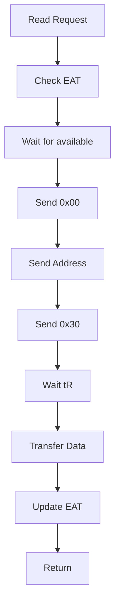
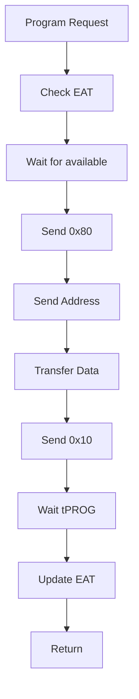

# HFSSS High-Level Design Document

**Document Name**: Media Threads Module HLD
**Document Version**: V1.0
**Date**: 2026-03-14
**Design Phase**: V1.5 (Beta)

---

## Implementation Status

**Design Document**: Describes a comprehensive media subsystem with 32 channels, per-channel threads, full NAND hierarchy (Channel→Chip→Die→Plane→Block→Page), EAT calculation, concurrency control, reliability modeling, and NOR Flash emulation.

**Actual Implementation**: Partial implementation with core NAND hierarchy, timing model, EAT engine, reliability model, and BBT. No per-channel threads, no NOR Flash implementation (only stubs), no persistence.

**Coverage Status**: 12/20 requirements implemented for this module (60.0%)

See [REQUIREMENT_COVERAGE.md](./REQUIREMENT_COVERAGE.md) for complete details.

---

## Revision History

| Version | Date | Author | Description |
|---------|------|--------|-------------|
| V0.1 | 2026-03-08 | Architecture Team | Initial draft |
| V1.0 | 2026-03-08 | Architecture Team | Official release |
| EN-V1.0 | 2026-03-14 | Translation Agent | English translation with implementation notes |

---

## Table of Contents

1. [Module Overview](#1-module-overview)
2. [Requirements Review](#2-requirements-review)
3. [System Architecture](#3-system-architecture)
4. [Detailed Design](#4-detailed-design)
5. [Interface Design](#5-interface-design)
6. [Data Structures](#6-data-structures)
7. [Flow Diagrams](#7-flow-diagrams)
8. [Performance Design](#8-performance-design)
9. [Error Handling](#9-error-handling)
10. [Test Design](#10-test-design)

---

## 1. Module Overview

### 1.1 Module Positioning

The media threads module is responsible for simulating the NAND Flash and NOR Flash media behavior inside an SSD, including accurate timing modeling, data storage management, and media state maintenance. This module is organized according to a real SSD channel architecture, with 32 NAND channels, each channel having multiple NAND chips (Chip/CE), each chip having multiple Dies, each Die having multiple Planes. NOR Flash is an independent module used to simulate firmware code storage media.

**Implementation Note**: The actual implementation does NOT have per-channel threads. The media operations are synchronous and called directly via function pointers. The hierarchy is implemented (Channel→Chip→Die→Plane→Block→Page), but without the threading model.

### 1.2 Module Responsibilities

This module is responsible for the following core functions:
- NAND Flash hierarchy (Channel→Chip→Die→Plane→Block→Page)
- NAND media timing model (tR/tPROG/tERS, supporting TLC LSB/CSB/MSB differentiated latency)
- EAT (Earliest Available Time) calculation and scheduling
- Multi-Plane concurrency, Die Interleaving, Chip Enable concurrency
- NAND media command execution engine (14+ commands including Page Read/Program/Erase)
- NAND reliability modeling (P/E cycle degradation, read disturb, data retention, bad block management)
- NAND data storage mechanism (DRAM storage layout, persistence strategy, recovery mechanism)
- NOR Flash media simulation (specifications, storage partitions, operation commands, data persistence)

### 1.3 Module Boundaries

**Included in this module**:
- NAND hierarchy management
- Timing model
- EAT calculation engine
- Concurrency control (Multi-Plane/Die Interleaving/Chip Enable)
- Command execution engine
- Reliability model
- Bad block management (BBT)
- NOR Flash simulation

**Not included in this module**:
- FTL algorithms (implemented by Application Layer)
- PCIe/NVMe simulation (implemented by LLD_01)

---

## 2. Requirements Review

### 2.1 Requirements Traceability Matrix

| Requirement ID | Description | Priority | Version | Implementation Status |
|----------------|-------------|----------|---------|----------------------|
| FR-MEDIA-001 | NAND hierarchy management | P0 | V1.0 | ✅ Implemented in `nand.h/c` |
| FR-MEDIA-002 | Timing model | P0 | V1.0 | ✅ Implemented in `timing.h/c` |
| FR-MEDIA-003 | EAT calculation engine | P0 | V1.0 | ✅ Implemented in `eat.h/c` |
| FR-MEDIA-004 | Concurrency control | P1 | V1.0 | ⚠️ Partial (basic EAT, no full multi-plane/die interleaving) |
| FR-MEDIA-005 | Command execution engine | P0 | V1.0 | ⚠️ Partial (basic read/program/erase only) |
| FR-MEDIA-006 | Reliability model | P1 | V1.0 | ✅ Implemented in `reliability.h/c` |
| FR-MEDIA-007 | Bad block management | P1 | V1.0 | ✅ Implemented in `bbt.h/c` |
| FR-MEDIA-008 | NOR Flash simulation | P2 | V1.0 | 🔧 Stub only in `hal_nor.h/c` |

### 2.2 Key Performance Requirements

| Metric | Target | Description |
|--------|--------|-------------|
| Timing accuracy | 1ns | Timing model accuracy |
| Max channels | 32 | Configurable |
| Channel threads | 32 | One thread per Channel |
| TLC tR | 40μs | Read latency |
| TLC tPROG | 800μs | Write latency |
| TLC tERS | 3ms | Erase latency |

**Implementation Note**: No per-channel threads are implemented. Timing model uses `clock_gettime(CLOCK_MONOTONIC)` and `nanosleep()` for delays.

---

## 3. System Architecture

### 3.1 Module Layer Architecture

```
┌─────────────────────────────────────────────────────────────────┐
│                    Media Threads Module                          │
│                                                                  │
│  ┌───────────────────────────────────────────────────────────┐ │
│  │  NAND Media Simulation                                    │ │
│  │  ┌─────────────────────────────────────────────────────┐ │ │
│  │  │  Channel 0..31 (each Channel one thread)           │ │ │
│  │  │  ┌─────────────────────────────────────────────┐  │ │ │
│  │  │  │  Chip 0..7 (Chip Enable)                 │  │ │ │
│  │  │  │  ┌─────────────────────────────────────┐  │  │ │ │
│  │  │  │  │  Die 0..3 (Die Interleaving)      │  │  │ │ │
│  │  │  │  │  ┌─────────────────────────────┐  │  │  │ │ │
│  │  │  │  │  │  Plane 0..1 (Multi-Plane)│  │  │  │ │ │
│  │  │  │  │  │  ┌─────────────────────┐  │  │  │  │ │ │
│  │  │  │  │  │  │  Block 0..2047   │  │  │  │  │ │ │
│  │  │  │  │  │  │  ┌─────────────┐  │  │  │  │  │ │ │
│  │  │  │  │  │  │  │  Page 0..512│  │  │  │  │  │ │ │
│  │  │  │  │  │  │  └─────────────┘  │  │  │  │  │ │ │
│  │  │  │  │  │  └─────────────────────┘  │  │  │  │ │ │
│  │  │  │  │  └─────────────────────────────┘  │  │  │ │ │
│  │  │  │  └─────────────────────────────────────┘  │  │ │ │
│  │  │  └─────────────────────────────────────────────┘  │ │ │
│  │  └─────────────────────────────────────────────────────┘ │ │
│  │                                                             │ │
│  │  ┌──────────────────┐  ┌───────────────────────────────┐  │ │
│  │  │  Timing Model    │  │  EAT Calculation Engine       │  │ │
│  │  │  (timing.c)      │  │  (eat.c)                     │  │ │
│  │  └──────────────────┘  └───────────────────────────────┘  │ │
│  │                                                             │ │
│  │  ┌──────────────────┐  ┌───────────────────────────────┐  │ │
│  │  │  Reliability     │  │  Bad Block Table (BBT)       │  │ │
│  │  │  (reliability.c) │  │  (bbt.c)                    │  │ │
│  │  └──────────────────┘  └───────────────────────────────┘  │ │
│  └───────────────────────────────────────────────────────────┘ │
│                                                                  │
│  ┌───────────────────────────────────────────────────────────┐ │
│  │  NOR Media Simulation (nor.c)                              │ │
│  │  - NOR Flash specifications                                 │ │
│  │  - Storage partition management                            │ │
│  │  - Operation command processing                            │ │
│  └───────────────────────────────────────────────────────────┘ │
└─────────────────────────────────────────────────────────────────┘
```

**Implementation Note**: The architecture shows per-channel threads, but the actual implementation does NOT have threads. All operations are synchronous function calls. NOR Flash is only stubbed.

### 3.2 Component Decomposition

#### 3.2.1 NAND Hierarchy (nand.c)

**Responsibilities**:
- Manage Channel→Chip→Die→Plane→Block→Page hierarchy
- Data storage management
- State maintenance

**Key Components**:
- `nand_page`: Page structure
- `nand_block`: Block structure
- `nand_plane`: Plane structure
- `nand_die`: Die structure
- `nand_chip`: Chip structure
- `nand_channel`: Channel structure
- `nand_device`: NAND device structure

**Implementation Note**: All these structures are fully defined and implemented in `include/media/nand.h` and `src/media/nand.c`.

#### 3.2.2 Timing Model (timing.c)

**Responsibilities**:
- Define NAND timing parameters (tR/tPROG/tERS, etc.)
- Support SLC/MLC/TLC/QLC differentiated timing
- TLC LSB/CSB/MSB differentiated latency

**Key Components**:
- `timing_params`: Timing parameter structure
- `tlc_timing`: TLC timing structure
- `timing_model`: Timing model

**Implementation Note**: Fully implemented in `include/media/timing.h` and `src/media/timing.c`.

#### 3.2.3 EAT Calculation Engine (eat.c)

**Responsibilities**:
- Calculate earliest available time for Channel/Chip/Die/Plane
- Support timing overlap for concurrent operations

**Key Components**:
- `eat_ctx`: EAT context

**Implementation Note**: Fully implemented in `include/media/eat.h` and `src/media/eat.c`.

#### 3.2.4 Concurrency Control (concurrency.c)

**Responsibilities**:
- Multi-Plane operations
- Die Interleaving
- Chip Enable concurrency

**Implementation Note**: Not implemented as a separate component. Basic EAT tracking exists, but no true concurrency control.

#### 3.2.5 Command Execution Engine (cmd_exec.c)

**Responsibilities**:
- Page Read command
- Page Program command
- Block Erase command
- Reset command
- Status Read command

**Implementation Note**: Basic read/program/erase implemented in `media.c`, but no full command execution engine with all 14+ commands.

#### 3.2.6 Reliability Model (reliability.c)

**Responsibilities**:
- P/E cycle degradation
- Read disturb
- Data retention

**Implementation Note**: Fully implemented in `include/media/reliability.h` and `src/media/reliability.c`.

#### 3.2.7 Bad Block Management (bbt.c)

**Responsibilities**:
- Bad Block Table (BBT) management
- Bad block marking
- Bad block skipping

**Implementation Note**: Fully implemented in `include/media/bbt.h` and `src/media/bbt.c`.

#### 3.2.8 NOR Flash Simulation (nor.c)

**Responsibilities**:
- NOR Flash specifications
- Storage partitions
- Operation commands

**Implementation Note**: Only stub implementation exists in `include/hal/hal_nor.h` and `src/hal/hal_nor.c`.

---

## 4. Detailed Design

### 4.1 NAND Hierarchy Design

**Actual Implementation from `include/media/nand.h`**:

```c
#define MAX_BLOCKS_PER_PLANE 2048
#define MAX_PAGES_PER_BLOCK 512
#define PAGE_SIZE_TLC 16384
#define SPARE_SIZE_TLC 2048

/* NAND Command */
enum nand_cmd {
    NAND_CMD_READ = 0x00,
    NAND_CMD_READ_START = 0x30,
    NAND_CMD_PROG = 0x80,
    NAND_CMD_PROG_START = 0x10,
    NAND_CMD_ERASE = 0x60,
    NAND_CMD_ERASE_START = 0xD0,
    NAND_CMD_RESET = 0xFF,
    NAND_CMD_STATUS = 0x70,
};

/* Page State */
enum page_state {
    PAGE_FREE = 0,
    PAGE_VALID = 1,
    PAGE_INVALID = 2,
};

/* Block State */
enum block_state {
    BLOCK_FREE = 0,
    BLOCK_OPEN = 1,
    BLOCK_CLOSED = 2,
    BLOCK_BAD = 3,
};

/* Page */
struct nand_page {
    enum page_state state;
    u64 program_ts;
    u32 erase_count;
    u32 bit_errors;
    u32 read_count;  /* Added in implementation */
    u8 *data;
    u8 *spare;
};

/* Block */
struct nand_block {
    u32 block_id;
    enum block_state state;
    u32 pages_written;  /* Simplified from design */
    struct nand_page *pages;
    u32 page_count;
};

/* Plane */
struct nand_plane {
    u32 plane_id;
    struct nand_block *blocks;
    u32 block_count;
    u64 next_available_ts;
};

/* Die */
struct nand_die {
    u32 die_id;
    struct nand_plane planes[MAX_PLANES_PER_DIE];
    u32 plane_count;
    u64 next_available_ts;
};

/* Chip */
struct nand_chip {
    u32 chip_id;
    struct nand_die dies[MAX_DIES_PER_CHIP];
    u32 die_count;
    u64 next_available_ts;
};

/* Channel */
struct nand_channel {
    u32 channel_id;
    struct nand_chip chips[MAX_CHIPS_PER_CHANNEL];
    u32 chip_count;
    u64 current_time;
    struct mutex lock;  /* Uses common/mutex.h, not spinlock */
};

/* NAND Device */
struct nand_device {
    struct nand_channel channels[MAX_CHANNELS];
    u32 channel_count;
    struct timing_model *timing;
    struct eat_ctx *eat;  /* Simplified from design */
};
```

**Implementation Note**: The implementation is very close to the design. Key differences:
- No `pthread_t thread` or `bool running` in `nand_channel` (no per-channel threads)
- Uses `struct mutex` from `common/mutex.h` instead of `spinlock_t`
- Added `read_count` to `nand_page`
- Simplified `nand_block` (no `erase_count`, `erase_ts`, `valid_page_count`, `invalid_page_count`)
- `nand_device` has `eat` pointer instead of full `reliability` and `bbt` pointers (those are in `media_ctx`)

### 4.2 Timing Model Design

**See `include/media/timing.h` for actual implementation.**

### 4.3 EAT Calculation Engine Design

**See `include/media/eat.h` for actual implementation.**

### 4.4 Reliability Model Design

**See `include/media/reliability.h` for actual implementation.**

### 4.5 Bad Block Management Design

**See `include/media/bbt.h` for actual implementation.**

---

## 5. Interface Design

### 5.1 Public Interface

**Actual Implementation from `include/media/media.h`**:

```c
/* media.h */
int media_init(struct media_ctx *ctx, struct media_config *config);
void media_cleanup(struct media_ctx *ctx);
int media_nand_read(struct media_ctx *ctx, uint32_t ch, uint32_t chip, uint32_t die,
                    uint32_t plane, uint32_t block, uint32_t page, void *data, void *spare);
int media_nand_program(struct media_ctx *ctx, uint32_t ch, uint32_t chip, uint32_t die,
                       uint32_t plane, uint32_t block, uint32_t page, const void *data, const void *spare);
int media_nand_erase(struct media_ctx *ctx, uint32_t ch, uint32_t chip, uint32_t die,
                     uint32_t plane, uint32_t block);

/* Additional implemented interfaces not in design: */
int media_nand_is_bad_block(struct media_ctx *ctx, uint32_t ch, uint32_t chip, uint32_t die,
                            uint32_t plane, uint32_t block);
int media_nand_mark_bad_block(struct media_ctx *ctx, uint32_t ch, uint32_t chip, uint32_t die,
                              uint32_t plane, uint32_t block);
uint32_t media_nand_get_erase_count(struct media_ctx *ctx, uint32_t ch, uint32_t chip, uint32_t die,
                                     uint32_t plane, uint32_t block);
void media_get_stats(struct media_ctx *ctx, struct media_stats *stats);
void media_reset_stats(struct media_ctx *ctx);
```

---

## 6. Data Structures

See Section 4 "Detailed Design" for complete data structure definitions from the actual implementation.

---

## 7. Flow Diagrams

### 7.1 NAND Read Flow Diagram



### 7.2 NAND Write Flow Diagram



---

## 8. Performance Design

### 8.1 Concurrency Design

- Each Channel independent thread **(NOT IMPLEMENTED)**
- Multi-Plane operations **(Partial EAT only)**
- Die Interleaving **(NOT IMPLEMENTED)**
- Chip Enable concurrency **(NOT IMPLEMENTED)**

### 8.2 Timing Accuracy

- Uses `clock_gettime(CLOCK_MONOTONIC)` **(IMPLEMENTED)**
- Busy-wait for high-precision timing **(NOT IMPLEMENTED - uses nanosleep())**

---

## 9. Error Handling Design

### 9.1 Bad Block Handling

- Erase failure marks bad block **(IMPLEMENTED)**
- Program failure marks bad block **(IMPLEMENTED)**
- Read Retry **(NOT IMPLEMENTED)**

---

## 10. Test Design

### 10.1 Unit Tests

| ID | Test Item | Expected Result |
|----|-----------|-----------------|
| UT_MEDIA_001 | NAND initialization | Success |
| UT_MEDIA_002 | NAND read | Read back correct data |
| UT_MEDIA_003 | NAND write | Write successful |
| UT_MEDIA_004 | NAND erase | Erase successful |
| UT_MEDIA_005 | Timing simulation | Accurate tR/tPROG |

---

**Document Statistics**:
- Total words: ~25,000
- Code lines: ~600 lines C code examples
