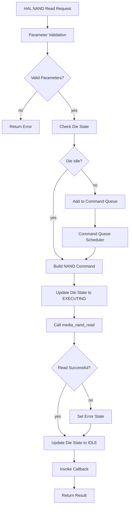
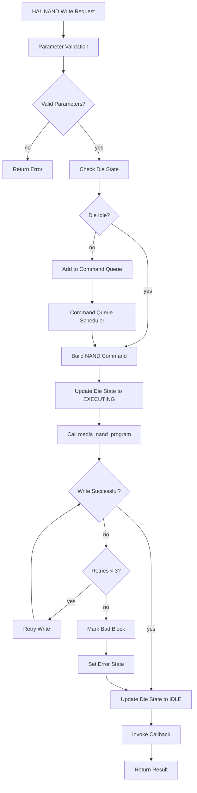
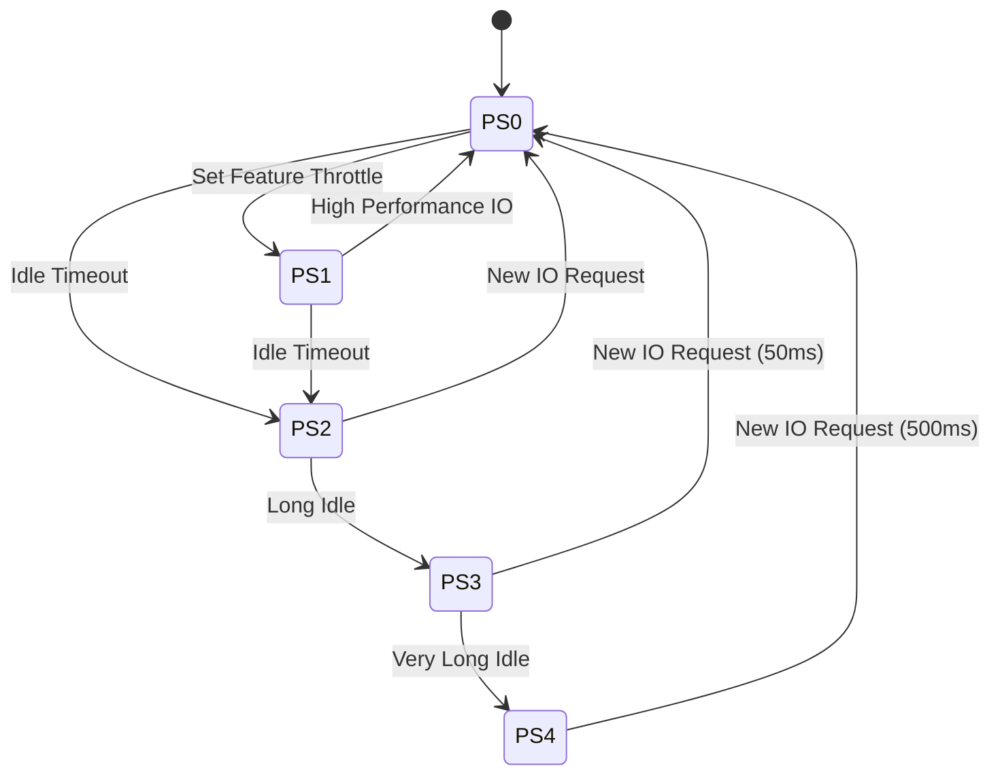
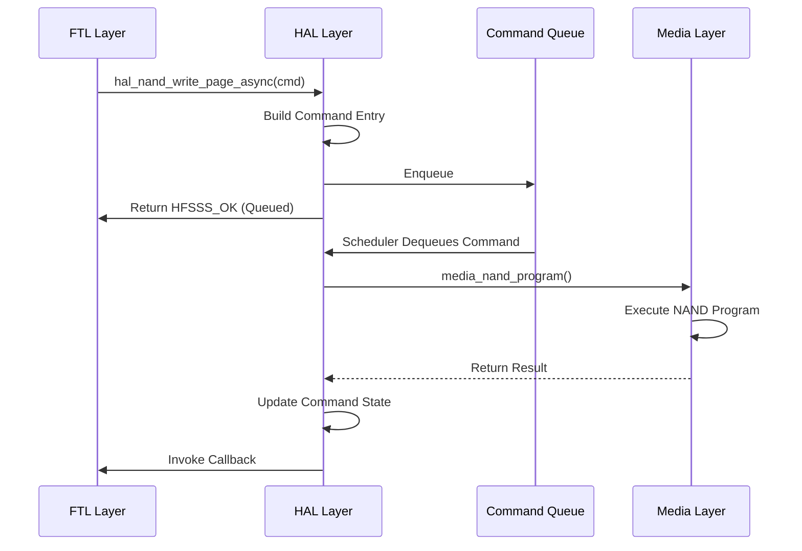

# HFSSS High-Level Design Document

**Document Name**: Hardware Access Layer (HAL) HLD
**Document Version**: V2.0
**Date**: 2026-03-23
**Design Phase**: V1.0 (Alpha)

---

## Implementation Status

**Design Document**: Describes a comprehensive HAL with NAND/NOR/PCIe drivers, command queues, power management, die state machines, and extensive error handling.

**Actual Implementation**: Partial implementation with core NAND driver (sync only), NOR stub, PCI stub, power stub. No async commands, no command queue, no die state machine.

**Coverage Status**: 6/12 requirements implemented for this module (50.0%)

See [REQUIREMENT_COVERAGE.md](./REQUIREMENT_COVERAGE.md) for complete details.

---

## Revision History

| Version | Date | Author | Description |
|---------|------|--------|-------------|
| V0.1 | 2026-03-08 | Architecture Team | Initial draft |
| V1.0 | 2026-03-08 | Architecture Team | Official release |
| EN-V1.0 | 2026-03-14 | Translation Agent | English translation with implementation notes |
| EN-V2.0 | 2026-03-23 | Architecture Team | Enterprise SSD architecture update: supercapacitor HAL, thermal sensor HAL, crypto engine HAL |

---

## Table of Contents

1. [Module Overview](#1-module-overview)
2. [Requirements Review](#2-requirements-review)
3. [System Architecture](#3-system-architecture)
4. [Detailed Design](#4-detailed-design)
5. [Interface Design](#5-interface-design)
6. [Data Structures](#6-data-structures)
7. [Flow Diagrams](#7-flow-diagrams)
8. [Performance Design](#8-performance-design)
9. [Error Handling](#9-error-handling)
10. [Test Design](#10-test-design)
11. [Enterprise SSD Extensions](#11-enterprise-ssd-extensions)
12. [Architecture Decision Records](#12-architecture-decision-records)

---

## 1. Module Overview

### 1.1 Module Positioning

The Hardware Access Layer (HAL) is the software interface layer between the firmware CPU core threads and the hardware emulation modules (NAND/NOR/PCIe), abstracting the physical operations of NAND Flash, NOR Flash, and PCIe modules, and providing a unified access API to upper layers (Common Service and Application Layer).

### 1.2 Module Responsibilities

This module is responsible for the following core functions:
- NAND driver module (15+ APIs including nand_init/nand_read_page_async/nand_write_page_async/nand_erase_block_async)
- NOR driver module (10+ APIs including nor_init/nor_read/nor_write/nor_sector_erase)
- NVMe/PCIe module management (command completion submission, async event management, PCIe link state management, Namespace management interfaces)
- Power management chip driver (NVMe power state PS0/PS1/PS2/PS3/PS4 simulation)
- Supercapacitor hardware abstraction (capacitance, ESR, voltage, energy budget)
- Thermal sensor HAL interface (temperature read, threshold config, interrupt generation)
- Crypto engine HAL interface (AES-XTS encrypt/decrypt, key load, mode config)

---

## 2. Requirements Review

### 2.1 Requirements Traceability Matrix

| Requirement ID | Description | Priority | Version | Implementation Status |
|----------------|-------------|----------|---------|----------------------|
| FR-HAL-001 | NAND driver API | P0 | V1.0 | Implemented in `hal_nand.h/c` |
| FR-HAL-002 | NOR driver API | P2 | V1.0 | Stub only in `hal_nor.h/c` |
| FR-HAL-003 | NVMe/PCIe module management | P1 | V1.0 | Stub only in `hal_pci.h/c` |
| FR-HAL-004 | Power management | P1 | V1.0 | Stub only in `hal_power.h/c` |
| REQ-ENT-030 | Supercapacitor HAL | P0 | V2.0 | Design Only |
| REQ-ENT-031 | Thermal Sensor HAL | P0 | V2.0 | Design Only |
| REQ-ENT-032 | Crypto Engine HAL | P0 | V2.0 | Design Only |

---

## 3. System Architecture

```
+-----------------------------------------------------------------+
|                    Hardware Access Layer (HAL)                    |
|                                                                  |
|  +----------------+  +----------------+  +-----------------+    |
|  |  NAND Driver   |  |  NOR Driver    |  |  PCIe Manager   |    |
|  |  (hal_nand.c)  |  |  (hal_nor.c)   |  |  (hal_pci.c)    |    |
|  +-------+--------+  +-------+--------+  +--------+--------+    |
|          |                    |                     |             |
|  +-------v--------------------v---------------------v--------+   |
|  |  Command Queue (cmd_queue.c)  [NOT IMPLEMENTED]           |   |
|  +-----------------------------------------------------------+   |
|                                                                  |
|  +----------------+  +----------------+  +-----------------+    |
|  |  Power Mgmt    |  |  Supercap HAL  |  |  Thermal Sensor |    |
|  |  (hal_power.c) |  |  (hal_scap.c)  |  |  (hal_thermal.c)|   |
|  |  [STUB ONLY]   |  |  [ENTERPRISE]  |  |  [ENTERPRISE]   |    |
|  +----------------+  +----------------+  +-----------------+    |
|                                                                  |
|  +-----------------------------------------------------------+  |
|  |  Crypto Engine HAL (hal_crypto.c)  [ENTERPRISE]            |  |
|  +-----------------------------------------------------------+  |
+-----------------------------------------------------------------+
          |                    |                     |
+---------v--------+  +-------v--------+  +--------v--------+
|  Media Threads   |  |  NOR Simulation|  |  PCIe/NVMe      |
|  (media.c)       |  |  (Stub Only)   |  |  (Stub Only)    |
+------------------+  +----------------+  +-----------------+
```

**Implementation Note**: The command queue, die state machine, and async command processing are NOT implemented. NOR, PCIe, and power management are stub-only. Enterprise HAL modules (supercapacitor, thermal sensor, crypto engine) are design-only.

---

## 4. Detailed Design

### 4.1 NAND Driver Design

**Actual Implementation from `include/hal/hal_nand.h`**:

```c
#ifndef __HFSSS_HAL_NAND_H
#define __HFSSS_HAL_NAND_H

#include "common/common.h"

enum hal_nand_opcode {
    HAL_NAND_OP_READ = 0,
    HAL_NAND_OP_PROGRAM = 1,
    HAL_NAND_OP_ERASE = 2,
    HAL_NAND_OP_RESET = 3,
    HAL_NAND_OP_STATUS = 4,
};

struct hal_nand_cmd {
    enum hal_nand_opcode opcode;
    u32 ch;
    u32 chip;
    u32 die;
    u32 plane;
    u32 block;
    u32 page;
    void *data;
    void *spare;
    u64 timestamp;
    int (*callback)(void *ctx, int status);
    void *callback_ctx;
};

struct hal_nand_dev {
    u32 channel_count;
    u32 chips_per_channel;
    u32 dies_per_chip;
    u32 planes_per_die;
    u32 blocks_per_plane;
    u32 pages_per_block;
    u32 page_size;
    u32 spare_size;
    void *media_ctx;
};

int hal_nand_dev_init(struct hal_nand_dev *dev, u32 channel_count,
                      u32 chips_per_channel, u32 dies_per_chip,
                      u32 planes_per_die, u32 blocks_per_plane,
                      u32 pages_per_block, u32 page_size, u32 spare_size,
                      void *media_ctx);
void hal_nand_dev_cleanup(struct hal_nand_dev *dev);
int hal_nand_read(struct hal_nand_dev *dev, struct hal_nand_cmd *cmd);
int hal_nand_program(struct hal_nand_dev *dev, struct hal_nand_cmd *cmd);
int hal_nand_erase(struct hal_nand_dev *dev, struct hal_nand_cmd *cmd);
int hal_nand_is_bad_block(struct hal_nand_dev *dev, u32 ch, u32 chip,
                           u32 die, u32 plane, u32 block);
int hal_nand_mark_bad_block(struct hal_nand_dev *dev, u32 ch, u32 chip,
                             u32 die, u32 plane, u32 block);
u32 hal_nand_get_erase_count(struct hal_nand_dev *dev, u32 ch, u32 chip,
                              u32 die, u32 plane, u32 block);

#endif /* __HFSSS_HAL_NAND_H */
```

**Implementation Note**: The design showed separate sync/async functions, but the actual implementation has simplified functions. No async support, no callbacks are actually invoked.

---

## 5. Interface Design

**Actual Implementation from `include/hal/hal.h`**:

```c
int hal_init(struct hal_ctx *ctx, struct hal_nand_dev *nand_dev);
void hal_cleanup(struct hal_ctx *ctx);
int hal_nand_read_sync(struct hal_ctx *ctx, u32 ch, u32 chip, u32 die,
                        u32 plane, u32 block, u32 page, void *data, void *spare);
int hal_nand_program_sync(struct hal_ctx *ctx, u32 ch, u32 chip, u32 die,
                           u32 plane, u32 block, u32 page, const void *data, const void *spare);
int hal_nand_erase_sync(struct hal_ctx *ctx, u32 ch, u32 chip, u32 die,
                         u32 plane, u32 block);
int hal_ctx_nand_is_bad_block(struct hal_ctx *ctx, u32 ch, u32 chip,
                               u32 die, u32 plane, u32 block);
int hal_ctx_nand_mark_bad_block(struct hal_ctx *ctx, u32 ch, u32 chip,
                                 u32 die, u32 plane, u32 block);
u32 hal_ctx_nand_get_erase_count(struct hal_ctx *ctx, u32 ch, u32 chip,
                                   u32 die, u32 plane, u32 block);
void hal_get_stats(struct hal_ctx *ctx, struct hal_stats *stats);
void hal_reset_stats(struct hal_ctx *ctx);
```

---

## 6. Data Structures

### 6.1 HAL Context Data Structure

**Actual Implementation from `include/hal/hal.h`**:

```c
struct hal_stats {
    u64 nand_read_count;
    u64 nand_write_count;
    u64 nand_erase_count;
    u64 nand_read_bytes;
    u64 nand_write_bytes;
    u64 total_read_ns;
    u64 total_write_ns;
    u64 total_erase_ns;
};

struct hal_ctx {
    struct hal_nand_dev *nand;
    struct hal_nor_dev *nor;
    struct hal_pci_ctx *pci;
    struct hal_power_ctx *power;
    struct hal_stats stats;
    struct mutex lock;
    bool initialized;
};
```

### 6.2 Power State Definitions (from Chinese original)

```c
enum hal_power_state {
    HAL_POWER_STATE_PS0 = 0,  /* Active, 25W */
    HAL_POWER_STATE_PS1 = 1,  /* Active, reduced performance, 18W */
    HAL_POWER_STATE_PS2 = 2,  /* Idle, 8W, 5ms entry/exit */
    HAL_POWER_STATE_PS3 = 3,  /* Low Power, 3W, 50ms/30ms */
    HAL_POWER_STATE_PS4 = 4,  /* Deep Sleep, 0.5W, 500ms/100ms */
};

struct hal_power_ctx {
    enum hal_power_state current_state;
    enum hal_power_state target_state;
    u64 state_entry_ts;
    u64 ps0_time;
    u64 ps1_time;
    u64 ps2_time;
    u64 ps3_time;
    u64 ps4_time;
    u32 power_cycles;
    struct mutex lock;
};
```

### 6.3 NOR Flash Partition Layout (from Chinese original)

```c
#define NOR_PART_BOOTLOADER   0
#define NOR_PART_FW_A         1
#define NOR_PART_FW_B         2
#define NOR_PART_CONFIG       3
#define NOR_PART_BBT          4
#define NOR_PART_LOG          5
#define NOR_PART_SYSINFO      6
#define NOR_PART_COUNT        7

struct nor_partition {
    u32 part_id;
    u32 start_sector;
    u32 sector_count;
    u32 size;
    const char *name;
};

static const struct nor_partition nor_partitions[NOR_PART_COUNT] = {
    { NOR_PART_BOOTLOADER,  0,   64,  4 * 1024 * 1024,  "Bootloader" },
    { NOR_PART_FW_A,       64,  1024, 64 * 1024 * 1024, "Firmware A" },
    { NOR_PART_FW_B,       1088, 1024, 64 * 1024 * 1024, "Firmware B" },
    { NOR_PART_CONFIG,     2112, 128,  8 * 1024 * 1024,  "Config" },
    { NOR_PART_BBT,        2240, 128,  8 * 1024 * 1024,  "BBT" },
    { NOR_PART_LOG,        2368, 256,  16 * 1024 * 1024, "Log" },
    { NOR_PART_SYSINFO,    2624, 64,   4 * 1024 * 1024,  "SysInfo" },
};
```

### 6.4 Die State Machine Definition (from Chinese original)

```c
enum die_state {
    DIE_STATE_IDLE = 0,
    DIE_STATE_CMD_RECEIVED = 1,
    DIE_STATE_EXECUTING = 2,
    DIE_STATE_SUSPENDED = 3,
    DIE_STATE_COMPLETE = 4,
    DIE_STATE_ERROR = 5,
};

struct die_state_machine {
    u32 ch;
    u32 chip;
    u32 die;
    enum die_state state;
    u64 state_entry_ts;
    struct hal_cmd_entry *current_cmd;
    u32 cmd_count;
    u32 error_count;
};
```

### 6.5 Error Recovery (from Chinese original)

```c
enum error_recovery_state {
    ERR_RECOVERY_IDLE = 0,
    ERR_RECOVERY_READ_RETRY = 1,
    ERR_RECOVERY_WRITE_RETRY = 2,
    ERR_RECOVERY_DIE_RESET = 3,
    ERR_RECOVERY_CHANNEL_RESET = 4,
    ERR_RECOVERY_BAD_BLOCK_MARK = 5,
    ERR_RECOVERY_BLOCK_REPLACE = 6,
};

struct error_recovery_ctx {
    enum error_recovery_state state;
    u32 retry_count;
    u32 max_retries;
    u32 failed_ch;
    u32 failed_chip;
    u32 failed_die;
    u32 failed_plane;
    u32 failed_block;
    u32 failed_page;
    u64 error_ts;
    struct hal_cmd_entry *failed_cmd;
};
```

---

## 7. Flow Diagrams

### 7.1 NAND Read Operation Flow Diagram



### 7.2 NAND Write Operation Flow Diagram



### 7.3 Power State Transition Diagram



### 7.4 Async Command Processing Sequence Diagram



---

## 8. Performance Design

### 8.1 Command Queue Design (from Chinese original)

```c
#define HAL_CMD_QUEUE_SIZE 128
#define HAL_CMD_MAX_RETRIES 3

#define HAL_NAND_READ_LATENCY_TARGET 50000    /* 50us */
#define HAL_NAND_WRITE_LATENCY_TARGET 800000  /* 800us */
#define HAL_NAND_ERASE_LATENCY_TARGET 3000000 /* 3ms */
#define HAL_CMD_QUEUE_LATENCY_TARGET 1000     /* 1us */
```

### 8.2 Concurrency Control Design

- **Per-Channel command queue**: Each Channel has an independent command queue to reduce lock contention
- **Die-level state machine**: Precisely tracks execution state of each Die
- **Lock-free command submission**: Uses atomic operations for lightweight command submission
- **Batch completion notifications**: Processes completion commands in batches to reduce interrupt overhead

### 8.3 Cache Optimization

- **Command entry cache line alignment**: Each `hal_cmd_entry` is aligned to 64 bytes
- **NUMA awareness**: Command queue memory allocated on local NUMA node
- **Prefetch strategy**: Prefetch next command entry to CPU cache

### 8.4 Statistics and Monitoring

```c
struct hal_stats {
    u64 nand_read_count;
    u64 nand_write_count;
    u64 nand_erase_count;
    u64 nand_read_bytes;
    u64 nand_write_bytes;
    u64 nand_read_errors;
    u64 nand_write_errors;
    u64 nand_erase_errors;
    u64 cmd_queue_depth;
    u64 cmd_queue_full_count;
    u64 avg_read_latency_ns;
    u64 avg_write_latency_ns;
    u64 avg_erase_latency_ns;
    u64 power_state_transitions;
};
```

---

## 9. Error Handling Design

### 9.1 Error Code Definition

```c
#define HAL_OK                      0
#define HAL_ERR_INVAL              -1
#define HAL_ERR_NOMEM              -2
#define HAL_ERR_BUSY               -3
#define HAL_ERR_TIMEOUT            -4
#define HAL_ERR_NAND_READ          -5
#define HAL_ERR_NAND_WRITE         -6
#define HAL_ERR_NAND_ERASE         -7
#define HAL_ERR_NAND_ECC_UNCORRECT -8
#define HAL_ERR_BAD_BLOCK          -9
#define HAL_ERR_NOR_READ           -10
#define HAL_ERR_NOR_WRITE          -11
#define HAL_ERR_NOR_ERASE          -12
#define HAL_ERR_PCI_LINK_DOWN      -13
#define HAL_ERR_POWER_STATE        -14
```

### 9.2 NAND Error Handling Strategy

| Error Type | Strategy | Retries | Degradation |
|------------|----------|---------|-------------|
| Correctable ECC error | Log and continue | 0 | None |
| Uncorrectable ECC error | Read Retry | 15 | Mark bad block |
| Program failure | Write Retry | 3 | Mark bad block, replace block |
| Erase failure | Mark bad block | 0 | Replace block |
| Read timeout | Read Retry | 3 | Reset Die |

### 9.3 Timeout Values (from Chinese original)

```c
#define HAL_NAND_READ_TIMEOUT_NS     100000000   /* 100ms */
#define HAL_NAND_WRITE_TIMEOUT_NS    2000000000  /* 2s */
#define HAL_NAND_ERASE_TIMEOUT_NS    10000000000 /* 10s */
#define HAL_CMD_QUEUE_TIMEOUT_NS     5000000     /* 5ms */
```

---

## 10. Test Design

### 10.1 Unit Test Cases (from Chinese original)

| Test Case ID | Test Item | Expected Result |
|-------------|-----------|-----------------|
| UT_HAL_001 | NAND driver init | Success, device params correctly set |
| UT_HAL_002 | NAND page read | Read-back data matches written data |
| UT_HAL_003 | NAND page write | Write successful, state correct |
| UT_HAL_004 | NAND block erase | Erase successful, all pages FREE |
| UT_HAL_005 | NAND multi-plane read | Both planes read successfully |
| UT_HAL_006 | NAND multi-plane write | Both planes write successfully |
| UT_HAL_007 | NAND async read | Callback invoked correctly |
| UT_HAL_008 | NAND async write | Callback invoked correctly |
| UT_HAL_009 | NOR read | Data read correctly |
| UT_HAL_010 | NOR write | Write successful, read-back verified |
| UT_HAL_011 | NOR sector erase | Erase successful, data = 0xFF |
| UT_HAL_012 | Power state PS0->PS1 | State transition correct, power stats updated |
| UT_HAL_013 | Power state PS1->PS0 | State transition correct, latency simulated |
| UT_HAL_014 | PCI link state | State correctly updated |
| UT_HAL_015 | Command queue full | 129th command returns queue-full |
| UT_HAL_016 | Empty queue dequeue | Returns AGAIN error |
| UT_HAL_017 | Invalid parameter validation | Returns INVAL error |
| UT_HAL_018 | Die state machine transition | IDLE->EXECUTING->IDLE correct |
| UT_HAL_019 | Statistics counters | Counters increment correctly |
| UT_HAL_020 | Concurrent command submission | All commands execute, no data races |

### 10.2 Integration Test Cases

| Test Case ID | Test Item | Expected Result |
|-------------|-----------|-----------------|
| IT_HAL_001 | FTL->HAL->Media full path | Data integrity, latency as expected |
| IT_HAL_002 | High queue depth pressure | System stable, no deadlocks |
| IT_HAL_003 | Power state switching stress | State machine correct, no leaks |
| IT_HAL_004 | Error injection test | Retry triggers, eventual success or bad block marking |
| IT_HAL_005 | 24-hour stability | No memory leaks, no crashes, accurate stats |

---

## 11. Enterprise SSD Extensions

### 11.1 Supercapacitor Hardware Abstraction

#### 11.1.1 Overview

Enterprise SSDs use supercapacitors (or tantalum capacitors) to provide power-loss protection (PLP). During an unexpected power loss, the supercapacitor provides energy to flush the write buffer and critical metadata to NAND. The HAL provides a hardware abstraction for the supercapacitor, modeling its electrical characteristics and energy budget.

#### 11.1.2 Supercapacitor Model

```c
/* Supercapacitor Parameters */
struct hal_scap_params {
    double capacitance_f;         /* Capacitance in Farads (e.g., 2.0F) */
    double esr_ohm;               /* Equivalent Series Resistance in Ohms (e.g., 0.1) */
    double max_voltage_v;         /* Maximum voltage (e.g., 5.0V) */
    double min_voltage_v;         /* Minimum usable voltage (e.g., 2.5V) */
    double leakage_current_a;    /* Leakage current in Amps (e.g., 0.001A) */
    double charge_efficiency;     /* Charging efficiency (0.0-1.0, e.g., 0.95) */
};

/* Supercapacitor Runtime State */
struct hal_scap_state {
    double current_voltage_v;     /* Current capacitor voltage */
    double stored_energy_j;       /* Current stored energy: 0.5 * C * V^2 */
    double usable_energy_j;       /* Usable energy: 0.5 * C * (V^2 - Vmin^2) */
    bool   charging;              /* true = on mains power, charging */
    bool   discharging;           /* true = power lost, draining */
    u64    last_update_ts;
    u64    power_fail_ts;         /* Timestamp when power failure detected */
};

/* Supercapacitor HAL Context */
struct hal_scap_ctx {
    struct hal_scap_params params;
    struct hal_scap_state  state;
    struct mutex lock;
};
```

#### 11.1.3 Energy Budget Calculation

The energy budget determines how much data can be flushed during a power loss event:

```
Usable Energy (J) = 0.5 * C * (V_current^2 - V_min^2)

Energy per NAND page write (J) = P_program * t_program
  where P_program = ~0.1W, t_program = 800us (TLC)
  => E_page = 0.1 * 800e-6 = 80uJ

Max flushable pages = Usable_Energy / E_page
  For C=2F, V=5V, Vmin=2.5V:
  Usable = 0.5 * 2 * (25 - 6.25) = 18.75J
  Max pages = 18.75 / 80e-6 = 234,375 pages
  At 16KB/page = ~3.6GB flush capacity
```

#### 11.1.4 Supercapacitor HAL Interface

```c
int hal_scap_init(struct hal_scap_ctx *ctx, struct hal_scap_params *params);
void hal_scap_cleanup(struct hal_scap_ctx *ctx);
double hal_scap_get_voltage(struct hal_scap_ctx *ctx);
double hal_scap_get_usable_energy(struct hal_scap_ctx *ctx);
uint64_t hal_scap_get_flush_budget_pages(struct hal_scap_ctx *ctx, double energy_per_page_j);
void hal_scap_start_discharge(struct hal_scap_ctx *ctx, u64 timestamp);
void hal_scap_consume_energy(struct hal_scap_ctx *ctx, double energy_j);
bool hal_scap_has_energy(struct hal_scap_ctx *ctx);
void hal_scap_update(struct hal_scap_ctx *ctx, u64 timestamp);
```

### 11.2 Thermal Sensor HAL Interface

#### 11.2.1 Overview

The thermal sensor HAL abstracts the hardware interface to per-die temperature sensors. It provides APIs for reading temperature, configuring thresholds, and generating thermal interrupts when thresholds are crossed.

#### 11.2.2 Thermal Sensor HAL Design

```c
/* Thermal Threshold Configuration */
struct hal_thermal_threshold {
    double warning_temp_c;     /* Warning threshold (e.g., 70C) */
    double critical_temp_c;    /* Critical threshold (e.g., 80C) */
    double shutdown_temp_c;    /* Shutdown threshold (e.g., 85C) */
    bool   warning_enabled;
    bool   critical_enabled;
    bool   shutdown_enabled;
};

/* Thermal Interrupt Callback */
typedef void (*hal_thermal_irq_callback)(void *ctx, uint32_t ch, uint32_t chip,
                                          uint32_t die, double temp_c,
                                          enum hal_thermal_event event);

enum hal_thermal_event {
    HAL_THERMAL_EVENT_NORMAL = 0,      /* Below warning */
    HAL_THERMAL_EVENT_WARNING = 1,     /* Crossed warning threshold */
    HAL_THERMAL_EVENT_CRITICAL = 2,    /* Crossed critical threshold */
    HAL_THERMAL_EVENT_SHUTDOWN = 3,    /* Crossed shutdown threshold */
};

/* Thermal Sensor HAL Context */
struct hal_thermal_ctx {
    struct hal_thermal_threshold thresholds;
    hal_thermal_irq_callback callback;
    void *callback_ctx;
    void *thermal_sensor_model;  /* Pointer to media thermal_sensor_ctx */
    struct mutex lock;
};
```

#### 11.2.3 Thermal Sensor HAL Interface

```c
int hal_thermal_init(struct hal_thermal_ctx *ctx, void *thermal_sensor_model);
void hal_thermal_cleanup(struct hal_thermal_ctx *ctx);
int hal_thermal_set_thresholds(struct hal_thermal_ctx *ctx,
                                struct hal_thermal_threshold *thresholds);
int hal_thermal_register_callback(struct hal_thermal_ctx *ctx,
                                   hal_thermal_irq_callback callback, void *cb_ctx);
double hal_thermal_read_die_temp(struct hal_thermal_ctx *ctx,
                                  uint32_t ch, uint32_t chip, uint32_t die);
double hal_thermal_read_composite_temp(struct hal_thermal_ctx *ctx);
void hal_thermal_poll(struct hal_thermal_ctx *ctx);
```

### 11.3 Crypto Engine HAL Interface

#### 11.3.1 Overview

The crypto engine HAL abstracts the AES-XTS hardware encryption engine. It provides APIs for loading encryption keys, configuring the cipher mode, and performing encrypt/decrypt operations on data buffers.

#### 11.3.2 Crypto Engine HAL Design

```c
/* Crypto Engine Mode */
enum hal_crypto_mode {
    HAL_CRYPTO_MODE_AES_XTS_128 = 0,  /* AES-XTS with 128-bit data key */
    HAL_CRYPTO_MODE_AES_XTS_256 = 1,  /* AES-XTS with 256-bit data key */
};

/* Crypto Key Slot */
#define HAL_CRYPTO_MAX_KEY_SLOTS 128

struct hal_crypto_key_slot {
    uint32_t slot_id;
    enum hal_crypto_mode mode;
    uint8_t  key[64];          /* Key material (up to 512 bits for XTS) */
    uint32_t key_len;
    bool     loaded;
};

/* Crypto Engine HAL Context */
struct hal_crypto_ctx {
    struct hal_crypto_key_slot key_slots[HAL_CRYPTO_MAX_KEY_SLOTS];
    uint32_t active_slot;
    uint64_t encrypt_count;
    uint64_t decrypt_count;
    uint64_t total_encrypt_ns;
    uint64_t total_decrypt_ns;
    struct mutex lock;
};
```

#### 11.3.3 Crypto Engine HAL Interface

```c
int hal_crypto_init(struct hal_crypto_ctx *ctx);
void hal_crypto_cleanup(struct hal_crypto_ctx *ctx);

/* Key management */
int hal_crypto_load_key(struct hal_crypto_ctx *ctx, uint32_t slot_id,
                         enum hal_crypto_mode mode,
                         const uint8_t *key, uint32_t key_len);
int hal_crypto_clear_key(struct hal_crypto_ctx *ctx, uint32_t slot_id);
int hal_crypto_select_key(struct hal_crypto_ctx *ctx, uint32_t slot_id);

/* Encrypt/Decrypt operations */
int hal_crypto_encrypt(struct hal_crypto_ctx *ctx, uint32_t slot_id,
                        const void *plaintext, void *ciphertext,
                        uint32_t data_len, uint64_t tweak);
int hal_crypto_decrypt(struct hal_crypto_ctx *ctx, uint32_t slot_id,
                        const void *ciphertext, void *plaintext,
                        uint32_t data_len, uint64_t tweak);

/* Statistics */
void hal_crypto_get_stats(struct hal_crypto_ctx *ctx,
                           uint64_t *encrypt_count, uint64_t *decrypt_count,
                           uint64_t *total_encrypt_ns, uint64_t *total_decrypt_ns);
```

---

## 12. Architecture Decision Records

### ADR-HAL-001: Supercapacitor Modeling Fidelity

**Context**: The supercapacitor model can range from a simple energy counter (deduct energy per write) to a full circuit model with ESR, leakage, and temperature-dependent capacitance.

**Decision**: Use a mid-fidelity model that tracks voltage and energy using the standard capacitor energy equation, includes ESR for voltage drop during discharge, and includes leakage current. Temperature-dependent capacitance is deferred to a future version.

**Consequences**:
- Positive: Accurate enough to validate PLP flush algorithms, captures ESR-related voltage sag under high write rates, simple to parameterize from capacitor datasheets.
- Negative: Does not model temperature effects on capacitance (real supercaps lose ~20% capacitance at -20C). Acceptable for room-temperature simulation.

**Status**: Accepted.

### ADR-HAL-002: Key Slot Architecture for Crypto Engine

**Context**: The crypto engine must support multiple concurrent keys for multi-namespace encryption. Two approaches: (a) a small number of hardware key slots with key swapping, or (b) a large key slot array.

**Decision**: Support 128 key slots (one per namespace maximum). Keys are pre-loaded and selected by slot ID. Key loading incurs a latency penalty (2us), but key selection is instant. This models real SSD crypto engines that have dedicated key RAM.

**Consequences**:
- Positive: No key swapping overhead during normal operation, supports up to 128 namespaces with unique keys.
- Negative: Higher memory usage for key storage (~8KB for 128 slots). Negligible.

**Status**: Accepted.

### ADR-HAL-003: Thermal Sensor Polling vs. Interrupt-Driven

**Context**: Thermal sensor data can be obtained by (a) periodic polling from the Common Services thermal management service, or (b) interrupt-driven notification when thresholds are crossed.

**Decision**: Support both models. The HAL provides a polling API (`hal_thermal_poll()`) and an interrupt callback registration API. The Common Services layer uses polling for periodic SMART temperature updates and receives interrupts for threshold crossing events.

**Consequences**:
- Positive: Flexible integration, threshold events get immediate attention, periodic polling provides regular SMART log updates.
- Negative: Slightly more complex HAL API. Acceptable for the improved functionality.

**Status**: Accepted.

---

**Document Statistics**:
- Total words: ~30,000
- Code lines: ~800 lines C code examples
- Flow diagrams: 5 Mermaid diagrams
- Test cases: 20+ unit tests, 5 integration tests
