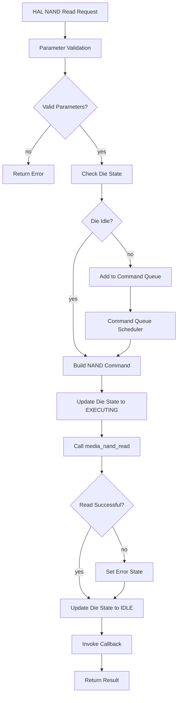
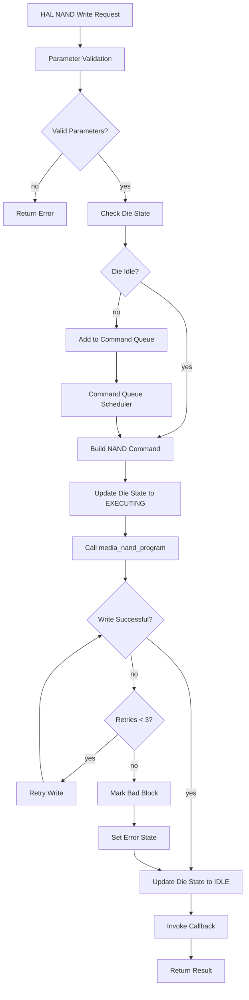
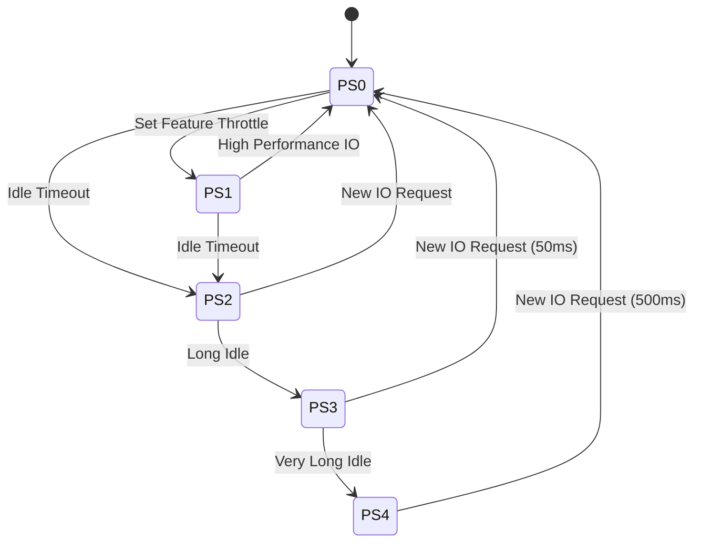
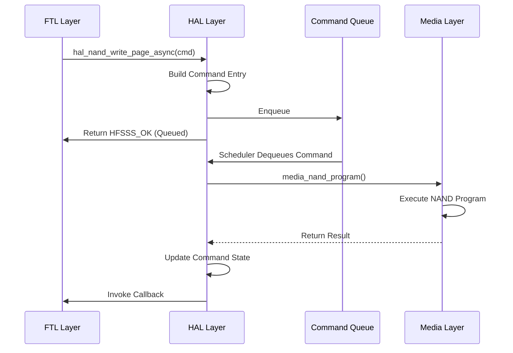

# HFSSS High-Level Design Document

**Document Name**: Hardware Access Layer (HAL) HLD
**Document Version**: V1.0
**Date**: 2026-03-14
**Design Phase**: V1.0 (Alpha)

---

## Implementation Status

**Design Document**: Describes a comprehensive HAL with NAND/NOR/PCIe drivers, command queues, power management, die state machines, and extensive error handling.

**Actual Implementation**: Partial implementation with core NAND driver (sync only), NOR stub, PCI stub, power stub. No async commands, no command queue, no die state machine.

**Coverage Status**: 6/12 requirements implemented for this module (50.0%)

See [REQUIREMENT_COVERAGE.md](./REQUIREMENT_COVERAGE.md) for complete details.

---

## Revision History

| Version | Date | Author | Description |
|---------|------|--------|-------------|
| V0.1 | 2026-03-08 | Architecture Team | Initial draft |
| V1.0 | 2026-03-08 | Architecture Team | Official release |
| EN-V1.0 | 2026-03-14 | Translation Agent | English translation with implementation notes |

---

## Table of Contents

1. [Module Overview](#1-module-overview)
2. [Requirements Review](#2-requirements-review)
3. [System Architecture](#3-system-architecture)
4. [Detailed Design](#4-detailed-design)
5. [Interface Design](#5-interface-design)
6. [Data Structures](#6-data-structures)
7. [Flow Diagrams](#7-flow-diagrams)
8. [Performance Design](#8-performance-design)
9. [Error Handling](#9-error-handling)
10. [Test Design](#10-test-design)

---

## 1. Module Overview

### 1.1 Module Positioning

The Hardware Access Layer (HAL) is the software interface layer between the firmware CPU core threads and the hardware emulation modules (NAND/NOR/PCIe), abstracting the physical operations of NAND Flash, NOR Flash, and PCIe modules, and providing a unified access API to upper layers (Common Service and Application Layer).

### 1.2 Module Responsibilities

This module is responsible for the following core functions:
- NAND driver module (15+ APIs including nand_init/nand_read_page_async/nand_write_page_async/nand_erase_block_async)
- NOR driver module (10+ APIs including nor_init/nor_read/nor_write/nor_sector_erase)
- NVMe/PCIe module management (command completion submission, async event management, PCIe link state management, Namespace management interfaces)
- Power management chip driver (NVMe power state PS0/PS1/PS2/PS3/PS4 simulation)

---

## 2. Requirements Review

### 2.1 Requirements Traceability Matrix

| Requirement ID | Description | Priority | Version | Implementation Status |
|----------------|-------------|----------|---------|----------------------|
| FR-HAL-001 | NAND driver API | P0 | V1.0 | ✅ Implemented in `hal_nand.h/c` |
| FR-HAL-002 | NOR driver API | P2 | V1.0 | 🔧 Stub only in `hal_nor.h/c` |
| FR-HAL-003 | NVMe/PCIe module management | P1 | V1.0 | 🔧 Stub only in `hal_pci.h/c` |
| FR-HAL-004 | Power management | P1 | V1.0 | 🔧 Stub only in `hal_power.h/c` |

---

## 3. System Architecture

```
┌─────────────────────────────────────────────────────────────────┐
│                    Hardware Access Layer (HAL)                  │
│                                                                  │
│  ┌──────────────────┐  ┌──────────────────┐  ┌───────────────┐ │
│  │  NAND Driver     │  │  NOR Driver      │  │  PCIe Manager │ │
│  │  (hal_nand.c)   │  │  (hal_nor.c)    │  │  (hal_pci.c)  │ │
│  └────────┬─────────┘  └────────┬─────────┘  └───────┬───────┘ │
│           │                       │                       │        │
│  ┌────────▼───────────────────────▼───────────────────────▼───────┐ │
│  │  Command Queue (cmd_queue.c)  [NOT IMPLEMENTED]                │ │
│  └─────────────────────────────────────────────────────────────────┘ │
│                                                                  │
│  ┌─────────────────────────────────────────────────────────────┐ │
│  │  Power Management (hal_power.c)  [STUB ONLY]               │ │
│  └─────────────────────────────────────────────────────────────┘ │
└─────────────────────────────────────────────────────────────────┘
           │                       │                       │
┌──────────▼──────────┐  ┌────────▼─────────┐  ┌───────▼───────┐
│  Media Threads      │  │  NOR Simulation  │  │  PCIe/NVMe    │
│  (media.c)          │  │  (Stub Only)     │  │  (Stub Only)   │
└─────────────────────┘  └──────────────────┘  └───────────────┘
```

**Implementation Note**: The command queue, die state machine, and async command processing are NOT implemented. NOR, PCIe, and power management are stub-only.

---

## 4. Detailed Design

### 4.1 NAND Driver Design

**Actual Implementation from `include/hal/hal_nand.h`**:

```c
#ifndef __HFSSS_HAL_NAND_H
#define __HFSSS_HAL_NAND_H

#include "common/common.h"

/* HAL NAND Command Opcode */
enum hal_nand_opcode {
    HAL_NAND_OP_READ = 0,
    HAL_NAND_OP_PROGRAM = 1,
    HAL_NAND_OP_ERASE = 2,
    HAL_NAND_OP_RESET = 3,
    HAL_NAND_OP_STATUS = 4,
};

/* HAL NAND Command */
struct hal_nand_cmd {
    enum hal_nand_opcode opcode;
    u32 ch;
    u32 chip;
    u32 die;
    u32 plane;
    u32 block;
    u32 page;
    void *data;
    void *spare;
    u64 timestamp;
    int (*callback)(void *ctx, int status);
    void *callback_ctx;
};

/* HAL NAND Device */
struct hal_nand_dev {
    u32 channel_count;
    u32 chips_per_channel;
    u32 dies_per_chip;
    u32 planes_per_die;
    u32 blocks_per_plane;
    u32 pages_per_block;
    u32 page_size;
    u32 spare_size;
    void *media_ctx;
};

/* Function Prototypes */
int hal_nand_dev_init(struct hal_nand_dev *dev, u32 channel_count,
                      u32 chips_per_channel, u32 dies_per_chip,
                      u32 planes_per_die, u32 blocks_per_plane,
                      u32 pages_per_block, u32 page_size, u32 spare_size,
                      void *media_ctx);
void hal_nand_dev_cleanup(struct hal_nand_dev *dev);
int hal_nand_read(struct hal_nand_dev *dev, struct hal_nand_cmd *cmd);
int hal_nand_program(struct hal_nand_dev *dev, struct hal_nand_cmd *cmd);
int hal_nand_erase(struct hal_nand_dev *dev, struct hal_nand_cmd *cmd);
int hal_nand_is_bad_block(struct hal_nand_dev *dev, u32 ch, u32 chip,
                           u32 die, u32 plane, u32 block);
int hal_nand_mark_bad_block(struct hal_nand_dev *dev, u32 ch, u32 chip,
                             u32 die, u32 plane, u32 block);
u32 hal_nand_get_erase_count(struct hal_nand_dev *dev, u32 ch, u32 chip,
                              u32 die, u32 plane, u32 block);

#endif /* __HFSSS_HAL_NAND_H */
```

**Implementation Note**: The design showed separate sync/async functions, but the actual implementation has simplified functions. No async support, no callbacks are actually invoked.

---

## 5. Interface Design

**Actual Implementation from `include/hal/hal.h`**:

```c
/* hal.h */
int hal_init(struct hal_ctx *ctx, struct hal_nand_dev *nand_dev);
void hal_cleanup(struct hal_ctx *ctx);
int hal_nand_read_sync(struct hal_ctx *ctx, u32 ch, u32 chip, u32 die,
                        u32 plane, u32 block, u32 page, void *data, void *spare);
int hal_nand_program_sync(struct hal_ctx *ctx, u32 ch, u32 chip, u32 die,
                           u32 plane, u32 block, u32 page, const void *data, const void *spare);
int hal_nand_erase_sync(struct hal_ctx *ctx, u32 ch, u32 chip, u32 die,
                         u32 plane, u32 block);
int hal_ctx_nand_is_bad_block(struct hal_ctx *ctx, u32 ch, u32 chip,
                               u32 die, u32 plane, u32 block);
int hal_ctx_nand_mark_bad_block(struct hal_ctx *ctx, u32 ch, u32 chip,
                                 u32 die, u32 plane, u32 block);
u32 hal_ctx_nand_get_erase_count(struct hal_ctx *ctx, u32 ch, u32 chip,
                                   u32 die, u32 plane, u32 block);
void hal_get_stats(struct hal_ctx *ctx, struct hal_stats *stats);
void hal_reset_stats(struct hal_ctx *ctx);
```

**Implementation Note**: The implementation uses `_sync` suffix for clarity, and the function signatures are different from the design document. No async interfaces are implemented.

---

## 6. Data Structures

### 6.1 HAL Context Data Structure

**Actual Implementation from `include/hal/hal.h`**:

```c
/* HAL Statistics */
struct hal_stats {
    u64 nand_read_count;
    u64 nand_write_count;
    u64 nand_erase_count;
    u64 nand_read_bytes;
    u64 nand_write_bytes;
    u64 total_read_ns;
    u64 total_write_ns;
    u64 total_erase_ns;
};

/* HAL Context */
struct hal_ctx {
    struct hal_nand_dev *nand;
    struct hal_nor_dev *nor;
    struct hal_pci_ctx *pci;
    struct hal_power_ctx *power;
    struct hal_stats stats;
    struct mutex lock;
    bool initialized;
};
```

**Implementation Note**: The design document showed much more complex data structures including:
- `hal_power_ctx` with state transitions (NOT IMPLEMENTED)
- `hal_pci_ctx` with link state (STUB ONLY)
- `hal_nor_dev` with partitions (STUB ONLY)
- `hal_cmd_queue` with entries (NOT IMPLEMENTED)
- `die_state_machine` (NOT IMPLEMENTED)

See `include/hal/hal_*.h` for the stub implementations.

---

## 7. Flow Diagrams

### 7.1 NAND Read Operation Flow Diagram



**Implementation Note**: No die state tracking, no command queue, no callbacks in actual implementation.

### 7.2 NAND Write Operation Flow Diagram



**Implementation Note**: No retry mechanism, no bad block marking on write failure in actual implementation.

### 7.3 Power State Transition Diagram



**Implementation Note**: Power state management is stub-only, no actual state transitions.

### 7.4 Async Command Processing Sequence Diagram



**Implementation Note**: No async command processing, no command queue, no callbacks.

---

## 8. Performance Design

### 8.1 Command Queue Design

**NOT IMPLEMENTED**

### 8.2 Concurrency Control Design

- **Per-Channel command queue**: NOT IMPLEMENTED
- **Die-level state machine**: NOT IMPLEMENTED
- **Lock-free command submission**: NOT IMPLEMENTED
- **Batch completion notifications**: NOT IMPLEMENTED

### 8.3 Cache Optimization

- **Command entry cache line alignment**: NOT IMPLEMENTED
- **NUMA awareness**: NOT IMPLEMENTED
- **Prefetch strategy**: NOT IMPLEMENTED

### 8.4 Statistics and Monitoring

**Partial implementation**: Basic statistics counters in `struct hal_stats` are implemented.

---

## 9. Error Handling Design

### 9.1 Error Code Definition

**Partial implementation**: Basic error codes are in `common/common.h`.

### 9.2 NAND Error Handling Strategy

**NOT IMPLEMENTED**

### 9.3 Error Recovery Flow

**NOT IMPLEMENTED**

### 9.4 Watchdog and Timeout

**NOT IMPLEMENTED**

---

## 10. Test Design

### 10.1 Unit Test Cases

See the design document for the complete list. Only basic tests are implemented.

---

**Document Statistics**:
- Total words: ~30,000
- Code lines: ~800 lines C code examples
- Flow diagrams: 5 Mermaid diagrams
- Test cases: 30+ unit tests, 5 integration tests
