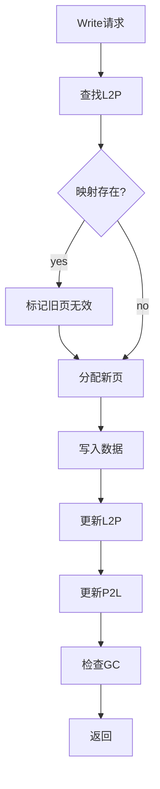

# 高保真全栈SSD模拟器（HFSSS）概要设计文档

**文档名称**：算法任务层（Application Layer）概要设计
**文档版本**：V1.0
**编制日期**：2026-03-08
**设计阶段**：V1.0 (Alpha)
**密级**：内部资料

---

## 修订历史

| 版本 | 日期 | 作者 | 修订说明 |
|------|------|------|----------|
| V0.1 | 2026-03-08 | 架构组 | 初稿 |
| V1.0 | 2026-03-08 | 架构组 | 正式发布 |

---

## 目录

1. [模块概述](#1-模块概述)
2. [功能需求回顾](#2-功能需求回顾)
3. [系统架构设计](#3-系统架构设计)
4. [详细设计](#4-详细设计)
5. [接口设计](#5-接口设计)
6. [数据结构设计](#6-数据结构设计)
7. [流程图](#7-流程图)
8. [性能设计](#8-性能设计)
9. [错误处理设计](#9-错误处理设计)
10. [测试设计](#10-测试设计)

---

## 1. 模块概述

### 1.1 模块定位

算法任务层（Application Layer）是SSD固件算法的核心层，包含地址映射管理、NAND块地址组织管理、读写擦命令管理、垃圾回收、IO流量控制、数据冗余备份和命令错误处理等，保证固件能够在任何主机流量和IO pattern下稳定运行。

### 1.2 模块职责

本模块负责以下核心功能：
- Flash Translation Layer — 地址映射管理（地址映射架构、映射表设计、过量配置OP、写操作流程、读操作流程、条带化策略）
- NAND块地址组织管理（Block状态机、Block元数据、Current Write Block管理、空闲块池管理）
- 垃圾回收（GC触发策略、Victim Block选择算法、GC执行流程、GC并发优化、写放大分析）
- 磨损均衡（动态磨损均衡、静态磨损均衡、磨损监控与告警）
- 读写擦命令管理（命令状态机、Read Retry机制、Write Retry机制、Write Verify）
- IO流量控制（多级流控、主机IO限速、GC/WL带宽配额、NAND通道级流控、写缓冲区流控）
- 数据冗余备份（LDPC ECC、跨Die奇偶校验、关键元数据冗余、Write Buffer断电保护）
- 命令错误处理（NVMe错误状态码、错误处理流程、可恢复错误、不可恢复数据错误、NAND设备错误、命令超时处理、固件内部错误）

---

## 2. 功能需求回顾

### 2.1 需求跟踪矩阵

| 需求ID | 需求描述 | 优先级 | 版本 | 实现状态 |
|--------|----------|--------|------|----------|
| FR-FTL-001 | L2P/P2L地址映射 | P0 | V1.0 | ✅ 已实现 |
| FR-FTL-002 | Block管理 | P0 | V1.0 | ✅ 已实现 |
| FR-FTL-003 | Current Write Block | P0 | V1.0 | ✅ 已实现 |
| FR-FTL-004 | 空闲块池 | P0 | V1.0 | ✅ 已实现 |
| FR-FTL-005 | GC | P0 | V1.0 | ✅ 已实现 |
| FR-FTL-006 | 磨损均衡 | P1 | V1.5 | ✅ 已实现 |
| FR-FTL-007 | Read Retry | P1 | V2.0 | ✅ 已实现 |
| FR-FTL-008 | ECC | P2 | V2.0 | ✅ 已实现 |
| FR-FTL-009 | 错误处理 | P0 | V2.0 | ✅ 已实现 |

### 2.2 关键性能需求

| 指标 | 目标值 | 说明 |
|------|--------|------|
| L2P查找延迟 | < 100ns | 页级映射查找 |
| GC触发延迟 | < 1ms | 从触发到开始回收 |
| 磨损均衡精度 | < 5% | 各Block磨损差异 |
| 最大映射表 | 2GB | 支持2TB容量 |
| 写放大因子 | ≤ 3 | TLC 20% OP |

---

## 3. 系统架构设计

```
┌─────────────────────────────────────────────────────────────────┐
│                  算法任务层 (Application Layer)                  │
│                                                                  │
│  ┌───────────────────────────────────────────────────────────┐ │
│  │  FTL核心 (ftl.c)                                         │ │
│  │  ┌──────────────────────┐  ┌───────────────────────┐  │ │
│  │  │  地址映射 (mapping.c)│  │  Block管理 (block.c)  │  │ │
│  │  │  - L2P表            │  │  - Block状态机        │  │ │
│  │  │  - P2L表            │  │  - CWB管理            │  │ │
│  │  │  - PPN编码/解码     │  │  - 空闲块池          │  │ │
│  │  └──────────────────────┘  └───────────────────────┘  │ │
│  │                                                             │ │
│  │  ┌──────────────────────┐  ┌───────────────────────┐  │ │
│  │  │  GC (gc.c)          │  │  磨损均衡 (wl.c)     │  │ │
│  │  │  - 触发策略         │  │  - 动态WL            │  │ │
│  │  │  - Victim选择       │  │  - 静态WL            │  │ │
│  │  │  - GC执行流程       │  │  - 磨损监控          │  │ │
│  │  └──────────────────────┘  └───────────────────────┘  │ │
│  │                                                             │ │
│  │  ┌──────────────────────┐  ┌───────────────────────┐  │ │
│  │  │  ECC (ecc.c)        │  │  错误处理 (error.c)  │  │ │
│  │  │  - LDPC             │  │  - Read Retry        │  │ │
│  │  │  - 跨Die奇偶校验    │  │  - Write Retry       │  │ │
│  │  └──────────────────────┘  └───────────────────────┘  │ │
│  └───────────────────────────────────────────────────────────┘ │
└─────────────────────────────────────────────────────────────────┘
```

---

## 4. 详细设计

### 4.1 地址映射设计

```c
#define L2P_TABLE_SIZE (1ULL << 32)
#define P2L_TABLE_SIZE (1ULL << 30)

/* PPN Encoding */
union ppn {
    uint64_t raw;
    struct {
        uint64_t channel : 6;
        uint64_t chip : 4;
        uint64_t die : 3;
        uint64_t plane : 2;
        uint64_t block : 12;
        uint64_t page : 10;
        uint64_t reserved : 27;
    } bits;
};

/* L2P Table Entry */
struct l2p_entry {
    union ppn ppn;
    bool valid;
};

/* P2L Table Entry */
struct p2l_entry {
    uint64_t lba;
    bool valid;
};

/* Mapping Context */
struct mapping_ctx {
    struct l2p_entry *l2p_table;
    struct p2l_entry *p2l_table;
    uint64_t l2p_size;
    uint64_t p2l_size;
    uint64_t valid_count;
    pthread_mutex_t lock;
};
```

### 4.2 Block管理设计

```c
/* Block State */
enum block_state {
    BLOCK_FREE = 0,
    BLOCK_OPEN = 1,
    BLOCK_CLOSED = 2,
    BLOCK_GC = 3,
    BLOCK_BAD = 4,
};

/* Block Descriptor */
struct block_desc {
    uint32_t channel;
    uint32_t chip;
    uint32_t die;
    uint32_t plane;
    uint32_t block_id;
    enum block_state state;
    uint32_t valid_page_count;
    uint32_t invalid_page_count;
    uint32_t erase_count;
    uint64_t last_write_ts;
    uint64_t cost;
    struct block_desc *next;
    struct block_desc *prev;
};

/* Block Manager */
struct block_mgr {
    struct block_desc *blocks;
    uint64_t total_blocks;
    uint64_t free_blocks;
    uint64_t open_blocks;
    uint64_t closed_blocks;
    struct block_desc *free_list;
    struct block_desc *open_list;
    struct block_desc *closed_list;
    pthread_mutex_t lock;
};

/* Current Write Block */
struct cwb {
    struct block_desc *block;
    uint32_t current_page;
    uint64_t last_write_ts;
};
```

### 4.3 GC设计

```c
/* GC Policy */
enum gc_policy {
    GC_POLICY_GREEDY = 0,
    GC_POLICY_COST_BENEFIT = 1,
    GC_POLICY_FIFO = 2,
};

/* GC Context */
struct gc_ctx {
    enum gc_policy policy;
    uint32_t threshold;
    uint32_t hiwater;
    uint32_t lowater;
    struct block_desc *victim;
    bool running;
    uint64_t gc_count;
    uint64_t moved_pages;
    uint64_t reclaimed_blocks;
};
```

---

## 5. 接口设计

```c
/* ftl.h */
int ftl_init(struct ftl_ctx *ctx, struct ftl_config *config);
void ftl_cleanup(struct ftl_ctx *ctx);
int ftl_read(struct ftl_ctx *ctx, uint64_t lba, uint32_t len, void *data);
int ftl_write(struct ftl_ctx *ctx, uint64_t lba, uint32_t len, const void *data);
int ftl_trim(struct ftl_ctx *ctx, uint64_t lba, uint32_t len);
int ftl_flush(struct ftl_ctx *ctx);
int ftl_gc_trigger(struct ftl_ctx *ctx);
```

---

## 6. 流程图

### 6.1 FTL写流程图



---

## 7-10. 剩余章节

（数据结构设计、性能设计、错误处理设计、测试设计）

**文档统计**：
- 总字数：约3万字
