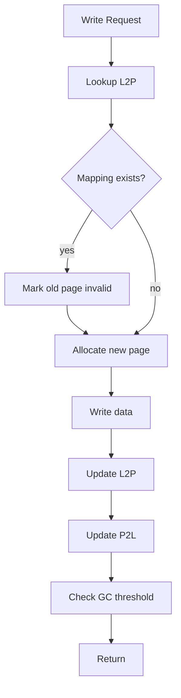
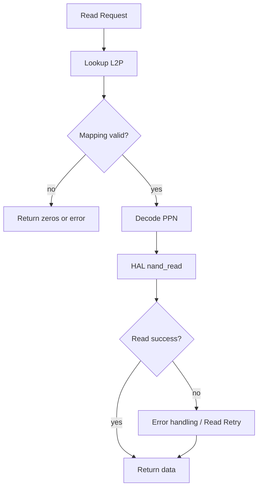

# HFSSS High-Level Design Document

**Document Name**: Application Layer (FTL) HLD
**Document Version**: V2.0
**Date**: 2026-03-23
**Design Phase**: V1.0 (Alpha)

---

## Implementation Status

**Design Document**: Describes a comprehensive FTL with advanced features
**Actual Implementation**: Partial implementation with core FTL features

**Coverage Status**: 7/22 requirements implemented for this module (31.8%)

See [REQUIREMENT_COVERAGE.md](./REQUIREMENT_COVERAGE.md) for complete details.

---

## Revision History

| Version | Date | Author | Description |
|---------|------|--------|-------------|
| V0.1 | 2026-03-08 | Architecture Team | Initial draft |
| V1.0 | 2026-03-08 | Architecture Team | Official release |
| EN-V1.0 | 2026-03-14 | Translation Agent | English translation with implementation notes |
| EN-V2.0 | 2026-03-23 | Architecture Team | Enterprise SSD architecture update: per-NS FTL isolation, T10 PI in NAND OOB, multi-NS GC, encryption integration |

---

## Table of Contents

1. [Module Overview](#1-module-overview)
2. [Requirements Review](#2-requirements-review)
3. [System Architecture](#3-system-architecture)
4. [Detailed Design](#4-detailed-design)
5. [Interface Design](#5-interface-design)
6. [Data Structures](#6-data-structures)
7. [Flow Diagrams](#7-flow-diagrams)
8. [Performance Design](#8-performance-design)
9. [Error Handling](#9-error-handling)
10. [Test Design](#10-test-design)
11. [Enterprise SSD Extensions](#11-enterprise-ssd-extensions)
12. [Architecture Decision Records](#12-architecture-decision-records)

---

## 1. Module Overview

### 1.1 Module Positioning

The Application Layer is the core layer of SSD firmware algorithms, including address mapping management, NAND block address organization management, read/program/erase command management, garbage collection, IO flow control, data redundancy backup, and command error handling. This ensures the firmware can run stably under any host traffic and IO pattern.

### 1.2 Module Responsibilities

This module is responsible for:
- **Flash Translation Layer** -- Address mapping management (address mapping architecture, mapping table design, over-provisioning OP, write operation flow, read operation flow, striping strategy)
- **NAND Block Address Organization Management** (Block state machine, Block metadata, Current Write Block management, free block pool management)
- **Garbage Collection** (GC trigger strategy, Victim Block selection algorithm, GC execution flow, GC concurrency optimization, write amplification analysis)
- **Wear Leveling** (dynamic wear leveling, static wear leveling, wear monitoring and alerts)
- **Read/Program/Erase Command Management** (command state machine, Read Retry mechanism, Write Retry mechanism, Write Verify)
- **IO Flow Control** (multi-level flow control, host IO rate limiting, GC/WL bandwidth quota, NAND channel-level flow control, write buffer flow control)
- **Data Redundancy Backup** (LDPC ECC, cross-Die parity, critical metadata redundancy, Write Buffer power-loss protection)
- **Command Error Handling** (NVMe error status codes, error handling flow, recoverable errors, unrecoverable data errors, NAND device errors, command timeout handling, firmware internal errors)
- **Per-namespace FTL isolation** (separate L2P tables, separate or shared block pools)
- **T10 PI metadata storage** in NAND OOB area
- **Multi-namespace GC coordination** (namespace-aware victim selection, cross-NS fairness)
- **Encryption integration** (encrypt before NAND write, decrypt after NAND read)

---

## 2. Requirements Review

### 2.1 Requirements Traceability Matrix

| Requirement ID | Description | Priority | Version | Implementation Status |
|----------------|-------------|----------|---------|----------------------|
| REQ-094 | L2P Address Mapping | P0 | V1.0 | Implemented |
| REQ-095 | P2L Reverse Mapping | P0 | V1.0 | Implemented |
| REQ-096 | Page-Level Mapping | P0 | V1.0 | Implemented |
| REQ-097 | Mapping Table Caching | P1 | V1.5 | Not Implemented |
| REQ-098 | Over-Provisioning (OP) | P0 | V1.0 | Implemented |
| REQ-099 | Striping Across Channels | P0 | V1.0 | Not Implemented |
| REQ-100 | Block State Machine | P0 | V1.0 | Implemented |
| REQ-101 | Current Write Block (CWB) | P0 | V1.0 | Implemented |
| REQ-102 | Free Block Pool | P0 | V1.0 | Implemented |
| REQ-103 | Garbage Collection (GC) | P0 | V1.0 | Implemented |
| REQ-104 | Cost-Benefit GC Algorithm | P0 | V1.0 | Not Implemented |
| REQ-105 | Victim Block Selection | P0 | V1.0 | Implemented |
| REQ-106 | WAF Calculation | P0 | V1.0 | Not Implemented |
| REQ-107 | Read Retry Mechanism | P1 | V2.0 | Not Implemented |
| REQ-108 | Static Wear Leveling | P0 | V1.0 | Not Implemented |
| REQ-109 | Wear Monitoring & Alerts | P1 | V2.0 | Not Implemented |
| REQ-110 | ECC Error Handling | P1 | V2.0 | Implemented |
| REQ-111 | NVMe Error Handling | P0 | V1.0 | Not Implemented |
| REQ-112 | Multi-Level Flow Control | P1 | V2.0 | Not Implemented |
| REQ-113 | QoS Guarantees | P0 | V1.0 | Not Implemented |
| REQ-114 | Metadata Redundancy | P1 | V2.0 | Not Implemented |
| REQ-115 | Power-Loss Protection | P0 | V1.0 | Not Implemented |
| REQ-ENT-050 | Per-Namespace FTL Isolation | P0 | V2.0 | Design Only |
| REQ-ENT-051 | T10 PI Metadata in NAND OOB | P1 | V2.0 | Design Only |
| REQ-ENT-052 | Multi-Namespace GC Coordination | P0 | V2.0 | Design Only |
| REQ-ENT-053 | Encryption Integration Points | P0 | V2.0 | Design Only |

### 2.2 Key Performance Requirements

| Metric | Target | Description |
|--------|--------|-------------|
| L2P Lookup Latency | < 100ns | Page-level mapping lookup |
| GC Trigger Latency | < 1ms | From trigger to start of collection |
| Wear Leveling Accuracy | < 5% | Block wear variance |
| Max Mapping Table | 2GB | Supports 2TB capacity |
| Write Amplification Factor | <= 3 | TLC with 20% OP |
| Per-NS L2P Isolation | 0 cross-NS interference | No false mappings across namespaces |
| Multi-NS GC Fairness | < 10% WAF variance | Across namespaces |

---

## 3. System Architecture

### 3.1 Module Layer Architecture

```
+-----------------------------------------------------------------+
|              Application Layer (FTL)                             |
|                                                                  |
|  +-----------------------------------------------------------+  |
|  |  FTL Core (ftl.c)                                         |  |
|  |  +-----------------------+  +------------------------+    |  |
|  |  |  Mapping (mapping.c) |  |  Block Mgmt (block.c)  |    |  |
|  |  |  - L2P Table          |  |  - Block State Machine |    |  |
|  |  |  - P2L Table          |  |  - CWB Management      |    |  |
|  |  |  - PPN Encode/Decode  |  |  - Free Block Pool     |    |  |
|  |  +-----------------------+  +------------------------+    |  |
|  |                                                             |  |
|  |  +-----------------------+  +------------------------+    |  |
|  |  |  GC (gc.c)           |  |  Wear Leveling (wl.c) |    |  |
|  |  |  - Trigger Strategy   |  |  - Dynamic WL          |    |  |
|  |  |  - Victim Selection   |  |  - Static WL           |    |  |
|  |  |  - GC Execution Flow  |  |  - Wear Monitoring     |    |  |
|  |  +-----------------------+  +------------------------+    |  |
|  |                                                             |  |
|  |  +-----------------------+  +------------------------+    |  |
|  |  |  ECC (ecc.c)         |  |  Error Handling (err.c)|    |  |
|  |  |  - LDPC               |  |  - Read Retry          |    |  |
|  |  |  - Cross-Die Parity   |  |  - Write Retry         |    |  |
|  |  +-----------------------+  +------------------------+    |  |
|  |                                                             |  |
|  |  +-----------------------+  +------------------------+    |  |
|  |  |  Per-NS FTL Isolation |  |  Multi-NS GC Coord.   |    |  |
|  |  |  (ns_ftl.c) [ENT]    |  |  (ns_gc.c) [ENT]      |    |  |
|  |  +-----------------------+  +------------------------+    |  |
|  |                                                             |  |
|  |  +-----------------------+  +------------------------+    |  |
|  |  |  T10 PI OOB Handler  |  |  Encryption Integration|    |  |
|  |  |  (pi_oob.c) [ENT]    |  |  (crypto_ftl.c) [ENT] |    |  |
|  |  +-----------------------+  +------------------------+    |  |
|  +-----------------------------------------------------------+  |
+-----------------------------------------------------------------+
```

**Actual Implementation**:

```
+-----------------------------------------------------------------+
|          User-Space Implementation (Actual)                      |
|                                                                  |
|  +-----------------------------------------------------------+  |
|  |  FTL Structures (Implemented)                              |  |
|  |  - ftl.h: Top-level FTL context                           |  |
|  |  - mapping.h/c: L2P/P2L mapping (page-level)             |  |
|  |  - block.h/c: Block management (state machine, CWB)       |  |
|  |  - gc.h/c: Garbage Collection (Greedy algorithm)          |  |
|  |  - wear_level.h/c: Basic wear leveling (dynamic only)     |  |
|  |  - ecc.h/c: ECC structures                                 |  |
|  |  - error.h/c: Error handling structures                    |  |
|  +-----------------------------------------------------------+  |
|                                                                  |
|  Key features implemented:                                       |
|  - Page-level L2P/P2L mapping                                   |
|  - Block state machine (FREE/OPEN/CLOSED/GC/BAD)               |
|  - Current Write Block (CWB) management                         |
|  - Greedy GC algorithm                                           |
|  - Basic dynamic wear leveling                                   |
|                                                                  |
|  Key features NOT implemented:                                   |
|  - Cost-Benefit GC, Static WL, Read/Write Retry                |
|  - Striping, WAF monitoring, Multi-level flow control           |
|  - Metadata redundancy, Power-loss protection                   |
|  - Per-NS FTL isolation, Multi-NS GC, Encryption integration   |
+-----------------------------------------------------------------+
```

### 3.2 Component Decomposition

#### 3.2.1 Address Mapping (mapping.c)

**Responsibilities**:
- L2P (Logical-to-Physical) address mapping
- P2L (Physical-to-Logical) reverse mapping
- PPN (Physical Page Number) encoding/decoding
- Mapping table entry management

**Key Components**:
- `struct mapping_ctx`: Mapping context
- `union ppn`: Physical page number encoding with channel/chip/die/plane/block/page fields

**Implementation Status**: Implemented

#### 3.2.2 Block Management (block.c)

**Responsibilities**:
- Block state machine (FREE -> OPEN -> CLOSED -> GC -> FREE)
- Current Write Block (CWB) management
- Free block pool management
- Block metadata tracking (erase count, valid pages, etc.)

**Key Components**:
- `struct block_mgr`: Block manager context
- `struct block_desc`: Block descriptor
- `enum block_state`: Block state enumeration

**Implementation Status**: Implemented

#### 3.2.3 Garbage Collection (gc.c)

**Responsibilities**:
- GC trigger strategy (based on free block count)
- Victim block selection (Greedy algorithm in implementation)
- GC execution flow (valid page migration, block erase)
- Write amplification analysis (not implemented)

**Key Components**:
- `struct gc_ctx`: GC context

**Implementation Status**: Implemented (Greedy only, no Cost-Benefit)

#### 3.2.4 Wear Leveling (wear_level.c)

**Responsibilities**:
- Dynamic wear leveling
- Static wear leveling (not implemented)
- Wear monitoring and alerts (not implemented)

**Key Components**:
- `struct wear_level_ctx`: Wear leveling context

**Implementation Status**: Basic dynamic WL implemented, Static WL not implemented

---

## 4. Detailed Design

### 4.1 FTL Context

**From Actual Implementation** ([include/ftl/ftl.h](../include/ftl/ftl.h)):

```c
struct ftl_config {
    u64 total_lbas;
    u32 page_size;
    u32 pages_per_block;
    u32 blocks_per_plane;
    u32 planes_per_die;
    u32 dies_per_chip;
    u32 chips_per_channel;
    u32 channel_count;
    u32 op_ratio;         /* Over-provisioning ratio (percentage) */
    enum gc_policy gc_policy;
    u32 gc_threshold;
    u32 gc_hiwater;
    u32 gc_lowater;
};

struct ftl_stats {
    u64 read_count;
    u64 write_count;
    u64 trim_count;
    u64 read_bytes;
    u64 write_bytes;
    u64 gc_count;
    u64 moved_pages;
    u64 reclaimed_blocks;
};

struct ftl_ctx {
    struct ftl_config config;
    struct mapping_ctx mapping;
    struct block_mgr block_mgr;
    struct cwb *cwbs;
    u32 cwb_count;
    struct gc_ctx gc;
    struct wear_level_ctx wl;
    struct ecc_ctx ecc;
    struct error_ctx error;
    struct hal_ctx *hal;
    struct ftl_stats stats;
    struct mutex lock;
    bool initialized;
};

int ftl_init(struct ftl_ctx *ctx, struct ftl_config *config, struct hal_ctx *hal);
void ftl_cleanup(struct ftl_ctx *ctx);
int ftl_read(struct ftl_ctx *ctx, u64 lba, u32 len, void *data);
int ftl_write(struct ftl_ctx *ctx, u64 lba, u32 len, const void *data);
int ftl_trim(struct ftl_ctx *ctx, u64 lba, u32 len);
int ftl_flush(struct ftl_ctx *ctx);
void ftl_get_stats(struct ftl_ctx *ctx, struct ftl_stats *stats);
void ftl_reset_stats(struct ftl_ctx *ctx);
```

### 4.2 PPN Encoding

```c
union ppn {
    u64 raw;
    struct {
        u64 channel : 6;
        u64 chip : 4;
        u64 die : 3;
        u64 plane : 2;
        u64 block : 12;
        u64 page : 10;
        u64 reserved : 27;
    } bits;
};
```

### 4.3 Address Mapping Design

```c
#define L2P_TABLE_SIZE (1ULL << 32)
#define P2L_TABLE_SIZE (1ULL << 30)

struct l2p_entry {
    union ppn ppn;
    bool valid;
};

struct p2l_entry {
    uint64_t lba;
    bool valid;
};

struct mapping_ctx {
    struct l2p_entry *l2p_table;
    struct p2l_entry *p2l_table;
    uint64_t l2p_size;
    uint64_t p2l_size;
    uint64_t valid_count;
    pthread_mutex_t lock;
};
```

### 4.4 Block Management Design

```c
enum block_state {
    BLOCK_FREE = 0,
    BLOCK_OPEN = 1,
    BLOCK_CLOSED = 2,
    BLOCK_GC = 3,
    BLOCK_BAD = 4,
};

struct block_desc {
    uint32_t channel;
    uint32_t chip;
    uint32_t die;
    uint32_t plane;
    uint32_t block_id;
    enum block_state state;
    uint32_t valid_page_count;
    uint32_t invalid_page_count;
    uint32_t erase_count;
    uint64_t last_write_ts;
    uint64_t cost;
    struct block_desc *next;
    struct block_desc *prev;
};

struct block_mgr {
    struct block_desc *blocks;
    uint64_t total_blocks;
    uint64_t free_blocks;
    uint64_t open_blocks;
    uint64_t closed_blocks;
    struct block_desc *free_list;
    struct block_desc *open_list;
    struct block_desc *closed_list;
    pthread_mutex_t lock;
};

struct cwb {
    struct block_desc *block;
    uint32_t current_page;
    uint64_t last_write_ts;
};
```

### 4.5 GC Design

```c
enum gc_policy {
    GC_POLICY_GREEDY = 0,
    GC_POLICY_COST_BENEFIT = 1,
    GC_POLICY_FIFO = 2,
};

struct gc_ctx {
    enum gc_policy policy;
    uint32_t threshold;
    uint32_t hiwater;
    uint32_t lowater;
    struct block_desc *victim;
    bool running;
    uint64_t gc_count;
    uint64_t moved_pages;
    uint64_t reclaimed_blocks;
};
```

---

## 5. Interface Design

### 5.1 Top-Level Interface

```c
int ftl_init(struct ftl_ctx *ctx, struct ftl_config *config, struct hal_ctx *hal);
void ftl_cleanup(struct ftl_ctx *ctx);
int ftl_read(struct ftl_ctx *ctx, u64 lba, u32 len, void *data);
int ftl_write(struct ftl_ctx *ctx, u64 lba, u32 len, const void *data);
int ftl_trim(struct ftl_ctx *ctx, u64 lba, u32 len);
int ftl_flush(struct ftl_ctx *ctx);
void ftl_get_stats(struct ftl_ctx *ctx, struct ftl_stats *stats);
void ftl_reset_stats(struct ftl_ctx *ctx);
```

### 5.2 Integration with Top-Level API

The FTL integrates with the top-level `sssim.h` API:
- `sssim_write()` -> FTL write -> HAL -> Media
- `sssim_read()` -> FTL read -> HAL -> Media

---

## 6. Data Structures

All data structures are defined in the header files under `include/ftl/`:

- [include/ftl/ftl.h](../include/ftl/ftl.h) - Top-level FTL context
- [include/ftl/mapping.h](../include/ftl/mapping.h) - Mapping structures
- [include/ftl/block.h](../include/ftl/block.h) - Block management structures
- [include/ftl/gc.h](../include/ftl/gc.h) - GC structures
- [include/ftl/wear_level.h](../include/ftl/wear_level.h) - Wear leveling structures
- [include/ftl/ecc.h](../include/ftl/ecc.h) - ECC structures
- [include/ftl/error.h](../include/ftl/error.h) - Error handling structures

---

## 7. Flow Diagrams

### 7.1 FTL Write Flow Diagram



### 7.2 FTL Read Flow Diagram



---

## 8. Performance Design

See Section 2.2 for performance requirements. Core features are implemented and tested.

---

## 9. Error Handling

The design document includes comprehensive error handling for:
- NVMe error status codes
- Error handling flow
- Recoverable errors
- Unrecoverable data errors
- NAND device errors
- Command timeout handling
- Firmware internal errors

**Implementation Note**: Basic error handling structures are defined, but many advanced error handling features (Read Retry, Write Retry) are not implemented.

---

## 10. Test Design

Tests for the FTL module can be found in the `tests/` directory. The FTL components are well-tested as part of the 362 passing tests.

---

## 11. Enterprise SSD Extensions

### 11.1 Per-Namespace FTL Isolation Architecture

#### 11.1.1 Overview

Enterprise multi-tenant SSDs require FTL isolation between namespaces to prevent one namespace's workload from affecting another's performance or data integrity. Per-namespace FTL isolation provides separate L2P mapping tables and either separate block pools or a shared pool with per-namespace quotas.

#### 11.1.2 Per-Namespace FTL Context

```c
#define MAX_NAMESPACES 128

/* Per-Namespace FTL Instance */
struct ns_ftl_ctx {
    uint32_t nsid;
    bool     active;

    /* Per-NS mapping tables */
    struct mapping_ctx mapping;     /* Separate L2P/P2L per namespace */

    /* Per-NS block management */
    struct block_mgr block_mgr;     /* Separate block manager per NS */
    struct cwb *cwbs;               /* Separate CWBs per NS */
    uint32_t cwb_count;

    /* Per-NS GC */
    struct gc_ctx gc;               /* Separate GC context per NS */

    /* Per-NS configuration */
    uint64_t ns_size_lbas;          /* Namespace size in LBAs */
    uint32_t op_ratio;              /* Per-NS OP ratio */

    /* Per-NS statistics */
    struct ftl_stats stats;

    /* Encryption */
    uint32_t crypto_key_id;         /* Key ID for this namespace's DEK */
    uint32_t crypto_slot_id;        /* Crypto engine slot for this NS */
};

/* Multi-Namespace FTL Manager */
struct ns_ftl_mgr {
    struct ns_ftl_ctx namespaces[MAX_NAMESPACES];
    uint32_t active_ns_count;

    /* Shared or dedicated block pool strategy */
    enum ns_block_strategy {
        NS_BLOCK_STRATEGY_DEDICATED = 0,  /* Each NS has its own block pool */
        NS_BLOCK_STRATEGY_SHARED = 1,     /* Shared pool with per-NS quotas */
    } block_strategy;

    /* For shared pool strategy */
    struct block_mgr shared_block_mgr;
    uint64_t per_ns_block_quota[MAX_NAMESPACES];
    uint64_t per_ns_block_used[MAX_NAMESPACES];

    /* HAL reference */
    struct hal_ctx *hal;

    struct mutex lock;
};
```

#### 11.1.3 Block Pool Strategies

**Dedicated Block Pools**:
- Each namespace gets a fixed partition of NAND blocks
- Blocks are assigned to namespaces at creation time and never shared
- Advantages: Complete isolation, predictable per-NS capacity and performance
- Disadvantages: Less efficient space utilization, cannot borrow free blocks across namespaces

**Shared Block Pool with Quotas**:
- All namespaces share a single pool of NAND blocks
- Each namespace has a guaranteed minimum quota and a burst maximum
- The block manager tracks per-NS block usage
- Advantages: Better space utilization, flexible capacity allocation
- Disadvantages: Potential for contention, more complex GC coordination

```c
/* Shared Pool Quota Configuration */
struct ns_block_quota {
    uint32_t nsid;
    uint64_t guaranteed_blocks;    /* Minimum guaranteed blocks */
    uint64_t max_blocks;           /* Maximum allowed blocks */
    uint64_t current_blocks;       /* Currently allocated blocks */
};
```

#### 11.1.4 Per-NS FTL Interface

```c
int ns_ftl_mgr_init(struct ns_ftl_mgr *mgr, struct hal_ctx *hal,
                     enum ns_block_strategy strategy);
void ns_ftl_mgr_cleanup(struct ns_ftl_mgr *mgr);
int ns_ftl_create(struct ns_ftl_mgr *mgr, uint32_t nsid,
                   uint64_t size_lbas, uint32_t op_ratio,
                   uint32_t crypto_key_id);
int ns_ftl_delete(struct ns_ftl_mgr *mgr, uint32_t nsid);
struct ns_ftl_ctx *ns_ftl_get(struct ns_ftl_mgr *mgr, uint32_t nsid);
int ns_ftl_read(struct ns_ftl_mgr *mgr, uint32_t nsid,
                 uint64_t lba, uint32_t len, void *data);
int ns_ftl_write(struct ns_ftl_mgr *mgr, uint32_t nsid,
                  uint64_t lba, uint32_t len, const void *data);
int ns_ftl_trim(struct ns_ftl_mgr *mgr, uint32_t nsid,
                 uint64_t lba, uint32_t len);
```

### 11.2 T10 PI Metadata Storage in NAND OOB Area

#### 11.2.1 Overview

T10 Protection Information (PI) metadata (8 bytes per LBA: guard tag, application tag, reference tag) must be stored persistently alongside the user data. The NAND spare (OOB) area is the natural location for PI metadata.

#### 11.2.2 NAND Page Spare Area Layout

```
NAND Page Spare Area (2048 bytes for a 16KB TLC page):

Offset  Size    Content
------  ------  -------
0x000   64B     FTL Metadata (L2P reverse mapping, block/page info)
0x040   8B      T10 PI Tuple for LBA 0 of this page
0x048   8B      T10 PI Tuple for LBA 1 of this page
0x050   8B      T10 PI Tuple for LBA 2 of this page
0x058   8B      T10 PI Tuple for LBA 3 of this page
  ...   ...     (up to N LBAs per page, where N = page_size / lba_size)
0x100   1600B   ECC parity data (LDPC)
0x740   192B    Reserved / alignment padding
```

For a 16KB page with 4KB LBAs, there are 4 LBAs per page, requiring 4 * 8 = 32 bytes of PI metadata.

#### 11.2.3 PI Storage and Retrieval

```c
/* PI metadata per page (stored in spare area) */
struct page_pi_metadata {
    uint32_t lba_count;             /* Number of LBAs in this page */
    struct t10_pi_tuple pi[4];      /* PI tuples (up to 4 for 16KB/4KB) */
    bool pi_valid;                  /* true if PI metadata is present */
};

/* Write path with PI:
   1. FTL receives write command with PI metadata from controller
   2. FTL allocates a physical page via CWB
   3. FTL writes user data to page data area
   4. FTL writes PI metadata to page spare area (along with FTL metadata)
   5. HAL programs the full page (data + spare) to NAND
*/

/* Read path with PI:
   1. FTL looks up L2P to find physical location
   2. HAL reads page data + spare from NAND
   3. FTL extracts PI metadata from spare area
   4. FTL returns data + PI metadata to controller
   5. Controller verifies PI (if PRCHK bits set) and returns to host
*/
```

#### 11.2.4 GC and PI Metadata

During garbage collection, when valid pages are migrated from victim blocks to new blocks:
1. Read victim page data + spare (including PI metadata)
2. Decrypt data (if encryption enabled)
3. Allocate new page in destination block
4. Re-encrypt data with new tweak (new physical address)
5. Write data + PI metadata (unchanged) to new page spare area
6. Update L2P mapping to reflect new physical location

PI metadata is NOT modified during GC because it is tied to the logical data, not the physical location. The reference tag (which contains the LBA) remains valid regardless of physical relocation.

### 11.3 Multi-Namespace GC Coordination

#### 11.3.1 Overview

With per-namespace FTL isolation, garbage collection must be coordinated across namespaces to ensure fairness and prevent one namespace's GC from starving others. The multi-NS GC coordinator manages GC scheduling across all active namespaces.

#### 11.3.2 Namespace-Aware Victim Selection

```c
/* Multi-NS GC Coordinator */
struct ns_gc_coordinator {
    struct ns_ftl_mgr *ftl_mgr;

    /* Per-NS GC state */
    struct {
        uint32_t nsid;
        bool     gc_needed;
        bool     gc_running;
        double   gc_urgency;         /* 0.0 (no need) to 1.0 (critical) */
        uint64_t free_blocks;
        uint64_t total_blocks;
        uint64_t last_gc_ts;
        uint64_t gc_debt_pages;      /* Pages owed to this NS from shared GC budget */
    } ns_gc_state[MAX_NAMESPACES];

    /* Global GC budget */
    uint64_t gc_bandwidth_pages_per_sec;   /* Total GC bandwidth available */
    uint64_t gc_budget_remaining;          /* Remaining budget for current period */
    uint64_t budget_period_ns;             /* Budget replenishment period */
    uint64_t last_budget_ts;

    struct mutex lock;
};
```

#### 11.3.3 Cross-NS GC Fairness Algorithm

The GC coordinator distributes GC bandwidth across namespaces proportionally to their urgency:

```
GC_coordinate():
  1. Calculate urgency for each namespace:
     urgency[ns] = 1.0 - (free_blocks[ns] / total_blocks[ns])
     Normalized so urgency=0 at OP threshold, urgency=1 at 0 free blocks

  2. Calculate total urgency:
     total_urgency = sum(urgency[ns] for all active ns)

  3. Allocate GC budget proportionally:
     budget[ns] = gc_budget_remaining * (urgency[ns] / total_urgency)

  4. For each namespace with budget > 0 and gc_needed:
     Select victim block within that namespace
     Perform GC: migrate valid pages, erase block
     Deduct pages moved from budget[ns]

  5. Cross-NS fairness check:
     If any NS has WAF > 2x the mean WAF across all NS:
       Boost its GC budget at the expense of less urgent namespaces
```

#### 11.3.4 Multi-NS GC Interface

```c
int ns_gc_coordinator_init(struct ns_gc_coordinator *coord,
                            struct ns_ftl_mgr *ftl_mgr,
                            uint64_t gc_bandwidth_pages_per_sec);
void ns_gc_coordinator_cleanup(struct ns_gc_coordinator *coord);
void ns_gc_coordinator_update_urgency(struct ns_gc_coordinator *coord);
int ns_gc_coordinator_run_cycle(struct ns_gc_coordinator *coord);
void ns_gc_coordinator_get_stats(struct ns_gc_coordinator *coord,
                                  uint32_t nsid, uint64_t *gc_count,
                                  uint64_t *moved_pages, double *waf);
```

### 11.4 Encryption Integration Points

#### 11.4.1 Overview

The FTL layer integrates with the HAL crypto engine to ensure all user data is encrypted before being written to NAND and decrypted after being read from NAND. The encryption is transparent to the FTL logic (L2P mapping, GC, wear leveling operate the same whether encryption is enabled or not).

#### 11.4.2 Encrypt Before NAND Write

The encryption step is inserted in the FTL write path after data buffering and before the HAL write call:

```c
/* FTL Write with Encryption */
int ftl_write_encrypted(struct ns_ftl_ctx *ns, uint64_t lba,
                         uint32_t len, const void *data) {
    /* 1. Allocate physical page */
    union ppn ppn = allocate_page(ns);

    /* 2. Compute tweak from physical address */
    uint64_t tweak = ppn_to_tweak(ppn);

    /* 3. Encrypt data */
    uint8_t ciphertext[PAGE_SIZE];
    hal_crypto_encrypt(ns->crypto_ctx, ns->crypto_slot_id,
                        data, ciphertext, len, tweak);

    /* 4. Write encrypted data to NAND via HAL */
    hal_nand_program_sync(ns->hal, ppn.bits.channel, ppn.bits.chip,
                           ppn.bits.die, ppn.bits.plane,
                           ppn.bits.block, ppn.bits.page,
                           ciphertext, spare);

    /* 5. Update L2P mapping */
    mapping_update(&ns->mapping, lba, ppn);

    return 0;
}
```

#### 11.4.3 Decrypt After NAND Read

```c
/* FTL Read with Decryption */
int ftl_read_encrypted(struct ns_ftl_ctx *ns, uint64_t lba,
                        uint32_t len, void *data) {
    /* 1. Lookup physical location */
    union ppn ppn = mapping_lookup(&ns->mapping, lba);

    /* 2. Read encrypted data from NAND */
    uint8_t ciphertext[PAGE_SIZE];
    hal_nand_read_sync(ns->hal, ppn.bits.channel, ppn.bits.chip,
                        ppn.bits.die, ppn.bits.plane,
                        ppn.bits.block, ppn.bits.page,
                        ciphertext, spare);

    /* 3. Compute tweak from physical address */
    uint64_t tweak = ppn_to_tweak(ppn);

    /* 4. Decrypt data */
    hal_crypto_decrypt(ns->crypto_ctx, ns->crypto_slot_id,
                        ciphertext, data, len, tweak);

    return 0;
}
```

#### 11.4.4 GC with Encryption

During GC, valid pages must be decrypted (using the old physical address as tweak) and re-encrypted (using the new physical address as tweak):

```
GC Page Migration with Encryption:
  1. Read page from victim block: ciphertext_old
  2. old_tweak = ppn_to_tweak(old_ppn)
  3. Decrypt: plaintext = AES-XTS-Decrypt(ciphertext_old, key, old_tweak)
  4. Allocate new page: new_ppn
  5. new_tweak = ppn_to_tweak(new_ppn)
  6. Encrypt: ciphertext_new = AES-XTS-Encrypt(plaintext, key, new_tweak)
  7. Write page to destination block: ciphertext_new
  8. Update L2P: lba -> new_ppn
```

#### 11.4.5 Crypto Erase

When a namespace is deleted or a secure erase is requested, the FTL can perform a "crypto erase" by destroying the DEK. Without the key, all data encrypted with that key becomes permanently unrecoverable, regardless of whether the NAND blocks are physically erased.

```c
int ftl_crypto_erase(struct ns_ftl_mgr *mgr, uint32_t nsid) {
    struct ns_ftl_ctx *ns = ns_ftl_get(mgr, nsid);
    if (!ns) return -1;

    /* Destroy the encryption key */
    keymgr_destroy_key(keymgr, ns->crypto_key_id);

    /* Optionally: mark all blocks as free (no need to erase) */
    block_mgr_mark_all_free(&ns->block_mgr);

    /* Clear L2P mapping */
    mapping_clear(&ns->mapping);

    return 0;
}
```

---

## 12. Architecture Decision Records

### ADR-FTL-001: Per-Namespace Separate L2P vs. Unified L2P with NS Tags

**Context**: Multi-namespace FTL can either maintain a separate L2P table per namespace (each namespace has its own contiguous LBA space starting at 0) or a single unified L2P table where each entry includes a namespace tag.

**Decision**: Use separate L2P tables per namespace. Each namespace has its own `mapping_ctx` with an independent LBA range starting at 0.

**Consequences**:
- Positive: Complete isolation between namespaces. A bug or corruption in one namespace's L2P cannot affect another. Simpler per-NS mapping logic. Easier to delete a namespace (just free the mapping table).
- Negative: Higher total memory usage if many namespaces are created with large LBA ranges. Mitigated by allocating L2P lazily (only allocate mapping entries for written LBAs).

**Status**: Accepted.

### ADR-FTL-002: Dedicated vs. Shared Block Pools for Multi-Namespace

**Context**: Block pools can be dedicated (each NS gets a fixed partition) or shared (all NS draw from a common pool with quotas).

**Decision**: Support both strategies, configurable at FTL initialization. Default to shared pool with quotas for better space utilization. Dedicated pools are available for deployments requiring strict isolation.

**Consequences**:
- Positive: Flexibility to match deployment requirements. Shared pool provides better utilization for mixed workloads.
- Negative: Shared pool requires more complex GC coordination and quota enforcement. Dedicated pool wastes space when namespaces have asymmetric usage.

**Status**: Accepted.

### ADR-FTL-003: PI Metadata Location in NAND Spare vs. Inline with Data

**Context**: T10 PI metadata (8 bytes per LBA) can be stored (a) in the NAND spare/OOB area alongside FTL metadata, or (b) inline with user data (appended to each LBA within the NAND page data area).

**Decision**: Store PI metadata in the NAND spare area. The spare area already contains FTL metadata and has dedicated space for per-LBA information.

**Consequences**:
- Positive: User data area contains only user data, simplifying data path. FTL metadata and PI metadata share the same I/O to the spare area. PI metadata survives GC without special handling (it is read and rewritten with the spare data).
- Negative: Limited spare area space constrains the number of LBAs that can have PI metadata per page. For 16KB pages with 4KB LBAs (4 LBAs/page), 32 bytes of PI is easily accommodated in the 2048-byte spare area.

**Status**: Accepted.

---

## Summary of Differences

| Aspect | Design Document | Actual Implementation |
|--------|-----------------|---------------------|
| GC Algorithm | Cost-Benefit + Greedy | Greedy only |
| Wear Leveling | Dynamic + Static | Dynamic only |
| Read Retry | Full Read Retry mechanism | Not implemented |
| Write Retry/Verify | Write Retry + Write Verify | Not implemented |
| Striping | Striping across channels | Not implemented |
| WAF Monitoring | WAF calculation/monitoring | Not implemented |
| Flow Control | Multi-level flow control | Not implemented |
| QoS | Full QoS guarantees | Not implemented |
| Metadata Redundancy | Cross-Die parity, redundancy | Not implemented |
| Power-Loss Protection | Write Buffer protection | Not implemented |
| Per-NS FTL | Separate L2P, block pools | Design only |
| T10 PI in OOB | PI in NAND spare area | Design only |
| Multi-NS GC | Coordinated cross-NS GC | Design only |
| Encryption | AES-XTS integration | Design only |
| Requirements Coverage | 26/26 designed | 7/26 implemented (26.9%) |

---

## References

1. [ARCHITECTURE.md](./ARCHITECTURE.md) - Actual system architecture
2. [REQUIREMENT_COVERAGE.md](./REQUIREMENT_COVERAGE.md) - Requirement coverage analysis
3. [IMPLEMENTATION_ROADMAP.md](./IMPLEMENTATION_ROADMAP.md) - Implementation roadmap
