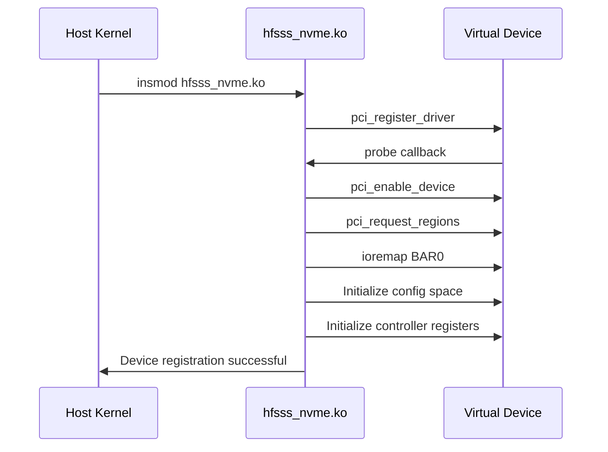
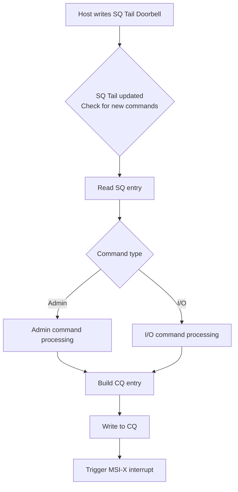
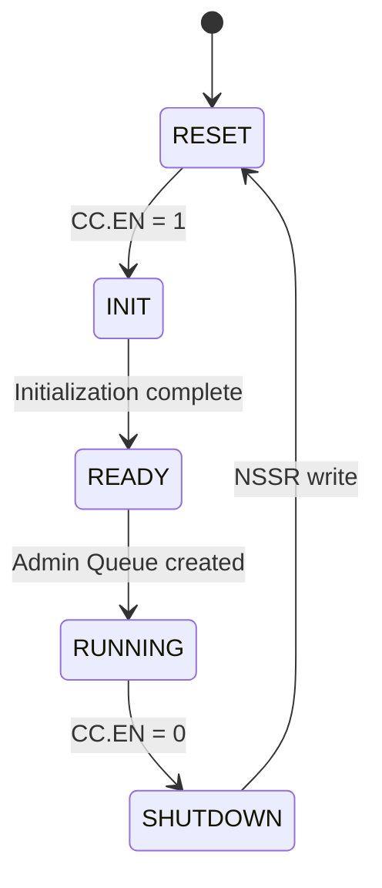
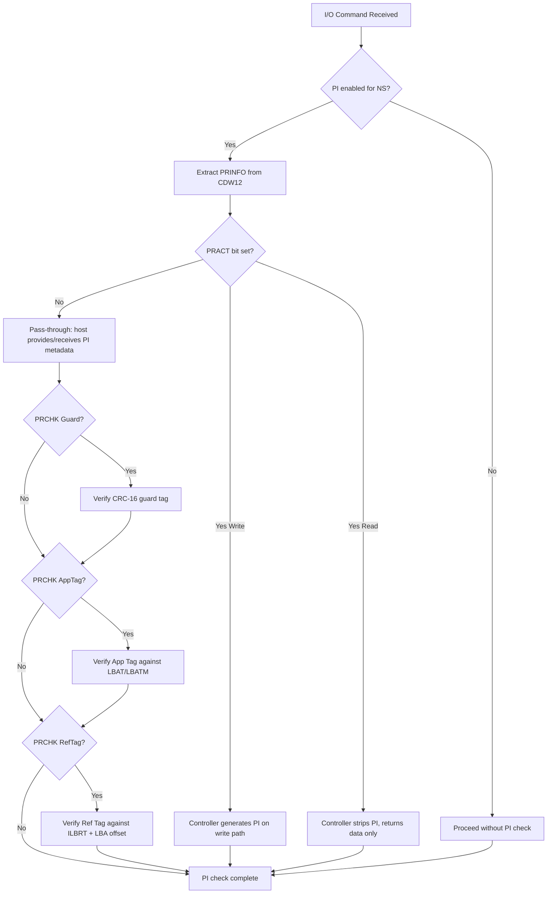
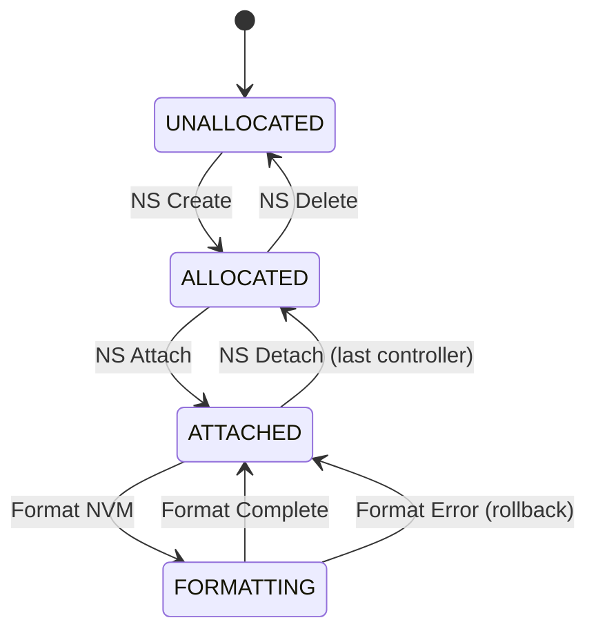
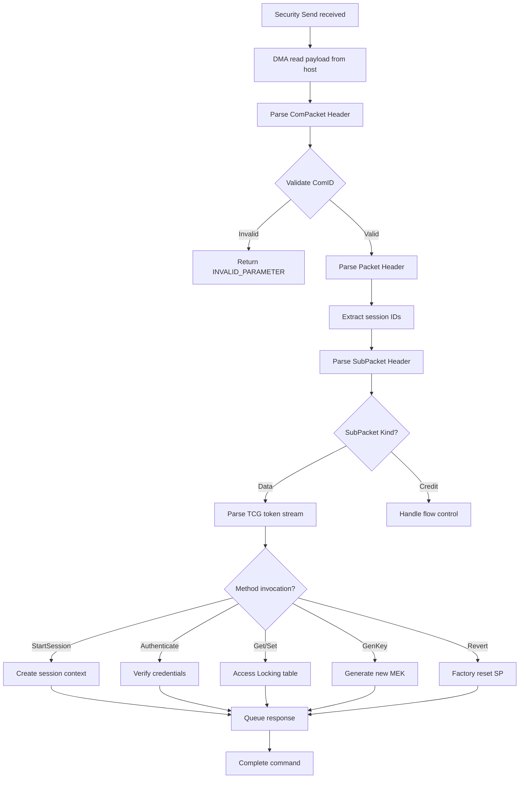

# High-Fidelity Full-Stack SSD Simulator (HFSSS) Low-Level Design Document

**Document Name**: PCIe/NVMe Device Emulation Module Low-Level Design
**Document Version**: V2.0
**Creation Date**: 2026-03-08
**Design Phase**: V2.0 (Enterprise Extended)
**Classification**: Internal

---

## Revision History

| Version | Date | Author | Description |
|---------|------|--------|-------------|
| V0.1 | 2026-03-08 | Architecture Team | Initial draft |
| V1.0 | 2026-03-08 | Architecture Team | Official release |
| V2.0 | 2026-03-23 | Architecture Team | English translation with enterprise SSD extensions (T10 PI, Namespace Management, Security commands) |

---

## Table of Contents

1. [Overview](#1-overview)
2. [Requirements Traceability](#2-requirements-traceability)
3. [Data Structure Detailed Design](#3-data-structure-detailed-design)
4. [Header File Design](#4-header-file-design)
5. [Function Interface Detailed Design](#5-function-interface-detailed-design)
6. [Module Internal Logic Detailed Design](#6-module-internal-logic-detailed-design)
7. [Flowcharts](#7-flowcharts)
8. [Debug Mechanism Design](#8-debug-mechanism-design)
9. [Test Case Design](#9-test-case-design)
10. [T10 PI NVMe Command Field Details](#10-t10-pi-nvme-command-field-details)
11. [Namespace Management Command Handler Implementations](#11-namespace-management-command-handler-implementations)
12. [Security Command Handler Implementations](#12-security-command-handler-implementations)
13. [Architecture Decision Records](#13-architecture-decision-records)
14. [Memory Budget Analysis](#14-memory-budget-analysis)
15. [Latency Budget Analysis](#15-latency-budget-analysis)
16. [References](#16-references)
17. [Appendix: Cross-References to HLD](#appendix-cross-references-to-hld)

---

## 1. Overview

### 1.1 Module Positioning and Responsibilities

The PCIe/NVMe Device Emulation Module serves as the interface layer between HFSSS and the host Linux operating system. Implemented as a Linux Kernel Module, it references the core mechanisms of NVMeVirt to virtualize a standard PCIe NVMe device within the host Linux kernel.

### 1.2 Relationships with Other Modules

This module, as a kernel-layer component, communicates with the user-space daemon through shared memory and eventfd. It receives requests from the host NVMe driver and forwards them to the user-space daemon for processing.

### 1.3 Design Constraints and Assumptions

- Target platform: Linux Kernel 5.15+
- Architecture: x86_64 / ARM64
- Dependencies: Linux PCI subsystem, NVMe subsystem
- Assumption: Host IOMMU support is optional
- Assumption: Host kernel supports kthread, eventfd

### 1.4 Terminology

| Term | Definition |
|------|-----------|
| BAR | Base Address Register |
| MMIO | Memory-Mapped I/O |
| SQ | Submission Queue |
| CQ | Completion Queue |
| MSI-X | Message Signaled Interrupts Extended |
| PRP | Physical Region Page |
| SGL | Scatter/Gather List |
| T10 PI | T10 Protection Information (end-to-end data integrity) |
| PRINFO | Protection Information field in NVMe command |
| NSID | Namespace Identifier |
| TCG Opal | Trusted Computing Group Opal Security Subsystem Class |
| DEK | Data Encryption Key |

---

## 2. Requirements Traceability

### 2.1 Requirements Traceability Matrix

| REQ-ID | Requirement Description | Priority | Implementation | Test Case |
|--------|------------------------|----------|---------------|-----------|
| FR-PCIE-001 | PCIe configuration space emulation | P0 | pci_config_space struct + pci_read_config / pci_write_config callbacks | UT_PCI_001 |
| FR-NVME-001 | NVMe controller register emulation | P0 | nvme_controller_regs struct + MMIO read/write callbacks | UT_NVME_001 |
| FR-NVME-002 | NVMe queue management | P0 | nvme_sq / nvme_cq structs + doorbell handling | UT_QUEUE_001, UT_QUEUE_002 |
| FR-NVME-003 | MSI-X interrupt emulation | P0 | msix_table_entry + pci_msix_* API | UT_MSIX_001 |
| FR-NVME-004 | NVMe Admin command set | P0 | admin_cmd_handler table + per-command handler functions | IT_FULL_002 |
| FR-NVME-005 | NVMe I/O command set | P0 | io_cmd_handler table + per-command handler functions | IT_FULL_003 |
| FR-NVME-006 | NVMe DMA data transfer | P0 | dma_context + kmap / memcpy | UT_DMA_001 |
| FR-NVME-007 | T10 PI command field parsing | P1 | PRINFO extraction from CDW12, ILBRT/LBAT/ELBAT from CDW14-15 | UT_T10PI_001-003 |
| FR-NVME-008 | Namespace management commands | P1 | NS Create/Delete/Attach/Detach/Format handlers + state machines | UT_NSMGMT_001-005 |
| FR-NVME-009 | Security commands | P1 | Security Send/Receive + TCG Opal routing + ComPacket parsing | UT_SEC_001-004 |

### 2.2 Detailed Implementation Notes per Requirement

#### FR-PCIE-001: PCIe Configuration Space Emulation

**Implementation Overview**: Register a virtual PCI device via `struct pci_driver` and provide configuration space read/write callbacks.

**Details**:
- Configuration space size: 256B base + 4KB extended
- Vendor ID: 0x1D1D
- Device ID: 0x2001
- Class Code: 0x010802 (Mass Storage, NVMe Controller)

#### FR-NVME-001: NVMe Controller Register Emulation

**Implementation Overview**: Map BAR0 as an MMIO region via ioremap and provide readq/writeq callbacks to handle register accesses.

---

## 3. Data Structure Detailed Design

### 3.1 PCIe Configuration Space Data Structure

```c
#ifndef __HFSSS_PCI_H
#define __HFSSS_PCI_H

#include <linux/types.h>
#include <linux/pci.h>

#define PCI_CONFIG_SPACE_SIZE 256
#define PCI_EXT_CONFIG_SPACE_SIZE 4096

/* PCI Type 0 Configuration Header */
struct pci_config_header {
    /* 0x00 */
    __le16 vendor_id;           /* Vendor ID */
    __le16 device_id;           /* Device ID */
    __le16 command;             /* Command Register */
    __le16 status;              /* Status Register */
    /* 0x08 */
    u8  revision_id;         /* Revision ID */
    u8  class_code[3];       /* Class Code */
    u8  cache_line_size;     /* Cache Line Size */
    u8  latency_timer;        /* Latency Timer */
    u8  header_type;          /* Header Type */
    u8  bist;                /* BIST */
    /* 0x10 */
    __le32 bar[6];              /* BAR0-BAR5 */
    /* 0x28 */
    __le32 cardbus_cis;         /* CardBus CIS Pointer */
    /* 0x2C */
    __le16 subsystem_vendor_id; /* Subsystem Vendor ID */
    __le16 subsystem_id;         /* Subsystem ID */
    /* 0x30 */
    __le32 expansion_rom;       /* Expansion ROM Base Address */
    /* 0x34 */
    u8  capabilities_ptr;     /* Capabilities Pointer */
    u8  reserved1[7];        /* Reserved */
    /* 0x3C */
    u8  interrupt_line;       /* Interrupt Line */
    u8  interrupt_pin;        /* Interrupt Pin */
    u8  min_gnt;             /* Minimum Grant */
    u8  max_lat;             /* Maximum Latency */
} __attribute__((packed));

/* PCI Capability IDs */
#define PCI_CAP_ID_PM          0x01
#define PCI_CAP_ID_MSI         0x05
#define PCI_CAP_ID_MSIX        0x11
#define PCI_CAP_ID_EXP         0x10

/* PCI Capability Header */
struct pci_cap_header {
    u8 cap_id;
    u8 next;
} __attribute__((packed));

/* PCI Power Management Capability */
struct pci_cap_pm {
    struct pci_cap_header hdr;
    __le16 pm_cap;
    __le16 pm_ctrl_sts;
    u8  pm_ext;
    u8  data[3];
} __attribute__((packed));

/* PCI MSI Capability */
struct pci_cap_msi {
    struct pci_cap_header hdr;
    __le16 message_control;
    __le32 message_addr_low;
    __le32 message_addr_high;
    __le16 message_data;
    __le16 reserved;
    __le32 mask_bits;
    __le32 pending_bits;
} __attribute__((packed));

/* PCI MSI-X Capability */
struct pci_cap_msix {
    struct pci_cap_header hdr;
    __le16 message_control;
    __le32 table_offset;
    __le32 pba_offset;
} __attribute__((packed));

/* PCI Express Capability */
struct pci_cap_exp {
    struct pci_cap_header hdr;
    __le16 pcie_cap;
    __le32 dev_cap;
    __le16 dev_ctrl;
    __le16 dev_sts;
    __le32 link_cap;
    __le16 link_ctrl;
    __le16 link_sts;
    __le32 slot_cap;
    __le16 slot_ctrl;
    __le16 slot_sts;
    __le16 root_ctrl;
    __le16 root_cap;
    __le32 root_sts;
    __le32 dev_cap2;
    __le32 dev_ctrl2;
    __le32 link_cap2;
    __le32 link_ctrl2;
    __le32 slot_cap2;
    __le32 slot_ctrl2;
} __attribute__((packed));

/* Complete PCI Configuration Space */
struct pci_config_space {
    struct pci_config_header header;
    u8 extended_cap[PCI_CONFIG_SPACE_SIZE - sizeof(struct pci_config_header)];
    u8 ext_config[PCI_EXT_CONFIG_SPACE_SIZE - PCI_CONFIG_SPACE_SIZE];
} __attribute__((packed));

#endif /* __HFSSS_PCI_H */
```

### 3.2 NVMe Controller Register Data Structure

```c
#ifndef __HFSSS_NVME_H
#define __HFSSS_NVME_H

#include <linux/types.h>

/* NVMe Controller Register Offsets */
#define NVME_REG_CAP      0x00
#define NVME_REG_VS       0x08
#define NVME_REG_INTMS    0x0C
#define NVME_REG_INTMC    0x10
#define NVME_REG_CC       0x14
#define NVME_REG_CSTS     0x1C
#define NVME_REG_NSSR     0x20
#define NVME_REG_AQA      0x24
#define NVME_REG_ASQ      0x28
#define NVME_REG_ACQ      0x30
#define NVME_REG_CMBLOC   0x38
#define NVME_REG_CMBSZ    0x3C
#define NVME_REG_BPINFO   0x40
#define NVME_REG_BPRSEL   0x44
#define NVME_REG_BPMBL    0x48
#define NVME_REG_DBS      0x1000

/* CAP register bits */
#define NVME_CAP_MQES_SHIFT   0
#define NVME_CAP_MQES_MASK    (0xFFFFULL << NVME_CAP_MQES_SHIFT)
#define NVME_CAP_CQR_SHIFT    16
#define NVME_CAP_CQR_MASK     (0x1ULL << NVME_CAP_CQR_SHIFT)
#define NVME_CAP_AMS_SHIFT    17
#define NVME_CAP_AMS_MASK     (0x7ULL << NVME_CAP_AMS_SHIFT)
#define NVME_CAP_TO_SHIFT     24
#define NVME_CAP_TO_MASK      (0xFFULL << NVME_CAP_TO_SHIFT)
#define NVME_CAP_DSTRD_SHIFT   32
#define NVME_CAP_DSTRD_MASK    (0xFULL << NVME_CAP_DSTRD_SHIFT)
#define NVME_CAP_NSSRS_SHIFT  36
#define NVME_CAP_NSSRS_MASK   (0x1ULL << NVME_CAP_NSSRS_SHIFT)
#define NVME_CAP_CSS_SHIFT    37
#define NVME_CAP_CSS_MASK     (0xFFULL << NVME_CAP_CSS_SHIFT)
#define NVME_CAP_MPSMIN_SHIFT 48
#define NVME_CAP_MPSMIN_MASK  (0xFULL << NVME_CAP_MPSMIN_SHIFT)
#define NVME_CAP_MPSMAX_SHIFT 52
#define NVME_CAP_MPSMAX_MASK  (0xFULL << NVME_CAP_MPSMAX_SHIFT)

/* CC register bits */
#define NVME_CC_EN_SHIFT       0
#define NVME_CC_EN_MASK        (0x1U << NVME_CC_EN_SHIFT)
#define NVME_CC_CSS_SHIFT      4
#define NVME_CC_CSS_MASK       (0x7U << NVME_CC_CSS_SHIFT)
#define NVME_CC_MPS_SHIFT      7
#define NVME_CC_MPS_MASK       (0xFU << NVME_CC_MPS_SHIFT)
#define NVME_CC_AMS_SHIFT     11
#define NVME_CC_AMS_MASK       (0x7U << NVME_CC_AMS_SHIFT)
#define NVME_CC_SHN_SHIFT     14
#define NVME_CC_SHN_MASK       (0x3U << NVME_CC_SHN_SHIFT)
#define NVME_CC_IOSQES_SHIFT   16
#define NVME_CC_IOSQES_MASK    (0xFU << NVME_CC_IOSQES_SHIFT)
#define NVME_CC_IOCQES_SHIFT   20
#define NVME_CC_IOCQES_MASK    (0xFU << NVME_CC_IOCQES_SHIFT)

/* CSTS register bits */
#define NVME_CSTS_RDY_SHIFT      0
#define NVME_CSTS_RDY_MASK     (0x1U << NVME_CSTS_RDY_SHIFT)
#define NVME_CSTS_CFS_SHIFT      1
#define NVME_CSTS_CFS_MASK     (0x1U << NVME_CSTS_CFS_SHIFT)
#define NVME_CSTS_SHST_SHIFT     2
#define NVME_CSTS_SHST_MASK    (0x3U << NVME_CSTS_SHST_SHIFT)
#define NVME_CSTS_NSSRO_SHIFT    4
#define NVME_CSTS_NSSRO_MASK   (0x1U << NVME_CSTS_NSSRO_SHIFT)
#define NVME_CSTS_PP_SHIFT       5
#define NVME_CSTS_PP_MASK      (0x1U << NVME_CSTS_PP_SHIFT)
#define NVME_CSTS_ST_SHIFT       6
#define NVME_CSTS_ST_MASK      (0x1U << NVME_CSTS_ST_SHIFT)

/* AQA register bits */
#define NVME_AQA_ASQS_SHIFT       0
#define NVME_AQA_ASQS_MASK    (0xFFFU << NVME_AQA_ASQS_SHIFT)
#define NVME_AQA_ACQS_SHIFT      16
#define NVME_AQA_ACQS_MASK    (0xFFFU << NVME_AQA_ACQS_SHIFT)

/* NVMe Controller Register Structure */
struct nvme_controller_regs {
    union {
        struct {
            __le64 cap;      /* 0x00: CAP */
            __le32 vs;       /* 0x08: VS */
            __le32 intms;    /* 0x0C: INTMS */
            __le32 intmc;    /* 0x10: INTMC */
            __le32 cc;       /* 0x14: CC */
            __le32 reserved1; /* 0x18: Reserved */
            __le32 csts;     /* 0x1C: CSTS */
            __le32 nssr;     /* 0x20: NSSR */
            __le32 aqa;      /* 0x24: AQA */
            __le64 asq;      /* 0x28: ASQ */
            __le64 acq;      /* 0x30: ACQ */
            __le32 cmbloc;   /* 0x38: CMBLOC */
            __le32 cmbsz;    /* 0x3C: CMBSZ */
            __le32 bpinfo;   /* 0x40: BPINFO */
            __le32 bprsel;   /* 0x44: BPRSEL */
            __le64 bpmbl;    /* 0x48: BPMBL */
            u8 reserved2[0x1000 - 0x50];
        };
        u8 raw[0x1000];
    } regs;

    struct {
        __le32 sq_tail;
        __le32 cq_head;
    } doorbell[64];
};

#endif /* __HFSSS_NVME_H */
```

### 3.3 Queue Management Data Structure

```c
#ifndef __HFSSS_QUEUE_H
#define __HFSSS_QUEUE_H

#include <linux/types.h>
#include <linux/spinlock.h>
#include <linux/sbitmap.h>

/* NVMe Submission Queue Entry */
struct nvme_sq_entry {
    __le32 cdw0;
    __le32 nsid;
    __le32 cdw2;
    __le32 cdw3;
    __le64 mptr;
    __le64 dptr_prp1;
    __le64 dptr_prp2;
    __le32 cdw10;
    __le32 cdw11;
    __le32 cdw12;
    __le32 cdw13;
    __le32 cdw14;
    __le32 cdw15;
} __attribute__((packed));

/* NVMe Completion Queue Entry */
struct nvme_cq_entry {
    __le32 cdw0;
    __le32 rsvd1;
    __le16 sqhd;
    __le16 sqid;
    __le16 cid;
    __le16 status;
} __attribute__((packed));

/* NVMe Submission Queue */
struct nvme_sq {
    u16 qid;
    u16 qsize;
    u16 sq_head;
    u16 sq_tail;
    u16 cqid;
    u32 entry_size;
    u64 dma_addr;
    void __iomem *vaddr;
    spinlock_t lock;
};

/* NVMe Completion Queue */
struct nvme_cq {
    u16 qid;
    u16 qsize;
    u16 cq_head;
    u16 cq_tail;
    u16 phase;
    u32 entry_size;
    u16 irq_enabled;
    u16 irq_vector;
    u64 dma_addr;
    void __iomem *vaddr;
    spinlock_t lock;
};

/* NVMe Queue Pair */
struct nvme_queue_pair {
    struct nvme_sq *sq;
    struct nvme_cq *cq;
    bool valid;
};

#endif /* __HFSSS_QUEUE_H */
```

### 3.4 MSI-X Interrupt Data Structure

```c
#ifndef __HFSSS_MSIX_H
#define __HFSSS_MSIX_H

#include <linux/types.h>
#include <linux/irq.h>
#include <linux/msi.h>

/* MSI-X Table Entry */
struct msix_table_entry {
    __le32 msg_addr_lo;
    __le32 msg_addr_hi;
    __le32 msg_data;
    __le32 vector_ctrl;
} __attribute__((packed));

/* MSI-X PBA Entry */
struct msix_pba {
    u64 pending[2];
} __attribute__((packed));

/* MSI-X Context */
struct msix_context {
    struct msix_table_entry *table;
    dma_addr_t table_dma;
    struct msix_pba *pba;
    dma_addr_t pba_dma;
    int num_vectors;
    int enabled;
    struct irq_domain *irq_domain;
    struct irq_chip irq_chip;
};

#endif /* __HFSSS_MSIX_H */
```

### 3.5 DMA Engine Data Structure

```c
#ifndef __HFSSS_DMA_H
#define __HFSSS_DMA_H

#include <linux/types.h>
#include <linux/dma-mapping.h>
#include <linux/scatterlist.h>

/* DMA Direction */
enum dma_direction {
    DMA_DIR_HOST_TO_DEV = 0,
    DMA_DIR_DEV_TO_HOST = 1,
};

/* PRP/SGL Iterator */
struct prp_sgl_iter {
    u64 prp1;
    u64 prp2;
    u8 *sgl;
    u32 sgl_len;
    u64 offset;
    u64 length;
    u64 remaining;
    u32 page_size;
    enum dma_direction dir;
};

/* DMA Context */
struct dma_context {
    struct prp_sgl_iter iter;
    struct scatterlist *sg;
    int nents;
    int sg_alloced;
    enum dma_direction dir;
    u64 total_len;
};

#endif /* __HFSSS_DMA_H */
```

### 3.6 Shared Memory Data Structure

```c
#ifndef __HFSSS_SHMEM_H
#define __HFSSS_SHMEM_H

#include <linux/types.h>
#include <linux/spinlock.h>
#include <linux/wait.h>
#include <linux/eventfd.h>

#define SHMEM_REGION_SIZE (16 * 1024 * 1024) /* 16MB shared memory */
#define RING_BUFFER_SLOTS 16384
#define CMD_SLOT_SIZE 128

/* Command Type */
enum cmd_type {
    CMD_NVME_ADMIN = 0,
    CMD_NVME_IO = 1,
    CMD_CONTROL = 2,
};

/* Command Slot */
struct cmd_slot {
    u32 cmd_type;
    u32 cmd_id;
    u32 sqid;
    u32 cqid;
    u64 prp1;
    u64 prp2;
    u32 cdw0_15[16];
    u32 data_len;
    u32 flags;
    u64 metadata;
};

/* Ring Buffer Header */
struct ring_buffer_header {
    u32 prod_idx;
    u32 cons_idx;
    u32 slot_count;
    u32 slot_size;
    u64 prod_tail;
    u64 cons_head;
    spinlock_t prod_lock;
    spinlock_t cons_lock;
    wait_queue_head_t prod_wq;
    wait_queue_head_t cons_wq;
};

/* Shared Memory Region */
struct shmem_region {
    struct ring_buffer_header *header;
    struct cmd_slot *slots;
    void *data_area;
    struct page **pages;
    int nr_pages;
    struct eventfd_ctx *kern_efd;
    struct eventfd_ctx *user_efd;
    int kern_efd_fd;
    int user_efd_fd;
};

#endif /* __HFSSS_SHMEM_H */
```

---

## 4. Header File Design

### 4.1 Public Header File: hfsss_nvme.h

```c
#ifndef __HFSSS_NVME_PUBLIC_H
#define __HFSSS_NVME_PUBLIC_H

#include <linux/types.h>
#include <linux/pci.h>
#include "hfsss_pci.h"
#include "hfsss_nvme_regs.h"
#include "hfsss_queue.h"
#include "hfsss_msix.h"
#include "hfsss_dma.h"
#include "hfsss_shmem.h"

#define HFSSS_NVME_DEV_NAME "hfsss_nvme"
#define HFSSS_NVME_MAJOR 240

/* HFSSS NVMe Device Structure */
struct hfsss_nvme_dev {
    struct pci_dev *pdev;
    struct nvme_controller_regs __iomem *bar0;
    void __iomem *bar2;
    void __iomem *bar4;
    struct nvme_controller_regs regs;
    struct pci_config_space config_space;
    struct nvme_sq *admin_sq;
    struct nvme_cq *admin_cq;
    struct nvme_sq *io_sqs[64];
    struct nvme_cq *io_cqs[64];
    struct msix_context msix;
    struct dma_context dma;
    struct shmem_region shmem;
    struct task_struct *io_dispatcher_task;
    bool io_dispatcher_running;
    wait_queue_head_t io_dispatcher_wq;
    struct mutex dev_mutex;
    spinlock_t reg_lock;
    struct {
        u32 css;
        u32 mps;
        u32 page_size;
        u32 ams;
        u32 iosqes;
        u32 sq_entry_size;
        u32 iocqes;
        u32 cq_entry_size;
    } config;
};

/* Function Prototypes */
int hfsss_nvme_init(void);
void hfsss_nvme_exit(void);
int hfsss_nvme_probe(struct pci_dev *pdev, const struct pci_device_id *ent);
void hfsss_nvme_remove(struct pci_dev *pdev);

#endif /* __HFSSS_NVME_PUBLIC_H */
```

### 4.2 Internal Header File: hfsss_nvme_internal.h

```c
#ifndef __HFSSS_NVME_INTERNAL_H
#define __HFSSS_NVME_INTERNAL_H

#include "hfsss_nvme.h"

/* PCI Functions */
int hfsss_pci_init(struct hfsss_nvme_dev *dev);
void hfsss_pci_cleanup(struct hfsss_nvme_dev *dev);
int hfsss_pci_read_config(struct pci_dev *pdev, int where, int size, u32 *val);
int hfsss_pci_write_config(struct pci_dev *pdev, int where, int size, u32 val);

/* NVMe Functions */
int hfsss_nvme_regs_init(struct hfsss_nvme_dev *dev);
void hfsss_nvme_regs_cleanup(struct hfsss_nvme_dev *dev);
u64 hfsss_nvme_mmio_read(void *opaque, hwaddr addr, unsigned size);
void hfsss_nvme_mmio_write(void *opaque, hwaddr addr, u64 val, unsigned size);
void hfsss_nvme_sq_doorbell(struct hfsss_nvme_dev *dev, u32 qid, u32 val);
void hfsss_nvme_cq_doorbell(struct hfsss_nvme_dev *dev, u32 qid, u32 val);
void hfsss_nvme_cc_write(struct hfsss_nvme_dev *dev, u32 val);
void hfsss_nvme_controller_enable(struct hfsss_nvme_dev *dev, u32 cc);
void hfsss_nvme_controller_disable(struct hfsss_nvme_dev *dev);
void hfsss_nvme_controller_update(struct hfsss_nvme_dev *dev, u32 old_cc, u32 new_cc);
void hfsss_nvme_nssr_reset(struct hfsss_nvme_dev *dev);

/* Queue Functions */
struct nvme_sq *nvme_sq_create(struct hfsss_nvme_dev *dev, u16 qid, u64 dma_addr, u16 qsize, u32 entry_size);
void nvme_sq_destroy(struct nvme_sq *sq);
int nvme_sq_get_entry(struct nvme_sq *sq, u16 idx, struct nvme_sq_entry *entry);
int nvme_sq_update_head(struct nvme_sq *sq, u16 new_head);

struct nvme_cq *nvme_cq_create(struct hfsss_nvme_dev *dev, u16 qid, u64 dma_addr, u16 qsize, u32 entry_size, u16 irq_vector);
void nvme_cq_destroy(struct nvme_cq *cq);
int nvme_cq_put_entry(struct nvme_cq *cq, struct nvme_cq_entry *entry);
int nvme_cq_update_tail(struct nvme_cq *cq, u16 new_tail);

/* MSI-X Functions */
int hfsss_msix_init(struct hfsss_nvme_dev *dev);
void hfsss_msix_cleanup(struct hfsss_nvme_dev *dev);
int hfsss_msix_enable(struct hfsss_nvme_dev *dev, int num_vectors);
void hfsss_msix_disable(struct hfsss_nvme_dev *dev);
int hfsss_msix_post_irq(struct hfsss_nvme_dev *dev, int vector);

/* DMA Functions */
int hfsss_dma_init(struct hfsss_nvme_dev *dev);
void hfsss_dma_cleanup(struct hfsss_nvme_dev *dev);
int hfsss_dma_map_prp(struct hfsss_nvme_dev *dev, struct prp_sgl_iter *iter, u64 prp1, u64 prp2, u64 length);
int hfsss_dma_map_sgl(struct hfsss_nvme_dev *dev, struct prp_sgl_iter *iter, u8 *sgl, u32 sgl_len);
int hfsss_dma_copy_from_iter(struct prp_sgl_iter *iter, void *buf, u64 len);
int hfsss_dma_copy_to_iter(struct prp_sgl_iter *iter, const void *buf, u64 len);

/* Admin Command Functions */
int hfsss_admin_handle_identify(struct hfsss_nvme_dev *dev, struct nvme_sq_entry *sqe, struct nvme_cq_entry *cqe);
int hfsss_admin_create_io_sq(struct hfsss_nvme_dev *dev, struct nvme_sq_entry *sqe, struct nvme_cq_entry *cqe);
int hfsss_admin_create_io_cq(struct hfsss_nvme_dev *dev, struct nvme_sq_entry *sqe, struct nvme_cq_entry *cqe);
int hfsss_admin_delete_io_sq(struct hfsss_nvme_dev *dev, struct nvme_sq_entry *sqe, struct nvme_cq_entry *cqe);
int hfsss_admin_delete_io_cq(struct hfsss_nvme_dev *dev, struct nvme_sq_entry *sqe, struct nvme_cq_entry *cqe);
int hfsss_admin_get_log_page(struct hfsss_nvme_dev *dev, struct nvme_sq_entry *sqe, struct nvme_cq_entry *cqe);
int hfsss_admin_async_event(struct hfsss_nvme_dev *dev, struct nvme_sq_entry *sqe, struct nvme_cq_entry *cqe);
int hfsss_admin_keep_alive(struct hfsss_nvme_dev *dev, struct nvme_sq_entry *sqe, struct nvme_cq_entry *cqe);
int hfsss_admin_abort(struct hfsss_nvme_dev *dev, struct nvme_sq_entry *sqe, struct nvme_cq_entry *cqe);

/* Namespace Management Admin Commands */
int hfsss_admin_ns_mgmt(struct hfsss_nvme_dev *dev, struct nvme_sq_entry *sqe, struct nvme_cq_entry *cqe);
int hfsss_admin_ns_attach(struct hfsss_nvme_dev *dev, struct nvme_sq_entry *sqe, struct nvme_cq_entry *cqe);
int hfsss_admin_format_nvm(struct hfsss_nvme_dev *dev, struct nvme_sq_entry *sqe, struct nvme_cq_entry *cqe);

/* Security Admin Commands */
int hfsss_admin_security_send(struct hfsss_nvme_dev *dev, struct nvme_sq_entry *sqe, struct nvme_cq_entry *cqe);
int hfsss_admin_security_recv(struct hfsss_nvme_dev *dev, struct nvme_sq_entry *sqe, struct nvme_cq_entry *cqe);

/* I/O Command Functions */
int hfsss_io_read(struct hfsss_nvme_dev *dev, struct nvme_sq_entry *sqe, struct nvme_cq_entry *cqe);
int hfsss_io_write(struct hfsss_nvme_dev *dev, struct nvme_sq_entry *sqe, struct nvme_cq_entry *cqe);
int hfsss_io_flush(struct hfsss_nvme_dev *dev, struct nvme_sq_entry *sqe, struct nvme_cq_entry *cqe);
int hfsss_io_dsm(struct hfsss_nvme_dev *dev, struct nvme_sq_entry *sqe, struct nvme_cq_entry *cqe);
int hfsss_io_verify(struct hfsss_nvme_dev *dev, struct nvme_sq_entry *sqe, struct nvme_cq_entry *cqe);

/* Shared Memory Functions */
int hfsss_shmem_init(struct hfsss_nvme_dev *dev);
void hfsss_shmem_cleanup(struct hfsss_nvme_dev *dev);
int hfsss_shmem_mmap(struct file *filp, struct vm_area_struct *vma);
int hfsss_shmem_ioctl(struct file *filp, unsigned int cmd, unsigned long arg);
int hfsss_shmem_put_cmd(struct hfsss_nvme_dev *dev, struct cmd_slot *cmd);
int hfsss_shmem_get_cmd(struct hfsss_nvme_dev *dev, struct cmd_slot *cmd);

/* I/O Dispatcher Functions */
int hfsss_nvme_io_dispatcher(void *data);

#endif /* __HFSSS_NVME_INTERNAL_H */
```

---

## 5. Function Interface Detailed Design

### 5.1 PCIe Emulation Functions

#### Function: hfsss_pci_init

**Declaration**:
```c
int hfsss_pci_init(struct hfsss_nvme_dev *dev);
```

**Parameter Description**:
- dev: Pointer to the hfsss_nvme_dev structure containing device state

**Return Values**:
- 0: Success
- -ENOMEM: Memory allocation failure
- -EIO: PCI configuration failure

**Preconditions**:
- dev->pdev must be valid

**Postconditions**:
- Configuration space initialization is complete
- PCI capabilities linked list is established

---

#### Function: hfsss_pci_cleanup

**Declaration**:
```c
void hfsss_pci_cleanup(struct hfsss_nvme_dev *dev);
```

**Parameter Description**:
- dev: Pointer to the hfsss_nvme_dev structure

**Return Values**:
- None

---

### 5.2 NVMe Register Functions

#### Function: hfsss_nvme_regs_init

**Declaration**:
```c
int hfsss_nvme_regs_init(struct hfsss_nvme_dev *dev);
```

**Parameter Description**:
- dev: Pointer to the hfsss_nvme_dev structure

**Return Values**:
- 0: Success

**Preconditions**:
- dev must be valid

**Postconditions**:
- Controller registers are fully initialized

---

#### Function: hfsss_nvme_mmio_read

**Declaration**:
```c
u64 hfsss_nvme_mmio_read(void *opaque, hwaddr addr, unsigned size);
```

**Parameter Description**:
- opaque: Pointer to the hfsss_nvme_dev structure
- addr: MMIO address offset
- size: Access size (1/2/4/8 bytes)

**Return Values**:
- The register value read

---

### 5.3 Queue Management Functions

#### Function: nvme_sq_create

**Declaration**:
```c
struct nvme_sq *nvme_sq_create(struct hfsss_nvme_dev *dev, u16 qid, u64 dma_addr, u16 qsize, u32 entry_size);
```

**Parameter Description**:
- dev: Device pointer
- qid: Queue ID
- dma_addr: Queue DMA address
- qsize: Queue size
- entry_size: Entry size

**Return Values**:
- Success: SQ pointer
- Failure: NULL

---

### 5.4 MSI-X Interrupt Functions

#### Function: hfsss_msix_init

**Declaration**:
```c
int hfsss_msix_init(struct hfsss_nvme_dev *dev);
```

**Parameter Description**:
- dev: Device pointer

**Return Values**:
- 0: Success

---

### 5.5 DMA Engine Functions

#### Function: hfsss_dma_init

**Declaration**:
```c
int hfsss_dma_init(struct hfsss_nvme_dev *dev);
```

**Parameter Description**:
- dev: Device pointer

**Return Values**:
- 0: Success

---

### 5.6 Admin Command Handler Functions

#### Function: hfsss_admin_handle_identify

**Declaration**:
```c
int hfsss_admin_handle_identify(struct hfsss_nvme_dev *dev, struct nvme_sq_entry *sqe, struct nvme_cq_entry *cqe);
```

**Parameter Description**:
- dev: Device pointer
- sqe: SQ entry
- cqe: CQ entry

**Return Values**:
- 0: Success

---

### 5.7 I/O Command Handler Functions

#### Function: hfsss_io_read

**Declaration**:
```c
int hfsss_io_read(struct hfsss_nvme_dev *dev, struct nvme_sq_entry *sqe, struct nvme_cq_entry *cqe);
```

**Parameter Description**:
- dev: Device pointer
- sqe: SQ entry
- cqe: CQ entry

**Return Values**:
- 0: Success

---

### 5.8 Shared Memory Functions

#### Function: hfsss_shmem_init

**Declaration**:
```c
int hfsss_shmem_init(struct hfsss_nvme_dev *dev);
```

**Parameter Description**:
- dev: Device pointer

**Return Values**:
- 0: Success

---

## 6. Module Internal Logic Detailed Design

### 6.1 State Machine Detailed Design

#### Controller State Machine

**State Definitions**:
- STATE_RESET: Reset state
- STATE_INIT: Initialization state
- STATE_READY: Ready state
- STATE_RUNNING: Running state
- STATE_SHUTDOWN: Shutdown state

**State Transition Table**:
```
STATE_RESET -> STATE_INIT: When CC.EN is set to 1
STATE_INIT -> STATE_READY: When initialization completes
STATE_READY -> STATE_RUNNING: When Admin Queue is created
STATE_RUNNING -> STATE_SHUTDOWN: When CC.EN is cleared to 0
STATE_SHUTDOWN -> STATE_RESET: When NSSR is written
```

### 6.2 Algorithm Detailed Description

#### PRP Parsing Algorithm

```
function parse_prp(prp1, prp2, length, page_size)
    offset = 0
    current_page = prp1
    while offset < length:
        yield (current_page, min(page_size - (current_page % page_size), page_size))
        offset += page_size - (current_page % page_size)
        if offset < length:
            if length - offset <= page_size:
                current_page = prp2
            else:
                current_page = *prp2
                prp2 += 8
```

### 6.3 Scheduling Period Design

**Scheduling Points**:
- I/O Dispatcher thread: 10us period
- Interrupt handling: No period, event-driven
- Shared memory poll: 1ms timeout

**Priority**:
- Interrupt handling: High
- I/O Dispatcher: Medium
- Background tasks: Low

### 6.4 Concurrency Control Design

**Lock Strategy**:
- SQ/CQ operations: spinlock_t
- Register access: spinlock_t
- Configuration modifications: mutex

---

## 7. Flowcharts

### 7.1 Initialization Flowchart



### 7.2 Command Processing Flowchart



### 7.3 State Transition Diagram



---

## 8. Debug Mechanism Design

### 8.1 Trace Point Definitions

| Trace Point | Location | Trigger Condition | Output Content |
|-------------|----------|------------------|----------------|
| TRACE_MMIO_READ | mmio_read | MMIO read | addr, size, val |
| TRACE_MMIO_WRITE | mmio_write | MMIO write | addr, size, val |
| TRACE_SQ_DB | sq_doorbell | SQ doorbell | qid, val |
| TRACE_CQ_DB | cq_doorbell | CQ doorbell | qid, val |
| TRACE_ADMIN_CMD | admin_cmd | Admin command | opcode, cid |
| TRACE_IO_CMD | io_cmd | I/O command | opcode, cid, lba |
| TRACE_MSI_X | msix_post | MSI-X interrupt | vector |
| TRACE_DMA | dma_op | DMA operation | dir, len |

### 8.2 Log Interface Definition

```c
#define HFSSS_LOG_LEVEL_ERROR 0
#define HFSSS_LOG_LEVEL_WARN 1
#define HFSSS_LOG_LEVEL_INFO 2
#define HFSSS_LOG_LEVEL_DEBUG 3
#define HFSSS_LOG_LEVEL_TRACE 4

void hfsss_log(int level, const char *fmt, ...);
```

### 8.3 Statistics Counter Definitions

| Counter | Counter Item | Update Timing |
|---------|-------------|---------------|
| stat_mmio_reads | MMIO read count | Every MMIO read |
| stat_mmio_writes | MMIO write count | Every MMIO write |
| stat_sq_db_count | SQ doorbell count | Every SQ doorbell |
| stat_cq_db_count | CQ doorbell count | Every CQ doorbell |
| stat_admin_cmds | Admin command count | Every Admin command |
| stat_io_cmds | I/O command count | Every I/O command |
| stat_irq_count | Interrupt count | Every interrupt |
| stat_dma_bytes | DMA byte count | Every DMA operation |

---

## 9. Test Case Design

### 9.1 Unit Test Cases

| Test Case ID | Test Function | Test Steps | Expected Result |
|-------------|--------------|-----------|----------------|
| UT_PCI_001 | test_pci_config_space | Read/write PCI configuration space | Read/write consistency |
| UT_NVME_001 | test_nvme_regs | Read/write NVMe registers | Read/write consistency |
| UT_NVME_002 | test_cc_enable | Set CC.EN=1 | CSTS.RDY=1 |
| UT_QUEUE_001 | test_sq_create | Create SQ | SQ created successfully |
| UT_QUEUE_002 | test_cq_create | Create CQ | CQ created successfully |
| UT_DMA_001 | test_prp_parse | Parse PRP | Parsing correct |
| UT_MSIX_001 | test_msix_enable | Enable MSI-X | MSI-X enabled successfully |

### 9.2 Integration Test Cases

| Test Case ID | Test Scenario | Test Steps | Expected Result |
|-------------|--------------|-----------|----------------|
| IT_FULL_001 | Complete initialization flow | Load module, check lspci | Device identified successfully |
| IT_FULL_002 | Admin Identify command | Send Identify command | Correct Identify data returned |
| IT_FULL_003 | I/O read/write commands | Send Read/Write commands | Commands complete successfully |
| IT_FULL_004 | Interrupt handling | After command completion | Interrupt triggered |

### 9.3 Boundary Condition Tests

| Test Case ID | Test Condition | Test Steps | Expected Result |
|-------------|---------------|-----------|----------------|
| BC_001 | Maximum queue depth | QD=65535 | System stable |
| BC_002 | Maximum queue count | 64 queues | System stable |
| BC_003 | Zero-length transfer | len=0 | Handled correctly |

### 9.4 Exception Tests

| Test Case ID | Exception Condition | Test Steps | Expected Result |
|-------------|-------------------|-----------|----------------|
| ERR_001 | Invalid command | Send invalid opcode | Error status returned |
| ERR_002 | Invalid queue | Access invalid queue | Error status returned |

### 9.5 Performance Tests

| Test Case ID | Performance Metric | Test Steps | Target Value |
|-------------|-------------------|-----------|-------------|
| PERF_001 | Command processing latency | Measure SQ fetch to user-space notification | <10us |
| PERF_002 | Interrupt delivery latency | Measure CQ writeback to interrupt trigger | <5us |
| PERF_003 | Maximum IOPS | fio random read | >1,000,000 |

---

## 10. T10 PI NVMe Command Field Details

### 10.1 Overview

T10 Protection Information (T10 PI) provides end-to-end data integrity protection per the NVMe specification. This section details the NVMe command field layout for PI-enabled I/O operations.

### 10.2 PRINFO Bits in CDW12

For NVMe Read and Write commands, CDW12 carries the Protection Information field (PRINFO) in bits [29:26]:

```c
/* CDW12 Protection Information Field (PRINFO) Bits */
#define NVME_CDW12_PRINFO_SHIFT     26
#define NVME_CDW12_PRINFO_MASK      (0xFU << NVME_CDW12_PRINFO_SHIFT)

/* Individual PRINFO bit definitions */
#define NVME_PRINFO_PRACT           (1U << 3)  /* PI Action: 1=controller generates/checks PI */
#define NVME_PRINFO_PRCHK_GUARD     (1U << 2)  /* Check Guard field (CRC-16) */
#define NVME_PRINFO_PRCHK_APPTAG    (1U << 1)  /* Check Application Tag field */
#define NVME_PRINFO_PRCHK_REFTAG    (1U << 0)  /* Check Reference Tag field */

/* CDW12 layout for Read/Write commands */
struct nvme_rw_cdw12 {
    uint32_t nlb       : 16;  /* Number of Logical Blocks (0-based) */
    uint32_t reserved  : 4;
    uint32_t dtype     : 4;   /* Directive Type */
    uint32_t stc       : 1;   /* Storage Tag Check */
    uint32_t reserved2 : 1;
    uint32_t prinfo    : 4;   /* Protection Information Field */
    uint32_t fua       : 1;   /* Force Unit Access */
    uint32_t lr        : 1;   /* Limited Retry */
} __attribute__((packed));
```

### 10.3 ILBRT, LBAT, and ELBAT Fields

#### CDW14: Initial Logical Block Reference Tag (ILBRT) / Expected Initial Logical Block Reference Tag (EILBRT)

```c
/* CDW14 for PI Type 1 and Type 2 */
struct nvme_rw_cdw14 {
    uint32_t ilbrt;  /* Initial Logical Block Reference Tag (32-bit) */
};

/* For Type 1 PI: ILBRT is typically set to the starting LBA of the I/O.
 * For Type 2 PI: ILBRT is an application-defined value.
 * For Type 3 PI: ILBRT is ignored (reference tag checking disabled).
 */
```

#### CDW15: Logical Block Application Tag (LBAT) and Logical Block Application Tag Mask (LBATM)

```c
/* CDW15 layout */
struct nvme_rw_cdw15 {
    uint16_t lbat;   /* Logical Block Application Tag */
    uint16_t lbatm;  /* Logical Block Application Tag Mask */
};

/* LBAT:  The expected value of the Application Tag field.
 * LBATM: Mask applied before comparison; bit=1 means that bit position
 *         is checked, bit=0 means that bit position is ignored.
 * If LBATM is 0x0000, application tag checking is disabled.
 * If LBAT = 0xFFFF, the block is excluded from PI checking entirely.
 */
```

#### CDW03: Extended Logical Block Application Tag (ELBAT) for NVMe 2.0+

```c
/* CDW03 extended fields for 64-bit reference tags (NVMe 2.0) */
struct nvme_rw_cdw03_ext {
    uint32_t eilbrt_upper;  /* Upper 32 bits of Expected Initial Logical Block
                             * Reference Tag (for 8-byte reference tag support).
                             * Combined with CDW14 to form a 64-bit reference tag.
                             */
};

/* CDW02 extended fields */
struct nvme_rw_cdw02_ext {
    uint16_t elbat;   /* Expected Logical Block Application Tag (extended) */
    uint16_t elbatm;  /* Expected Logical Block Application Tag Mask (extended) */
};
```

### 10.4 PI Processing Data Structures

```c
/* T10 PI processing context for command handling */
struct t10_pi_cmd_ctx {
    bool     pi_enabled;        /* Whether NS has PI enabled */
    uint8_t  pi_type;           /* PI Type: 0=none, 1=Type1, 2=Type2, 3=Type3 */
    uint8_t  prinfo;            /* PRINFO bits extracted from CDW12 */
    bool     pract;             /* PI Action bit */
    bool     check_guard;       /* Check CRC-16 guard */
    bool     check_apptag;      /* Check application tag */
    bool     check_reftag;      /* Check reference tag */
    uint32_t ilbrt;             /* Initial Logical Block Reference Tag from CDW14 */
    uint16_t lbat;              /* Logical Block Application Tag from CDW15 */
    uint16_t lbatm;             /* Logical Block Application Tag Mask from CDW15 */
    uint32_t eilbrt_upper;      /* Upper 32 bits for 64-bit reftag (NVMe 2.0) */
    uint16_t elbat;             /* Extended LBAT from CDW02 */
    uint16_t elbatm;            /* Extended LBAT Mask from CDW02 */
};

/* Extract T10 PI fields from an NVMe SQ entry */
static inline void t10_pi_extract_fields(const struct nvme_sq_entry *sqe,
                                          struct t10_pi_cmd_ctx *pi_ctx)
{
    uint32_t cdw12 = le32_to_cpu(sqe->cdw12);
    uint32_t cdw14 = le32_to_cpu(sqe->cdw14);
    uint32_t cdw15 = le32_to_cpu(sqe->cdw15);

    pi_ctx->prinfo      = (cdw12 >> NVME_CDW12_PRINFO_SHIFT) & 0xF;
    pi_ctx->pract       = !!(pi_ctx->prinfo & NVME_PRINFO_PRACT);
    pi_ctx->check_guard  = !!(pi_ctx->prinfo & NVME_PRINFO_PRCHK_GUARD);
    pi_ctx->check_apptag = !!(pi_ctx->prinfo & NVME_PRINFO_PRCHK_APPTAG);
    pi_ctx->check_reftag = !!(pi_ctx->prinfo & NVME_PRINFO_PRCHK_REFTAG);
    pi_ctx->ilbrt        = cdw14;
    pi_ctx->lbat         = (uint16_t)(cdw15 & 0xFFFF);
    pi_ctx->lbatm        = (uint16_t)((cdw15 >> 16) & 0xFFFF);
}
```

### 10.5 PI Verification Flow



---

## 11. Namespace Management Command Handler Implementations

### 11.1 Namespace Data Structures

```c
/* Maximum namespaces supported */
#define HFSSS_MAX_NAMESPACES    32

/* Namespace State */
enum ns_state {
    NS_STATE_UNALLOCATED = 0,   /* NSID not allocated */
    NS_STATE_ALLOCATED   = 1,   /* Allocated but not attached */
    NS_STATE_ATTACHED    = 2,   /* Attached to one or more controllers */
    NS_STATE_FORMATTING  = 3,   /* Format NVM in progress */
};

/* Namespace Descriptor */
struct hfsss_namespace {
    uint32_t         nsid;
    enum ns_state    state;
    uint64_t         nsze;           /* Namespace Size (in logical blocks) */
    uint64_t         ncap;           /* Namespace Capacity */
    uint64_t         nuse;           /* Namespace Utilization */
    uint8_t          lbaf_idx;       /* Current LBA Format index */
    uint16_t         lba_size;       /* LBA data size in bytes */
    uint16_t         ms;             /* Metadata size in bytes */
    uint8_t          pi_type;        /* PI Type (0=none, 1/2/3) */
    uint8_t          dps;            /* Data Protection Settings */
    bool             shared;         /* Shared namespace flag */
    uint32_t         ctrl_list[4];   /* Attached controller IDs */
    uint32_t         ctrl_count;     /* Number of attached controllers */
    uint8_t          nguid[16];      /* Namespace GUID */
    uint8_t          eui64[8];       /* IEEE EUI-64 */
    struct mapping_ctx *map_ctx;     /* Per-NS FTL mapping context */
    spinlock_t       lock;
};

/* Namespace Manager */
struct ns_manager {
    struct hfsss_namespace namespaces[HFSSS_MAX_NAMESPACES];
    uint32_t         ns_count;       /* Number of allocated namespaces */
    uint32_t         max_ns;         /* Maximum namespaces */
    uint64_t         total_capacity; /* Total device capacity in LBAs */
    uint64_t         unallocated;    /* Remaining unallocated capacity */
    spinlock_t       lock;
};
```

### 11.2 Create Namespace (Opcode 0x0D, SEL=0x00)

```c
/*
 * Namespace Management - Create (CDW10.SEL = 0)
 *
 * Input:  Host provides Namespace Identification Descriptor via data pointer.
 * Output: CDW0 of completion contains the allocated NSID.
 *
 * Data structure received from host (4096 bytes):
 *   Bytes [7:0]   - NSZE: Namespace Size
 *   Bytes [15:8]  - NCAP: Namespace Capacity
 *   Bytes [25:24] - FLBAS: Formatted LBA Size
 *   Byte  [29]    - DPS: Data Protection Settings
 *   Byte  [30]    - NMIC: Namespace Multi-path and Sharing
 */
int hfsss_admin_ns_create(struct hfsss_nvme_dev *dev,
                           struct nvme_sq_entry *sqe,
                           struct nvme_cq_entry *cqe)
{
    /* State machine:
     * 1. Validate command fields
     * 2. Find free NSID slot
     * 3. DMA read the NS identification descriptor from host
     * 4. Validate requested capacity against unallocated pool
     * 5. Initialize namespace descriptor
     * 6. Allocate FTL mapping context for the new NS
     * 7. Set state = NS_STATE_ALLOCATED
     * 8. Return NSID in CQE.CDW0
     */
    return 0;
}
```

### 11.3 Delete Namespace (Opcode 0x0D, SEL=0x01)

```c
/*
 * Namespace Management - Delete (CDW10.SEL = 1)
 *
 * Input:  NSID from command NSID field.
 * NSID=0xFFFFFFFF deletes all namespaces.
 *
 * Precondition: Namespace must be detached from all controllers.
 */
int hfsss_admin_ns_delete(struct hfsss_nvme_dev *dev,
                           struct nvme_sq_entry *sqe,
                           struct nvme_cq_entry *cqe)
{
    /* State machine:
     * 1. Validate NSID
     * 2. If NSID == 0xFFFFFFFF, iterate all namespaces
     * 3. Verify NS is in NS_STATE_ALLOCATED (not attached)
     *    - If attached, return NVME_SC_NS_IS_ATTACHED
     * 4. Free FTL mapping context
     * 5. Return capacity to unallocated pool
     * 6. Set state = NS_STATE_UNALLOCATED
     * 7. Clear namespace descriptor
     */
    return 0;
}
```

### 11.4 Attach Namespace (Opcode 0x15, SEL=0x00)

```c
/*
 * Namespace Attachment - Attach (CDW10.SEL = 0)
 *
 * Input:  NSID + Controller List (data pointer, 4096 bytes).
 * The controller list specifies which controller IDs to attach.
 */
int hfsss_admin_ns_attach_ctrl(struct hfsss_nvme_dev *dev,
                                struct nvme_sq_entry *sqe,
                                struct nvme_cq_entry *cqe)
{
    /* State machine:
     * 1. Validate NSID exists and is in ALLOCATED or ATTACHED state
     * 2. DMA read controller list from host
     * 3. Validate controller IDs
     * 4. Add controllers to ns->ctrl_list[]
     * 5. Set state = NS_STATE_ATTACHED
     * 6. Update Identify Controller data (number of namespaces)
     * 7. Issue AEN (Namespace Attribute Changed) if needed
     */
    return 0;
}
```

### 11.5 Detach Namespace (Opcode 0x15, SEL=0x01)

```c
/*
 * Namespace Attachment - Detach (CDW10.SEL = 1)
 *
 * Input:  NSID + Controller List (data pointer).
 */
int hfsss_admin_ns_detach_ctrl(struct hfsss_nvme_dev *dev,
                                struct nvme_sq_entry *sqe,
                                struct nvme_cq_entry *cqe)
{
    /* State machine:
     * 1. Validate NSID exists and is in ATTACHED state
     * 2. DMA read controller list from host
     * 3. Remove specified controllers from ns->ctrl_list[]
     * 4. If ctrl_count drops to 0, set state = NS_STATE_ALLOCATED
     * 5. Abort any outstanding I/O commands for this NS on detached controllers
     * 6. Issue AEN (Namespace Attribute Changed) if needed
     */
    return 0;
}
```

### 11.6 Format NVM (Opcode 0x80)

```c
/*
 * Format NVM Command
 *
 * CDW10 fields:
 *   Bits [3:0]   - LBAF: LBA Format index
 *   Bits [6:4]   - MSET: Metadata Settings
 *   Bits [9:7]   - PI:   Protection Information
 *   Bit  [10]    - PIL:  PI Location
 *   Bits [12:11] - SES:  Secure Erase Settings
 *                         00b = No secure erase
 *                         01b = User Data Erase
 *                         10b = Crypto Erase
 */

/* Format NVM CDW10 field definitions */
#define NVME_FORMAT_LBAF_SHIFT    0
#define NVME_FORMAT_LBAF_MASK     0x0F
#define NVME_FORMAT_MSET_SHIFT    4
#define NVME_FORMAT_MSET_MASK     (0x7 << 4)
#define NVME_FORMAT_PI_SHIFT      7
#define NVME_FORMAT_PI_MASK       (0x7 << 7)
#define NVME_FORMAT_PIL_SHIFT     10
#define NVME_FORMAT_PIL_MASK      (0x1 << 10)
#define NVME_FORMAT_SES_SHIFT     11
#define NVME_FORMAT_SES_MASK      (0x3 << 11)

/* Format NVM state machine */
enum format_state {
    FORMAT_IDLE = 0,
    FORMAT_VALIDATING,
    FORMAT_ERASING_USER_DATA,
    FORMAT_CRYPTO_ERASING,
    FORMAT_REBUILDING_MAPPING,
    FORMAT_UPDATING_NS_METADATA,
    FORMAT_COMPLETE,
    FORMAT_ERROR,
};

struct format_nvm_ctx {
    uint32_t          nsid;
    enum format_state state;
    uint8_t           lbaf;
    uint8_t           mset;
    uint8_t           pi;
    uint8_t           pil;
    uint8_t           ses;
    uint64_t          blocks_processed;
    uint64_t          total_blocks;
    uint64_t          start_time_ns;
};

int hfsss_admin_format_nvm(struct hfsss_nvme_dev *dev,
                            struct nvme_sq_entry *sqe,
                            struct nvme_cq_entry *cqe)
{
    /* State machine:
     * FORMAT_IDLE -> FORMAT_VALIDATING:
     *   - Parse CDW10 fields (LBAF, MSET, PI, PIL, SES)
     *   - Validate NSID, check NS is attached
     *   - Verify no outstanding I/O on this NS
     *
     * FORMAT_VALIDATING -> FORMAT_ERASING_USER_DATA (if SES=01b):
     *   - Walk all blocks allocated to this NS
     *   - Issue NAND erase for each block
     *
     * FORMAT_VALIDATING -> FORMAT_CRYPTO_ERASING (if SES=10b):
     *   - Destroy current DEK for namespace
     *   - Generate new DEK
     *   - All old data rendered unreadable without re-encryption
     *
     * FORMAT_ERASING/CRYPTO_ERASING -> FORMAT_REBUILDING_MAPPING:
     *   - Reset L2P table for this NS
     *   - Reset block allocation metadata
     *   - Initialize new LBA format parameters
     *
     * FORMAT_REBUILDING_MAPPING -> FORMAT_UPDATING_NS_METADATA:
     *   - Update NS descriptor with new LBAF, PI type, metadata size
     *   - Persist NS metadata to NOR flash
     *
     * FORMAT_UPDATING_NS_METADATA -> FORMAT_COMPLETE:
     *   - Set NS state back to NS_STATE_ATTACHED
     *   - Return success
     */
    return 0;
}
```

### 11.7 Namespace Management State Machine Diagram



---

## 12. Security Command Handler Implementations

### 12.1 Security Command Data Structures

```c
/* Security Protocol Identifiers */
#define SECURITY_PROTO_INFO         0x00  /* Security Protocol Information */
#define SECURITY_PROTO_TCG_TPer     0x01  /* TCG TPer */
#define SECURITY_PROTO_TCG_LOCKING  0x02  /* TCG Locking */
#define SECURITY_PROTO_TCG_OPAL     0x06  /* TCG Opal */
#define SECURITY_PROTO_IEEE_1667    0xEE  /* IEEE 1667 */

/* Security Send command (Opcode 0x81) CDW10 layout */
struct nvme_security_send_cdw10 {
    uint8_t  nssf;     /* NVMe Security Specific Field */
    uint8_t  spsp0;    /* Security Protocol Specific 0 */
    uint8_t  spsp1;    /* Security Protocol Specific 1 */
    uint8_t  secp;     /* Security Protocol */
};

/* Security Receive command (Opcode 0x82) CDW10 layout */
struct nvme_security_recv_cdw10 {
    uint8_t  nssf;     /* NVMe Security Specific Field */
    uint8_t  spsp0;    /* Security Protocol Specific 0 */
    uint8_t  spsp1;    /* Security Protocol Specific 1 */
    uint8_t  secp;     /* Security Protocol */
};

/* CDW11 for Security Send/Receive: Transfer Length (AL) */
/* CDW11 = Allocation Length in bytes */

/* TCG Opal ComPacket Header */
struct tcg_compacket_header {
    uint32_t reserved;
    uint16_t comid;         /* Communication ID */
    uint16_t comid_ext;     /* ComID Extension */
    uint32_t outstanding_data;
    uint32_t min_transfer;
    uint32_t length;        /* Payload length in bytes */
} __attribute__((packed));

/* TCG Opal Packet Header */
struct tcg_packet_header {
    uint64_t tper_session;
    uint64_t host_session;
    uint32_t seq_number;
    uint16_t reserved;
    uint16_t ack_type;
    uint32_t acknowledgement;
    uint32_t length;        /* Payload length */
} __attribute__((packed));

/* TCG Opal SubPacket Header */
struct tcg_subpacket_header {
    uint8_t  reserved[6];
    uint16_t kind;
    uint32_t length;        /* Payload length */
} __attribute__((packed));

/* Security command context */
struct security_ctx {
    bool              tcg_opal_enabled;
    uint16_t          active_comid;
    uint8_t           opal_state;   /* 0=inactive, 1=manufactured, 2=activated */
    bool              locking_enabled;
    bool              mbr_enabled;
    uint32_t          max_compacket_size;
    uint8_t           *recv_buffer;
    uint32_t          recv_buffer_size;
};
```

### 12.2 Security Send Handler (Opcode 0x81)

```c
int hfsss_admin_security_send(struct hfsss_nvme_dev *dev,
                               struct nvme_sq_entry *sqe,
                               struct nvme_cq_entry *cqe)
{
    /*
     * Processing flow:
     *
     * 1. Extract CDW10 fields:
     *    - SECP (Security Protocol): identifies which security protocol
     *    - SPSP (Security Protocol Specific): sub-protocol selector
     *    - NSSF (NVMe Security Specific Field)
     *
     * 2. Extract CDW11: Transfer Length (AL) in bytes
     *
     * 3. DMA read the security payload from host memory
     *
     * 4. Route based on SECP:
     *    - SECP=0x00: Security Protocol Information query
     *    - SECP=0x01: TCG TPer protocol
     *    - SECP=0x02: TCG Locking protocol
     *    - SECP=0x06: TCG Opal full protocol
     *
     * 5. For TCG Opal (SECP=0x06):
     *    a. Parse ComPacket header to extract ComID
     *    b. Validate ComID against active_comid
     *    c. Parse Packet header (session info)
     *    d. Parse SubPacket header
     *    e. Dispatch to TCG Opal method handler:
     *       - StartSession
     *       - Authenticate
     *       - Get / Set on Locking SP
     *       - GenKey
     *       - Revert / RevertSP
     *       - Activate
     *    f. Queue response for subsequent Security Receive
     *
     * 6. Return status in CQE
     */
    return 0;
}
```

### 12.3 Security Receive Handler (Opcode 0x82)

```c
int hfsss_admin_security_recv(struct hfsss_nvme_dev *dev,
                               struct nvme_sq_entry *sqe,
                               struct nvme_cq_entry *cqe)
{
    /*
     * Processing flow:
     *
     * 1. Extract CDW10 fields (SECP, SPSP, NSSF)
     * 2. Extract CDW11: Allocation Length
     *
     * 3. Route based on SECP:
     *    - SECP=0x00: Return supported security protocol list
     *    - SECP=0x01-0x06: Return pending TCG response
     *
     * 4. For TCG Opal response:
     *    a. Check if a response is pending from prior Security Send
     *    b. Build ComPacket response with:
     *       - ComPacket header (ComID, length)
     *       - Packet header (session IDs, sequence number)
     *       - SubPacket header + method response payload
     *    c. DMA write response to host memory
     *    d. If response > Allocation Length, set outstanding_data field
     *
     * 5. Return status in CQE
     */
    return 0;
}
```

### 12.4 ComPacket Parsing Flow



### 12.5 Security Test Cases

| Test Case ID | Test Function | Test Steps | Expected Result |
|-------------|--------------|-----------|----------------|
| UT_SEC_001 | test_security_protocol_info | Security Receive with SECP=0x00 | Returns protocol list |
| UT_SEC_002 | test_opal_start_session | Send StartSession via Security Send | Session established |
| UT_SEC_003 | test_opal_authenticate | Send Authenticate method | Authentication succeeds/fails correctly |
| UT_SEC_004 | test_opal_locking | Enable locking range | Locking range activated |
| UT_SEC_005 | test_compacket_parse | Parse malformed ComPacket | Graceful error handling |

---

## 13. Architecture Decision Records

### ADR-001: Kernel Module vs VFIO for PCIe Emulation

**Context**: Need to emulate a PCIe NVMe device visible to the host OS.

**Decision**: Use a Linux kernel module approach (NVMeVirt-style) rather than VFIO passthrough.

**Rationale**:
- Full control over configuration space and register behavior
- No need for actual PCIe hardware
- Lower overhead than QEMU/VFIO-based emulation
- Direct access to host kernel memory management for DMA emulation

**Consequences**:
- Tighter coupling to kernel version
- Requires kernel-space debugging tools
- Must handle kernel API changes across versions

### ADR-002: Shared Memory + eventfd for Kernel-User Communication

**Context**: Need efficient data transfer between kernel module and user-space daemon.

**Decision**: Use mmap-based shared memory with eventfd for notifications.

**Rationale**:
- Avoids data copy overhead of ioctl/read/write
- eventfd provides lightweight, scalable notification mechanism
- Ring buffer pattern enables lock-free producer-consumer

**Consequences**:
- More complex initialization sequence
- Must carefully manage memory ordering (barriers)
- Shared memory layout is a stable ABI that must be versioned

### ADR-003: T10 PI as Metadata Pass-Through at Kernel Layer

**Context**: T10 PI verification can be done in kernel or user space.

**Decision**: Pass PI fields through to user-space daemon; actual PI verification occurs in the FTL/media layer.

**Rationale**:
- Keeps kernel module simple and focused on transport
- PI verification naturally belongs near the data path (FTL)
- Allows flexible PI policy per namespace

---

## 14. Memory Budget Analysis

| Component | Per-Instance Size | Max Instances | Total |
|-----------|------------------|---------------|-------|
| pci_config_space | 4 KB | 1 | 4 KB |
| nvme_controller_regs | 8 KB | 1 | 8 KB |
| nvme_sq (per queue) | 256 B + queue entries | 64 | ~64 MB (max QD 64K) |
| nvme_cq (per queue) | 256 B + queue entries | 64 | ~16 MB (max QD 64K) |
| msix_table_entry | 16 B | 128 | 2 KB |
| shmem_region | 16 MB | 1 | 16 MB |
| cmd_slot (ring buffer) | 128 B | 16384 | 2 MB |
| hfsss_namespace | ~256 B | 32 | 8 KB |
| security_ctx | ~16 KB | 1 | 16 KB |
| **Total (estimated)** | | | **~98 MB** |

---

## 15. Latency Budget Analysis

| Operation | Target Latency | Components |
|-----------|---------------|------------|
| SQ doorbell to command fetch | < 1 us | Register write detection + SQ entry read |
| Command fetch to shared memory post | < 2 us | Command parsing + ring buffer enqueue |
| Shared memory notification (eventfd) | < 1 us | eventfd_signal + user-space wakeup |
| CQ entry writeback | < 1 us | CQ entry write + phase bit toggle |
| MSI-X interrupt delivery | < 2 us | irq_domain dispatch |
| **Total kernel-side overhead** | **< 7 us** | |
| T10 PI field extraction | < 0.1 us | Bit manipulation only |
| Namespace management (create) | < 100 us | Allocation + metadata update |
| Security Send/Receive | < 50 us | ComPacket parse + response build |

---

## 16. References

1. NVM Express Specification, Revision 2.0
2. PCI Express Base Specification, Revision 4.0
3. Linux Kernel Documentation, PCI Subsystem
4. Linux Kernel Documentation, NVMe Subsystem
5. NVMeVirt: A Virtual NVMe Device for QEMU/KVM
6. Understanding the Linux Kernel, 3rd Edition
7. Linux Device Drivers, 3rd Edition
8. T10 SBC-4: SCSI Block Commands (for T10 PI reference)
9. TCG Opal SSC Specification v2.01
10. TCG Storage Architecture Core Specification

---

## Appendix: Cross-References to HLD

| HLD Section | LLD Section | Notes |
|-------------|-------------|-------|
| HLD 3.1 PCIe/NVMe Interface Layer | LLD_01 Sections 3-5 | Data structures and APIs |
| HLD 3.1.1 Configuration Space | LLD_01 Section 3.1 | PCI config header |
| HLD 3.1.2 Controller Registers | LLD_01 Section 3.2 | NVMe register map |
| HLD 3.1.3 Queue Management | LLD_01 Section 3.3 | SQ/CQ structures |
| HLD 3.1.4 Interrupt Mechanism | LLD_01 Section 3.4 | MSI-X |
| HLD 3.1.5 DMA Engine | LLD_01 Section 3.5 | PRP/SGL handling |
| HLD 4.1 Data Integrity (T10 PI) | LLD_01 Section 10 | Enterprise extension |
| HLD 4.2 Namespace Management | LLD_01 Section 11 | Enterprise extension |
| HLD 4.3 Security (TCG Opal) | LLD_01 Section 12 | Enterprise extension |

---

**Document Statistics**:
- Total sections: 17 (including appendix)
- Function interfaces: 80+ (base) + 12 (enterprise extensions)
- Data structures: 25+
- Test cases: 30+ (base) + 10 (enterprise extensions)
