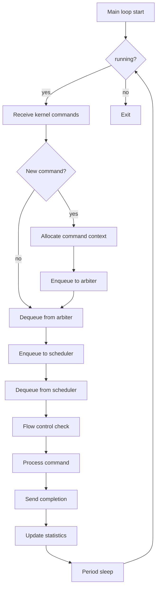
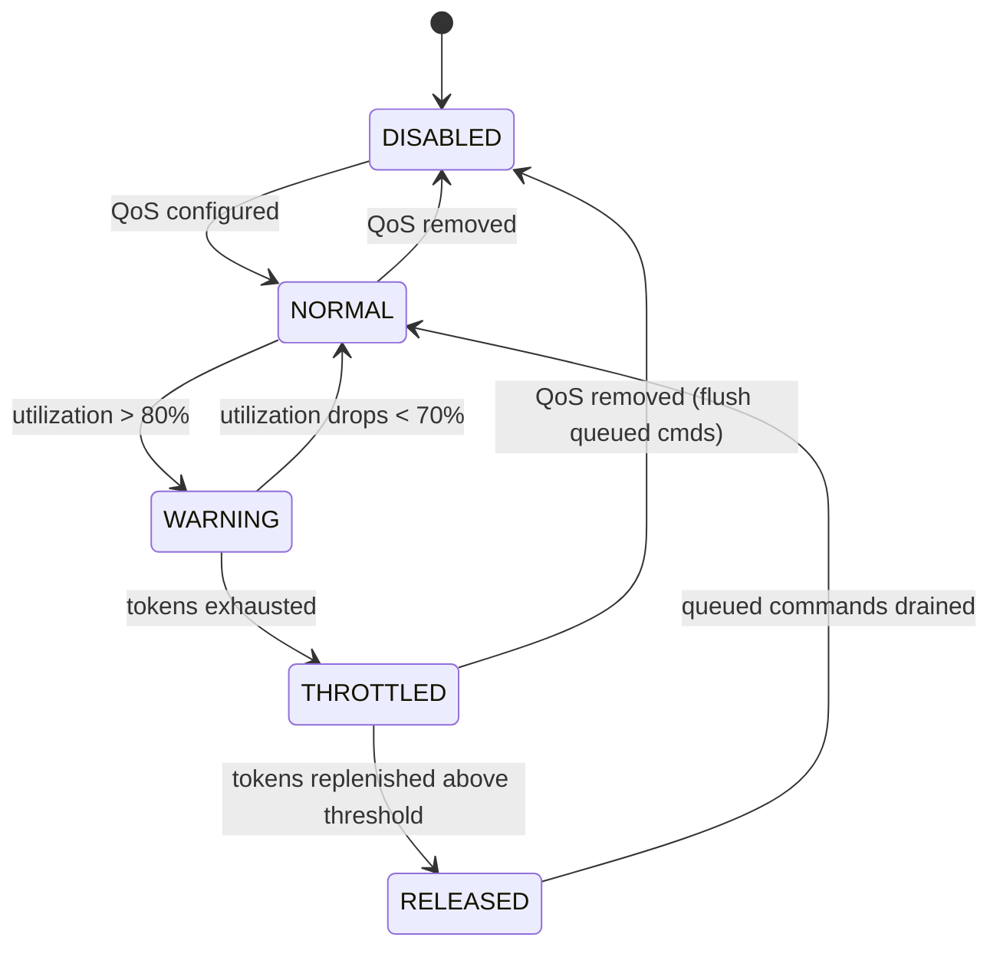
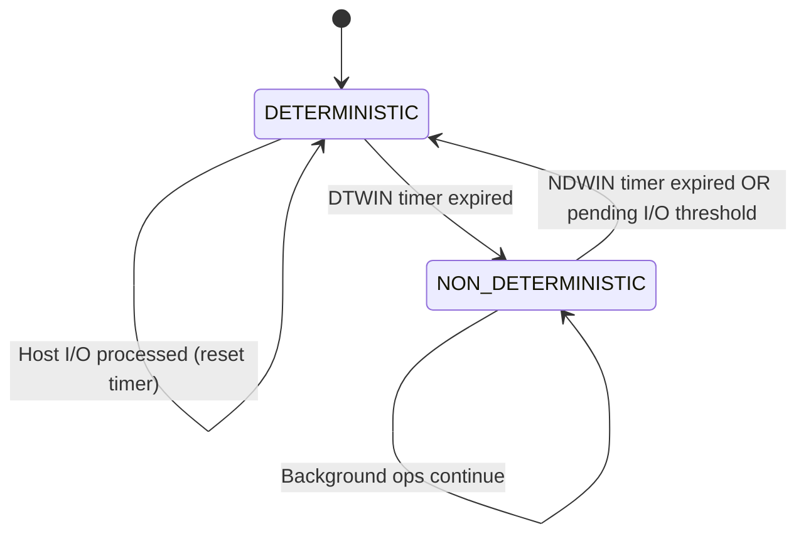
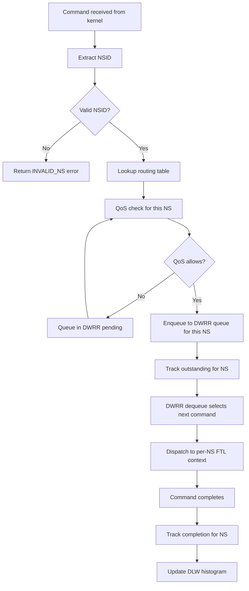

# High-Fidelity Full-Stack SSD Simulator (HFSSS) Low-Level Design Document

**Document Name**: Controller Thread Module Low-Level Design
**Document Version**: V2.0
**Creation Date**: 2026-03-08
**Design Phase**: V2.0 (Enterprise Extended)
**Classification**: Internal

---

## Revision History

| Version | Date | Author | Description |
|---------|------|--------|-------------|
| V0.1 | 2026-03-08 | Architecture Team | Initial draft |
| V1.0 | 2026-03-08 | Architecture Team | Official release |
| V2.0 | 2026-03-23 | Architecture Team | English translation with enterprise SSD extensions (DWRR, per-NS QoS, deterministic latency, multi-NS dispatch) |

---

## Table of Contents

1. [Overview](#1-overview)
2. [Requirements Traceability](#2-requirements-traceability)
3. [Data Structure Detailed Design](#3-data-structure-detailed-design)
4. [Header File Design](#4-header-file-design)
5. [Function Interface Detailed Design](#5-function-interface-detailed-design)
6. [Module Internal Logic Detailed Design](#6-module-internal-logic-detailed-design)
7. [Flowcharts](#7-flowcharts)
8. [Debug Mechanism Design](#8-debug-mechanism-design)
9. [Test Case Design](#9-test-case-design)
10. [DWRR Scheduler Detailed Data Structures](#10-dwrr-scheduler-detailed-data-structures)
11. [Per-Namespace QoS Enforcement State Machines](#11-per-namespace-qos-enforcement-state-machines)
12. [Deterministic Latency Window Implementation](#12-deterministic-latency-window-implementation)
13. [Multi-Namespace Command Dispatch](#13-multi-namespace-command-dispatch)
14. [Architecture Decision Records](#14-architecture-decision-records)
15. [Memory Budget Analysis](#15-memory-budget-analysis)
16. [Latency Budget Analysis](#16-latency-budget-analysis)
17. [References](#17-references)
18. [Appendix: Cross-References to HLD](#appendix-cross-references-to-hld)

---

## 1. Overview

### 1.1 Module Positioning and Responsibilities

The Controller Thread Module is the core scheduling unit of the user-space daemon. It is responsible for receiving NVMe commands from the kernel module, performing arbitration and scheduling, dispatching commands to the various algorithm task layers, and ultimately coordinating command completion.

### 1.2 Relationships with Other Modules

- **Upstream**: Communicates with the kernel module via shared memory Ring Buffer
- **Downstream**: Communicates with FTL layer, HAL layer, and media layer via message queues
- **Parallel**: Collaborates with the Common Platform Layer using RTOS primitives

### 1.3 Design Constraints and Assumptions

- Scheduling period: 10us - 1ms configurable
- Maximum queue depth: 65535
- Maximum concurrent commands: 65536
- Supported scheduling policies: FIFO, Greedy, Deadline

### 1.4 Terminology

| Term | Definition |
|------|-----------|
| DWRR | Deficit Weighted Round Robin scheduler |
| QoS | Quality of Service |
| NS | Namespace |
| NSID | Namespace Identifier |
| DLW | Deterministic Latency Window |
| WAF | Write Amplification Factor |
| SLA | Service Level Agreement |
| WRR | Weighted Round Robin |

---

## 2. Requirements Traceability

### 2.1 Requirements Traceability Matrix

| REQ-ID | Requirement Description | Priority | Implementation | Test Case |
|--------|------------------------|----------|---------------|-----------|
| FR-CTRL-001 | Shared memory Ring Buffer reception | P0 | ring_buffer_rx function | UT_CTRL_002 |
| FR-CTRL-002 | Command arbiter | P0 | cmd_arbitrate function | UT_CTRL_003 |
| FR-CTRL-003 | I/O scheduler | P0 | io_schedule function | UT_CTRL_004, UT_CTRL_005 |
| FR-CTRL-004 | Write Buffer management | P0 | write_buffer module | UT_CTRL_006 |
| FR-CTRL-005 | Read cache management | P0 | read_cache module | UT_CTRL_007 |
| FR-CTRL-006 | Channel load balancing | P1 | channel_balance function | IT_CTRL_003 |
| FR-CTRL-007 | Resource manager | P1 | resource_mgr module | IT_CTRL_002 |
| FR-CTRL-008 | Flow control | P2 | flow_control module | IT_CTRL_002 |
| FR-CTRL-009 | DWRR scheduling | P1 | dwrr_scheduler module | UT_DWRR_001-004 |
| FR-CTRL-010 | Per-NS QoS enforcement | P1 | ns_qos_enforcer module | UT_QOS_001-005 |
| FR-CTRL-011 | Deterministic latency windows | P1 | dlw_manager module | UT_DLW_001-004 |
| FR-CTRL-012 | Multi-namespace dispatch | P1 | ns_dispatch module | UT_NSDISP_001-003 |

---

## 3. Data Structure Detailed Design

### 3.1 Shared Memory Ring Buffer Data Structure

```c
#ifndef __HFSSS_SHMEM_IF_H
#define __HFSSS_SHMEM_IF_H

#include <stdint.h>
#include <stdatomic.h>
#include <stdbool.h>

#define RING_BUFFER_SLOTS 16384
#define CMD_SLOT_SIZE 128
#define DATA_BUFFER_SIZE (128 * 1024 * 1024)

/* Command Type */
enum cmd_type {
    CMD_NVME_ADMIN = 0,
    CMD_NVME_IO = 1,
    CMD_CONTROL = 2,
};

/* NVMe Command (from kernel) */
struct nvme_cmd_from_kern {
    uint32_t cmd_type;
    uint32_t cmd_id;
    uint32_t sqid;
    uint32_t cqid;
    uint64_t prp1;
    uint64_t prp2;
    uint32_t cdw0_15[16];
    uint32_t data_len;
    uint32_t flags;
    uint64_t metadata;
};

/* Completion (to kernel) */
struct nvme_cpl_to_kern {
    uint32_t cmd_id;
    uint16_t sqid;
    uint16_t cqid;
    uint16_t sqhd;
    uint16_t cid;
    uint32_t status;
    uint32_t cdw0;
};

/* Ring Buffer Slot */
struct ring_slot {
    struct nvme_cmd_from_kern cmd;
    atomic_uint ready;
    atomic_uint done;
};

/* Ring Buffer Header */
struct ring_header {
    atomic_uint prod_idx;
    atomic_uint cons_idx;
    uint32_t slot_count;
    uint32_t slot_size;
    uint64_t prod_seq;
    uint64_t cons_seq;
};

/* Shared Memory Layout */
struct shmem_layout {
    struct ring_header header;
    struct ring_slot slots[RING_BUFFER_SLOTS];
    uint8_t data_buffer[DATA_BUFFER_SIZE];
};

#endif /* __HFSSS_SHMEM_IF_H */
```

### 3.2 Command Arbiter Data Structure

```c
#ifndef __HFSSS_ARBITER_H
#define __HFSSS_ARBITER_H

#include <stdint.h>
#include <stdbool.h>
#include "shmem_if.h"

/* Command Priority */
enum cmd_priority {
    PRIO_ADMIN_HIGH = 0,
    PRIO_IO_URGENT = 1,
    PRIO_IO_HIGH = 2,
    PRIO_IO_NORMAL = 3,
    PRIO_IO_LOW = 4,
    PRIO_MAX = 5,
};

/* Command State */
enum cmd_state {
    CMD_STATE_FREE = 0,
    CMD_STATE_RECEIVED = 1,
    CMD_STATE_ARBITRATED = 2,
    CMD_STATE_SCHEDULED = 3,
    CMD_STATE_IN_FLIGHT = 4,
    CMD_STATE_COMPLETED = 5,
    CMD_STATE_ERROR = 6,
};

/* Command Context */
struct cmd_context {
    uint64_t cmd_id;
    enum cmd_type type;
    enum cmd_priority priority;
    enum cmd_state state;
    uint64_t timestamp;
    uint64_t deadline;
    struct nvme_cmd_from_kern kern_cmd;
    void *user_data;
    struct cmd_context *next;
    struct cmd_context *prev;
};

/* Priority Queue */
struct priority_queue {
    struct cmd_context *head;
    struct cmd_context *tail;
    uint32_t count;
    spinlock_t lock;
};

/* Arbiter Context */
struct arbiter_ctx {
    struct priority_queue queues[PRIO_MAX];
    uint32_t total_cmds;
    uint32_t max_cmds;
    struct cmd_context *cmd_pool;
    uint32_t pool_size;
    spinlock_t lock;
};

#endif /* __HFSSS_ARBITER_H */
```

### 3.3 I/O Scheduler Data Structure

```c
#ifndef __HFSSS_SCHEDULER_H
#define __HFSSS_SCHEDULER_H

#include <stdint.h>
#include <stdbool.h>
#include "arbiter.h"

/* Scheduling Policy */
enum sched_policy {
    SCHED_FIFO = 0,
    SCHED_GREEDY = 1,
    SCHED_DEADLINE = 2,
    SCHED_WRR = 3,
};

/* FIFO Scheduler */
struct sched_fifo {
    struct cmd_context *head;
    struct cmd_context *tail;
    uint32_t count;
};

/* Greedy Scheduler (LBA ordered) */
struct sched_greedy {
    struct cmd_context *tree_root;
    uint32_t count;
};

/* Deadline Scheduler */
struct sched_deadline {
    struct cmd_context *read_queue;
    struct cmd_context *write_queue;
    uint32_t read_count;
    uint32_t write_count;
    uint32_t read_batch;
    uint32_t write_batch;
};

/* Scheduler Context */
struct scheduler_ctx {
    enum sched_policy policy;
    union {
        struct sched_fifo fifo;
        struct sched_greedy greedy;
        struct sched_deadline deadline;
    } u;
    uint64_t last_sched_ts;
    uint64_t sched_period_ns;
    spinlock_t lock;
};

#endif /* __HFSSS_SCHEDULER_H */
```

### 3.4 Write Buffer Management Data Structure

```c
#ifndef __HFSSS_WRITE_BUFFER_H
#define __HFSSS_WRITE_BUFFER_H

#include <stdint.h>
#include <stdbool.h>

#define WB_MAX_ENTRIES 65536
#define WB_ENTRY_SIZE 4096
#define WB_TOTAL_SIZE (WB_MAX_ENTRIES * WB_ENTRY_SIZE)

/* Write Buffer Entry State */
enum wb_entry_state {
    WB_FREE = 0,
    WB_ALLOCATED = 1,
    WB_DIRTY = 2,
    WB_FLUSHING = 3,
    WB_FLUSHED = 4,
};

/* Write Buffer Entry */
struct wb_entry {
    uint64_t lba;
    uint32_t len;
    enum wb_entry_state state;
    uint64_t timestamp;
    uint32_t refcount;
    void *data;
    struct wb_entry *next;
    struct wb_entry *prev;
    struct hlist_node hash_node;
};

/* Write Buffer Context */
struct write_buffer_ctx {
    struct wb_entry *entries;
    uint8_t *data_pool;
    uint32_t entry_count;
    uint32_t free_count;
    uint32_t dirty_count;
    struct wb_entry *free_list;
    struct wb_entry *dirty_list;
    struct hlist_head *hash_table;
    uint32_t hash_buckets;
    uint64_t flush_threshold;
    uint64_t flush_interval_ns;
    uint64_t last_flush_ts;
    spinlock_t lock;
};

#endif /* __HFSSS_WRITE_BUFFER_H */
```

### 3.5 Read Cache (LRU) Data Structure

```c
#ifndef __HFSSS_READ_CACHE_H
#define __HFSSS_READ_CACHE_H

#include <stdint.h>
#include <stdbool.h>

#define RC_MAX_ENTRIES 131072
#define RC_ENTRY_SIZE 4096
#define RC_TOTAL_SIZE (RC_MAX_ENTRIES * RC_ENTRY_SIZE)

/* Read Cache Entry */
struct rc_entry {
    uint64_t lba;
    uint32_t len;
    uint64_t timestamp;
    uint32_t hit_count;
    void *data;
    struct rc_entry *next;
    struct rc_entry *prev;
    struct hlist_node hash_node;
};

/* Read Cache Context (LRU) */
struct read_cache_ctx {
    struct rc_entry *entries;
    uint8_t *data_pool;
    uint32_t entry_count;
    uint32_t used_count;
    struct rc_entry *lru_head;
    struct rc_entry *lru_tail;
    struct hlist_head *hash_table;
    uint32_t hash_buckets;
    uint64_t hit_count;
    uint64_t miss_count;
    spinlock_t lock;
};

#endif /* __HFSSS_READ_CACHE_H */
```

### 3.6 Channel Load Balancing Data Structure

```c
#ifndef __HFSSS_CHANNEL_H
#define __HFSSS_CHANNEL_H

#include <stdint.h>
#include <stdbool.h>

#define MAX_CHANNELS 32
#define MAX_CHIPS_PER_CHANNEL 8
#define MAX_DIES_PER_CHIP 4

/* Channel State */
enum channel_state {
    CHANNEL_IDLE = 0,
    CHANNEL_BUSY = 1,
    CHANNEL_ERROR = 2,
};

/* Channel Statistics */
struct channel_stats {
    uint64_t cmd_count;
    uint64_t read_count;
    uint64_t write_count;
    uint64_t busy_time_ns;
    uint64_t idle_time_ns;
};

/* Channel Context */
struct channel_ctx {
    uint32_t channel_id;
    enum channel_state state;
    uint32_t chip_count;
    uint32_t die_count;
    uint64_t next_available_ts;
    struct channel_stats stats;
    void *private_data;
};

/* Channel Manager */
struct channel_mgr {
    struct channel_ctx channels[MAX_CHANNELS];
    uint32_t channel_count;
    uint64_t total_busy_time;
    uint64_t last_balance_ts;
    uint64_t balance_interval_ns;
    spinlock_t lock;
};

#endif /* __HFSSS_CHANNEL_H */
```

### 3.7 Resource Manager Data Structure

```c
#ifndef __HFSSS_RESOURCE_H
#define __HFSSS_RESOURCE_H

#include <stdint.h>
#include <stdbool.h>

/* Resource Type */
enum resource_type {
    RESOURCE_CMD_SLOT = 0,
    RESOURCE_DATA_BUFFER = 1,
    RESOURCE_DMA_DESC = 2,
    RESOURCE_MEDIA_CMD = 3,
    RESOURCE_MAX = 4,
};

/* Resource Pool */
struct resource_pool {
    enum resource_type type;
    uint32_t total;
    uint32_t used;
    uint32_t free;
    void **free_list;
    spinlock_t lock;
};

/* Resource Manager */
struct resource_mgr {
    struct resource_pool pools[RESOURCE_MAX];
    uint64_t alloc_count[RESOURCE_MAX];
    uint64_t free_count[RESOURCE_MAX];
    spinlock_t lock;
};

#endif /* __HFSSS_RESOURCE_H */
```

### 3.8 Flow Control (Token Bucket) Data Structure

```c
#ifndef __HFSSS_FLOW_CONTROL_H
#define __HFSSS_FLOW_CONTROL_H

#include <stdint.h>
#include <stdbool.h>

/* Flow Type */
enum flow_type {
    FLOW_READ = 0,
    FLOW_WRITE = 1,
    FLOW_ADMIN = 2,
    FLOW_MAX = 3,
};

/* Token Bucket */
struct token_bucket {
    uint64_t tokens;
    uint64_t max_tokens;
    uint64_t rate;
    uint64_t last_refill_ts;
    spinlock_t lock;
};

/* Flow Control Context */
struct flow_ctrl_ctx {
    struct token_bucket buckets[FLOW_MAX];
    bool enabled;
    uint64_t total_allowed[FLOW_MAX];
    uint64_t total_throttled[FLOW_MAX];
};

#endif /* __HFSSS_FLOW_CONTROL_H */
```

---

## 4. Header File Design

### 4.1 Public Header File: controller.h

```c
#ifndef __HFSSS_CONTROLLER_H
#define __HFSSS_CONTROLLER_H

#include <stdint.h>
#include <stdbool.h>
#include "shmem_if.h"
#include "arbiter.h"
#include "scheduler.h"
#include "write_buffer.h"
#include "read_cache.h"
#include "channel.h"
#include "resource.h"
#include "flow_control.h"

/* Controller Configuration */
struct controller_config {
    uint64_t sched_period_ns;
    uint32_t max_concurrent_cmds;
    enum sched_policy sched_policy;
    uint32_t wb_max_entries;
    uint32_t rc_max_entries;
    uint32_t channel_count;
    bool flow_ctrl_enabled;
    uint64_t read_rate_limit;
    uint64_t write_rate_limit;
};

/* Controller Context */
struct controller_ctx {
    struct controller_config config;
    struct shmem_layout *shmem;
    int shmem_fd;
    int eventfd_kern;
    int eventfd_user;

    struct arbiter_ctx arbiter;
    struct scheduler_ctx scheduler;
    struct write_buffer_ctx wb;
    struct read_cache_ctx rc;
    struct channel_mgr channel_mgr;
    struct resource_mgr resource_mgr;
    struct flow_ctrl_ctx flow_ctrl;

    pthread_t thread;
    bool running;
    uint64_t loop_count;
    uint64_t last_loop_ts;

    void *ftl_ctx;
    void *hal_ctx;
};

/* Function Prototypes */
int controller_init(struct controller_ctx *ctx, struct controller_config *config);
void controller_cleanup(struct controller_ctx *ctx);
int controller_start(struct controller_ctx *ctx);
void controller_stop(struct controller_ctx *ctx);

#endif /* __HFSSS_CONTROLLER_H */
```

### 4.2 Internal Header File: controller_internal.h

```c
#ifndef __HFSSS_CONTROLLER_INTERNAL_H
#define __HFSSS_CONTROLLER_INTERNAL_H

#include "controller.h"

/* Shared Memory Functions */
int shmem_if_init(struct controller_ctx *ctx);
void shmem_if_cleanup(struct controller_ctx *ctx);
int shmem_if_receive_cmd(struct controller_ctx *ctx, struct nvme_cmd_from_kern *cmd);
int shmem_if_send_cpl(struct controller_ctx *ctx, struct nvme_cpl_to_kern *cpl);

/* Arbiter Functions */
int arbiter_init(struct arbiter_ctx *ctx, uint32_t max_cmds);
void arbiter_cleanup(struct arbiter_ctx *ctx);
struct cmd_context *arbiter_alloc_cmd(struct arbiter_ctx *ctx);
void arbiter_free_cmd(struct arbiter_ctx *ctx, struct cmd_context *cmd);
int arbiter_enqueue(struct arbiter_ctx *ctx, struct cmd_context *cmd);
struct cmd_context *arbiter_dequeue(struct arbiter_ctx *ctx);

/* Scheduler Functions */
int scheduler_init(struct scheduler_ctx *ctx, enum sched_policy policy);
void scheduler_cleanup(struct scheduler_ctx *ctx);
int scheduler_enqueue(struct scheduler_ctx *ctx, struct cmd_context *cmd);
struct cmd_context *scheduler_dequeue(struct scheduler_ctx *ctx);
int scheduler_set_policy(struct scheduler_ctx *ctx, enum sched_policy policy);

/* Write Buffer Functions */
int wb_init(struct write_buffer_ctx *ctx, uint32_t max_entries);
void wb_cleanup(struct write_buffer_ctx *ctx);
struct wb_entry *wb_alloc(struct write_buffer_ctx *ctx, uint64_t lba, uint32_t len);
void wb_free(struct write_buffer_ctx *ctx, struct wb_entry *entry);
int wb_write(struct write_buffer_ctx *ctx, uint64_t lba, uint32_t len, void *data);
int wb_read(struct write_buffer_ctx *ctx, uint64_t lba, uint32_t len, void *data);
int wb_flush(struct write_buffer_ctx *ctx);
bool wb_lookup(struct write_buffer_ctx *ctx, uint64_t lba);

/* Read Cache Functions */
int rc_init(struct read_cache_ctx *ctx, uint32_t max_entries);
void rc_cleanup(struct read_cache_ctx *ctx);
int rc_insert(struct read_cache_ctx *ctx, uint64_t lba, uint32_t len, void *data);
int rc_lookup(struct read_cache_ctx *ctx, uint64_t lba, uint32_t len, void *data);
void rc_invalidate(struct read_cache_ctx *ctx, uint64_t lba, uint32_t len);
void rc_clear(struct read_cache_ctx *ctx);

/* Channel Manager Functions */
int channel_mgr_init(struct channel_mgr *mgr, uint32_t channel_count);
void channel_mgr_cleanup(struct channel_mgr *mgr);
int channel_mgr_select(struct channel_mgr *mgr, uint64_t lba);
int channel_mgr_balance(struct channel_mgr *mgr);

/* Resource Manager Functions */
int resource_mgr_init(struct resource_mgr *mgr);
void resource_mgr_cleanup(struct resource_mgr *mgr);
void *resource_alloc(struct resource_mgr *mgr, enum resource_type type);
void resource_free(struct resource_mgr *mgr, enum resource_type type, void *ptr);

/* Flow Control Functions */
int flow_ctrl_init(struct flow_ctrl_ctx *ctx);
void flow_ctrl_cleanup(struct flow_ctrl_ctx *ctx);
bool flow_ctrl_check(struct flow_ctrl_ctx *ctx, enum flow_type type, uint64_t tokens);
void flow_ctrl_refill(struct flow_ctrl_ctx *ctx);

/* Command Processing Functions */
int process_admin_cmd(struct controller_ctx *ctx, struct cmd_context *cmd);
int process_io_cmd(struct controller_ctx *ctx, struct cmd_context *cmd);
int complete_cmd(struct controller_ctx *ctx, struct cmd_context *cmd, uint32_t status);

/* Main Loop */
void *controller_main_loop(void *arg);

#endif /* __HFSSS_CONTROLLER_INTERNAL_H */
```

---

## 5. Function Interface Detailed Design

### 5.1 Controller Initialization Function

#### Function: controller_init

**Declaration**:
```c
int controller_init(struct controller_ctx *ctx, struct controller_config *config);
```

**Parameter Description**:
- ctx: Controller context
- config: Configuration parameters

**Return Values**:
- 0: Success
- -ENOMEM: Memory allocation failure

---

### 5.2 Shared Memory Interface Functions

#### Function: shmem_if_receive_cmd

**Declaration**:
```c
int shmem_if_receive_cmd(struct controller_ctx *ctx, struct nvme_cmd_from_kern *cmd);
```

**Parameter Description**:
- ctx: Controller context
- cmd: Output command

**Return Values**:
- 0: Command received successfully
- -EAGAIN: No new command available

---

### 5.3 Arbiter Functions

#### Function: arbiter_enqueue

**Declaration**:
```c
int arbiter_enqueue(struct arbiter_ctx *ctx, struct cmd_context *cmd);
```

**Parameter Description**:
- ctx: Arbiter context
- cmd: Command context

**Return Values**:
- 0: Success

---

### 5.4 Scheduler Functions

#### Function: scheduler_dequeue

**Declaration**:
```c
struct cmd_context *scheduler_dequeue(struct scheduler_ctx *ctx);
```

**Parameter Description**:
- ctx: Scheduler context

**Return Values**:
- Command context pointer, or NULL if no command available

---

### 5.5 Write Buffer Functions

#### Function: wb_write

**Declaration**:
```c
int wb_write(struct write_buffer_ctx *ctx, uint64_t lba, uint32_t len, void *data);
```

**Parameter Description**:
- ctx: Write Buffer context
- lba: Starting LBA
- len: Length (bytes)
- data: Data pointer

**Return Values**:
- 0: Success

---

### 5.6 Read Cache Functions

#### Function: rc_lookup

**Declaration**:
```c
int rc_lookup(struct read_cache_ctx *ctx, uint64_t lba, uint32_t len, void *data);
```

**Parameter Description**:
- ctx: Read cache context
- lba: Starting LBA
- len: Length
- data: Output data buffer

**Return Values**:
- 0: Cache hit
- -ENOENT: Cache miss

---

## 6. Module Internal Logic Detailed Design

### 6.1 Command State Machine

**State Definitions**:
- FREE: Idle
- RECEIVED: Received from kernel
- ARBITRATED: Arbitration complete
- SCHEDULED: Scheduling complete
- IN_FLIGHT: Processing in progress
- COMPLETED: Processing finished successfully
- ERROR: Processing failed

**State Transition Table**:
```
FREE -> RECEIVED: Received from kernel
RECEIVED -> ARBITRATED: Arbitration complete
ARBITRATED -> SCHEDULED: Scheduling complete
SCHEDULED -> IN_FLIGHT: Processing begins
IN_FLIGHT -> COMPLETED: Processing succeeds
IN_FLIGHT -> ERROR: Processing fails
COMPLETED -> FREE: Released
ERROR -> FREE: Released
```

### 6.2 Scheduling Period Design

- **Main loop period**: 10us (configurable)
- **Scheduling point**: Every period
- **Load balancing period**: 10ms
- **Write Buffer flush period**: 100ms

### 6.3 Concurrency Control

- **Arbiter**: spinlock
- **Scheduler**: spinlock
- **Write Buffer**: spinlock
- **Read Cache**: spinlock

---

## 7. Flowcharts

### 7.1 Main Loop Flowchart



---

## 8. Debug Mechanism Design

### 8.1 Trace Points

| Trace Point | Description |
|-------------|-------------|
| TRACE_CTRL_LOOP | Main loop |
| TRACE_CTRL_CMD_RX | Command receive |
| TRACE_CTRL_ARBITER | Arbitration |
| TRACE_CTRL_SCHED | Scheduling |
| TRACE_CTRL_CMD_DONE | Command completion |

### 8.2 Statistics Counters

| Counter | Description |
|---------|-------------|
| stat_loop_count | Loop iteration count |
| stat_cmd_rx_count | Received command count |
| stat_cmd_done_count | Completed command count |
| stat_wb_hit_count | Write Buffer hit count |
| stat_rc_hit_count | Read Cache hit count |
| stat_rc_miss_count | Read Cache miss count |

---

## 9. Test Case Design

### 9.1 Unit Tests

| ID | Test Item | Expected Result |
|----|----------|----------------|
| UT_CTRL_001 | Controller initialization | Success |
| UT_CTRL_002 | Command reception | Successful reception |
| UT_CTRL_003 | Command arbitration | Correct priority ordering |
| UT_CTRL_004 | FIFO scheduling | FIFO order maintained |
| UT_CTRL_005 | Greedy scheduling | LBA-ordered output |
| UT_CTRL_006 | Write Buffer write | Write succeeds |
| UT_CTRL_007 | Read Cache hit | Cache hit returns data |

### 9.2 Integration Tests

| ID | Test Item | Expected Result |
|----|----------|----------------|
| IT_CTRL_001 | Complete command flow | Successful completion |
| IT_CTRL_002 | High QD stress | System remains stable |
| IT_CTRL_003 | Mixed read/write workload | Stable performance |

---

## 10. DWRR Scheduler Detailed Data Structures

### 10.1 Overview

The Deficit Weighted Round Robin (DWRR) scheduler provides fair bandwidth allocation across multiple namespaces or priority classes. Unlike simple WRR, DWRR handles variable-size requests by tracking deficit counters, ensuring that namespaces consuming less than their quantum in one round carry the surplus forward.

### 10.2 Data Structures

```c
#ifndef __HFSSS_DWRR_H
#define __HFSSS_DWRR_H

#include <stdint.h>
#include <stdbool.h>
#include "arbiter.h"

#define DWRR_MAX_QUEUES      32    /* One per namespace */
#define DWRR_DEFAULT_QUANTUM 16    /* Default quantum in 4KB units */
#define DWRR_MIN_QUANTUM     1
#define DWRR_MAX_QUANTUM     256

/*
 * DWRR Queue: one per namespace (or priority class).
 * Each queue tracks a deficit counter that accumulates
 * unused quantum from previous rounds.
 */
struct dwrr_queue {
    uint32_t          queue_id;       /* Namespace ID or priority class */
    uint32_t          weight;         /* Relative weight (1-100) */
    uint32_t          quantum;        /* Bytes (in 4KB units) granted per round */
    int64_t           deficit;        /* Deficit counter (may go negative temporarily) */
    uint32_t          pending_cmds;   /* Number of commands waiting */
    uint64_t          bytes_served;   /* Total bytes served (lifetime) */
    uint64_t          cmds_served;    /* Total commands served (lifetime) */
    struct cmd_context *head;         /* Command queue head */
    struct cmd_context *tail;         /* Command queue tail */
    bool              active;         /* Whether this queue is in the active list */
    struct dwrr_queue *next_active;   /* Next queue in active round-robin list */
};

/*
 * DWRR Scheduler Context.
 * Maintains a circular linked list of active queues.
 */
struct dwrr_scheduler {
    struct dwrr_queue  queues[DWRR_MAX_QUEUES];
    uint32_t           num_queues;
    struct dwrr_queue *current;       /* Current queue being served */
    struct dwrr_queue *active_head;   /* Head of active queue circular list */
    uint32_t           total_weight;  /* Sum of all active queue weights */
    uint32_t           base_quantum;  /* Base quantum (4KB units) for weight=1 */
    uint64_t           round_count;   /* Number of complete rounds */
    spinlock_t         lock;

    /* Statistics */
    uint64_t           total_served;
    uint64_t           total_starvation_events; /* Queue starved for > threshold */
    uint64_t           starvation_threshold_ns; /* Configurable threshold */
};

#endif /* __HFSSS_DWRR_H */
```

### 10.3 Quantum Calculation Algorithm

The quantum for each queue is calculated based on its weight relative to the total weight of all active queues:

```
quantum[i] = base_quantum * weight[i]
```

Where:
- `base_quantum` is the minimum scheduling unit (default: 16 x 4KB = 64KB)
- `weight[i]` is the relative weight assigned to queue i (range: 1-100)
- The quantum represents how many 4KB units a queue may consume per round

```c
/*
 * Recalculate quantum for all active queues.
 * Called when a queue is added/removed or weights change.
 */
static void dwrr_recalculate_quantum(struct dwrr_scheduler *sched)
{
    sched->total_weight = 0;
    for (uint32_t i = 0; i < sched->num_queues; i++) {
        if (sched->queues[i].active) {
            sched->total_weight += sched->queues[i].weight;
        }
    }

    for (uint32_t i = 0; i < sched->num_queues; i++) {
        if (sched->queues[i].active) {
            sched->queues[i].quantum =
                sched->base_quantum * sched->queues[i].weight;
            /* Clamp to valid range */
            if (sched->queues[i].quantum < DWRR_MIN_QUANTUM)
                sched->queues[i].quantum = DWRR_MIN_QUANTUM;
            if (sched->queues[i].quantum > DWRR_MAX_QUANTUM)
                sched->queues[i].quantum = DWRR_MAX_QUANTUM;
        }
    }
}
```

### 10.4 DWRR Dequeue Algorithm

```c
/*
 * DWRR dequeue: select next command to dispatch.
 *
 * Algorithm:
 * 1. Start at current queue in the active list.
 * 2. Add quantum to deficit counter.
 * 3. If head command's size <= deficit:
 *    - Dequeue command, subtract its size from deficit.
 *    - Return command.
 * 4. If deficit < head command's size:
 *    - Move to next active queue.
 * 5. If queue is empty:
 *    - Reset deficit to 0.
 *    - Remove from active list.
 *    - Move to next active queue.
 * 6. Repeat until a command is found or all queues checked.
 */
struct cmd_context *dwrr_dequeue(struct dwrr_scheduler *sched)
{
    struct dwrr_queue *start = sched->current;
    if (!start) return NULL;

    struct dwrr_queue *q = start;
    do {
        if (q->pending_cmds == 0) {
            /* Empty queue: reset deficit, deactivate */
            q->deficit = 0;
            q->active = false;
            q = q->next_active;
            /* Remove from active list handled separately */
            continue;
        }

        q->deficit += q->quantum;

        struct cmd_context *cmd = q->head;
        uint32_t cmd_size = (cmd->kern_cmd.data_len + 4095) / 4096; /* in 4KB units */
        if (cmd_size == 0) cmd_size = 1;

        if (q->deficit >= (int64_t)cmd_size) {
            /* Serve this command */
            q->head = cmd->next;
            if (!q->head) q->tail = NULL;
            q->pending_cmds--;
            q->deficit -= cmd_size;
            q->bytes_served += cmd_size * 4096;
            q->cmds_served++;
            sched->total_served++;

            sched->current = q->next_active;
            return cmd;
        }

        q = q->next_active;
    } while (q != start);

    return NULL; /* All queues checked, none serviceable */
}
```

### 10.5 DWRR Function Interface

```c
/* Initialize DWRR scheduler */
int dwrr_init(struct dwrr_scheduler *sched, uint32_t base_quantum);

/* Cleanup DWRR scheduler */
void dwrr_cleanup(struct dwrr_scheduler *sched);

/* Add a queue (namespace) with given weight */
int dwrr_add_queue(struct dwrr_scheduler *sched, uint32_t queue_id, uint32_t weight);

/* Remove a queue */
int dwrr_remove_queue(struct dwrr_scheduler *sched, uint32_t queue_id);

/* Update queue weight */
int dwrr_set_weight(struct dwrr_scheduler *sched, uint32_t queue_id, uint32_t weight);

/* Enqueue a command to a specific queue */
int dwrr_enqueue(struct dwrr_scheduler *sched, uint32_t queue_id, struct cmd_context *cmd);

/* Dequeue next command (DWRR algorithm) */
struct cmd_context *dwrr_dequeue(struct dwrr_scheduler *sched);

/* Get queue statistics */
int dwrr_get_stats(struct dwrr_scheduler *sched, uint32_t queue_id,
                   uint64_t *bytes_served, uint64_t *cmds_served);
```

---

## 11. Per-Namespace QoS Enforcement State Machines

### 11.1 Overview

Each namespace can have independently configured QoS parameters including IOPS limits, bandwidth limits, and latency targets. The QoS enforcer uses token buckets for rate limiting with configurable burst allowances.

### 11.2 QoS Data Structures

```c
#ifndef __HFSSS_NS_QOS_H
#define __HFSSS_NS_QOS_H

#include <stdint.h>
#include <stdbool.h>

#define NS_QOS_MAX_NAMESPACES 32

/* QoS enforcement state */
enum qos_state {
    QOS_STATE_NORMAL    = 0,  /* Operating within limits */
    QOS_STATE_WARNING   = 1,  /* Approaching limit (>80% utilization) */
    QOS_STATE_THROTTLED = 2,  /* Rate limited, commands queued */
    QOS_STATE_RELEASED  = 3,  /* Transitioning from throttle to normal */
    QOS_STATE_DISABLED  = 4,  /* QoS not enabled for this NS */
};

/* QoS configuration per namespace */
struct ns_qos_config {
    uint32_t nsid;
    uint64_t read_iops_limit;       /* Max read IOPS (0 = unlimited) */
    uint64_t write_iops_limit;      /* Max write IOPS (0 = unlimited) */
    uint64_t read_bw_limit_mbps;    /* Max read bandwidth in MB/s */
    uint64_t write_bw_limit_mbps;   /* Max write bandwidth in MB/s */
    uint64_t latency_target_us;     /* Target P99 latency in microseconds */
    uint32_t burst_allowance;       /* Burst credits (in IOPS units) */
    uint32_t burst_refill_rate;     /* Burst credits restored per second */
};

/* Token bucket for rate limiting */
struct qos_token_bucket {
    int64_t  tokens;            /* Current token count (may be negative) */
    int64_t  max_tokens;        /* Maximum token count (bucket capacity) */
    int64_t  burst_tokens;      /* Additional burst capacity */
    uint64_t refill_rate;       /* Tokens per second */
    uint64_t last_refill_ts;    /* Timestamp of last refill */
    uint64_t refill_interval_ns;/* Refill granularity (default 1ms) */
};

/* Per-namespace QoS enforcement context */
struct ns_qos_ctx {
    uint32_t               nsid;
    enum qos_state         state;
    struct ns_qos_config   config;

    /* Token buckets */
    struct qos_token_bucket read_iops_bucket;
    struct qos_token_bucket write_iops_bucket;
    struct qos_token_bucket read_bw_bucket;
    struct qos_token_bucket write_bw_bucket;

    /* Burst tracking */
    uint32_t               burst_credits;
    uint32_t               max_burst_credits;
    uint64_t               last_burst_refill_ts;

    /* Statistics */
    uint64_t               total_throttle_count;
    uint64_t               total_throttle_time_ns;
    uint64_t               throttle_start_ts;
    uint64_t               current_read_iops;
    uint64_t               current_write_iops;
    uint64_t               current_read_bw;
    uint64_t               current_write_bw;

    /* Sliding window for IOPS/BW calculation */
    uint64_t               window_start_ts;
    uint64_t               window_read_ios;
    uint64_t               window_write_ios;
    uint64_t               window_read_bytes;
    uint64_t               window_write_bytes;

    spinlock_t             lock;
};

/* QoS Manager (manages all namespaces) */
struct qos_manager {
    struct ns_qos_ctx      ns_qos[NS_QOS_MAX_NAMESPACES];
    uint32_t               active_count;
    uint64_t               enforcement_period_ns; /* How often to check (default 100us) */
    uint64_t               last_enforcement_ts;
    spinlock_t             lock;
};

#endif /* __HFSSS_NS_QOS_H */
```

### 11.3 Token Replenishment Algorithm

```c
/*
 * Replenish tokens based on elapsed time.
 * Called periodically (every enforcement_period) and on each command check.
 *
 * tokens_to_add = refill_rate * (now - last_refill_ts) / 1e9
 * tokens = min(tokens + tokens_to_add, max_tokens + burst_tokens)
 */
static void qos_refill_tokens(struct qos_token_bucket *bucket, uint64_t now_ns)
{
    uint64_t elapsed = now_ns - bucket->last_refill_ts;
    if (elapsed < bucket->refill_interval_ns)
        return;

    int64_t new_tokens = (int64_t)((bucket->refill_rate * elapsed) / 1000000000ULL);
    bucket->tokens += new_tokens;

    int64_t cap = bucket->max_tokens + bucket->burst_tokens;
    if (bucket->tokens > cap)
        bucket->tokens = cap;

    bucket->last_refill_ts = now_ns;
}
```

### 11.4 QoS State Machine



**Transition Details**:

| From | To | Condition | Action |
|------|----|-----------|--------|
| DISABLED | NORMAL | `ns_qos_configure()` called | Initialize token buckets |
| NORMAL | WARNING | Current IOPS > 80% of limit | Log warning, begin monitoring |
| WARNING | NORMAL | Current IOPS < 70% of limit (hysteresis) | Clear warning |
| WARNING | THROTTLED | `tokens <= 0` and no burst credits | Hold commands in pending queue |
| THROTTLED | RELEASED | `tokens > release_threshold` | Begin draining pending queue |
| RELEASED | NORMAL | All pending commands dispatched | Resume normal operation |

### 11.5 QoS Check Function

```c
/*
 * Check if a command is allowed under current QoS limits.
 *
 * Returns:
 *   0: Command allowed, tokens consumed
 *  -EAGAIN: Command must wait (throttled)
 *  -ENOSPC: Burst capacity exhausted
 */
int ns_qos_check(struct ns_qos_ctx *qos, struct cmd_context *cmd, uint64_t now_ns)
{
    /* 1. Refill tokens for all buckets */
    /* 2. Determine command type (read/write) and size */
    /* 3. Check IOPS bucket: consume 1 token per I/O */
    /* 4. Check BW bucket: consume (data_len / 4096) tokens */
    /* 5. If either bucket is empty:
     *    - Check burst credits
     *    - If burst available: consume burst credit, allow
     *    - If no burst: transition to THROTTLED, return -EAGAIN
     * 6. Update sliding window statistics
     * 7. Return 0 (allowed)
     */
    return 0;
}
```

### 11.6 QoS Function Interface

```c
int qos_manager_init(struct qos_manager *mgr);
void qos_manager_cleanup(struct qos_manager *mgr);

int ns_qos_configure(struct qos_manager *mgr, const struct ns_qos_config *config);
int ns_qos_remove(struct qos_manager *mgr, uint32_t nsid);
int ns_qos_check(struct ns_qos_ctx *qos, struct cmd_context *cmd, uint64_t now_ns);
void ns_qos_complete(struct ns_qos_ctx *qos, struct cmd_context *cmd, uint64_t now_ns);
int ns_qos_get_stats(struct qos_manager *mgr, uint32_t nsid,
                     uint64_t *throttle_count, uint64_t *throttle_time_ns);
```

---

## 12. Deterministic Latency Window Implementation

### 12.1 Overview

Deterministic Latency Windows (DLW) ensure that background operations like garbage collection (GC) do not cause latency spikes beyond an acceptable threshold. The implementation inserts GC preemption points, tracks latency histograms, and maintains SLA violation counters.

### 12.2 Data Structures

```c
#ifndef __HFSSS_DLW_H
#define __HFSSS_DLW_H

#include <stdint.h>
#include <stdbool.h>

#define DLW_HISTOGRAM_BUCKETS 64
#define DLW_MAX_PREEMPTION_POINTS 16

/* Deterministic Latency Window Configuration */
struct dlw_config {
    uint64_t window_duration_us;  /* DLW window length (e.g., 100us for DTWIN) */
    uint64_t ndwin_time_us;       /* Non-Deterministic Window time */
    uint64_t dtwin_reads_max;     /* Max read operations during DTWIN */
    uint64_t dtwin_writes_max;    /* Max write operations during DTWIN */
    uint64_t dtwin_time_max_us;   /* Max time for a single DTWIN */
    uint64_t p99_target_us;       /* P99 latency target */
    uint64_t p999_target_us;      /* P99.9 latency target */
    uint64_t sla_violation_threshold; /* Violations before alert */
};

/* Latency histogram bucket */
struct latency_bucket {
    uint64_t lower_bound_us;  /* Lower bound of this bucket */
    uint64_t upper_bound_us;  /* Upper bound of this bucket */
    uint64_t count;           /* Number of I/Os in this bucket */
};

/* Latency histogram */
struct latency_histogram {
    struct latency_bucket buckets[DLW_HISTOGRAM_BUCKETS];
    uint32_t              num_buckets;
    uint64_t              total_samples;
    uint64_t              sum_latency_us;
    uint64_t              min_latency_us;
    uint64_t              max_latency_us;
    uint64_t              p50_us;   /* Cached percentile values */
    uint64_t              p90_us;
    uint64_t              p99_us;
    uint64_t              p999_us;
};

/* GC Preemption Point */
struct gc_preemption_point {
    uint64_t check_interval_us;   /* How often to check for preemption */
    uint64_t max_gc_slice_us;     /* Max continuous GC time before preemption */
    uint32_t pending_io_threshold;/* Preempt if pending I/O exceeds this */
    bool     enabled;
};

/* SLA Violation Counter */
struct sla_counter {
    uint64_t total_violations;
    uint64_t violations_this_window;
    uint64_t last_violation_ts;
    uint64_t consecutive_violations;
    uint64_t max_consecutive;
};

/* DLW Manager Context */
struct dlw_ctx {
    struct dlw_config        config;
    struct latency_histogram read_hist;
    struct latency_histogram write_hist;
    struct gc_preemption_point preempt_points[DLW_MAX_PREEMPTION_POINTS];
    uint32_t                 num_preempt_points;
    struct sla_counter       sla;

    /* Window state */
    enum {
        DLW_DETERMINISTIC = 0,   /* DTWIN: host I/O has priority */
        DLW_NON_DETERMINISTIC = 1, /* NDWIN: background ops allowed */
    } current_window;
    uint64_t                 window_start_ts;
    uint64_t                 dtwin_reads;
    uint64_t                 dtwin_writes;

    /* GC coordination */
    bool                     gc_active;
    uint64_t                 gc_start_ts;
    uint64_t                 gc_total_time_us;
    uint64_t                 gc_preempt_count;

    spinlock_t               lock;
};

#endif /* __HFSSS_DLW_H */
```

### 12.3 P99 Latency Tracking

```c
/*
 * Record a latency sample and update histogram.
 * Recalculates percentiles periodically (every 1000 samples).
 */
void dlw_record_latency(struct dlw_ctx *dlw, bool is_read, uint64_t latency_us)
{
    struct latency_histogram *hist = is_read ? &dlw->read_hist : &dlw->write_hist;

    /* Find appropriate bucket */
    for (uint32_t i = 0; i < hist->num_buckets; i++) {
        if (latency_us >= hist->buckets[i].lower_bound_us &&
            latency_us < hist->buckets[i].upper_bound_us) {
            hist->buckets[i].count++;
            break;
        }
    }

    hist->total_samples++;
    hist->sum_latency_us += latency_us;
    if (latency_us < hist->min_latency_us) hist->min_latency_us = latency_us;
    if (latency_us > hist->max_latency_us) hist->max_latency_us = latency_us;

    /* Recalculate percentiles every 1000 samples */
    if (hist->total_samples % 1000 == 0) {
        dlw_recalculate_percentiles(hist);
    }

    /* Check SLA violation */
    if (latency_us > dlw->config.p99_target_us) {
        dlw->sla.total_violations++;
        dlw->sla.violations_this_window++;
        dlw->sla.consecutive_violations++;
        if (dlw->sla.consecutive_violations > dlw->sla.max_consecutive)
            dlw->sla.max_consecutive = dlw->sla.consecutive_violations;
    } else {
        dlw->sla.consecutive_violations = 0;
    }
}

/*
 * Calculate percentile from histogram using linear interpolation.
 */
static void dlw_recalculate_percentiles(struct latency_histogram *hist)
{
    uint64_t p50_target  = hist->total_samples * 50 / 100;
    uint64_t p90_target  = hist->total_samples * 90 / 100;
    uint64_t p99_target  = hist->total_samples * 99 / 100;
    uint64_t p999_target = hist->total_samples * 999 / 1000;

    uint64_t cumulative = 0;
    for (uint32_t i = 0; i < hist->num_buckets; i++) {
        cumulative += hist->buckets[i].count;
        if (cumulative >= p50_target && hist->p50_us == 0)
            hist->p50_us = hist->buckets[i].upper_bound_us;
        if (cumulative >= p90_target && hist->p90_us == 0)
            hist->p90_us = hist->buckets[i].upper_bound_us;
        if (cumulative >= p99_target && hist->p99_us == 0)
            hist->p99_us = hist->buckets[i].upper_bound_us;
        if (cumulative >= p999_target && hist->p999_us == 0)
            hist->p999_us = hist->buckets[i].upper_bound_us;
    }
}
```

### 12.4 GC Preemption Point Insertion

```c
/*
 * Check if GC should be preempted to maintain deterministic latency.
 * Called at each GC preemption point during block migration.
 *
 * Returns true if GC should yield to host I/O.
 */
bool dlw_should_preempt_gc(struct dlw_ctx *dlw, uint64_t now_us)
{
    if (!dlw->gc_active)
        return false;

    /* Always preempt during deterministic window */
    if (dlw->current_window == DLW_DETERMINISTIC)
        return true;

    uint64_t gc_elapsed = now_us - dlw->gc_start_ts;

    /* Check if GC has exceeded its time slice */
    for (uint32_t i = 0; i < dlw->num_preempt_points; i++) {
        struct gc_preemption_point *pp = &dlw->preempt_points[i];
        if (!pp->enabled) continue;

        if (gc_elapsed > pp->max_gc_slice_us) {
            dlw->gc_preempt_count++;
            return true;
        }
    }

    return false;
}
```

### 12.5 DLW Window Transition



### 12.6 DLW Function Interface

```c
int dlw_init(struct dlw_ctx *dlw, const struct dlw_config *config);
void dlw_cleanup(struct dlw_ctx *dlw);
void dlw_record_latency(struct dlw_ctx *dlw, bool is_read, uint64_t latency_us);
bool dlw_should_preempt_gc(struct dlw_ctx *dlw, uint64_t now_us);
void dlw_gc_start(struct dlw_ctx *dlw, uint64_t now_us);
void dlw_gc_end(struct dlw_ctx *dlw, uint64_t now_us);
void dlw_window_tick(struct dlw_ctx *dlw, uint64_t now_us);
int dlw_get_percentiles(struct dlw_ctx *dlw, bool is_read,
                        uint64_t *p50, uint64_t *p90, uint64_t *p99, uint64_t *p999);
int dlw_get_sla_stats(struct dlw_ctx *dlw, uint64_t *violations, uint64_t *max_consecutive);
```

---

## 13. Multi-Namespace Command Dispatch

### 13.1 Overview

Multi-namespace support requires routing incoming NVMe commands to the correct namespace context, tracking per-NS completion independently, and ensuring fair resource allocation across namespaces.

### 13.2 Data Structures

```c
#ifndef __HFSSS_NS_DISPATCH_H
#define __HFSSS_NS_DISPATCH_H

#include <stdint.h>
#include <stdbool.h>
#include "arbiter.h"

#define NS_DISPATCH_MAX_NS 32
#define NS_DISPATCH_HASH_BUCKETS 64

/* NSID-based routing table entry */
struct ns_route_entry {
    uint32_t         nsid;
    bool             valid;
    void             *ftl_ctx;        /* Per-NS FTL context pointer */
    void             *qos_ctx;        /* Per-NS QoS context pointer */
    uint32_t         dwrr_queue_id;   /* DWRR scheduler queue for this NS */
    uint32_t         preferred_channel; /* Hint for channel affinity */
};

/* Per-namespace completion tracker */
struct ns_completion_tracker {
    uint32_t         nsid;
    uint64_t         outstanding_cmds;  /* Commands in-flight for this NS */
    uint64_t         completed_cmds;    /* Total completed for this NS */
    uint64_t         error_cmds;        /* Total errors for this NS */
    uint64_t         total_latency_ns;  /* Cumulative latency for avg calculation */
    uint64_t         last_completion_ts;
    spinlock_t       lock;
};

/* Namespace routing table */
struct ns_routing_table {
    struct ns_route_entry entries[NS_DISPATCH_MAX_NS];
    uint32_t              count;
    /* Fast lookup hash: NSID -> index */
    int16_t               hash[NS_DISPATCH_HASH_BUCKETS];
    spinlock_t            lock;
};

/* Namespace dispatch context */
struct ns_dispatch_ctx {
    struct ns_routing_table     routing;
    struct ns_completion_tracker trackers[NS_DISPATCH_MAX_NS];
    struct dwrr_scheduler       *dwrr;    /* DWRR scheduler reference */
    struct qos_manager          *qos_mgr; /* QoS manager reference */
    spinlock_t                  lock;
};

#endif /* __HFSSS_NS_DISPATCH_H */
```

### 13.3 NSID-Based Routing

```c
/*
 * Route an incoming command to the appropriate namespace context.
 *
 * 1. Extract NSID from command (cdw0_15[1] = NSID field)
 * 2. Hash NSID to find routing table entry
 * 3. Validate namespace is attached and accessible
 * 4. Return per-NS FTL context and QoS context
 */
int ns_dispatch_route(struct ns_dispatch_ctx *ctx,
                      struct cmd_context *cmd,
                      struct ns_route_entry **route)
{
    uint32_t nsid = cmd->kern_cmd.cdw0_15[1]; /* NSID from NVMe command */

    /* Hash lookup */
    uint32_t hash = nsid % NS_DISPATCH_HASH_BUCKETS;
    int16_t idx = ctx->routing.hash[hash];

    if (idx < 0 || !ctx->routing.entries[idx].valid ||
        ctx->routing.entries[idx].nsid != nsid) {
        /* Linear search fallback for hash collisions */
        for (uint32_t i = 0; i < ctx->routing.count; i++) {
            if (ctx->routing.entries[i].valid &&
                ctx->routing.entries[i].nsid == nsid) {
                *route = &ctx->routing.entries[i];
                return 0;
            }
        }
        return -EINVAL; /* Invalid NSID */
    }

    *route = &ctx->routing.entries[idx];
    return 0;
}
```

### 13.4 Per-NS Completion Tracking

```c
/*
 * Record command dispatch to a namespace (increment outstanding).
 */
void ns_dispatch_track_submit(struct ns_dispatch_ctx *ctx, uint32_t nsid)
{
    for (uint32_t i = 0; i < NS_DISPATCH_MAX_NS; i++) {
        if (ctx->trackers[i].nsid == nsid) {
            __atomic_add_fetch(&ctx->trackers[i].outstanding_cmds, 1,
                               __ATOMIC_RELAXED);
            return;
        }
    }
}

/*
 * Record command completion for a namespace.
 */
void ns_dispatch_track_complete(struct ns_dispatch_ctx *ctx, uint32_t nsid,
                                 uint64_t latency_ns, bool error)
{
    for (uint32_t i = 0; i < NS_DISPATCH_MAX_NS; i++) {
        if (ctx->trackers[i].nsid == nsid) {
            __atomic_sub_fetch(&ctx->trackers[i].outstanding_cmds, 1,
                               __ATOMIC_RELAXED);
            ctx->trackers[i].completed_cmds++;
            ctx->trackers[i].total_latency_ns += latency_ns;
            if (error) ctx->trackers[i].error_cmds++;
            return;
        }
    }
}
```

### 13.5 Dispatch Flow



### 13.6 NS Dispatch Function Interface

```c
int ns_dispatch_init(struct ns_dispatch_ctx *ctx, struct dwrr_scheduler *dwrr,
                     struct qos_manager *qos_mgr);
void ns_dispatch_cleanup(struct ns_dispatch_ctx *ctx);
int ns_dispatch_add_ns(struct ns_dispatch_ctx *ctx, uint32_t nsid,
                       void *ftl_ctx, uint32_t weight);
int ns_dispatch_remove_ns(struct ns_dispatch_ctx *ctx, uint32_t nsid);
int ns_dispatch_route(struct ns_dispatch_ctx *ctx, struct cmd_context *cmd,
                      struct ns_route_entry **route);
void ns_dispatch_track_submit(struct ns_dispatch_ctx *ctx, uint32_t nsid);
void ns_dispatch_track_complete(struct ns_dispatch_ctx *ctx, uint32_t nsid,
                                 uint64_t latency_ns, bool error);
```

---

## 14. Architecture Decision Records

### ADR-001: DWRR over Simple WRR for Multi-NS Scheduling

**Context**: Need fair scheduling across namespaces with varying I/O sizes.

**Decision**: Use Deficit Weighted Round Robin instead of simple Weighted Round Robin.

**Rationale**: Simple WRR counts commands, not bytes. A namespace issuing 4KB reads consumes the same "slot" as one issuing 128KB writes. DWRR tracks deficits in byte units, providing proportional bandwidth allocation.

**Consequences**: Slightly more complex implementation; deficit counters need careful initialization and reset on queue state changes.

### ADR-002: Token Bucket for QoS Rate Limiting

**Context**: Need per-NS rate limiting with burst tolerance.

**Decision**: Dual token bucket (IOPS + bandwidth) per namespace.

**Rationale**: Token bucket naturally supports burst allowance while enforcing long-term rate. Separate IOPS and BW buckets allow independent control of both dimensions.

### ADR-003: Histogram-Based P99 Tracking

**Context**: Need real-time P99 latency tracking for SLA enforcement.

**Decision**: Fixed-bucket histogram with periodic percentile recalculation.

**Rationale**: Exact sorting of all latency samples is too expensive. Histogram provides O(1) insertion and O(N_buckets) percentile calculation. 64 logarithmically-spaced buckets give sufficient precision for SLA monitoring.

---

## 15. Memory Budget Analysis

| Component | Per-Instance Size | Max Instances | Total |
|-----------|------------------|---------------|-------|
| shmem_layout | 128 MB (data) + 2 MB (ring) | 1 | 130 MB |
| cmd_context (pool) | 256 B | 65536 | 16 MB |
| write_buffer_ctx | 256 MB (data pool) | 1 | 256 MB |
| read_cache_ctx | 512 MB (data pool) | 1 | 512 MB |
| channel_ctx | 128 B | 32 | 4 KB |
| resource_pool | 64 B | 4 | 256 B |
| token_bucket | 48 B | 3 | 144 B |
| dwrr_queue | 96 B | 32 | 3 KB |
| ns_qos_ctx | 320 B | 32 | 10 KB |
| dlw_ctx | ~8 KB (histograms) | 1 | 8 KB |
| ns_dispatch_ctx | ~4 KB | 1 | 4 KB |
| **Total (estimated)** | | | **~914 MB** |

Note: Write buffer and read cache data pools dominate. These are configurable.

---

## 16. Latency Budget Analysis

| Operation | Target Latency | Components |
|-----------|---------------|------------|
| Ring buffer receive | < 0.5 us | Atomic read + memory copy |
| Command arbitration | < 0.2 us | Priority queue insert |
| DWRR scheduling decision | < 0.5 us | Deficit check + dequeue |
| QoS token check | < 0.2 us | Token bucket check + refill |
| Write buffer lookup (hash) | < 0.3 us | Hash lookup |
| Read cache lookup (hash) | < 0.3 us | Hash lookup + LRU update |
| Channel selection | < 0.1 us | Min-load selection |
| NS dispatch routing | < 0.2 us | Hash lookup |
| DLW latency recording | < 0.1 us | Histogram bucket update |
| **Total controller overhead** | **< 2.4 us** | |

---

## 17. References

1. Operating Systems: Three Easy Pieces
2. Linux System Programming
3. NVMe Specification 2.0
4. Deficit Round Robin: An Efficient Scheduling Algorithm (Shreedhar & Varghese, 1996)
5. Token Bucket Algorithm (RFC 2697)
6. NVMe Deterministic Latency (TP4070)

---

## Appendix: Cross-References to HLD

| HLD Section | LLD Section | Notes |
|-------------|-------------|-------|
| HLD 3.2 Controller Thread | LLD_02 Sections 3-6 | Core data structures and logic |
| HLD 3.2.1 Command Arbitration | LLD_02 Section 3.2 | Priority queues |
| HLD 3.2.2 I/O Scheduling | LLD_02 Section 3.3, Section 10 | FIFO/Greedy/Deadline + DWRR |
| HLD 3.2.3 Write Buffer | LLD_02 Section 3.4 | WB management |
| HLD 3.2.4 Read Cache | LLD_02 Section 3.5 | LRU cache |
| HLD 4.4 Multi-NS QoS | LLD_02 Section 11 | Enterprise extension |
| HLD 4.5 Deterministic Latency | LLD_02 Section 12 | Enterprise extension |
| HLD 4.6 Multi-NS Dispatch | LLD_02 Section 13 | Enterprise extension |

---

**Document Statistics**:
- Total sections: 18 (including appendix)
- Function interfaces: 60+ (base) + 25 (enterprise extensions)
- Data structures: 15+ (base) + 12 (enterprise extensions)
- Test cases: 10 (base) + 16 (enterprise extensions)
