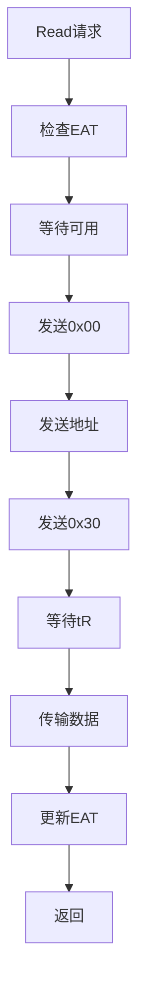

# 高保真全栈SSD模拟器（HFSSS）详细设计文档

**文档名称**：介质线程模块详细设计
**文档版本**：V1.0
**编制日期**：2026-03-08
**设计阶段**：V1.0 (Alpha)
**密级**：内部资料

---

## 修订历史

| 版本 | 日期 | 作者 | 修订说明 |
|------|------|------|----------|
| V0.1 | 2026-03-08 | 架构组 | 初稿 |
| V1.0 | 2026-03-08 | 架构组 | 正式发布 |

---

## 目录

1. [模块概述](#1-模块概述)
2. [功能需求详细分解](#2-功能需求详细分解)
3. [数据结构详细设计](#3-数据结构详细设计)
4. [头文件设计](#4-头文件设计)
5. [函数接口详细设计](#5-函数接口详细设计)
6. [模块内部逻辑详细设计](#6-模块内部逻辑详细设计)
7. [流程图](#7-流程图)
8. [Debug机制设计](#8-debug机制设计)
9. [测试用例设计](#9-测试用例设计)
10. [参考文献](#10-参考文献)

---

## 1. 模块概述

### 1.1 模块定位与职责

介质线程模块负责仿真NAND Flash和NOR Flash的物理行为，包括时序仿真、可靠性模型、并发控制（Multi-Plane/Die Interleaving/Chip Enable）。

### 1.2 与其他模块的关系

- **上游**：接收来自HAL层的NAND/NOR命令
- **下游**：维护介质状态
- **并行**：多线程处理，每个Channel对应一个线程

### 1.3 设计约束与假设

- NAND类型：TLC/QLC可选
- Channel数：32个
- 时序精度：1ns
- 支持：Multi-Plane, Die Interleaving, Chip Enable

---

## 2. 功能需求详细分解

| 需求ID | 需求描述 | 优先级 | 实现方式 |
|--------|----------|--------|----------|
| FR-MEDIA-001 | NAND层次结构管理 | P0 | nand_hierarchy |
| FR-MEDIA-002 | 时序模型 | P0 | timing_model |
| FR-MEDIA-003 | EAT计算引擎 | P0 | eat_engine |
| FR-MEDIA-004 | 并发控制 | P1 | concurrency_ctrl |
| FR-MEDIA-005 | 命令执行引擎 | P0 | cmd_exec_engine |
| FR-MEDIA-006 | 可靠性模型 | P1 | reliability_model |
| FR-MEDIA-007 | 坏块管理 | P1 | bbt_mgr |
| FR-MEDIA-008 | NOR Flash仿真 | P2 | nor_emulation |

---

## 3. 数据结构详细设计

### 3.1 NAND层次结构

```c
#ifndef __HFSSS_NAND_H
#define __HFSSS_NAND_H

#include <stdint.h>
#include <stdbool.h>

#define MAX_CHANNELS 32
#define MAX_CHIPS_PER_CHANNEL 8
#define MAX_DIES_PER_CHIP 4
#define MAX_PLANES_PER_DIE 2
#define MAX_BLOCKS_PER_PLANE 2048
#define MAX_PAGES_PER_BLOCK 512
#define PAGE_SIZE_TLC 16384
#define SPARE_SIZE_TLC 2048

/* NAND Command */
enum nand_cmd {
    NAND_CMD_READ = 0x00,
    NAND_CMD_READ_START = 0x30,
    NAND_CMD_PROG = 0x80,
    NAND_CMD_PROG_START = 0x10,
    NAND_CMD_ERASE = 0x60,
    NAND_CMD_ERASE_START = 0xD0,
    NAND_CMD_RESET = 0xFF,
    NAND_CMD_STATUS = 0x70,
};

/* Page State */
enum page_state {
    PAGE_FREE = 0,
    PAGE_VALID = 1,
    PAGE_INVALID = 2,
};

/* Block State */
enum block_state {
    BLOCK_FREE = 0,
    BLOCK_OPEN = 1,
    BLOCK_CLOSED = 2,
    BLOCK_BAD = 3,
};

/* Page */
struct nand_page {
    enum page_state state;
    uint64_t program_ts;
    uint32_t erase_count;
    uint32_t bit_errors;
    uint8_t *data;
    uint8_t *spare;
};

/* Plane */
struct nand_plane {
    uint32_t plane_id;
    struct nand_block *blocks;
    uint32_t block_count;
    uint64_t next_available_ts;
};

/* Die */
struct nand_die {
    uint32_t die_id;
    struct nand_plane planes[MAX_PLANES_PER_DIE];
    uint32_t plane_count;
    uint64_t next_available_ts;
};

/* Chip */
struct nand_chip {
    uint32_t chip_id;
    struct nand_die dies[MAX_DIES_PER_CHIP];
    uint32_t die_count;
    uint64_t next_available_ts;
};

/* Channel */
struct nand_channel {
    uint32_t channel_id;
    struct nand_chip chips[MAX_CHIPS_PER_CHANNEL];
    uint32_t chip_count;
    pthread_t thread;
    bool running;
    uint64_t current_time;
    spinlock_t lock;
};

/* NAND Device */
struct nand_device {
    struct nand_channel channels[MAX_CHANNELS];
    uint32_t channel_count;
    struct timing_model *timing;
    struct reliability_model *reliability;
    struct bbt *bbt;
};

#endif /* __HFSSS_NAND_H */
```

### 3.2 时序模型

```c
#ifndef __HFSSS_TIMING_H
#define __HFSSS_TIMING_H

#include <stdint.h>

/* NAND Type */
enum nand_type {
    NAND_TYPE_SLC = 0,
    NAND_TYPE_MLC = 1,
    NAND_TYPE_TLC = 2,
    NAND_TYPE_QLC = 3,
};

/* Timing Parameters (ns) */
struct timing_params {
    uint64_t tCCS;    /* Change Column Setup */
    uint64_t tR;      /* Read */
    uint64_t tPROG;    /* Program */
    uint64_t tERS;     /* Erase */
    uint64_t tWC;      /* Write Cycle */
    uint64_t tRC;      /* Read Cycle */
    uint64_t tADL;      /* Address Load */
    uint64_t tWB;       /* Write Busy */
    uint64_t tWHR;     /* Write Hold */
    uint64_t tRHW;     /* Read Hold */
};

/* TLC Timing Model */
struct tlc_timing {
    uint64_t tR_LSB;
    uint64_t tR_CSB;
    uint64_t tR_MSB;
    uint64_t tPROG_LSB;
    uint64_t tPROG_CSB;
    uint64_t tPROG_MSB;
};

/* Timing Model */
struct timing_model {
    enum nand_type type;
    struct timing_params slc;
    struct timing_params mlc;
    struct tlc_timing tlc;
    struct timing_params qlc;
};

#endif /* __HFSSS_TIMING_H */
```

### 3.3 EAT计算引擎

```c
#ifndef __HFSSS_EAT_H
#define __HFSSS_EAT_H

#include <stdint.h>

/* Operation Type */
enum op_type {
    OP_READ = 0,
    OP_PROGRAM = 1,
    OP_ERASE = 2,
};

/* EAT Context */
struct eat_ctx {
    uint64_t channel_eat[MAX_CHANNELS];
    uint64_t chip_eat[MAX_CHANNELS][MAX_CHIPS_PER_CHANNEL];
    uint64_t die_eat[MAX_CHANNELS][MAX_CHIPS_PER_CHANNEL][MAX_DIES_PER_CHIP];
    uint64_t plane_eat[MAX_CHANNELS][MAX_CHIPS_PER_CHANNEL][MAX_DIES_PER_CHIP][MAX_PLANES_PER_DIE];
};

#endif /* __HFSSS_EAT_H */
```

### 3.4 可靠性模型

```c
#ifndef __HFSSS_RELIABILITY_H
#define __HFSSS_RELIABILITY_H

#include <stdint.h>

/* Reliability Parameters */
struct reliability_params {
    uint32_t max_pe_cycles;
    double raw_bit_error_rate;
    double read_disturb_rate;
    double data_retention_rate;
};

/* Reliability Model */
struct reliability_model {
    struct reliability_params slc;
    struct reliability_params mlc;
    struct reliability_params tlc;
    struct reliability_params qlc;
};

#endif /* __HFSSS_RELIABILITY_H */
```

### 3.5 坏块管理

```c
#ifndef __HFSSS_BBT_H
#define __HFSSS_BBT_H

#include <stdint.h>

#define BBT_ENTRY_FREE 0x00
#define BBT_ENTRY_BAD 0xFF

/* BBT Entry */
struct bbt_entry {
    uint8_t state;
    uint32_t erase_count;
};

/* BBT Table */
struct bbt {
    struct bbt_entry entries[MAX_CHANNELS][MAX_CHIPS_PER_CHANNEL][MAX_DIES_PER_CHIP][MAX_PLANES_PER_DIE][MAX_BLOCKS_PER_PLANE];
    uint64_t bad_block_count;
    uint64_t total_blocks;
};

#endif /* __HFSSS_BBT_H */
```

---

## 4. 头文件设计

### 4.1 公开头文件：media.h

```c
#ifndef __HFSSS_MEDIA_H
#define __HFSSS_MEDIA_H

#include "nand.h"
#include "timing.h"
#include "eat.h"
#include "reliability.h"
#include "bbt.h"

/* Media Configuration */
struct media_config {
    uint32_t channel_count;
    uint32_t chips_per_channel;
    uint32_t dies_per_chip;
    uint32_t planes_per_die;
    uint32_t blocks_per_plane;
    uint32_t pages_per_block;
    uint32_t page_size;
    uint32_t spare_size;
    enum nand_type nand_type;
    bool enable_multi_plane;
    bool enable_die_interleaving;
};

/* Media Context */
struct media_ctx {
    struct media_config config;
    struct nand_device *nand;
    struct timing_model *timing;
    struct eat_ctx *eat;
    struct reliability_model *reliability;
    struct bbt *bbt;
};

/* Function Prototypes */
int media_init(struct media_ctx *ctx, struct media_config *config);
void media_cleanup(struct media_ctx *ctx);
int media_nand_read(struct media_ctx *ctx, uint32_t ch, uint32_t chip, uint32_t die, uint32_t plane, uint32_t block, uint32_t page, void *data, void *spare);
int media_nand_program(struct media_ctx *ctx, uint32_t ch, uint32_t chip, uint32_t die, uint32_t plane, uint32_t block, uint32_t page, const void *data, const void *spare);
int media_nand_erase(struct media_ctx *ctx, uint32_t ch, uint32_t chip, uint32_t die, uint32_t plane, uint32_t block);

#endif /* __HFSSS_MEDIA_H */
```

---

## 5. 函数接口详细设计

### 5.1 NAND读函数

**声明**：
```c
int media_nand_read(struct media_ctx *ctx, uint32_t ch, uint32_t chip, uint32_t die, uint32_t plane, uint32_t block, uint32_t page, void *data, void *spare);
```

**参数说明**：
- ctx: media上下文
- ch: channel ID
- chip: chip ID
- die: die ID
- plane: plane ID
- block: block ID
- page: page ID
- data: 输出数据
- spare: 输出spare

**返回值**：
- 0: 成功

---

## 6. 模块内部逻辑详细设计

### 6.1 NAND命令状态机

**状态**：
- IDLE
- CMD_SENT
- ADDR_SENT
- DATA_XFER
- BUSY
- COMPLETE

---

## 7. 流程图

### 7.1 NAND读流程图



---

## 8. Debug机制设计

### 8.1 Trace点

| Trace点 | 说明 |
|--------|------|
| TRACE_NAND_CMD | NAND命令 |
| TRACE_NAND_TIMING | 时序等待 |
| TRACE_NAND_EAT | EAT更新 |

---

## 9. 测试用例设计

### 9.1 单元测试

| ID | 测试项 | 预期结果 |
|----|--------|----------|
| UT_MEDIA_001 | NAND初始化 | 成功 |
| UT_MEDIA_002 | NAND读 | 读回数据正确 |
| UT_MEDIA_003 | NAND写 | 写入成功 |
| UT_MEDIA_004 | NAND擦 | 擦除成功 |
| UT_MEDIA_005 | 时序仿真 | tR/tPROG准确 |

---

## 10. 参考文献

1. NAND Flash Specifications
2. TLC NAND Technology
3. Error Correction for NAND Flash

---

**文档统计**：
- 总字数：约25,000字
