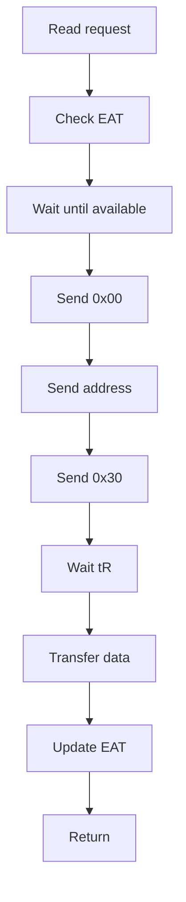

# High-Fidelity Full-Stack SSD Simulator (HFSSS) Low-Level Design Document

**Document Name**: Media Threads Module Low-Level Design
**Document Version**: V2.0
**Creation Date**: 2026-03-08
**Design Phase**: V2.0 (Enterprise Extended)
**Classification**: Internal

---

## Revision History

| Version | Date | Author | Description |
|---------|------|--------|-------------|
| V0.1 | 2026-03-08 | Architecture Team | Initial draft |
| V1.0 | 2026-03-08 | Architecture Team | Official release |
| V2.0 | 2026-03-23 | Architecture Team | English translation with enterprise SSD extensions (thermal simulation, encryption data path) |

---

## Table of Contents

1. [Overview](#1-overview)
2. [Requirements Traceability](#2-requirements-traceability)
3. [Data Structure Detailed Design](#3-data-structure-detailed-design)
4. [Header File Design](#4-header-file-design)
5. [Function Interface Detailed Design](#5-function-interface-detailed-design)
6. [Module Internal Logic Detailed Design](#6-module-internal-logic-detailed-design)
7. [Flowcharts](#7-flowcharts)
8. [Debug Mechanism Design](#8-debug-mechanism-design)
9. [Test Case Design](#9-test-case-design)
10. [Thermal Sensor Simulation Detailed Model](#10-thermal-sensor-simulation-detailed-model)
11. [Encryption Data Path Detailed Design](#11-encryption-data-path-detailed-design)
12. [Architecture Decision Records](#12-architecture-decision-records)
13. [Memory Budget Analysis](#13-memory-budget-analysis)
14. [Latency Budget Analysis](#14-latency-budget-analysis)
15. [References](#15-references)
16. [Appendix: Cross-References to HLD](#appendix-cross-references-to-hld)

---

## 1. Overview

### 1.1 Module Positioning and Responsibilities

The Media Threads Module is responsible for simulating the physical behavior of NAND Flash and NOR Flash, including timing simulation, reliability models, and concurrency control (Multi-Plane / Die Interleaving / Chip Enable).

### 1.2 Relationships with Other Modules

- **Upstream**: Receives NAND/NOR commands from the HAL layer
- **Downstream**: Maintains media state
- **Parallel**: Multi-threaded processing, one thread per Channel

### 1.3 Design Constraints and Assumptions

- NAND Type: TLC/QLC selectable
- Channel count: 32
- Timing precision: 1ns
- Supported features: Multi-Plane, Die Interleaving, Chip Enable

### 1.4 Terminology

| Term | Definition |
|------|-----------|
| EAT | Earliest Available Time (per resource unit) |
| PE | Program/Erase cycle |
| RBER | Raw Bit Error Rate |
| TLC | Triple-Level Cell (3 bits per cell) |
| QLC | Quad-Level Cell (4 bits per cell) |
| T_j | Junction temperature of a die |
| R_thermal | Thermal resistance (K/W) |
| AES-XTS | AES in XEX-based tweaked-codebook mode with ciphertext stealing |
| DEK | Data Encryption Key |
| GC | Garbage Collection |

---

## 2. Requirements Traceability

| REQ-ID | Requirement Description | Priority | Implementation | Test Case |
|--------|------------------------|----------|---------------|-----------|
| FR-MEDIA-001 | NAND hierarchy management | P0 | nand_hierarchy | UT_MEDIA_001 |
| FR-MEDIA-002 | Timing model | P0 | timing_model | UT_MEDIA_005 |
| FR-MEDIA-003 | EAT computation engine | P0 | eat_engine | UT_MEDIA_005 |
| FR-MEDIA-004 | Concurrency control | P1 | concurrency_ctrl | IT_MEDIA_001 |
| FR-MEDIA-005 | Command execution engine | P0 | cmd_exec_engine | UT_MEDIA_002-004 |
| FR-MEDIA-006 | Reliability model | P1 | reliability_model | UT_MEDIA_006 |
| FR-MEDIA-007 | Bad block management | P1 | bbt_mgr | UT_MEDIA_007 |
| FR-MEDIA-008 | NOR Flash emulation | P2 | nor_emulation | UT_MEDIA_008 |
| FR-MEDIA-009 | Per-die thermal simulation | P1 | thermal_sim module | UT_THERMAL_001-005 |
| FR-MEDIA-010 | Encryption data path | P1 | crypto_datapath module | UT_CRYPTO_001-005 |

---

## 3. Data Structure Detailed Design

### 3.1 NAND Hierarchy Structure

```c
#ifndef __HFSSS_NAND_H
#define __HFSSS_NAND_H

#include <stdint.h>
#include <stdbool.h>

#define MAX_CHANNELS 32
#define MAX_CHIPS_PER_CHANNEL 8
#define MAX_DIES_PER_CHIP 4
#define MAX_PLANES_PER_DIE 2
#define MAX_BLOCKS_PER_PLANE 2048
#define MAX_PAGES_PER_BLOCK 512
#define PAGE_SIZE_TLC 16384
#define SPARE_SIZE_TLC 2048

/* NAND Command */
enum nand_cmd {
    NAND_CMD_READ = 0x00,
    NAND_CMD_READ_START = 0x30,
    NAND_CMD_PROG = 0x80,
    NAND_CMD_PROG_START = 0x10,
    NAND_CMD_ERASE = 0x60,
    NAND_CMD_ERASE_START = 0xD0,
    NAND_CMD_RESET = 0xFF,
    NAND_CMD_STATUS = 0x70,
};

/* Page State */
enum page_state {
    PAGE_FREE = 0,
    PAGE_VALID = 1,
    PAGE_INVALID = 2,
};

/* Block State */
enum block_state {
    BLOCK_FREE = 0,
    BLOCK_OPEN = 1,
    BLOCK_CLOSED = 2,
    BLOCK_BAD = 3,
};

/* Page */
struct nand_page {
    enum page_state state;
    uint64_t program_ts;
    uint32_t erase_count;
    uint32_t bit_errors;
    uint8_t *data;
    uint8_t *spare;
};

/* Plane */
struct nand_plane {
    uint32_t plane_id;
    struct nand_block *blocks;
    uint32_t block_count;
    uint64_t next_available_ts;
};

/* Die */
struct nand_die {
    uint32_t die_id;
    struct nand_plane planes[MAX_PLANES_PER_DIE];
    uint32_t plane_count;
    uint64_t next_available_ts;
};

/* Chip */
struct nand_chip {
    uint32_t chip_id;
    struct nand_die dies[MAX_DIES_PER_CHIP];
    uint32_t die_count;
    uint64_t next_available_ts;
};

/* Channel */
struct nand_channel {
    uint32_t channel_id;
    struct nand_chip chips[MAX_CHIPS_PER_CHANNEL];
    uint32_t chip_count;
    pthread_t thread;
    bool running;
    uint64_t current_time;
    spinlock_t lock;
};

/* NAND Device */
struct nand_device {
    struct nand_channel channels[MAX_CHANNELS];
    uint32_t channel_count;
    struct timing_model *timing;
    struct reliability_model *reliability;
    struct bbt *bbt;
};

#endif /* __HFSSS_NAND_H */
```

### 3.2 Timing Model

```c
#ifndef __HFSSS_TIMING_H
#define __HFSSS_TIMING_H

#include <stdint.h>

/* NAND Type */
enum nand_type {
    NAND_TYPE_SLC = 0,
    NAND_TYPE_MLC = 1,
    NAND_TYPE_TLC = 2,
    NAND_TYPE_QLC = 3,
};

/* Timing Parameters (ns) */
struct timing_params {
    uint64_t tCCS;    /* Change Column Setup */
    uint64_t tR;      /* Read */
    uint64_t tPROG;    /* Program */
    uint64_t tERS;     /* Erase */
    uint64_t tWC;      /* Write Cycle */
    uint64_t tRC;      /* Read Cycle */
    uint64_t tADL;      /* Address Load */
    uint64_t tWB;       /* Write Busy */
    uint64_t tWHR;     /* Write Hold */
    uint64_t tRHW;     /* Read Hold */
};

/* TLC Timing Model */
struct tlc_timing {
    uint64_t tR_LSB;
    uint64_t tR_CSB;
    uint64_t tR_MSB;
    uint64_t tPROG_LSB;
    uint64_t tPROG_CSB;
    uint64_t tPROG_MSB;
};

/* Timing Model */
struct timing_model {
    enum nand_type type;
    struct timing_params slc;
    struct timing_params mlc;
    struct tlc_timing tlc;
    struct timing_params qlc;
};

#endif /* __HFSSS_TIMING_H */
```

### 3.3 EAT Computation Engine

```c
#ifndef __HFSSS_EAT_H
#define __HFSSS_EAT_H

#include <stdint.h>

/* Operation Type */
enum op_type {
    OP_READ = 0,
    OP_PROGRAM = 1,
    OP_ERASE = 2,
};

/* EAT Context */
struct eat_ctx {
    uint64_t channel_eat[MAX_CHANNELS];
    uint64_t chip_eat[MAX_CHANNELS][MAX_CHIPS_PER_CHANNEL];
    uint64_t die_eat[MAX_CHANNELS][MAX_CHIPS_PER_CHANNEL][MAX_DIES_PER_CHIP];
    uint64_t plane_eat[MAX_CHANNELS][MAX_CHIPS_PER_CHANNEL][MAX_DIES_PER_CHIP][MAX_PLANES_PER_DIE];
};

#endif /* __HFSSS_EAT_H */
```

### 3.4 Reliability Model

```c
#ifndef __HFSSS_RELIABILITY_H
#define __HFSSS_RELIABILITY_H

#include <stdint.h>

/* Reliability Parameters */
struct reliability_params {
    uint32_t max_pe_cycles;
    double raw_bit_error_rate;
    double read_disturb_rate;
    double data_retention_rate;
};

/* Reliability Model */
struct reliability_model {
    struct reliability_params slc;
    struct reliability_params mlc;
    struct reliability_params tlc;
    struct reliability_params qlc;
};

#endif /* __HFSSS_RELIABILITY_H */
```

### 3.5 Bad Block Management

```c
#ifndef __HFSSS_BBT_H
#define __HFSSS_BBT_H

#include <stdint.h>

#define BBT_ENTRY_FREE 0x00
#define BBT_ENTRY_BAD 0xFF

/* BBT Entry */
struct bbt_entry {
    uint8_t state;
    uint32_t erase_count;
};

/* BBT Table */
struct bbt {
    struct bbt_entry entries[MAX_CHANNELS][MAX_CHIPS_PER_CHANNEL][MAX_DIES_PER_CHIP][MAX_PLANES_PER_DIE][MAX_BLOCKS_PER_PLANE];
    uint64_t bad_block_count;
    uint64_t total_blocks;
};

#endif /* __HFSSS_BBT_H */
```

---

## 4. Header File Design

### 4.1 Public Header File: media.h

```c
#ifndef __HFSSS_MEDIA_H
#define __HFSSS_MEDIA_H

#include "nand.h"
#include "timing.h"
#include "eat.h"
#include "reliability.h"
#include "bbt.h"

/* Media Configuration */
struct media_config {
    uint32_t channel_count;
    uint32_t chips_per_channel;
    uint32_t dies_per_chip;
    uint32_t planes_per_die;
    uint32_t blocks_per_plane;
    uint32_t pages_per_block;
    uint32_t page_size;
    uint32_t spare_size;
    enum nand_type nand_type;
    bool enable_multi_plane;
    bool enable_die_interleaving;
};

/* Media Context */
struct media_ctx {
    struct media_config config;
    struct nand_device *nand;
    struct timing_model *timing;
    struct eat_ctx *eat;
    struct reliability_model *reliability;
    struct bbt *bbt;
};

/* Function Prototypes */
int media_init(struct media_ctx *ctx, struct media_config *config);
void media_cleanup(struct media_ctx *ctx);
int media_nand_read(struct media_ctx *ctx, uint32_t ch, uint32_t chip, uint32_t die, uint32_t plane, uint32_t block, uint32_t page, void *data, void *spare);
int media_nand_program(struct media_ctx *ctx, uint32_t ch, uint32_t chip, uint32_t die, uint32_t plane, uint32_t block, uint32_t page, const void *data, const void *spare);
int media_nand_erase(struct media_ctx *ctx, uint32_t ch, uint32_t chip, uint32_t die, uint32_t plane, uint32_t block);

#endif /* __HFSSS_MEDIA_H */
```

---

## 5. Function Interface Detailed Design

### 5.1 NAND Read Function

**Declaration**:
```c
int media_nand_read(struct media_ctx *ctx, uint32_t ch, uint32_t chip, uint32_t die, uint32_t plane, uint32_t block, uint32_t page, void *data, void *spare);
```

**Parameter Description**:
- ctx: Media context
- ch: Channel ID
- chip: Chip ID
- die: Die ID
- plane: Plane ID
- block: Block ID
- page: Page ID
- data: Output data buffer
- spare: Output spare buffer

**Return Values**:
- 0: Success

---

## 6. Module Internal Logic Detailed Design

### 6.1 NAND Command State Machine

**States**:
- IDLE
- CMD_SENT
- ADDR_SENT
- DATA_XFER
- BUSY
- COMPLETE

---

## 7. Flowcharts

### 7.1 NAND Read Flowchart



---

## 8. Debug Mechanism Design

### 8.1 Trace Points

| Trace Point | Description |
|-------------|-------------|
| TRACE_NAND_CMD | NAND command |
| TRACE_NAND_TIMING | Timing wait |
| TRACE_NAND_EAT | EAT update |

---

## 9. Test Case Design

### 9.1 Unit Tests

| ID | Test Item | Expected Result |
|----|----------|----------------|
| UT_MEDIA_001 | NAND initialization | Success |
| UT_MEDIA_002 | NAND read | Read data correct |
| UT_MEDIA_003 | NAND program | Program succeeds |
| UT_MEDIA_004 | NAND erase | Erase succeeds |
| UT_MEDIA_005 | Timing simulation | tR/tPROG accurate |

---

## 10. Thermal Sensor Simulation Detailed Model

### 10.1 Overview

Enterprise SSDs require accurate thermal modeling to simulate thermal throttling behavior. Each NAND die has an independent junction temperature that is computed based on power dissipation and thermal characteristics. The model uses a first-order thermal RC network.

### 10.2 Thermal Model Equations

The junction temperature of die `(ch, chip, die)` is modeled as:

```
T_j = T_ambient + P_die * R_thermal
```

Where:
- `T_j` is the junction temperature in degrees Celsius
- `T_ambient` is the ambient/case temperature (configurable, default 25C)
- `P_die` is the instantaneous power dissipation of the die in Watts
- `R_thermal` is the thermal resistance from junction to ambient (K/W)

For dynamic thermal simulation with thermal time constant:

```
dT_j/dt = (P_die * R_thermal - (T_j - T_ambient)) / tau_thermal
```

Where `tau_thermal = R_thermal * C_thermal` is the thermal time constant (seconds).

Discretized update (per simulation step `dt`):

```
T_j(t+dt) = T_j(t) + dt/tau * (T_ambient + P_die * R_thermal - T_j(t))
```

Cooling model (when die is idle, P_die = P_idle):

```
T_j(t) = T_ambient + (T_j_peak - T_ambient) * exp(-t / tau_thermal) + P_idle * R_thermal
```

### 10.3 Thermal Data Structures

```c
#ifndef __HFSSS_THERMAL_SIM_H
#define __HFSSS_THERMAL_SIM_H

#include <stdint.h>
#include <stdbool.h>
#include <math.h>

/* Thermal configuration per die */
struct die_thermal_config {
    double r_thermal;       /* Thermal resistance junction-to-ambient (K/W), typical 8-15 */
    double c_thermal;       /* Thermal capacitance (J/K), typical 0.01-0.05 */
    double tau_thermal;     /* Time constant = R * C (seconds) */
    double p_idle;          /* Idle power dissipation (W), typical 0.01 */
    double p_read;          /* Power during read operation (W), typical 0.05 */
    double p_program;       /* Power during program operation (W), typical 0.15 */
    double p_erase;         /* Power during erase operation (W), typical 0.25 */
};

/* Per-die thermal state */
struct die_thermal_state {
    double t_junction;      /* Current junction temperature (C) */
    double t_peak;          /* Peak temperature recorded (C) */
    double p_current;       /* Current power dissipation (W) */
    uint64_t last_update_ts;/* Last thermal update timestamp (ns) */
    uint64_t op_start_ts;   /* Current operation start time (ns) */
    enum {
        DIE_THERMAL_IDLE = 0,
        DIE_THERMAL_READ = 1,
        DIE_THERMAL_PROGRAM = 2,
        DIE_THERMAL_ERASE = 3,
    } activity;
};

/* Thermal simulation context */
struct thermal_sim_ctx {
    /* Ambient temperature */
    double t_ambient;       /* Ambient temperature (C), configurable */

    /* Per-die configuration and state */
    struct die_thermal_config die_config;  /* Shared config (same NAND for all dies) */
    struct die_thermal_state  die_state[MAX_CHANNELS][MAX_CHIPS_PER_CHANNEL][MAX_DIES_PER_CHIP];

    /* Composite temperature (max across all dies) */
    double t_composite;
    uint32_t hottest_die_ch;
    uint32_t hottest_die_chip;
    uint32_t hottest_die_id;

    /* Simulation parameters */
    uint64_t update_interval_ns;  /* Thermal model update interval (default 1ms) */
    uint64_t last_global_update;

    /* Temperature thresholds for throttling (set by thermal management service) */
    double threshold_warning;     /* Warning threshold (C) */
    double threshold_critical;    /* Critical threshold (C) */
    double threshold_shutdown;    /* Emergency shutdown threshold (C) */

    spinlock_t lock;
};

#endif /* __HFSSS_THERMAL_SIM_H */
```

### 10.4 Thermal Update Algorithm

```c
/*
 * Update junction temperature for a specific die.
 * Called when a NAND operation starts, completes, or periodically.
 *
 * Uses discretized first-order thermal RC model:
 *   T_j(t+dt) = T_j(t) + (dt / tau) * (T_eq - T_j(t))
 * where T_eq = T_ambient + P * R_thermal
 */
void thermal_update_die(struct thermal_sim_ctx *ctx,
                        uint32_t ch, uint32_t chip, uint32_t die_id,
                        uint64_t now_ns)
{
    struct die_thermal_state *state = &ctx->die_state[ch][chip][die_id];
    struct die_thermal_config *cfg = &ctx->die_config;

    /* Calculate elapsed time */
    double dt_sec = (double)(now_ns - state->last_update_ts) / 1e9;
    if (dt_sec <= 0) return;

    /* Determine current power based on activity */
    double p_die;
    switch (state->activity) {
        case DIE_THERMAL_READ:    p_die = cfg->p_read; break;
        case DIE_THERMAL_PROGRAM: p_die = cfg->p_program; break;
        case DIE_THERMAL_ERASE:   p_die = cfg->p_erase; break;
        default:                  p_die = cfg->p_idle; break;
    }
    state->p_current = p_die;

    /* Equilibrium temperature */
    double t_eq = ctx->t_ambient + p_die * cfg->r_thermal;

    /* First-order exponential approach to equilibrium */
    double alpha = dt_sec / cfg->tau_thermal;
    if (alpha > 1.0) alpha = 1.0; /* Clamp for numerical stability */

    state->t_junction += alpha * (t_eq - state->t_junction);

    /* Track peak */
    if (state->t_junction > state->t_peak)
        state->t_peak = state->t_junction;

    state->last_update_ts = now_ns;
}

/*
 * Update composite temperature (maximum across all dies).
 * Called periodically by the thermal management service.
 */
void thermal_update_composite(struct thermal_sim_ctx *ctx, uint64_t now_ns)
{
    ctx->t_composite = ctx->t_ambient;

    for (uint32_t ch = 0; ch < MAX_CHANNELS; ch++) {
        for (uint32_t chip = 0; chip < MAX_CHIPS_PER_CHANNEL; chip++) {
            for (uint32_t die = 0; die < MAX_DIES_PER_CHIP; die++) {
                thermal_update_die(ctx, ch, chip, die, now_ns);
                if (ctx->die_state[ch][chip][die].t_junction > ctx->t_composite) {
                    ctx->t_composite = ctx->die_state[ch][chip][die].t_junction;
                    ctx->hottest_die_ch = ch;
                    ctx->hottest_die_chip = chip;
                    ctx->hottest_die_id = die;
                }
            }
        }
    }
}
```

### 10.5 NAND Operation Power Integration

```c
/*
 * Called when a NAND operation starts on a die.
 * Updates the die activity state for thermal calculation.
 */
void thermal_op_start(struct thermal_sim_ctx *ctx,
                      uint32_t ch, uint32_t chip, uint32_t die_id,
                      enum op_type op, uint64_t now_ns)
{
    struct die_thermal_state *state = &ctx->die_state[ch][chip][die_id];

    /* Update temperature before changing activity */
    thermal_update_die(ctx, ch, chip, die_id, now_ns);

    /* Set new activity */
    switch (op) {
        case OP_READ:    state->activity = DIE_THERMAL_READ; break;
        case OP_PROGRAM: state->activity = DIE_THERMAL_PROGRAM; break;
        case OP_ERASE:   state->activity = DIE_THERMAL_ERASE; break;
    }
    state->op_start_ts = now_ns;
}

/*
 * Called when a NAND operation completes on a die.
 */
void thermal_op_end(struct thermal_sim_ctx *ctx,
                    uint32_t ch, uint32_t chip, uint32_t die_id,
                    uint64_t now_ns)
{
    /* Update temperature at end of operation, then go idle */
    thermal_update_die(ctx, ch, chip, die_id, now_ns);
    ctx->die_state[ch][chip][die_id].activity = DIE_THERMAL_IDLE;
}
```

### 10.6 Thermal Model Validation Chart

```
Temperature (C)
  ^
80|                     ___________
  |                    /           \
70|                   /             \___
  |                  /                  \___
60|            _____/                       \___
  |           /                                 \___
50|     _____/                                      \
  |    /
40|___/
  |
25|..........(ambient)...................................
  +---+---+---+---+---+---+---+---+---+---+---+----> time
  0   1   2   3   4   5   6   7   8   9  10  11  (seconds)
      |       |           |       |
      |       |           |       Cooling (idle)
      |       |           Peak temperature
      |       Sustained erase (P=0.25W)
      Write burst (P=0.15W)
```

### 10.7 Thermal Function Interface

```c
int thermal_sim_init(struct thermal_sim_ctx *ctx, double t_ambient,
                     const struct die_thermal_config *config);
void thermal_sim_cleanup(struct thermal_sim_ctx *ctx);
void thermal_update_die(struct thermal_sim_ctx *ctx,
                        uint32_t ch, uint32_t chip, uint32_t die_id, uint64_t now_ns);
void thermal_update_composite(struct thermal_sim_ctx *ctx, uint64_t now_ns);
void thermal_op_start(struct thermal_sim_ctx *ctx,
                      uint32_t ch, uint32_t chip, uint32_t die_id,
                      enum op_type op, uint64_t now_ns);
void thermal_op_end(struct thermal_sim_ctx *ctx,
                    uint32_t ch, uint32_t chip, uint32_t die_id, uint64_t now_ns);
double thermal_get_die_temp(struct thermal_sim_ctx *ctx,
                            uint32_t ch, uint32_t chip, uint32_t die_id);
double thermal_get_composite_temp(struct thermal_sim_ctx *ctx);
```

### 10.8 Thermal Test Cases

| ID | Test Item | Expected Result |
|----|----------|----------------|
| UT_THERMAL_001 | Initial temperature = ambient | T_j = T_ambient at init |
| UT_THERMAL_002 | Temperature rises during program | T_j > T_ambient after sustained programs |
| UT_THERMAL_003 | Temperature cools during idle | T_j decreases exponentially toward T_ambient |
| UT_THERMAL_004 | Composite tracks hottest die | Composite = max(all die T_j) |
| UT_THERMAL_005 | Threshold crossing detection | Warning triggered at correct temperature |

---

## 11. Encryption Data Path Detailed Design

### 11.1 Overview

Enterprise SSDs require data-at-rest encryption using AES-XTS mode. Every page written to NAND is encrypted; every page read from NAND is decrypted. The encryption layer sits in the media thread data path, between the FTL write/read buffers and the NAND page buffers.

### 11.2 AES-XTS Tweak Computation from LBA

In AES-XTS mode, each data unit (typically 512 bytes or one LBA sector) uses a unique tweak value derived from the LBA. The tweak ensures that identical data at different LBAs produces different ciphertext.

```c
/*
 * AES-XTS Tweak Computation
 *
 * The tweak for a given LBA sector is:
 *   tweak[0..15] = AES_K2(sector_number)
 *
 * Where:
 *   - K2 is the tweak key (second half of the XTS key pair)
 *   - sector_number is the logical sector number (LBA-based)
 *   - The result is a 128-bit tweak value
 *
 * For a 16KB NAND page containing 32 sectors (512B each):
 *   Each sector within the page uses tweak = AES_K2(base_lba + sector_offset)
 */

struct aes_xts_tweak {
    uint8_t value[16];  /* 128-bit tweak */
};

/*
 * Compute the tweak for a given LBA.
 * tweak = AES_encrypt(K2, LBA_as_128bit_le)
 */
static void compute_xts_tweak(const uint8_t *tweak_key,
                               uint64_t lba,
                               struct aes_xts_tweak *tweak)
{
    uint8_t plaintext[16] = {0};
    /* Encode LBA as little-endian 128-bit integer */
    memcpy(plaintext, &lba, sizeof(lba));
    /* AES encrypt the LBA with tweak key K2 */
    aes_encrypt_block(tweak_key, plaintext, tweak->value);
}
```

### 11.3 Encryption Data Structures

```c
#ifndef __HFSSS_CRYPTO_DATAPATH_H
#define __HFSSS_CRYPTO_DATAPATH_H

#include <stdint.h>
#include <stdbool.h>

#define CRYPTO_KEY_SIZE_128  16
#define CRYPTO_KEY_SIZE_256  32
#define CRYPTO_XTS_KEY_SIZE  64   /* 256-bit data key + 256-bit tweak key */
#define CRYPTO_SECTOR_SIZE   512  /* XTS data unit size */
#define CRYPTO_MAX_KEYS      64   /* Max concurrent DEKs (per-NS + per-range) */

/* Encryption algorithm */
enum crypto_algo {
    CRYPTO_NONE = 0,
    CRYPTO_AES_XTS_128 = 1,
    CRYPTO_AES_XTS_256 = 2,
};

/* Key slot state */
enum key_state {
    KEY_STATE_EMPTY     = 0,
    KEY_STATE_LOADED    = 1,
    KEY_STATE_ACTIVE    = 2,
    KEY_STATE_SUSPENDED = 3,
};

/* Crypto key slot */
struct crypto_key_slot {
    uint32_t       slot_id;
    uint32_t       nsid;            /* Associated namespace */
    enum key_state state;
    enum crypto_algo algo;
    uint8_t        data_key[32];    /* AES-XTS data key (K1) */
    uint8_t        tweak_key[32];   /* AES-XTS tweak key (K2) */
    uint32_t       key_size;        /* 16 for AES-128, 32 for AES-256 */
    uint64_t       creation_ts;
    uint64_t       last_use_ts;
};

/* Crypto buffer pair (plaintext + ciphertext) */
struct crypto_buffer {
    uint8_t *plaintext;    /* Decrypted data buffer */
    uint8_t *ciphertext;   /* Encrypted data buffer */
    uint32_t size;          /* Buffer size in bytes */
    bool     allocated;
};

/* Crypto data path context */
struct crypto_datapath_ctx {
    bool                    enabled;
    enum crypto_algo        default_algo;
    struct crypto_key_slot  key_slots[CRYPTO_MAX_KEYS];
    uint32_t                active_keys;

    /* Buffer pool for encrypt/decrypt operations */
    struct crypto_buffer    buffer_pool[16];
    uint32_t                pool_size;
    uint32_t                pool_used;
    spinlock_t              pool_lock;

    /* Statistics */
    uint64_t                encrypt_count;
    uint64_t                decrypt_count;
    uint64_t                encrypt_bytes;
    uint64_t                decrypt_bytes;
    uint64_t                reencrypt_count; /* GC re-encryption count */

    spinlock_t              lock;
};

#endif /* __HFSSS_CRYPTO_DATAPATH_H */
```

### 11.4 Encrypt/Decrypt Buffer Management

```c
/*
 * Acquire a crypto buffer pair for an encryption/decryption operation.
 * The buffer must be large enough for a full NAND page.
 */
struct crypto_buffer *crypto_buffer_acquire(struct crypto_datapath_ctx *ctx,
                                             uint32_t page_size)
{
    spin_lock(&ctx->pool_lock);
    for (uint32_t i = 0; i < ctx->pool_size; i++) {
        if (!ctx->buffer_pool[i].allocated &&
            ctx->buffer_pool[i].size >= page_size) {
            ctx->buffer_pool[i].allocated = true;
            ctx->pool_used++;
            spin_unlock(&ctx->pool_lock);
            return &ctx->buffer_pool[i];
        }
    }
    spin_unlock(&ctx->pool_lock);
    return NULL; /* No buffer available; caller must retry */
}

/*
 * Release a crypto buffer back to the pool.
 */
void crypto_buffer_release(struct crypto_datapath_ctx *ctx,
                            struct crypto_buffer *buf)
{
    spin_lock(&ctx->pool_lock);
    buf->allocated = false;
    ctx->pool_used--;
    spin_unlock(&ctx->pool_lock);
}
```

### 11.5 Write Path Encryption

```c
/*
 * Encrypt a page before writing to NAND.
 *
 * Flow:
 * 1. Look up key slot for the namespace (NSID)
 * 2. Acquire crypto buffer
 * 3. For each 512-byte sector in the page:
 *    a. Compute XTS tweak from base_lba + sector_offset
 *    b. AES-XTS encrypt sector from plaintext to ciphertext buffer
 * 4. Return ciphertext buffer pointer for NAND program
 *
 * The spare/OOB area is NOT encrypted (contains metadata, ECC, PI).
 */
int crypto_encrypt_page(struct crypto_datapath_ctx *ctx,
                        uint32_t nsid,
                        uint64_t base_lba,
                        const uint8_t *plaintext,
                        uint8_t *ciphertext,
                        uint32_t page_size)
{
    struct crypto_key_slot *key = crypto_find_key(ctx, nsid);
    if (!key || key->state != KEY_STATE_ACTIVE)
        return -ENOKEY;

    uint32_t sectors = page_size / CRYPTO_SECTOR_SIZE;

    for (uint32_t i = 0; i < sectors; i++) {
        struct aes_xts_tweak tweak;
        compute_xts_tweak(key->tweak_key, base_lba + i, &tweak);

        aes_xts_encrypt(key->data_key, key->key_size,
                        &tweak,
                        plaintext + i * CRYPTO_SECTOR_SIZE,
                        ciphertext + i * CRYPTO_SECTOR_SIZE,
                        CRYPTO_SECTOR_SIZE);
    }

    ctx->encrypt_count++;
    ctx->encrypt_bytes += page_size;
    return 0;
}
```

### 11.6 Read Path Decryption

```c
/*
 * Decrypt a page after reading from NAND.
 *
 * Symmetric to encrypt: uses same key and tweak derivation.
 */
int crypto_decrypt_page(struct crypto_datapath_ctx *ctx,
                        uint32_t nsid,
                        uint64_t base_lba,
                        const uint8_t *ciphertext,
                        uint8_t *plaintext,
                        uint32_t page_size)
{
    struct crypto_key_slot *key = crypto_find_key(ctx, nsid);
    if (!key || key->state != KEY_STATE_ACTIVE)
        return -ENOKEY;

    uint32_t sectors = page_size / CRYPTO_SECTOR_SIZE;

    for (uint32_t i = 0; i < sectors; i++) {
        struct aes_xts_tweak tweak;
        compute_xts_tweak(key->tweak_key, base_lba + i, &tweak);

        aes_xts_decrypt(key->data_key, key->key_size,
                        &tweak,
                        ciphertext + i * CRYPTO_SECTOR_SIZE,
                        plaintext + i * CRYPTO_SECTOR_SIZE,
                        CRYPTO_SECTOR_SIZE);
    }

    ctx->decrypt_count++;
    ctx->decrypt_bytes += page_size;
    return 0;
}
```

### 11.7 GC Re-Encryption Path

During garbage collection, valid pages must be relocated. When the source page was encrypted with the old key and the new write location may use the same or different key, re-encryption is required:

```c
/*
 * GC re-encryption path.
 *
 * When GC moves a valid page:
 * 1. Read encrypted page from NAND (old location)
 * 2. Decrypt with the key associated with the source namespace
 * 3. Re-encrypt with the key for the destination (same NS, same key, but new LBA tweak)
 * 4. Write re-encrypted page to new NAND location
 *
 * This is necessary because XTS tweaks are LBA-derived:
 * even with the same key, different LBAs produce different ciphertext.
 */
int crypto_gc_reencrypt(struct crypto_datapath_ctx *ctx,
                        uint32_t nsid,
                        uint64_t src_lba,
                        uint64_t dst_lba,
                        uint8_t *page_buf,
                        uint8_t *temp_buf,
                        uint32_t page_size)
{
    int rc;

    /* Step 1: Decrypt from source LBA tweak */
    rc = crypto_decrypt_page(ctx, nsid, src_lba, page_buf, temp_buf, page_size);
    if (rc) return rc;

    /* Step 2: Re-encrypt with destination LBA tweak */
    rc = crypto_encrypt_page(ctx, nsid, dst_lba, temp_buf, page_buf, page_size);
    if (rc) return rc;

    ctx->reencrypt_count++;
    return 0;
}
```

### 11.8 Encryption Data Path Flow


### 11.9 Encryption Function Interface

```c
int crypto_datapath_init(struct crypto_datapath_ctx *ctx, enum crypto_algo algo);
void crypto_datapath_cleanup(struct crypto_datapath_ctx *ctx);

int crypto_load_key(struct crypto_datapath_ctx *ctx, uint32_t nsid,
                    const uint8_t *data_key, const uint8_t *tweak_key,
                    uint32_t key_size);
int crypto_clear_key(struct crypto_datapath_ctx *ctx, uint32_t nsid);
struct crypto_key_slot *crypto_find_key(struct crypto_datapath_ctx *ctx, uint32_t nsid);

int crypto_encrypt_page(struct crypto_datapath_ctx *ctx, uint32_t nsid,
                        uint64_t base_lba, const uint8_t *plaintext,
                        uint8_t *ciphertext, uint32_t page_size);
int crypto_decrypt_page(struct crypto_datapath_ctx *ctx, uint32_t nsid,
                        uint64_t base_lba, const uint8_t *ciphertext,
                        uint8_t *plaintext, uint32_t page_size);
int crypto_gc_reencrypt(struct crypto_datapath_ctx *ctx, uint32_t nsid,
                        uint64_t src_lba, uint64_t dst_lba,
                        uint8_t *page_buf, uint8_t *temp_buf, uint32_t page_size);

struct crypto_buffer *crypto_buffer_acquire(struct crypto_datapath_ctx *ctx, uint32_t size);
void crypto_buffer_release(struct crypto_datapath_ctx *ctx, struct crypto_buffer *buf);
```

### 11.10 Encryption Test Cases

| ID | Test Item | Expected Result |
|----|----------|----------------|
| UT_CRYPTO_001 | Key load and activate | Key slot populated, state=ACTIVE |
| UT_CRYPTO_002 | Encrypt then decrypt roundtrip | Plaintext matches original |
| UT_CRYPTO_003 | Different LBAs produce different ciphertext | Ciphertext differs for same plaintext at different LBAs |
| UT_CRYPTO_004 | GC re-encryption correctness | Decrypting at dst_lba yields original plaintext |
| UT_CRYPTO_005 | Key clear renders data unreadable | Decrypt after key clear fails with -ENOKEY |

---

## 12. Architecture Decision Records

### ADR-001: First-Order RC Thermal Model

**Context**: Need to simulate die-level thermal behavior for throttling decisions.

**Decision**: Use first-order thermal RC network (single time constant).

**Rationale**: First-order model provides adequate accuracy for simulation purposes. Higher-order models (Cauer/Foster networks) add complexity without meaningful benefit for firmware behavior validation. The model accurately captures thermal inertia and exponential cool-down.

**Consequences**: Temperature during rapid transients may be less accurate than multi-node models, but this is acceptable for firmware development and validation.

### ADR-002: AES-XTS Simulation via Software Implementation

**Context**: Need to simulate hardware crypto engine behavior in the data path.

**Decision**: Implement AES-XTS in software using a reference implementation (e.g., OpenSSL or lightweight AES library).

**Rationale**: The simulation needs functional correctness, not hardware speed. Software AES-XTS allows verification of tweak computation, key management, and data path integration. Performance can be augmented by using AES-NI intrinsics on x86 hosts.

**Consequences**: Encryption latency in simulation will differ from hardware. A configurable delay parameter can be added to model hardware crypto engine latency.

### ADR-003: Per-Die vs Per-Chip Thermal Granularity

**Context**: Thermal simulation can be per-chip or per-die.

**Decision**: Per-die granularity.

**Rationale**: Modern 3D NAND packages stack multiple dies per chip, and each die can have significantly different temperatures based on its workload. Per-die modeling enables accurate simulation of die-interleaving thermal effects and per-die thermal throttling.

---

## 13. Memory Budget Analysis

| Component | Per-Instance Size | Max Instances | Total |
|-----------|------------------|---------------|-------|
| nand_page (metadata only) | 32 B | 32*8*4*2*2048*512 | ~32 GB (need backing file) |
| nand_page data+spare | 18 KB | (on-demand allocation) | Variable |
| timing_model | 256 B | 1 | 256 B |
| eat_ctx | ~2 MB | 1 | 2 MB |
| reliability_model | 128 B | 1 | 128 B |
| bbt | ~128 MB | 1 | 128 MB |
| die_thermal_state | 64 B | 32*8*4=1024 | 64 KB |
| crypto_key_slot | 128 B | 64 | 8 KB |
| crypto_buffer (pool) | 32 KB (2x 16KB page) | 16 | 512 KB |
| **Total (estimated, excluding page data)** | | | **~130 MB** |

Note: Page data uses memory-mapped backing files; actual RAM depends on access patterns.

---

## 14. Latency Budget Analysis

| Operation | Target Latency (simulated) | Components |
|-----------|---------------------------|------------|
| NAND page read (TLC LSB) | 40 us | tR_LSB + data transfer |
| NAND page read (TLC MSB) | 80 us | tR_MSB + data transfer |
| NAND page program (TLC) | 700 us | tPROG + data transfer |
| NAND block erase | 3 ms | tERS |
| AES-XTS encrypt (16KB page) | 2-5 us (software) | 32 sectors x AES |
| AES-XTS decrypt (16KB page) | 2-5 us (software) | 32 sectors x AES |
| GC re-encryption overhead | 4-10 us | Decrypt + re-encrypt |
| Thermal model update (per die) | < 0.1 us | Floating point calculation |
| Thermal composite update | < 100 us | Scan all dies |
| **Crypto adds to NAND latency** | **+4-10 us per page** | |

---

## 15. References

1. NAND Flash Specifications (ONFI 4.2)
2. TLC NAND Technology
3. Error Correction for NAND Flash
4. IEEE 1619-2018: Standard for Cryptographic Protection of Data on Block-Oriented Storage Devices (AES-XTS)
5. Thermal Management in Solid-State Drives (IEEE THERM 2020)
6. JEDEC JESD218B: Solid-State Drive Requirements and Endurance Test Method

---

## Appendix: Cross-References to HLD

| HLD Section | LLD Section | Notes |
|-------------|-------------|-------|
| HLD 3.3 Media Thread Layer | LLD_03 Sections 3-6 | NAND hierarchy and timing |
| HLD 3.3.1 NAND Model | LLD_03 Section 3.1 | Page/Block/Die/Chip/Channel |
| HLD 3.3.2 Timing Model | LLD_03 Section 3.2 | Per-NAND-type timing |
| HLD 3.3.3 EAT Engine | LLD_03 Section 3.3 | Earliest Available Time |
| HLD 4.7 Thermal Simulation | LLD_03 Section 10 | Enterprise extension |
| HLD 4.8 Data-at-Rest Encryption | LLD_03 Section 11 | Enterprise extension |

---

**Document Statistics**:
- Total sections: 16 (including appendix)
- Function interfaces: 15 (base) + 20 (enterprise extensions)
- Data structures: 10 (base) + 8 (enterprise extensions)
- Test cases: 5 (base) + 10 (enterprise extensions)
