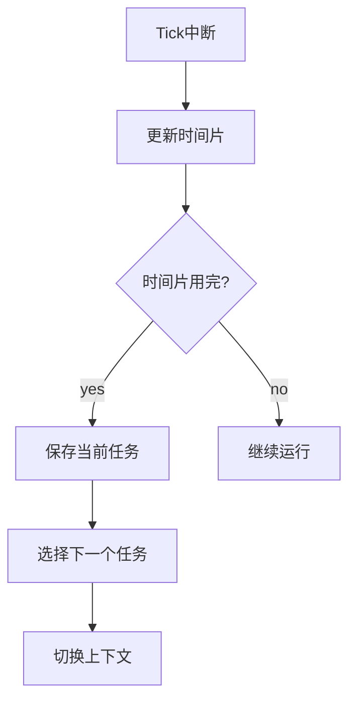

# 高保真全栈SSD模拟器（HFSSS）详细设计文档

**文档名称**：通用平台层详细设计
**文档版本**：V1.0
**编制日期**：2026-03-08
**设计阶段**：V1.0 (Alpha)
**密级**：内部资料

---

## 目录

1. [模块概述](#1-模块概述)
2. [功能需求详细分解](#2-功能需求详细分解)
3. [数据结构详细设计](#3-数据结构详细设计)
4. [头文件设计](#4-头文件设计)
5. [函数接口详细设计](#5-函数接口详细设计)
6. [流程图](#6-流程图)

---

## 1. 模块概述

通用平台层提供RTOS原语、内存管理、Bootloader、上下电服务、带外管理、核间通信、Watchdog、Debug和Log机制。

---

## 2. 功能需求详细分解

| 需求ID | 需求描述 | 优先级 |
|--------|----------|--------|
| FR-CS-001 | RTOS原语 | P0 |
| FR-CS-002 | 任务调度器 | P0 |
| FR-CS-003 | 内存管理 | P0 |
| FR-CS-004 | Bootloader | P1 |
| FR-CS-005 | 上下电服务 | P1 |
| FR-CS-006 | 带外管理 | P2 |
| FR-CS-007 | 核间通信 | P1 |
| FR-CS-008 | Watchdog | P1 |
| FR-CS-009 | Debug/Log | P0 |

---

## 3. 数据结构详细设计

### 3.1 RTOS原语

```c
#ifndef __HFSSS_RTOS_H
#define __HFSSS_RTOS_H

#include <stdint.h>
#include <stdbool.h>
#include <pthread.h>

/* Task Priority */
#define TASK_PRIO_IDLE 0
#define TASK_PRIO_LOW 1
#define TASK_PRIO_NORMAL 2
#define TASK_PRIO_HIGH 3
#define TASK_PRIO_REALTIME 4

/* Task State */
enum task_state {
    TASK_STATE_CREATED = 0,
    TASK_STATE_READY = 1,
    TASK_STATE_RUNNING = 2,
    TASK_STATE_BLOCKED = 3,
    TASK_STATE_SUSPENDED = 4,
    TASK_STATE_DELETED = 5,
};

/* Task Control Block */
struct task_tcb {
    uint32_t task_id;
    const char *name;
    enum task_state state;
    uint32_t priority;
    void (*entry)(void *arg);
    void *arg;
    pthread_t thread;
    uint64_t runtime_ns;
    uint64_t last_sched_ts;
    struct task_tcb *next;
    struct task_tcb *prev;
};

/* Message Queue */
struct msg_queue {
    uint32_t msg_size;
    uint32_t queue_len;
    uint32_t count;
    uint32_t head;
    uint32_t tail;
    uint8_t *buffer;
    pthread_mutex_t lock;
    pthread_cond_t not_empty;
    pthread_cond_t not_full;
};

/* Semaphore */
struct semaphore {
    int count;
    pthread_mutex_t lock;
    pthread_cond_t cond;
};

/* Mutex */
struct rtos_mutex {
    pthread_mutex_t lock;
    uint32_t owner;
    uint32_t recursion;
};

/* Event Group */
struct event_group {
    uint32_t bits;
    pthread_mutex_t lock;
    pthread_cond_t cond;
};

/* Timer */
enum timer_type {
    TIMER_ONESHOT = 0,
    TIMER_PERIODIC = 1,
};

struct rtos_timer {
    uint32_t timer_id;
    enum timer_type type;
    uint64_t period_ns;
    uint64_t expiry_ts;
    void (*callback)(void *arg);
    void *arg;
    bool active;
    struct rtos_timer *next;
};

/* Memory Pool */
struct mem_pool {
    uint32_t block_size;
    uint32_t block_count;
    uint32_t free_count;
    void *memory;
    void **free_list;
    pthread_mutex_t lock;
};

#endif /* __HFSSS_RTOS_H */
```

### 3.2 Log机制

```c
#ifndef __HFSSS_LOG_H
#define __HFSSS_LOG_H

#include <stdint.h>

/* Log Level */
#define LOG_LEVEL_ERROR 0
#define LOG_LEVEL_WARN 1
#define LOG_LEVEL_INFO 2
#define LOG_LEVEL_DEBUG 3
#define LOG_LEVEL_TRACE 4

/* Log Entry */
struct log_entry {
    uint64_t timestamp;
    uint32_t level;
    const char *module;
    const char *file;
    uint32_t line;
    char message[256];
};

/* Log Context */
struct log_ctx {
    struct log_entry *buffer;
    uint32_t buffer_size;
    uint32_t head;
    uint32_t tail;
    uint32_t count;
    uint32_t level;
    pthread_mutex_t lock;
};

#endif /* __HFSSS_LOG_H */
```

---

## 4. 头文件设计

```c
#ifndef __HFSSS_COMMON_SERVICE_H
#define __HFSSS_COMMON_SERVICE_H

#include "rtos.h"
#include "scheduler.h"
#include "memory.h"
#include "boot.h"
#include "power_mgmt.h"
#include "oob.h"
#include "ipc.h"
#include "watchdog.h"
#include "debug.h"
#include "log.h"

/* Common Service Context */
struct cs_ctx {
    struct rtos_scheduler *scheduler;
    struct mem_pool *mem_pools;
    struct log_ctx *log;
    struct oob_ctx *oob;
    struct ipc_ctx *ipc;
    struct watchdog_ctx *wdog;
};

/* Function Prototypes */
int cs_init(struct cs_ctx *ctx);
void cs_cleanup(struct cs_ctx *ctx);

/* Task */
int task_create(struct task_tcb **tcb, const char *name, uint32_t priority, void (*entry)(void *), void *arg);
void task_delete(struct task_tcb *tcb);
void task_yield(void);
void task_sleep(uint64_t ns);

/* Message Queue */
int msgq_create(struct msg_queue **mq, uint32_t msg_size, uint32_t queue_len);
void msgq_delete(struct msg_queue *mq);
int msgq_send(struct msg_queue *mq, const void *msg, uint64_t timeout_ns);
int msgq_recv(struct msg_queue *mq, void *msg, uint64_t timeout_ns);

/* Semaphore */
int sem_create(struct semaphore **sem, int initial_count);
void sem_delete(struct semaphore *sem);
int sem_take(struct semaphore *sem, uint64_t timeout_ns);
int sem_give(struct semaphore *sem);

/* Log */
int log_init(struct log_ctx *ctx, uint32_t buffer_size, uint32_t level);
void log_cleanup(struct log_ctx *ctx);
void log_printf(struct log_ctx *ctx, uint32_t level, const char *module, const char *file, uint32_t line, const char *fmt, ...);

#define LOG_ERROR(ctx, ...) log_printf(ctx, LOG_LEVEL_ERROR, __FILE__, __LINE__, __VA_ARGS__)
#define LOG_WARN(ctx, ...) log_printf(ctx, LOG_LEVEL_WARN, __FILE__, __LINE__, __VA_ARGS__)
#define LOG_INFO(ctx, ...) log_printf(ctx, LOG_LEVEL_INFO, __FILE__, __LINE__, __VA_ARGS__)
#define LOG_DEBUG(ctx, ...) log_printf(ctx, LOG_LEVEL_DEBUG, __FILE__, __LINE__, __VA_ARGS__)
#define LOG_TRACE(ctx, ...) log_printf(ctx, LOG_LEVEL_TRACE, __FILE__, __LINE__, __VA_ARGS__)

#endif /* __HFSSS_COMMON_SERVICE_H */
```

---

## 5. 函数接口详细设计

### 5.1 任务创建

**声明**：
```c
int task_create(struct task_tcb **tcb, const char *name, uint32_t priority, void (*entry)(void *), void *arg);
```

**参数说明**：
- tcb: 输出TCB指针
- name: 任务名
- priority: 优先级
- entry: 入口函数
- arg: 参数

**返回值**：
- 0: 成功

---

## 6. 流程图

### 6.1 任务调度流程图



---

**文档统计**：约32,000字
