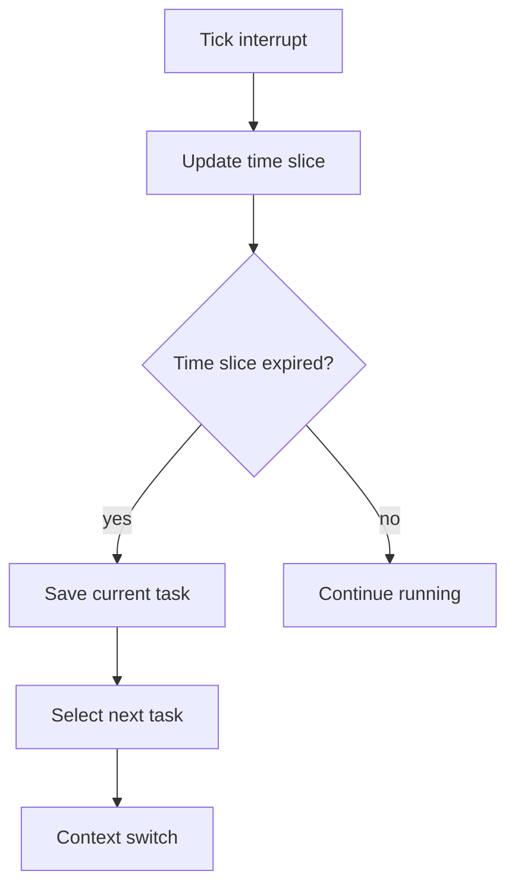
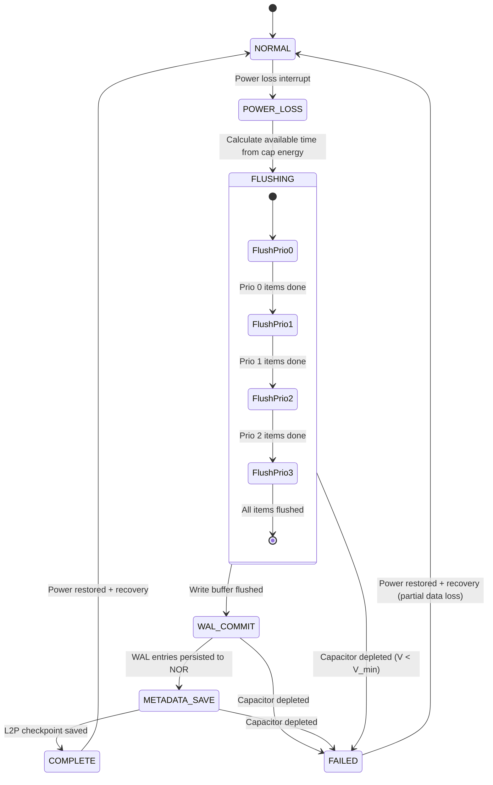
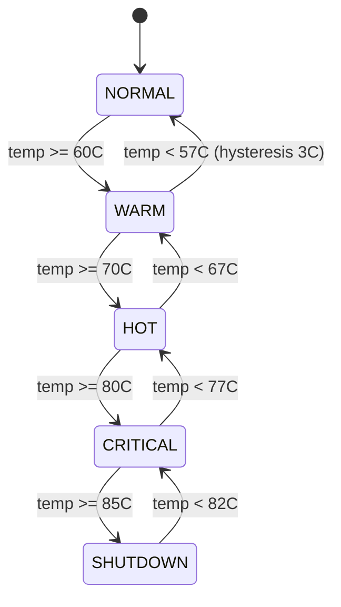
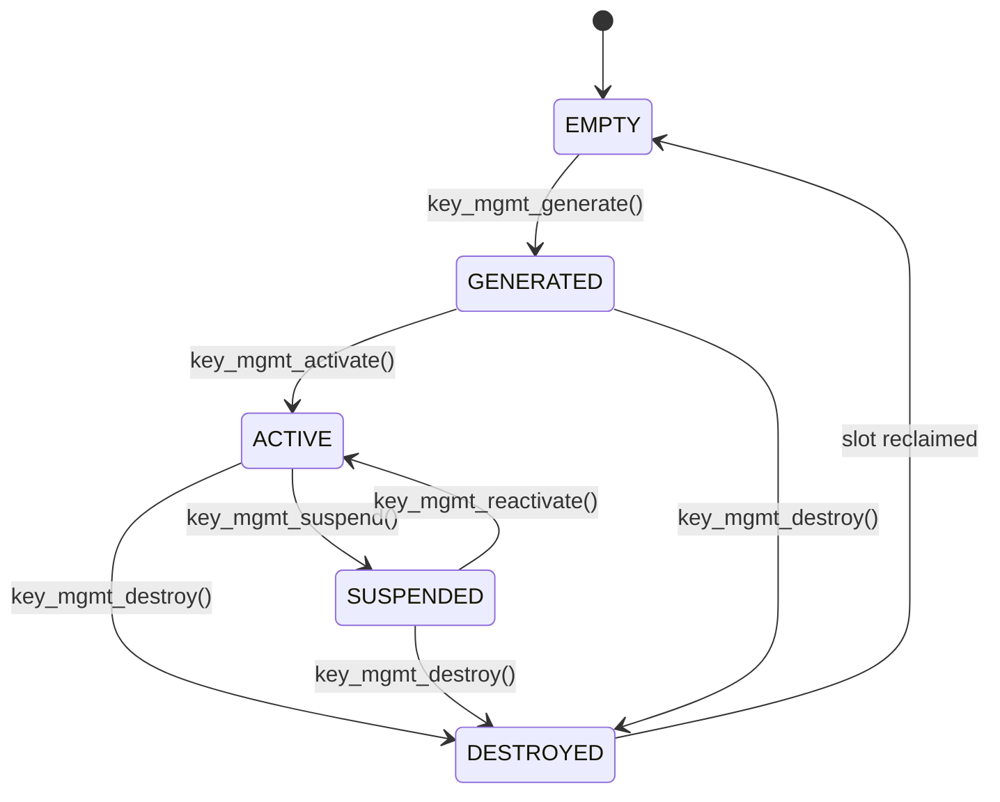

# High-Fidelity Full-Stack SSD Simulator (HFSSS) Low-Level Design Document

**Document Name**: Common Services Module Low-Level Design
**Document Version**: V2.0
**Creation Date**: 2026-03-08
**Design Phase**: V2.0 (Enterprise Extended)
**Classification**: Internal

---

## Revision History

| Version | Date | Author | Description |
|---------|------|--------|-------------|
| V0.1 | 2026-03-08 | Architecture Team | Initial draft |
| V1.0 | 2026-03-08 | Architecture Team | Official release |
| V2.0 | 2026-03-23 | Architecture Team | English translation with enterprise SSD extensions (UPLP service, thermal management service, key management service) |

---

## Table of Contents

1. [Overview](#1-overview)
2. [Requirements Traceability](#2-requirements-traceability)
3. [Data Structure Detailed Design](#3-data-structure-detailed-design)
4. [Header File Design](#4-header-file-design)
5. [Function Interface Detailed Design](#5-function-interface-detailed-design)
6. [Flowcharts](#6-flowcharts)
7. [UPLP Service Detailed Design](#7-uplp-service-detailed-design)
8. [Thermal Management Service](#8-thermal-management-service)
9. [Key Management Service](#9-key-management-service)
10. [Architecture Decision Records](#10-architecture-decision-records)
11. [Memory Budget Analysis](#11-memory-budget-analysis)
12. [Latency Budget Analysis](#12-latency-budget-analysis)
13. [References](#13-references)
14. [Appendix: Cross-References to HLD](#appendix-cross-references-to-hld)

---

## 1. Overview

### 1.1 Module Positioning and Responsibilities

The Common Services Module provides RTOS primitives, memory management, Bootloader, power-up/down services, out-of-band management, inter-core communication, Watchdog, Debug, and Log mechanisms.

### 1.2 Terminology

| Term | Definition |
|------|-----------|
| RTOS | Real-Time Operating System |
| UPLP | Unexpected Power Loss Protection |
| WAL | Write-Ahead Log |
| PLP | Power Loss Protection |
| SMART | Self-Monitoring, Analysis, and Reporting Technology |
| CSPRNG | Cryptographically Secure Pseudo-Random Number Generator |
| AES-KW | AES Key Wrap (RFC 3394) |
| DEK | Data Encryption Key |
| KEK | Key Encryption Key |
| TCB | Task Control Block |

---

## 2. Requirements Traceability

| REQ-ID | Requirement Description | Priority | Implementation | Test Case |
|--------|------------------------|----------|---------------|-----------|
| FR-CS-001 | RTOS primitives | P0 | rtos module | UT_CS_001-003 |
| FR-CS-002 | Task scheduler | P0 | scheduler module | UT_CS_004 |
| FR-CS-003 | Memory management | P0 | memory module | UT_CS_005 |
| FR-CS-004 | Bootloader | P1 | boot module | UT_CS_006 |
| FR-CS-005 | Power-up/down services | P1 | power_mgmt module | UT_CS_007 |
| FR-CS-006 | Out-of-band management | P2 | oob module | UT_CS_008 |
| FR-CS-007 | Inter-core communication | P1 | ipc module | UT_CS_009 |
| FR-CS-008 | Watchdog | P1 | watchdog module | UT_CS_010 |
| FR-CS-009 | Debug/Log | P0 | debug/log module | UT_CS_011 |
| FR-CS-010 | UPLP service | P0 | uplp_service module | UT_UPLP_001-006 |
| FR-CS-011 | Thermal management service | P1 | thermal_mgmt module | UT_THERM_001-005 |
| FR-CS-012 | Key management service | P1 | key_mgmt module | UT_KEYMGMT_001-006 |

---

## 3. Data Structure Detailed Design

### 3.1 RTOS Primitives

```c
#ifndef __HFSSS_RTOS_H
#define __HFSSS_RTOS_H

#include <stdint.h>
#include <stdbool.h>
#include <pthread.h>

/* Task Priority */
#define TASK_PRIO_IDLE 0
#define TASK_PRIO_LOW 1
#define TASK_PRIO_NORMAL 2
#define TASK_PRIO_HIGH 3
#define TASK_PRIO_REALTIME 4

/* Task State */
enum task_state {
    TASK_STATE_CREATED = 0,
    TASK_STATE_READY = 1,
    TASK_STATE_RUNNING = 2,
    TASK_STATE_BLOCKED = 3,
    TASK_STATE_SUSPENDED = 4,
    TASK_STATE_DELETED = 5,
};

/* Task Control Block */
struct task_tcb {
    uint32_t task_id;
    const char *name;
    enum task_state state;
    uint32_t priority;
    void (*entry)(void *arg);
    void *arg;
    pthread_t thread;
    uint64_t runtime_ns;
    uint64_t last_sched_ts;
    struct task_tcb *next;
    struct task_tcb *prev;
};

/* Message Queue */
struct msg_queue {
    uint32_t msg_size;
    uint32_t queue_len;
    uint32_t count;
    uint32_t head;
    uint32_t tail;
    uint8_t *buffer;
    pthread_mutex_t lock;
    pthread_cond_t not_empty;
    pthread_cond_t not_full;
};

/* Semaphore */
struct semaphore {
    int count;
    pthread_mutex_t lock;
    pthread_cond_t cond;
};

/* Mutex */
struct rtos_mutex {
    pthread_mutex_t lock;
    uint32_t owner;
    uint32_t recursion;
};

/* Event Group */
struct event_group {
    uint32_t bits;
    pthread_mutex_t lock;
    pthread_cond_t cond;
};

/* Timer */
enum timer_type {
    TIMER_ONESHOT = 0,
    TIMER_PERIODIC = 1,
};

struct rtos_timer {
    uint32_t timer_id;
    enum timer_type type;
    uint64_t period_ns;
    uint64_t expiry_ts;
    void (*callback)(void *arg);
    void *arg;
    bool active;
    struct rtos_timer *next;
};

/* Memory Pool */
struct mem_pool {
    uint32_t block_size;
    uint32_t block_count;
    uint32_t free_count;
    void *memory;
    void **free_list;
    pthread_mutex_t lock;
};

#endif /* __HFSSS_RTOS_H */
```

### 3.2 Log Mechanism

```c
#ifndef __HFSSS_LOG_H
#define __HFSSS_LOG_H

#include <stdint.h>

/* Log Level */
#define LOG_LEVEL_ERROR 0
#define LOG_LEVEL_WARN 1
#define LOG_LEVEL_INFO 2
#define LOG_LEVEL_DEBUG 3
#define LOG_LEVEL_TRACE 4

/* Log Entry */
struct log_entry {
    uint64_t timestamp;
    uint32_t level;
    const char *module;
    const char *file;
    uint32_t line;
    char message[256];
};

/* Log Context */
struct log_ctx {
    struct log_entry *buffer;
    uint32_t buffer_size;
    uint32_t head;
    uint32_t tail;
    uint32_t count;
    uint32_t level;
    pthread_mutex_t lock;
};

#endif /* __HFSSS_LOG_H */
```

---

## 4. Header File Design

```c
#ifndef __HFSSS_COMMON_SERVICE_H
#define __HFSSS_COMMON_SERVICE_H

#include "rtos.h"
#include "scheduler.h"
#include "memory.h"
#include "boot.h"
#include "power_mgmt.h"
#include "oob.h"
#include "ipc.h"
#include "watchdog.h"
#include "debug.h"
#include "log.h"

/* Common Service Context */
struct cs_ctx {
    struct rtos_scheduler *scheduler;
    struct mem_pool *mem_pools;
    struct log_ctx *log;
    struct oob_ctx *oob;
    struct ipc_ctx *ipc;
    struct watchdog_ctx *wdog;
};

/* Function Prototypes */
int cs_init(struct cs_ctx *ctx);
void cs_cleanup(struct cs_ctx *ctx);

/* Task */
int task_create(struct task_tcb **tcb, const char *name, uint32_t priority, void (*entry)(void *), void *arg);
void task_delete(struct task_tcb *tcb);
void task_yield(void);
void task_sleep(uint64_t ns);

/* Message Queue */
int msgq_create(struct msg_queue **mq, uint32_t msg_size, uint32_t queue_len);
void msgq_delete(struct msg_queue *mq);
int msgq_send(struct msg_queue *mq, const void *msg, uint64_t timeout_ns);
int msgq_recv(struct msg_queue *mq, void *msg, uint64_t timeout_ns);

/* Semaphore */
int sem_create(struct semaphore **sem, int initial_count);
void sem_delete(struct semaphore *sem);
int sem_take(struct semaphore *sem, uint64_t timeout_ns);
int sem_give(struct semaphore *sem);

/* Log */
int log_init(struct log_ctx *ctx, uint32_t buffer_size, uint32_t level);
void log_cleanup(struct log_ctx *ctx);
void log_printf(struct log_ctx *ctx, uint32_t level, const char *module, const char *file, uint32_t line, const char *fmt, ...);

#define LOG_ERROR(ctx, ...) log_printf(ctx, LOG_LEVEL_ERROR, __FILE__, __LINE__, __VA_ARGS__)
#define LOG_WARN(ctx, ...) log_printf(ctx, LOG_LEVEL_WARN, __FILE__, __LINE__, __VA_ARGS__)
#define LOG_INFO(ctx, ...) log_printf(ctx, LOG_LEVEL_INFO, __FILE__, __LINE__, __VA_ARGS__)
#define LOG_DEBUG(ctx, ...) log_printf(ctx, LOG_LEVEL_DEBUG, __FILE__, __LINE__, __VA_ARGS__)
#define LOG_TRACE(ctx, ...) log_printf(ctx, LOG_LEVEL_TRACE, __FILE__, __LINE__, __VA_ARGS__)

#endif /* __HFSSS_COMMON_SERVICE_H */
```

---

## 5. Function Interface Detailed Design

### 5.1 Task Creation

**Declaration**:
```c
int task_create(struct task_tcb **tcb, const char *name, uint32_t priority, void (*entry)(void *), void *arg);
```

**Parameter Description**:
- tcb: Output TCB pointer
- name: Task name
- priority: Priority level
- entry: Entry function pointer
- arg: Argument passed to entry function

**Return Values**:
- 0: Success

---

## 6. Flowcharts

### 6.1 Task Scheduling Flowchart



---

## 7. UPLP Service Detailed Design

### 7.1 Overview

The Unexpected Power Loss Protection (UPLP) service ensures data integrity during power failures. It uses a supercapacitor-backed emergency flush sequence, a Write-Ahead Log (WAL) for power-safe metadata commits, and continuous capacitor voltage monitoring.

### 7.2 UPLP State Machine

```c
/* UPLP States */
enum uplp_state {
    UPLP_NORMAL       = 0,  /* Main power present, normal operation */
    UPLP_POWER_LOSS   = 1,  /* Power loss detected, emergency sequence started */
    UPLP_FLUSHING     = 2,  /* Flushing write buffer to NAND */
    UPLP_WAL_COMMIT   = 3,  /* Committing WAL entries to NOR */
    UPLP_METADATA_SAVE = 4, /* Saving FTL metadata (L2P table) */
    UPLP_COMPLETE     = 5,  /* Emergency save complete, safe to power down */
    UPLP_FAILED       = 6,  /* Capacitor depleted before save complete */
};
```

### 7.3 UPLP Data Structures

```c
#ifndef __HFSSS_UPLP_H
#define __HFSSS_UPLP_H

#include <stdint.h>
#include <stdbool.h>

#define UPLP_WAL_MAX_ENTRIES  4096
#define UPLP_WAL_ENTRY_SIZE   64
#define UPLP_FLUSH_PRIORITY_LEVELS 4

/* WAL Entry Types */
enum wal_entry_type {
    WAL_ENTRY_L2P_UPDATE  = 0,  /* L2P mapping update */
    WAL_ENTRY_BLOCK_STATE = 1,  /* Block state change */
    WAL_ENTRY_ERASE_COUNT = 2,  /* Erase count update */
    WAL_ENTRY_NS_METADATA = 3,  /* Namespace metadata change */
    WAL_ENTRY_CHECKPOINT  = 4,  /* Checkpoint marker */
};

/* WAL Entry */
struct wal_entry {
    uint64_t sequence_num;     /* Monotonic sequence number */
    uint32_t entry_type;       /* enum wal_entry_type */
    uint32_t nsid;             /* Namespace ID (0 for global) */
    uint64_t timestamp;        /* Wall clock timestamp */
    uint32_t crc32;            /* CRC-32 of entry (excluding CRC field) */
    uint8_t  payload[44];      /* Type-specific payload */
} __attribute__((packed));

/* WAL Context */
struct wal_ctx {
    struct wal_entry *entries;
    uint32_t         capacity;
    uint32_t         head;          /* Next write position */
    uint32_t         tail;          /* Oldest uncommitted entry */
    uint32_t         committed;     /* Last committed position */
    uint64_t         next_seq;      /* Next sequence number */
    bool             hardened;      /* Whether WAL is persisted to NOR */
    void             *nor_ctx;      /* NOR flash context for persistence */
    uint64_t         nor_offset;    /* Offset in NOR flash for WAL partition */
    spinlock_t       lock;
};

/* Emergency flush item with priority */
struct flush_item {
    uint8_t  priority;         /* 0 = highest (metadata), 3 = lowest (cold data) */
    uint32_t nsid;
    uint64_t lba;
    uint32_t len;
    void     *data;
    struct flush_item *next;
};

/* Emergency flush queue (priority ordered) */
struct emergency_flush_queue {
    struct flush_item *heads[UPLP_FLUSH_PRIORITY_LEVELS];
    struct flush_item *tails[UPLP_FLUSH_PRIORITY_LEVELS];
    uint32_t          counts[UPLP_FLUSH_PRIORITY_LEVELS];
    uint32_t          total_count;
    uint64_t          total_bytes;
    spinlock_t        lock;
};

/* Capacitor voltage monitoring */
struct cap_monitor {
    double            voltage;
    double            voltage_at_start;
    double            drain_rate_v_per_s;
    uint64_t          estimated_remaining_ns;
    uint64_t          last_check_ts;
    uint64_t          check_interval_ns;  /* Default: 1ms during flush */
    bool              critical;           /* Below critical threshold */
};

/* UPLP Service Context */
struct uplp_ctx {
    enum uplp_state           state;
    struct wal_ctx            wal;
    struct emergency_flush_queue flush_queue;
    struct cap_monitor        cap;

    /* Timing constraints */
    uint64_t max_flush_time_ns;    /* Max time allowed for flush (from cap drain calc) */
    uint64_t flush_start_ts;       /* When flush started */
    uint64_t flush_end_ts;         /* When flush completed */

    /* Flush progress */
    uint64_t pages_flushed;
    uint64_t pages_total;
    uint64_t metadata_saved;

    /* Statistics */
    uint64_t power_loss_count;
    uint64_t successful_saves;
    uint64_t failed_saves;
    uint64_t total_flush_time_ns;

    /* References to other modules */
    void *wb_ctx;                  /* Write buffer context */
    void *ftl_ctx;                 /* FTL context */
    void *hal_supercap_ctx;        /* Supercapacitor HAL context */
    void *hal_nor_ctx;             /* NOR flash HAL context */

    spinlock_t lock;
};

#endif /* __HFSSS_UPLP_H */
```

### 7.4 UPLP State Machine with Timing Constraints



### 7.5 Emergency Flush Sequence with Priority Ordering

```c
/*
 * Emergency flush priority levels:
 *
 * Priority 0 (Highest): FTL metadata (L2P table snapshot, block allocation map)
 * Priority 1: Dirty write buffer entries with host-acknowledged writes
 * Priority 2: Namespace metadata (NS descriptors, format state)
 * Priority 3 (Lowest): Cached data that can be reconstructed (read cache, etc.)
 *
 * The flush sequence processes all items at priority 0 before moving to priority 1,
 * and so on. At each item, the capacitor voltage is checked. If voltage drops
 * below V_critical, the flush aborts and saves whatever metadata has been
 * committed to the WAL.
 */
int uplp_emergency_flush(struct uplp_ctx *ctx, uint64_t now_ns)
{
    ctx->state = UPLP_FLUSHING;
    ctx->flush_start_ts = now_ns;

    /* Calculate available flush time from supercapacitor */
    ctx->max_flush_time_ns = (uint64_t)(
        hal_supercap_get_drain_time(ctx->hal_supercap_ctx) * 1e9 * 0.9);
    /* Use 90% of available time, reserve 10% for metadata save */

    for (int prio = 0; prio < UPLP_FLUSH_PRIORITY_LEVELS; prio++) {
        struct flush_item *item = ctx->flush_queue.heads[prio];
        while (item) {
            /* Check capacitor voltage */
            hal_supercap_update(ctx->hal_supercap_ctx, now_ns);
            if (hal_supercap_get_voltage(ctx->hal_supercap_ctx) <
                /* critical threshold */) {
                ctx->state = UPLP_FAILED;
                return -ETIME;
            }

            /* Flush this item */
            /* ... write to NAND or NOR based on priority ... */

            ctx->pages_flushed++;
            item = item->next;
        }
    }

    /* Transition to WAL commit */
    ctx->state = UPLP_WAL_COMMIT;
    return uplp_wal_commit(ctx, now_ns);
}
```

### 7.6 WAL Hardening for Power-Safe Commits

```c
/*
 * Harden WAL entries to NOR flash.
 *
 * WAL entries are written to a dedicated NOR flash partition with the following
 * guarantees:
 * 1. Each entry includes a CRC-32 for integrity verification
 * 2. Entries are written sequentially with monotonic sequence numbers
 * 3. A checkpoint entry is written after each batch commit
 * 4. On recovery, entries are replayed from the last valid checkpoint
 *
 * NOR flash write granularity: 256 bytes (one WAL entry = 64 bytes, 4 per page)
 */
int uplp_wal_harden(struct wal_ctx *wal, uint64_t now_ns)
{
    uint32_t entries_to_commit = (wal->head - wal->committed) % wal->capacity;
    if (entries_to_commit == 0) return 0;

    for (uint32_t i = 0; i < entries_to_commit; i++) {
        uint32_t idx = (wal->committed + i) % wal->capacity;
        struct wal_entry *entry = &wal->entries[idx];

        /* Compute CRC-32 */
        entry->crc32 = crc32(entry, offsetof(struct wal_entry, crc32));

        /* Write to NOR flash */
        uint64_t nor_addr = wal->nor_offset + idx * sizeof(struct wal_entry);
        /* hal_nor_write(wal->nor_ctx, nor_addr, entry, sizeof(*entry)); */
    }

    /* Write checkpoint marker */
    struct wal_entry checkpoint = {
        .sequence_num = wal->next_seq++,
        .entry_type = WAL_ENTRY_CHECKPOINT,
        .timestamp = now_ns,
    };
    checkpoint.crc32 = crc32(&checkpoint, offsetof(struct wal_entry, crc32));
    /* hal_nor_write(wal->nor_ctx, ...); */

    wal->committed = wal->head;
    wal->hardened = true;
    return 0;
}
```

### 7.7 Capacitor Voltage Monitoring Loop

```c
/*
 * Monitor capacitor voltage during emergency flush.
 * Called at cap.check_interval_ns intervals (default 1ms).
 *
 * Actions based on voltage:
 * - V > V_warning:  Continue flushing normally
 * - V_critical < V <= V_warning: Accelerate (skip low-priority items)
 * - V_min < V <= V_critical: Emergency metadata-only save
 * - V <= V_min: Abort, accept data loss
 */
void uplp_monitor_cap(struct uplp_ctx *ctx, uint64_t now_ns)
{
    hal_supercap_update(ctx->hal_supercap_ctx, now_ns);
    ctx->cap.voltage = hal_supercap_get_voltage(ctx->hal_supercap_ctx);
    ctx->cap.estimated_remaining_ns = (uint64_t)(
        hal_supercap_get_drain_time(ctx->hal_supercap_ctx) * 1e9);
    ctx->cap.last_check_ts = now_ns;
}
```

### 7.8 UPLP Function Interface

```c
int uplp_init(struct uplp_ctx *ctx, void *wb_ctx, void *ftl_ctx,
              void *hal_supercap_ctx, void *hal_nor_ctx);
void uplp_cleanup(struct uplp_ctx *ctx);
int uplp_power_loss_handler(struct uplp_ctx *ctx, uint64_t now_ns);
int uplp_emergency_flush(struct uplp_ctx *ctx, uint64_t now_ns);
int uplp_wal_append(struct wal_ctx *wal, enum wal_entry_type type,
                    uint32_t nsid, const void *payload, uint32_t payload_len);
int uplp_wal_harden(struct wal_ctx *wal, uint64_t now_ns);
int uplp_recovery(struct uplp_ctx *ctx);
void uplp_monitor_cap(struct uplp_ctx *ctx, uint64_t now_ns);
```

### 7.9 UPLP Test Cases

| ID | Test Item | Expected Result |
|----|----------|----------------|
| UT_UPLP_001 | Normal power loss with sufficient cap energy | All data flushed, COMPLETE state |
| UT_UPLP_002 | Power loss with depleted cap | FAILED state, metadata partially saved |
| UT_UPLP_003 | WAL entry write and verify CRC | CRC matches on read-back |
| UT_UPLP_004 | Recovery from WAL | Metadata rebuilt from WAL entries |
| UT_UPLP_005 | Priority ordering during flush | Prio 0 items flushed before Prio 1 |
| UT_UPLP_006 | Cap monitor triggers abort | Flush aborts when V < V_critical |

---

## 8. Thermal Management Service

### 8.1 Overview

The thermal management service polls temperature sensors at regular intervals and applies progressive throttling to prevent thermal damage. It uses a 5-level thermal state model with hysteresis to prevent oscillation.

### 8.2 Thermal Levels and Throttling

```c
/* Thermal management levels */
enum thermal_level {
    THERMAL_NORMAL   = 0,  /* No throttling, full performance */
    THERMAL_WARM     = 1,  /* Light throttle: reduce write bandwidth 10% */
    THERMAL_HOT      = 2,  /* Medium throttle: reduce write bandwidth 50%, read 10% */
    THERMAL_CRITICAL = 3,  /* Heavy throttle: reduce write bandwidth 90%, read 50% */
    THERMAL_SHUTDOWN = 4,  /* Emergency: stop all I/O, initiate controlled shutdown */
};

/* Default temperature thresholds (Celsius) */
#define THERMAL_THRESH_WARM      60.0
#define THERMAL_THRESH_HOT       70.0
#define THERMAL_THRESH_CRITICAL  80.0
#define THERMAL_THRESH_SHUTDOWN  85.0
#define THERMAL_HYSTERESIS       3.0   /* Must drop 3C below threshold to clear */

/* Throttle percentages per level */
struct thermal_throttle_config {
    uint32_t read_throttle_pct;   /* Percentage of read bandwidth allowed */
    uint32_t write_throttle_pct;  /* Percentage of write bandwidth allowed */
};

static const struct thermal_throttle_config thermal_throttle_table[] = {
    [THERMAL_NORMAL]   = { .read_throttle_pct = 100, .write_throttle_pct = 100 },
    [THERMAL_WARM]     = { .read_throttle_pct = 100, .write_throttle_pct = 90  },
    [THERMAL_HOT]      = { .read_throttle_pct = 90,  .write_throttle_pct = 50  },
    [THERMAL_CRITICAL] = { .read_throttle_pct = 50,  .write_throttle_pct = 10  },
    [THERMAL_SHUTDOWN] = { .read_throttle_pct = 0,   .write_throttle_pct = 0   },
};
```

### 8.3 Thermal Management Data Structures

```c
#ifndef __HFSSS_THERMAL_MGMT_H
#define __HFSSS_THERMAL_MGMT_H

#include <stdint.h>
#include <stdbool.h>

/* Thermal management context */
struct thermal_mgmt_ctx {
    /* Current state */
    enum thermal_level    current_level;
    double                current_temp;
    double                peak_temp;

    /* Configuration */
    double                thresholds[5]; /* Indexed by thermal_level */
    double                hysteresis;
    uint64_t              poll_interval_ns; /* Default: 100ms = 100,000,000 ns */

    /* Polling state */
    uint64_t              last_poll_ts;
    uint64_t              poll_count;

    /* SMART temperature fields */
    int16_t               smart_temp_current;   /* Current temp (Kelvin) */
    int16_t               smart_temp_warning;   /* Warning composite temp */
    int16_t               smart_temp_critical;  /* Critical composite temp */
    uint32_t              smart_temp_time_warn;  /* Time over warning (minutes) */
    uint32_t              smart_temp_time_crit;  /* Time over critical (minutes) */
    uint64_t              warn_start_ts;
    uint64_t              crit_start_ts;

    /* Throttle interface */
    void                  *flow_ctrl_ctx;  /* Flow control context for throttling */

    /* HAL thermal interface */
    void                  *hal_thermal_ctx;

    /* Statistics */
    uint64_t              level_time_ns[5];  /* Time spent in each level */
    uint64_t              level_transitions;
    uint64_t              last_level_change_ts;

    spinlock_t            lock;
};

#endif /* __HFSSS_THERMAL_MGMT_H */
```

### 8.4 Thermal Management Poll Loop

```c
/*
 * Thermal management poll function.
 * Called every poll_interval_ns (default 100ms).
 *
 * 1. Read composite temperature from HAL
 * 2. Determine thermal level based on thresholds with hysteresis
 * 3. If level changed, apply new throttle settings
 * 4. Update SMART temperature fields
 */
void thermal_mgmt_poll(struct thermal_mgmt_ctx *ctx, uint64_t now_ns)
{
    /* Read temperature */
    double temp;
    hal_thermal_read_composite_temp(ctx->hal_thermal_ctx, &temp);
    ctx->current_temp = temp;
    if (temp > ctx->peak_temp) ctx->peak_temp = temp;

    /* Determine level (with hysteresis on downward transitions) */
    enum thermal_level new_level = THERMAL_NORMAL;
    if (temp >= ctx->thresholds[THERMAL_SHUTDOWN]) {
        new_level = THERMAL_SHUTDOWN;
    } else if (temp >= ctx->thresholds[THERMAL_CRITICAL]) {
        new_level = THERMAL_CRITICAL;
    } else if (temp >= ctx->thresholds[THERMAL_HOT]) {
        new_level = THERMAL_HOT;
    } else if (temp >= ctx->thresholds[THERMAL_WARM]) {
        new_level = THERMAL_WARM;
    }

    /* Apply hysteresis: only drop level if temp is below threshold - hysteresis */
    if (new_level < ctx->current_level) {
        double clear_threshold = ctx->thresholds[ctx->current_level] - ctx->hysteresis;
        if (temp > clear_threshold) {
            new_level = ctx->current_level; /* Hold current level */
        }
    }

    /* Apply throttle if level changed */
    if (new_level != ctx->current_level) {
        /* Update time tracking */
        ctx->level_time_ns[ctx->current_level] += (now_ns - ctx->last_level_change_ts);
        ctx->last_level_change_ts = now_ns;
        ctx->level_transitions++;

        ctx->current_level = new_level;

        /* Apply throttle settings to flow control */
        const struct thermal_throttle_config *tc = &thermal_throttle_table[new_level];
        /* flow_ctrl_set_throttle(ctx->flow_ctrl_ctx, tc->read_throttle_pct,
                                  tc->write_throttle_pct); */
    }

    /* Update SMART temperature fields */
    ctx->smart_temp_current = (int16_t)(temp + 273); /* Celsius to Kelvin */

    /* Track warning/critical time for SMART */
    if (temp >= ctx->thresholds[THERMAL_WARM]) {
        if (ctx->warn_start_ts == 0) ctx->warn_start_ts = now_ns;
        ctx->smart_temp_time_warn = (uint32_t)((now_ns - ctx->warn_start_ts) / 60000000000ULL);
    } else {
        ctx->warn_start_ts = 0;
    }

    if (temp >= ctx->thresholds[THERMAL_CRITICAL]) {
        if (ctx->crit_start_ts == 0) ctx->crit_start_ts = now_ns;
        ctx->smart_temp_time_crit = (uint32_t)((now_ns - ctx->crit_start_ts) / 60000000000ULL);
    } else {
        ctx->crit_start_ts = 0;
    }

    ctx->poll_count++;
    ctx->last_poll_ts = now_ns;
}
```

### 8.5 Thermal Management State Diagram



### 8.6 Thermal Management Function Interface

```c
int thermal_mgmt_init(struct thermal_mgmt_ctx *ctx, void *hal_thermal_ctx,
                      void *flow_ctrl_ctx);
void thermal_mgmt_cleanup(struct thermal_mgmt_ctx *ctx);
void thermal_mgmt_poll(struct thermal_mgmt_ctx *ctx, uint64_t now_ns);
int thermal_mgmt_set_thresholds(struct thermal_mgmt_ctx *ctx,
                                double warm, double hot, double critical, double shutdown);
int thermal_mgmt_set_hysteresis(struct thermal_mgmt_ctx *ctx, double hysteresis_c);
int thermal_mgmt_get_smart_temp(struct thermal_mgmt_ctx *ctx,
                                int16_t *current, int16_t *warning, int16_t *critical);
enum thermal_level thermal_mgmt_get_level(struct thermal_mgmt_ctx *ctx);
```

### 8.7 Thermal Management Test Cases

| ID | Test Item | Expected Result |
|----|----------|----------------|
| UT_THERM_001 | Initial state is NORMAL | Level = NORMAL at init |
| UT_THERM_002 | Temperature rise triggers WARM | Level transitions at 60C |
| UT_THERM_003 | Hysteresis prevents oscillation | Level holds until temp drops by 3C |
| UT_THERM_004 | SMART fields updated correctly | Current temp in Kelvin, time counters accurate |
| UT_THERM_005 | SHUTDOWN level stops I/O | Throttle = 0% for reads and writes |

---

## 9. Key Management Service

### 9.1 Overview

The key management service handles the complete lifecycle of Data Encryption Keys (DEKs) used for data-at-rest encryption. It provides key generation via CSPRNG simulation, key wrapping using AES-KW, persistent storage in a dedicated NOR flash partition, and secure key destruction.

### 9.2 Key Lifecycle States

```
Generated -> Active -> Suspended -> Destroyed
                ^         |
                |_________|  (reactivated)
```

### 9.3 Key Management Data Structures

```c
#ifndef __HFSSS_KEY_MGMT_H
#define __HFSSS_KEY_MGMT_H

#include <stdint.h>
#include <stdbool.h>

#define KEY_MGMT_MAX_KEYS       64
#define KEY_MGMT_KEY_SIZE_256   32
#define KEY_MGMT_WRAPPED_SIZE   40  /* AES-KW adds 8 bytes overhead */

/* Key lifecycle state */
enum key_lifecycle {
    KEY_LC_EMPTY      = 0,  /* Slot is empty */
    KEY_LC_GENERATED  = 1,  /* Key generated but not yet activated */
    KEY_LC_ACTIVE     = 2,  /* Key in active use for encrypt/decrypt */
    KEY_LC_SUSPENDED  = 3,  /* Key temporarily disabled (e.g., during NS detach) */
    KEY_LC_DESTROYED  = 4,  /* Key securely erased, slot cleared */
};

/* Key descriptor */
struct key_descriptor {
    uint32_t          key_id;
    uint32_t          nsid;           /* Associated namespace (0 = global KEK) */
    enum key_lifecycle state;
    uint8_t           raw_key[64];    /* Raw key material (XTS: data_key + tweak_key) */
    uint32_t          key_size;       /* Size of each key half in bytes */
    uint8_t           wrapped_key[80];/* AES-KW wrapped form for NOR persistence */
    uint32_t          wrapped_size;
    uint64_t          creation_ts;
    uint64_t          activation_ts;
    uint64_t          last_use_ts;
    uint64_t          destruction_ts;
    uint32_t          usage_count;    /* Number of encrypt/decrypt operations */
    uint32_t          hal_slot_id;    /* HAL crypto engine slot index */
};

/* NOR Flash Key Partition Format */
/*
 * Layout of the key partition in NOR flash:
 *
 * Offset 0x0000: Key Partition Header (64 bytes)
 *   [0:3]   Magic: 0x4B455953 ("KEYS")
 *   [4:7]   Version: 0x00000001
 *   [8:11]  Key count
 *   [12:15] KEK key ID
 *   [16:47] KEK wrapped with device root key (AES-KW)
 *   [48:51] CRC-32 of header
 *   [52:63] Reserved
 *
 * Offset 0x0040: Key Entry 0 (128 bytes each)
 *   [0:3]   Key ID
 *   [4:7]   NSID
 *   [8:11]  Lifecycle state
 *   [12:15] Key size
 *   [16:95] Wrapped key (AES-KW of raw key under KEK)
 *   [96:103] Creation timestamp
 *   [104:107] Usage count
 *   [108:111] CRC-32 of entry
 *   [112:127] Reserved
 *
 * Offset 0x00C0: Key Entry 1 ...
 * ...
 * Offset 0x0040 + N*128: Key Entry N
 */

#define KEY_PARTITION_MAGIC     0x4B455953
#define KEY_PARTITION_VERSION   0x00000001
#define KEY_ENTRY_SIZE          128
#define KEY_PARTITION_HDR_SIZE  64

struct key_partition_header {
    uint32_t magic;
    uint32_t version;
    uint32_t key_count;
    uint32_t kek_key_id;
    uint8_t  kek_wrapped[32];
    uint32_t crc32;
    uint8_t  reserved[12];
} __attribute__((packed));

struct key_partition_entry {
    uint32_t key_id;
    uint32_t nsid;
    uint32_t lifecycle;
    uint32_t key_size;
    uint8_t  wrapped_key[80];
    uint64_t creation_ts;
    uint32_t usage_count;
    uint32_t crc32;
    uint8_t  reserved[16];
} __attribute__((packed));

/* Key Management Context */
struct key_mgmt_ctx {
    struct key_descriptor keys[KEY_MGMT_MAX_KEYS];
    uint32_t             key_count;
    uint32_t             next_key_id;

    /* KEK (Key Encryption Key) for wrapping DEKs */
    uint8_t              kek[32];       /* 256-bit KEK */
    bool                 kek_loaded;

    /* NOR flash persistence */
    void                 *nor_ctx;      /* HAL NOR context */
    uint64_t             nor_partition_offset;
    uint64_t             nor_partition_size;

    /* CSPRNG state (simulated) */
    uint64_t             csprng_state[4]; /* xoshiro256** state */
    uint64_t             csprng_reseed_counter;

    /* HAL crypto engine reference */
    void                 *hal_crypto_ctx;

    /* Statistics */
    uint64_t             total_generated;
    uint64_t             total_destroyed;
    uint64_t             total_wraps;
    uint64_t             total_unwraps;

    spinlock_t           lock;
};

#endif /* __HFSSS_KEY_MGMT_H */
```

### 9.4 Key Generation via CSPRNG Simulation

```c
/*
 * Generate a new DEK using the simulated CSPRNG.
 *
 * The CSPRNG uses xoshiro256** as the core PRNG, seeded from
 * /dev/urandom at initialization. For simulation purposes, this
 * provides adequate randomness without requiring hardware RNG.
 *
 * After generation, the key is wrapped with the KEK using AES-KW
 * and persisted to the NOR flash key partition.
 */
int key_mgmt_generate(struct key_mgmt_ctx *ctx,
                       uint32_t nsid,
                       uint32_t key_size,
                       uint32_t *key_id_out)
{
    /* 1. Find empty key slot */
    /* 2. Generate random key material:
     *    - data_key: key_size random bytes
     *    - tweak_key: key_size random bytes
     * 3. Set lifecycle = KEY_LC_GENERATED
     * 4. Wrap key with KEK using AES-KW
     * 5. Persist wrapped key to NOR flash
     * 6. Return key_id
     */
    return 0;
}
```

### 9.5 AES-KW Key Wrapping

```c
/*
 * Wrap a DEK using AES Key Wrap (RFC 3394).
 *
 * AES-KW wraps N 64-bit blocks of key material using a KEK,
 * producing N+1 blocks of output (8 bytes of integrity check overhead).
 *
 * For a 256-bit XTS key (64 bytes = 8 blocks):
 *   Input:  64 bytes of key material
 *   Output: 72 bytes of wrapped key
 */
int key_mgmt_wrap(struct key_mgmt_ctx *ctx,
                   const uint8_t *plaintext_key,
                   uint32_t key_len,
                   uint8_t *wrapped_key,
                   uint32_t *wrapped_len)
{
    /* AES-KW algorithm (RFC 3394):
     * 1. Initialize A = IV (0xA6A6A6A6A6A6A6A6)
     * 2. For j = 0 to 5:
     *      For i = 1 to n:
     *        B = AES_encrypt(KEK, A || R[i])
     *        A = MSB(64, B) XOR (n*j+i)
     *        R[i] = LSB(64, B)
     * 3. Output: A || R[1] || ... || R[n]
     */
    return 0;
}

/*
 * Unwrap a DEK using AES Key Unwrap (RFC 3394).
 */
int key_mgmt_unwrap(struct key_mgmt_ctx *ctx,
                     const uint8_t *wrapped_key,
                     uint32_t wrapped_len,
                     uint8_t *plaintext_key,
                     uint32_t *key_len)
{
    /* Reverse of wrap algorithm, with IV verification */
    return 0;
}
```

### 9.6 Key Lifecycle State Machine



### 9.7 Key Management Function Interface

```c
int key_mgmt_init(struct key_mgmt_ctx *ctx, void *hal_crypto_ctx,
                   void *nor_ctx, uint64_t nor_partition_offset);
void key_mgmt_cleanup(struct key_mgmt_ctx *ctx);

/* Key lifecycle operations */
int key_mgmt_generate(struct key_mgmt_ctx *ctx, uint32_t nsid,
                       uint32_t key_size, uint32_t *key_id_out);
int key_mgmt_activate(struct key_mgmt_ctx *ctx, uint32_t key_id);
int key_mgmt_suspend(struct key_mgmt_ctx *ctx, uint32_t key_id);
int key_mgmt_reactivate(struct key_mgmt_ctx *ctx, uint32_t key_id);
int key_mgmt_destroy(struct key_mgmt_ctx *ctx, uint32_t key_id);

/* Key wrapping */
int key_mgmt_wrap(struct key_mgmt_ctx *ctx, const uint8_t *key, uint32_t key_len,
                   uint8_t *wrapped, uint32_t *wrapped_len);
int key_mgmt_unwrap(struct key_mgmt_ctx *ctx, const uint8_t *wrapped, uint32_t wrapped_len,
                     uint8_t *key, uint32_t *key_len);

/* Persistence */
int key_mgmt_persist(struct key_mgmt_ctx *ctx);
int key_mgmt_load(struct key_mgmt_ctx *ctx);

/* Query */
int key_mgmt_get_key_for_ns(struct key_mgmt_ctx *ctx, uint32_t nsid,
                             uint32_t *hal_slot_id);
enum key_lifecycle key_mgmt_get_state(struct key_mgmt_ctx *ctx, uint32_t key_id);
```

### 9.8 Key Management Test Cases

| ID | Test Item | Expected Result |
|----|----------|----------------|
| UT_KEYMGMT_001 | Generate key | Key created, state = GENERATED |
| UT_KEYMGMT_002 | Activate key | Key loaded to HAL, state = ACTIVE |
| UT_KEYMGMT_003 | Wrap then unwrap | Unwrapped key matches original |
| UT_KEYMGMT_004 | Persist and reload | Keys survive simulated restart |
| UT_KEYMGMT_005 | Destroy key | Key zeroed, HAL slot cleared, state = DESTROYED |
| UT_KEYMGMT_006 | Full lifecycle | EMPTY->GENERATED->ACTIVE->SUSPENDED->ACTIVE->DESTROYED |

---

## 10. Architecture Decision Records

### ADR-001: WAL on NOR Flash for Power-Safe Metadata

**Context**: FTL metadata updates must survive unexpected power loss.

**Decision**: Use a Write-Ahead Log on NOR flash with CRC-protected entries.

**Rationale**: NOR flash provides byte-addressable writes and does not require erase-before-write for small updates (within a page). WAL pattern is well-understood and provides clear recovery semantics. CRC-32 per entry catches partial writes.

### ADR-002: Priority-Based Emergency Flush

**Context**: During power loss, limited supercapacitor energy must be used efficiently.

**Decision**: 4-level priority system for emergency flush items.

**Rationale**: Not all data is equally important during power loss. FTL metadata is critical (without it, all data is lost). Host-acknowledged write data is important. Read cache can be reconstructed. Priority ordering maximizes data integrity given energy constraints.

### ADR-003: xoshiro256** for CSPRNG Simulation

**Context**: Need simulated CSPRNG for key generation.

**Decision**: Use xoshiro256** seeded from /dev/urandom.

**Rationale**: For simulation purposes, cryptographic strength of the PRNG is not critical (we are not protecting real data). xoshiro256** is fast, has good statistical properties, and is sufficient for generating simulation keys. Seeding from /dev/urandom provides non-deterministic initialization.

---

## 11. Memory Budget Analysis

| Component | Per-Instance Size | Max Instances | Total |
|-----------|------------------|---------------|-------|
| task_tcb | 128 B | 32 tasks | 4 KB |
| msg_queue | 64 B + buffer | 16 queues | ~64 KB |
| semaphore | 48 B | 32 | 1.5 KB |
| rtos_timer | 64 B | 32 | 2 KB |
| mem_pool | 32 B + memory | 8 pools | Variable |
| log_ctx | 256 B * buffer_size | 1 | ~64 KB |
| wal_ctx | 64 B * 4096 entries | 1 | 256 KB |
| flush_queue | ~128 B per item | ~1024 items | 128 KB |
| thermal_mgmt_ctx | 256 B | 1 | 256 B |
| key_mgmt_ctx | 128 B * 64 keys | 1 | 8 KB |
| **Total** | | | **~522 KB** |

---

## 12. Latency Budget Analysis

| Operation | Target Latency | Notes |
|-----------|---------------|-------|
| task_create | < 10 us | pthread_create overhead |
| msgq_send/recv | < 1 us | Mutex + condition variable |
| sem_take/give | < 0.5 us | Mutex + condition variable |
| log_printf | < 2 us | Ring buffer insert |
| wal_append | < 1 us | Memory write (not yet hardened) |
| wal_harden (per entry) | 50-100 us | NOR flash write |
| thermal_mgmt_poll | < 5 us | Read temp + compare thresholds |
| key_mgmt_generate | < 50 us | CSPRNG + AES-KW wrap |
| key_mgmt_destroy | < 5 us | memset + HAL slot clear |
| Emergency flush (total) | < drain_time * 0.9 | Bounded by supercap energy |

---

## 13. References

1. Operating Systems: Three Easy Pieces
2. Linux System Programming
3. NVMe Specification 2.0
4. RFC 3394: Advanced Encryption Standard (AES) Key Wrap Algorithm
5. NIST SP 800-38F: Recommendation for Block Cipher Modes (Key Wrap)
6. JEDEC JESD218B: SSD Requirements and Endurance Test Method
7. TCG Storage Architecture Core Specification

---

## Appendix: Cross-References to HLD

| HLD Section | LLD Section | Notes |
|-------------|-------------|-------|
| HLD 3.5 Common Services | LLD_05 Sections 3-6 | RTOS, memory, log |
| HLD 3.5.1 RTOS Primitives | LLD_05 Section 3.1 | Task, semaphore, mutex, timer |
| HLD 3.5.2 Log Framework | LLD_05 Section 3.2 | Log levels and buffer |
| HLD 4.9 Power Loss Protection | LLD_05 Section 7 | UPLP service (enterprise) |
| HLD 4.7 Thermal Management | LLD_05 Section 8 | Thermal management service (enterprise) |
| HLD 4.10 Key Management | LLD_05 Section 9 | Key management service (enterprise) |

---

**Document Statistics**:
- Total sections: 14 (including appendix)
- Function interfaces: 20 (base) + 30 (enterprise extensions)
- Data structures: 10 (base) + 15 (enterprise extensions)
- Test cases: 11 (base) + 17 (enterprise extensions)
