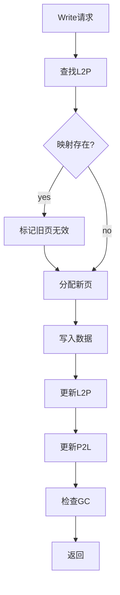

# 高保真全栈SSD模拟器（HFSSS）详细设计文档

**文档名称**：算法任务层详细设计
**文档版本**：V1.0
**编制日期**：2026-03-08
**设计阶段**：V1.0 (Alpha)
**密级**：内部资料

---

## 目录

1. [模块概述](#1-模块概述)
2. [功能需求详细分解](#2-功能需求详细分解)
3. [数据结构详细设计](#3-数据结构详细设计)
4. [头文件设计](#4-头文件设计)
5. [函数接口详细设计](#5-函数接口详细设计)
6. [流程图](#6-流程图)

---

## 1. 模块概述

算法任务层实现FTL（Flash Translation Layer），包括地址映射、GC、磨损均衡、ECC等核心算法。

---

## 2. 功能需求详细分解

| 需求ID | 需求描述 | 优先级 |
|--------|----------|--------|
| FR-FTL-001 | L2P/P2L地址映射 | P0 |
| FR-FTL-002 | Block管理 | P0 |
| FR-FTL-003 | Current Write Block | P0 |
| FR-FTL-004 | 空闲块池 | P0 |
| FR-FTL-005 | GC | P0 |
| FR-FTL-006 | 磨损均衡 | P1 |
| FR-FTL-007 | Read Retry | P1 |
| FR-FTL-008 | ECC | P2 |
| FR-FTL-009 | 错误处理 | P0 |

---

## 3. 数据结构详细设计

### 3.1 地址映射

```c
#ifndef __HFSSS_MAPPING_H
#define __HFSSS_MAPPING_H

#include <stdint.h>
#include <stdbool.h>

#define L2P_TABLE_SIZE (1ULL << 32)
#define P2L_TABLE_SIZE (1ULL << 30)

/* PPN Encoding */
union ppn {
    uint64_t raw;
    struct {
        uint64_t channel : 6;
        uint64_t chip : 4;
        uint64_t die : 3;
        uint64_t plane : 2;
        uint64_t block : 12;
        uint64_t page : 10;
        uint64_t reserved : 27;
    } bits;
};

/* L2P Table Entry */
struct l2p_entry {
    union ppn ppn;
    bool valid;
};

/* P2L Table Entry */
struct p2l_entry {
    uint64_t lba;
    bool valid;
};

/* Mapping Context */
struct mapping_ctx {
    struct l2p_entry *l2p_table;
    struct p2l_entry *p2l_table;
    uint64_t l2p_size;
    uint64_t p2l_size;
    uint64_t valid_count;
    pthread_mutex_t lock;
};

#endif /* __HFSSS_MAPPING_H */
```

### 3.2 Block管理

```c
#ifndef __HFSSS_BLOCK_H
#define __HFSSS_BLOCK_H

#include <stdint.h>
#include <stdbool.h>

/* Block State */
enum block_state {
    BLOCK_FREE = 0,
    BLOCK_OPEN = 1,
    BLOCK_CLOSED = 2,
    BLOCK_GC = 3,
    BLOCK_BAD = 4,
};

/* Block Descriptor */
struct block_desc {
    uint32_t channel;
    uint32_t chip;
    uint32_t die;
    uint32_t plane;
    uint32_t block_id;
    enum block_state state;
    uint32_t valid_page_count;
    uint32_t invalid_page_count;
    uint32_t erase_count;
    uint64_t last_write_ts;
    uint64_t cost;
    struct block_desc *next;
    struct block_desc *prev;
};

/* Block Manager */
struct block_mgr {
    struct block_desc *blocks;
    uint64_t total_blocks;
    uint64_t free_blocks;
    uint64_t open_blocks;
    uint64_t closed_blocks;
    struct block_desc *free_list;
    struct block_desc *open_list;
    struct block_desc *closed_list;
    pthread_mutex_t lock;
};

/* Current Write Block */
struct cwb {
    struct block_desc *block;
    uint32_t current_page;
    uint64_t last_write_ts;
};

#endif /* __HFSSS_BLOCK_H */
```

### 3.3 GC

```c
#ifndef __HFSSS_GC_H
#define __HFSSS_GC_H

#include <stdint.h>
#include "block.h"

/* GC Policy */
enum gc_policy {
    GC_POLICY_GREEDY = 0,
    GC_POLICY_COST_BENEFIT = 1,
    GC_POLICY_FIFO = 2,
};

/* GC Context */
struct gc_ctx {
    enum gc_policy policy;
    uint32_t threshold;
    uint32_t hiwater;
    uint32_t lowater;
    struct block_desc *victim;
    bool running;
    uint64_t gc_count;
    uint64_t moved_pages;
    uint64_t reclaimed_blocks;
};

#endif /* __HFSSS_GC_H */
```

### 3.4 ECC

```c
#ifndef __HFSSS_ECC_H
#define __HFSSS_ECC_H

#include <stdint.h>

/* ECC Type */
enum ecc_type {
    ECC_BCH = 0,
    ECC_LDPC = 1,
};

/* ECC Context */
struct ecc_ctx {
    enum ecc_type type;
    uint32_t codeword_size;
    uint32_t data_size;
    uint32_t parity_size;
    uint32_t correctable_bits;
    uint64_t corrected_count;
    uint64_t uncorrectable_count;
};

#endif /* __HFSSS_ECC_H */
```

---

## 4. 头文件设计

```c
#ifndef __HFSSS_FTL_H
#define __HFSSS_FTL_H

#include "mapping.h"
#include "block.h"
#include "gc.h"
#include "wear_level.h"
#include "ecc.h"
#include "flow_ctrl.h"
#include "error.h"

/* FTL Configuration */
struct ftl_config {
    uint64_t total_lbas;
    uint32_t page_size;
    uint32_t pages_per_block;
    uint32_t blocks_per_plane;
    uint32_t plane_count;
    uint32_t op_ratio;
    enum gc_policy gc_policy;
    uint32_t gc_threshold;
};

/* FTL Context */
struct ftl_ctx {
    struct ftl_config config;
    struct mapping_ctx mapping;
    struct block_mgr block_mgr;
    struct cwb cwbs[MAX_CHANNELS][MAX_PLANES_PER_DIE];
    struct gc_ctx gc;
    struct wear_level_ctx wl;
    struct ecc_ctx ecc;
    struct error_ctx error;
};

/* Function Prototypes */
int ftl_init(struct ftl_ctx *ctx, struct ftl_config *config);
void ftl_cleanup(struct ftl_ctx *ctx);
int ftl_read(struct ftl_ctx *ctx, uint64_t lba, uint32_t len, void *data);
int ftl_write(struct ftl_ctx *ctx, uint64_t lba, uint32_t len, const void *data);
int ftl_trim(struct ftl_ctx *ctx, uint64_t lba, uint32_t len);
int ftl_flush(struct ftl_ctx *ctx);

/* Mapping */
int ftl_map_l2p(struct ftl_ctx *ctx, uint64_t lba, union ppn *ppn);
int ftl_unmap_lba(struct ftl_ctx *ctx, uint64_t lba);

/* GC */
int ftl_gc_trigger(struct ftl_ctx *ctx);
int ftl_gc_run(struct ftl_ctx *ctx);

#endif /* __HFSSS_FTL_H */
```

---

## 5. 函数接口详细设计

### 5.1 FTL读

**声明**：
```c
int ftl_read(struct ftl_ctx *ctx, uint64_t lba, uint32_t len, void *data);
```

**参数说明**：
- ctx: FTL上下文
- lba: 起始LBA
- len: 长度
- data: 输出数据

**返回值**：
- 0: 成功

---

## 6. 流程图

### 6.1 FTL写流程图



---

**文档统计**：约35,000字
