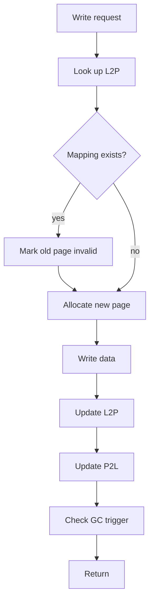
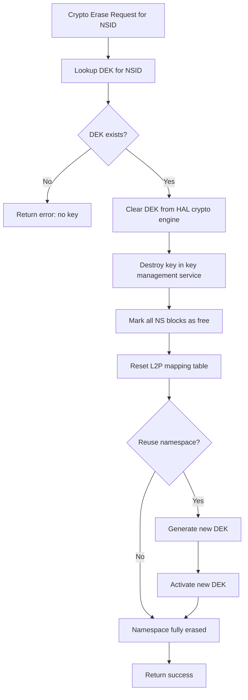

# High-Fidelity Full-Stack SSD Simulator (HFSSS) Low-Level Design Document

**Document Name**: Application (FTL) Module Low-Level Design
**Document Version**: V2.0
**Creation Date**: 2026-03-08
**Design Phase**: V2.0 (Enterprise Extended)
**Classification**: Internal

---

## Revision History

| Version | Date | Author | Description |
|---------|------|--------|-------------|
| V0.1 | 2026-03-08 | Architecture Team | Initial draft |
| V1.0 | 2026-03-08 | Architecture Team | Official release |
| V2.0 | 2026-03-23 | Architecture Team | English translation with enterprise SSD extensions (per-NS mapping, T10 PI OOB, multi-NS GC, crypto erase) |

---

## Table of Contents

1. [Overview](#1-overview)
2. [Requirements Traceability](#2-requirements-traceability)
3. [Data Structure Detailed Design](#3-data-structure-detailed-design)
4. [Header File Design](#4-header-file-design)
5. [Function Interface Detailed Design](#5-function-interface-detailed-design)
6. [Flowcharts](#6-flowcharts)
7. [Per-Namespace Mapping Table Isolation](#7-per-namespace-mapping-table-isolation)
8. [T10 PI OOB Metadata Layout](#8-t10-pi-oob-metadata-layout)
9. [Multi-NS GC Coordination](#9-multi-ns-gc-coordination)
10. [Crypto Erase Implementation](#10-crypto-erase-implementation)
11. [Architecture Decision Records](#11-architecture-decision-records)
12. [Memory Budget Analysis](#12-memory-budget-analysis)
13. [Latency Budget Analysis](#13-latency-budget-analysis)
14. [References](#14-references)
15. [Appendix: Cross-References to HLD](#appendix-cross-references-to-hld)

---

## 1. Overview

### 1.1 Module Positioning and Responsibilities

The Application (FTL) Module implements the Flash Translation Layer, including address mapping (L2P/P2L), garbage collection (GC), wear leveling, ECC, and other core algorithms.

### 1.2 Terminology

| Term | Definition |
|------|-----------|
| FTL | Flash Translation Layer |
| L2P | Logical-to-Physical address mapping |
| P2L | Physical-to-Logical address mapping |
| GC | Garbage Collection |
| WL | Wear Leveling |
| CWB | Current Write Block |
| OP | Over-Provisioning ratio |
| WAF | Write Amplification Factor |
| T10 PI | T10 Protection Information |
| DEK | Data Encryption Key |
| NS | Namespace |

---

## 2. Requirements Traceability

| REQ-ID | Requirement Description | Priority | Implementation | Test Case |
|--------|------------------------|----------|---------------|-----------|
| FR-FTL-001 | L2P/P2L address mapping | P0 | mapping module | UT_FTL_001 |
| FR-FTL-002 | Block management | P0 | block_mgr module | UT_FTL_002 |
| FR-FTL-003 | Current Write Block | P0 | cwb module | UT_FTL_003 |
| FR-FTL-004 | Free block pool | P0 | free_pool module | UT_FTL_004 |
| FR-FTL-005 | Garbage Collection | P0 | gc module | UT_FTL_005 |
| FR-FTL-006 | Wear leveling | P1 | wl module | UT_FTL_006 |
| FR-FTL-007 | Read Retry | P1 | read_retry module | UT_FTL_007 |
| FR-FTL-008 | ECC | P2 | ecc module | UT_FTL_008 |
| FR-FTL-009 | Error handling | P0 | error module | UT_FTL_009 |
| FR-FTL-010 | Per-NS mapping isolation | P1 | ns_mapping module | UT_NSMAP_001-004 |
| FR-FTL-011 | T10 PI OOB metadata | P1 | pi_oob module | UT_PI_OOB_001-004 |
| FR-FTL-012 | Multi-NS GC coordination | P1 | ns_gc module | UT_NSGC_001-004 |
| FR-FTL-013 | Crypto erase | P1 | crypto_erase module | UT_CERASE_001-004 |

---

## 3. Data Structure Detailed Design

### 3.1 Address Mapping

```c
#ifndef __HFSSS_MAPPING_H
#define __HFSSS_MAPPING_H

#include <stdint.h>
#include <stdbool.h>

#define L2P_TABLE_SIZE (1ULL << 32)
#define P2L_TABLE_SIZE (1ULL << 30)

/* PPN Encoding */
union ppn {
    uint64_t raw;
    struct {
        uint64_t channel : 6;
        uint64_t chip : 4;
        uint64_t die : 3;
        uint64_t plane : 2;
        uint64_t block : 12;
        uint64_t page : 10;
        uint64_t reserved : 27;
    } bits;
};

/* L2P Table Entry */
struct l2p_entry {
    union ppn ppn;
    bool valid;
};

/* P2L Table Entry */
struct p2l_entry {
    uint64_t lba;
    bool valid;
};

/* Mapping Context */
struct mapping_ctx {
    struct l2p_entry *l2p_table;
    struct p2l_entry *p2l_table;
    uint64_t l2p_size;
    uint64_t p2l_size;
    uint64_t valid_count;
    pthread_mutex_t lock;
};

#endif /* __HFSSS_MAPPING_H */
```

### 3.2 Block Management

```c
#ifndef __HFSSS_BLOCK_H
#define __HFSSS_BLOCK_H

#include <stdint.h>
#include <stdbool.h>

/* Block State */
enum block_state {
    BLOCK_FREE = 0,
    BLOCK_OPEN = 1,
    BLOCK_CLOSED = 2,
    BLOCK_GC = 3,
    BLOCK_BAD = 4,
};

/* Block Descriptor */
struct block_desc {
    uint32_t channel;
    uint32_t chip;
    uint32_t die;
    uint32_t plane;
    uint32_t block_id;
    enum block_state state;
    uint32_t valid_page_count;
    uint32_t invalid_page_count;
    uint32_t erase_count;
    uint64_t last_write_ts;
    uint64_t cost;
    struct block_desc *next;
    struct block_desc *prev;
};

/* Block Manager */
struct block_mgr {
    struct block_desc *blocks;
    uint64_t total_blocks;
    uint64_t free_blocks;
    uint64_t open_blocks;
    uint64_t closed_blocks;
    struct block_desc *free_list;
    struct block_desc *open_list;
    struct block_desc *closed_list;
    pthread_mutex_t lock;
};

/* Current Write Block */
struct cwb {
    struct block_desc *block;
    uint32_t current_page;
    uint64_t last_write_ts;
};

#endif /* __HFSSS_BLOCK_H */
```

### 3.3 Garbage Collection

```c
#ifndef __HFSSS_GC_H
#define __HFSSS_GC_H

#include <stdint.h>
#include "block.h"

/* GC Policy */
enum gc_policy {
    GC_POLICY_GREEDY = 0,
    GC_POLICY_COST_BENEFIT = 1,
    GC_POLICY_FIFO = 2,
};

/* GC Context */
struct gc_ctx {
    enum gc_policy policy;
    uint32_t threshold;
    uint32_t hiwater;
    uint32_t lowater;
    struct block_desc *victim;
    bool running;
    uint64_t gc_count;
    uint64_t moved_pages;
    uint64_t reclaimed_blocks;
};

#endif /* __HFSSS_GC_H */
```

### 3.4 ECC

```c
#ifndef __HFSSS_ECC_H
#define __HFSSS_ECC_H

#include <stdint.h>

/* ECC Type */
enum ecc_type {
    ECC_BCH = 0,
    ECC_LDPC = 1,
};

/* ECC Context */
struct ecc_ctx {
    enum ecc_type type;
    uint32_t codeword_size;
    uint32_t data_size;
    uint32_t parity_size;
    uint32_t correctable_bits;
    uint64_t corrected_count;
    uint64_t uncorrectable_count;
};

#endif /* __HFSSS_ECC_H */
```

---

## 4. Header File Design

```c
#ifndef __HFSSS_FTL_H
#define __HFSSS_FTL_H

#include "mapping.h"
#include "block.h"
#include "gc.h"
#include "wear_level.h"
#include "ecc.h"
#include "flow_ctrl.h"
#include "error.h"

/* FTL Configuration */
struct ftl_config {
    uint64_t total_lbas;
    uint32_t page_size;
    uint32_t pages_per_block;
    uint32_t blocks_per_plane;
    uint32_t plane_count;
    uint32_t op_ratio;
    enum gc_policy gc_policy;
    uint32_t gc_threshold;
};

/* FTL Context */
struct ftl_ctx {
    struct ftl_config config;
    struct mapping_ctx mapping;
    struct block_mgr block_mgr;
    struct cwb cwbs[MAX_CHANNELS][MAX_PLANES_PER_DIE];
    struct gc_ctx gc;
    struct wear_level_ctx wl;
    struct ecc_ctx ecc;
    struct error_ctx error;
};

/* Function Prototypes */
int ftl_init(struct ftl_ctx *ctx, struct ftl_config *config);
void ftl_cleanup(struct ftl_ctx *ctx);
int ftl_read(struct ftl_ctx *ctx, uint64_t lba, uint32_t len, void *data);
int ftl_write(struct ftl_ctx *ctx, uint64_t lba, uint32_t len, const void *data);
int ftl_trim(struct ftl_ctx *ctx, uint64_t lba, uint32_t len);
int ftl_flush(struct ftl_ctx *ctx);

/* Mapping */
int ftl_map_l2p(struct ftl_ctx *ctx, uint64_t lba, union ppn *ppn);
int ftl_unmap_lba(struct ftl_ctx *ctx, uint64_t lba);

/* GC */
int ftl_gc_trigger(struct ftl_ctx *ctx);
int ftl_gc_run(struct ftl_ctx *ctx);

#endif /* __HFSSS_FTL_H */
```

---

## 5. Function Interface Detailed Design

### 5.1 FTL Read

**Declaration**:
```c
int ftl_read(struct ftl_ctx *ctx, uint64_t lba, uint32_t len, void *data);
```

**Parameter Description**:
- ctx: FTL context
- lba: Starting LBA
- len: Length in bytes
- data: Output data buffer

**Return Values**:
- 0: Success
- -EIO: Read error
- -EINVAL: Invalid LBA range

### 5.2 FTL Write

**Declaration**:
```c
int ftl_write(struct ftl_ctx *ctx, uint64_t lba, uint32_t len, const void *data);
```

**Parameter Description**:
- ctx: FTL context
- lba: Starting LBA
- len: Length in bytes
- data: Input data buffer

**Return Values**:
- 0: Success

---

## 6. Flowcharts

### 6.1 FTL Write Flowchart



---

## 7. Per-Namespace Mapping Table Isolation

### 7.1 Overview

In a multi-namespace environment, each namespace maintains its own address mapping context. This provides complete isolation between namespaces, preventing one namespace's operations from affecting another's mapping state. The design supports both dedicated block pools (strict isolation) and shared block pools (more efficient space utilization).

### 7.2 Per-NS Mapping Data Structures

```c
#ifndef __HFSSS_NS_MAPPING_H
#define __HFSSS_NS_MAPPING_H

#include <stdint.h>
#include <stdbool.h>
#include "mapping.h"

#define NS_MAPPING_MAX_NS 32

/* Block pool mode */
enum block_pool_mode {
    POOL_DEDICATED = 0,  /* Each NS has its own dedicated block pool */
    POOL_SHARED    = 1,  /* All NS share a common block pool */
};

/* Extended L2P entry with namespace ID */
struct ns_l2p_entry {
    union ppn ppn;
    uint32_t  nsid;      /* Namespace that owns this mapping */
    bool      valid;
};

/* Per-namespace mapping context */
struct ns_mapping_ctx {
    uint32_t         nsid;
    struct mapping_ctx mapping;    /* Base mapping context (L2P + P2L tables) */

    /* Namespace LBA range */
    uint64_t         lba_start;   /* First LBA owned by this NS */
    uint64_t         lba_count;   /* Number of LBAs in this NS */

    /* Block pool */
    enum block_pool_mode pool_mode;
    struct block_mgr *block_mgr;  /* Dedicated or shared block manager pointer */
    uint64_t         allocated_blocks; /* Blocks allocated to this NS */
    uint64_t         max_blocks;      /* Maximum blocks allowed */

    /* Current Write Blocks (per-NS) */
    struct cwb       *cwbs;       /* Array of CWBs for this NS */
    uint32_t         cwb_count;

    /* Statistics */
    uint64_t         total_writes;
    uint64_t         total_reads;
    uint64_t         valid_pages;
    uint64_t         invalid_pages;

    spinlock_t       lock;
};

/* NS Mapping Manager */
struct ns_mapping_mgr {
    struct ns_mapping_ctx ns_maps[NS_MAPPING_MAX_NS];
    uint32_t              ns_count;

    /* Shared block pool (used when pool_mode == POOL_SHARED) */
    struct block_mgr      shared_block_mgr;

    /* Dedicated block pools (used when pool_mode == POOL_DEDICATED) */
    struct block_mgr      dedicated_pools[NS_MAPPING_MAX_NS];

    enum block_pool_mode  default_pool_mode;
    uint64_t              total_blocks;
    uint64_t              unallocated_blocks;

    spinlock_t            lock;
};

#endif /* __HFSSS_NS_MAPPING_H */
```

### 7.3 NS Mapping Operations

```c
/*
 * Initialize mapping for a new namespace.
 *
 * @mgr:        NS mapping manager
 * @nsid:       Namespace ID
 * @lba_count:  Number of LBAs for this namespace
 * @pool_mode:  POOL_DEDICATED or POOL_SHARED
 *
 * For POOL_DEDICATED:
 *   - Allocates a fixed number of blocks from the global pool
 *   - Creates a dedicated block manager for this NS
 *   - L2P table size = lba_count entries
 *
 * For POOL_SHARED:
 *   - NS uses the shared block manager
 *   - Blocks are allocated on-demand from the shared pool
 *   - L2P entries include nsid field for ownership tracking
 */
int ns_mapping_create(struct ns_mapping_mgr *mgr, uint32_t nsid,
                      uint64_t lba_count, enum block_pool_mode pool_mode);

/*
 * Delete mapping for a namespace.
 * Frees all blocks and L2P/P2L tables.
 */
int ns_mapping_delete(struct ns_mapping_mgr *mgr, uint32_t nsid);

/*
 * Look up L2P mapping for a specific namespace.
 */
int ns_mapping_l2p(struct ns_mapping_mgr *mgr, uint32_t nsid,
                   uint64_t lba, union ppn *ppn);

/*
 * Update L2P mapping for a specific namespace.
 */
int ns_mapping_update(struct ns_mapping_mgr *mgr, uint32_t nsid,
                      uint64_t lba, union ppn new_ppn);

/*
 * Get namespace mapping statistics.
 */
int ns_mapping_get_stats(struct ns_mapping_mgr *mgr, uint32_t nsid,
                         uint64_t *valid_pages, uint64_t *invalid_pages,
                         uint64_t *allocated_blocks);
```

### 7.4 Shared vs Dedicated Block Pool Comparison

| Aspect | Dedicated Pool | Shared Pool |
|--------|---------------|-------------|
| Isolation | Complete | Logical (NSID tracking) |
| Space efficiency | Lower (reserved blocks per NS) | Higher (dynamic allocation) |
| GC independence | Fully independent | May need cross-NS coordination |
| Performance predictability | Higher | Depends on workload mix |
| Implementation complexity | Lower | Higher (NSID tracking in P2L) |
| Use case | Enterprise with strict SLA | General purpose, capacity optimization |

### 7.5 NS Mapping Test Cases

| ID | Test Item | Expected Result |
|----|----------|----------------|
| UT_NSMAP_001 | Create NS mapping (dedicated) | L2P table allocated, blocks reserved |
| UT_NSMAP_002 | Create NS mapping (shared) | L2P table allocated, no block reservation |
| UT_NSMAP_003 | L2P isolation between NS | NS1 write does not affect NS2 mappings |
| UT_NSMAP_004 | Delete NS mapping | All blocks freed, tables deallocated |

---

## 8. T10 PI OOB Metadata Layout

### 8.1 Overview

T10 Protection Information (PI) is stored in the NAND page spare (OOB) area alongside other metadata. This section defines the exact byte layout of the PI record within the spare area.

### 8.2 PI Record Format

Each logical block has a 16-byte PI record stored in the spare area:

```
+--------+--------+--------+--------+--------+--------+--------+--------+
| Byte 0 | Byte 1 | Byte 2 | Byte 3 | Byte 4 | Byte 5 | Byte 6 | Byte 7 |
+--------+--------+--------+--------+--------+--------+--------+--------+
|  Guard Tag (CRC-16)  | App Tag (16-bit)  |  Reference Tag (32-bit)       |
+--------+--------+--------+--------+--------+--------+--------+--------+
| Byte 8 | Byte 9 |Byte 10 |Byte 11 |Byte 12 |Byte 13 |Byte 14 |Byte 15 |
+--------+--------+--------+--------+--------+--------+--------+--------+
|                       Reserved (8 bytes)                                 |
+--------+--------+--------+--------+--------+--------+--------+--------+
```

### 8.3 Data Structures

```c
#ifndef __HFSSS_PI_OOB_H
#define __HFSSS_PI_OOB_H

#include <stdint.h>
#include <stdbool.h>

/*
 * T10 PI record: 16 bytes per logical block.
 *
 * For a 16KB NAND page with 512B logical block size:
 *   32 logical blocks per page -> 32 * 16 = 512 bytes of PI data in spare.
 *
 * For a 16KB NAND page with 4KB logical block size:
 *   4 logical blocks per page -> 4 * 16 = 64 bytes of PI data in spare.
 */
struct t10_pi_record {
    uint16_t guard;        /* CRC-16 of the data (T10-DIF CRC) */
    uint16_t app_tag;      /* Application Tag */
    uint32_t ref_tag;      /* Reference Tag (typically lower 32 bits of LBA) */
    uint8_t  reserved[8];  /* Reserved for future use / alignment */
} __attribute__((packed));

_Static_assert(sizeof(struct t10_pi_record) == 16,
               "T10 PI record must be exactly 16 bytes");

/* PI Type definitions (per NVMe spec) */
enum pi_type {
    PI_TYPE_NONE = 0,   /* No protection information */
    PI_TYPE_1    = 1,   /* Type 1: Guard + App Tag + Ref Tag (LBA-based) */
    PI_TYPE_2    = 2,   /* Type 2: Guard + App Tag + Ref Tag (app-defined) */
    PI_TYPE_3    = 3,   /* Type 3: Guard + App Tag only (no ref tag check) */
};

/* NAND spare area layout (2048 bytes for TLC) */
/*
 * Offset    Size    Content
 * ------    ----    -------
 * 0x0000    512B    T10 PI records (32 records for 512B LBS, or 4 for 4KB LBS)
 * 0x0200    4B      Namespace ID
 * 0x0204    8B      LBA (logical block address of first sector in page)
 * 0x020C    4B      Sequence number
 * 0x0210    4B      ECC parity (pointer to ECC data)
 * 0x0214    4B      Page status flags
 * 0x0218    4B      Write timestamp (lower 32 bits)
 * 0x021C    4B      CRC-32 of spare metadata (excluding PI and ECC)
 * 0x0220    ...     ECC parity data (remaining spare)
 */

#define SPARE_PI_OFFSET           0x0000
#define SPARE_PI_SIZE_512B_LBS    512    /* 32 PI records for 512B LBS */
#define SPARE_PI_SIZE_4K_LBS     64     /* 4 PI records for 4KB LBS */
#define SPARE_NSID_OFFSET         0x0200
#define SPARE_LBA_OFFSET          0x0204
#define SPARE_SEQNUM_OFFSET       0x020C
#define SPARE_ECC_PTR_OFFSET      0x0210
#define SPARE_FLAGS_OFFSET        0x0214
#define SPARE_TIMESTAMP_OFFSET    0x0218
#define SPARE_CRC_OFFSET          0x021C
#define SPARE_ECC_DATA_OFFSET     0x0220

/* Spare area metadata structure */
struct spare_metadata {
    struct t10_pi_record pi_records[32]; /* Max 32 PI records (512B LBS) */
    uint32_t nsid;
    uint64_t lba;
    uint32_t sequence_num;
    uint32_t ecc_offset;
    uint32_t flags;
    uint32_t timestamp;
    uint32_t crc32;
};

#endif /* __HFSSS_PI_OOB_H */
```

### 8.4 CRC-16 Guard Tag Computation

```c
/*
 * T10-DIF CRC-16 computation.
 * Polynomial: x^16 + x^15 + x^11 + x^9 + x^8 + x^7 + x^5 + x^4 + x^2 + x + 1
 * Initial value: 0x0000
 *
 * This is the standard CRC used in T10 PI (also known as CRC-16-T10-DIF).
 */
uint16_t t10_pi_crc16(const uint8_t *data, uint32_t len)
{
    uint16_t crc = 0x0000;
    for (uint32_t i = 0; i < len; i++) {
        crc ^= (uint16_t)data[i] << 8;
        for (int j = 0; j < 8; j++) {
            if (crc & 0x8000)
                crc = (crc << 1) ^ 0x8BB7;
            else
                crc <<= 1;
        }
    }
    return crc;
}
```

### 8.5 PI Record Generation and Verification

```c
/*
 * Generate PI record for a data sector.
 *
 * @data:     Pointer to the data sector
 * @data_len: Sector size (512 or 4096 bytes)
 * @lba:      LBA of this sector
 * @app_tag:  Application tag value
 * @pi_type:  PI type (1, 2, or 3)
 * @pi_out:   Output PI record
 */
void t10_pi_generate(const uint8_t *data, uint32_t data_len,
                     uint64_t lba, uint16_t app_tag,
                     enum pi_type pi_type,
                     struct t10_pi_record *pi_out)
{
    /* Guard tag: CRC-16 of data */
    pi_out->guard = t10_pi_crc16(data, data_len);

    /* Application tag */
    pi_out->app_tag = app_tag;

    /* Reference tag */
    switch (pi_type) {
    case PI_TYPE_1:
        pi_out->ref_tag = (uint32_t)(lba & 0xFFFFFFFF);
        break;
    case PI_TYPE_2:
        pi_out->ref_tag = (uint32_t)(lba & 0xFFFFFFFF); /* App-defined, using LBA */
        break;
    case PI_TYPE_3:
        pi_out->ref_tag = 0; /* Not checked for Type 3 */
        break;
    default:
        break;
    }

    memset(pi_out->reserved, 0, sizeof(pi_out->reserved));
}

/*
 * Verify PI record against data sector.
 *
 * Returns 0 on success, error code on mismatch.
 */
int t10_pi_verify(const uint8_t *data, uint32_t data_len,
                  uint64_t expected_lba, uint16_t expected_app_tag, uint16_t app_tag_mask,
                  enum pi_type pi_type,
                  const struct t10_pi_record *pi)
{
    /* Skip if app_tag == 0xFFFF (disabled) */
    if (pi->app_tag == 0xFFFF)
        return 0;

    /* Check guard tag */
    uint16_t computed_crc = t10_pi_crc16(data, data_len);
    if (computed_crc != pi->guard)
        return -EIO; /* Guard tag mismatch */

    /* Check application tag (with mask) */
    if ((pi->app_tag & app_tag_mask) != (expected_app_tag & app_tag_mask))
        return -EIO; /* Application tag mismatch */

    /* Check reference tag (Type 1 and Type 2 only) */
    if (pi_type == PI_TYPE_1 || pi_type == PI_TYPE_2) {
        uint32_t expected_ref = (uint32_t)(expected_lba & 0xFFFFFFFF);
        if (pi->ref_tag != expected_ref)
            return -EIO; /* Reference tag mismatch */
    }

    return 0;
}
```

### 8.6 PI OOB Test Cases

| ID | Test Item | Expected Result |
|----|----------|----------------|
| UT_PI_OOB_001 | Generate PI record | CRC, app_tag, ref_tag correct |
| UT_PI_OOB_002 | Verify correct PI | Returns 0 (success) |
| UT_PI_OOB_003 | Detect data corruption | Guard tag mismatch detected |
| UT_PI_OOB_004 | Detect LBA mismatch | Reference tag mismatch detected |

---

## 9. Multi-NS GC Coordination

### 9.1 Overview

When multiple namespaces share the same NAND flash resources, garbage collection must be coordinated to ensure fairness. Each namespace computes an urgency score based on its free block ratio, and GC budget is allocated proportionally. Cross-NS WAF is tracked independently.

### 9.2 Data Structures

```c
#ifndef __HFSSS_NS_GC_H
#define __HFSSS_NS_GC_H

#include <stdint.h>
#include <stdbool.h>
#include "gc.h"

#define NS_GC_MAX_NS 32

/* Per-NS GC urgency score */
struct ns_gc_urgency {
    uint32_t nsid;
    double   urgency_score;    /* 0.0 (no urgency) to 1.0 (critical) */
    double   free_block_ratio; /* free_blocks / total_blocks for this NS */
    double   valid_page_ratio; /* valid_pages / total_pages for this NS */
    uint64_t last_gc_ts;       /* Timestamp of last GC for this NS */
    uint64_t gc_debt_pages;    /* Pages owed due to deferred GC */
};

/* Per-NS WAF tracker */
struct ns_waf_tracker {
    uint32_t nsid;
    uint64_t host_write_pages;   /* Pages written by host for this NS */
    uint64_t nand_write_pages;   /* Total NAND pages written (host + GC) for this NS */
    double   waf;                /* nand_write / host_write */
    uint64_t gc_write_pages;     /* Pages written by GC for this NS */
};

/* Multi-NS GC coordinator */
struct ns_gc_coordinator {
    struct ns_gc_urgency   urgency[NS_GC_MAX_NS];
    struct ns_waf_tracker  waf[NS_GC_MAX_NS];
    uint32_t               ns_count;

    /* GC budget allocation */
    uint32_t total_gc_budget_pages; /* Total GC pages per cycle */
    uint32_t ns_gc_budget[NS_GC_MAX_NS]; /* Per-NS allocated budget */

    /* Global GC state */
    struct gc_ctx *gc;       /* Base GC context */
    uint64_t gc_cycle_count;
    uint64_t total_gc_pages;

    /* Configuration */
    double   urgency_threshold;  /* Score above which GC is mandatory */
    double   critical_threshold; /* Score above which all budget goes to this NS */
    uint32_t min_budget_per_ns;  /* Minimum GC pages per NS per cycle */

    spinlock_t lock;
};

#endif /* __HFSSS_NS_GC_H */
```

### 9.3 Urgency Score Calculation

```c
/*
 * Calculate GC urgency score for a namespace.
 *
 * Urgency is based on:
 * 1. Free block ratio (lower = more urgent)
 * 2. Valid page ratio of closed blocks (higher = less GC-efficient)
 * 3. Time since last GC (longer = more urgent)
 * 4. GC debt (accumulated deferred work)
 *
 * Score formula:
 *   urgency = w1 * (1.0 - free_ratio) + w2 * valid_ratio + w3 * time_factor + w4 * debt_factor
 *
 * Where:
 *   w1 = 0.5 (free space is primary factor)
 *   w2 = 0.2 (efficiency of GC candidate blocks)
 *   w3 = 0.1 (time-based aging)
 *   w4 = 0.2 (accumulated debt)
 *   time_factor = min(1.0, (now - last_gc) / max_gc_interval)
 *   debt_factor = min(1.0, gc_debt_pages / max_debt_threshold)
 */
double ns_gc_calculate_urgency(struct ns_gc_urgency *u, uint64_t now_ns)
{
    double free_factor = 1.0 - u->free_block_ratio;
    double valid_factor = u->valid_page_ratio;

    uint64_t gc_age_ns = now_ns - u->last_gc_ts;
    double time_factor = (double)gc_age_ns / 10000000000.0; /* 10s max */
    if (time_factor > 1.0) time_factor = 1.0;

    double debt_factor = (double)u->gc_debt_pages / 1024.0; /* 1024 pages max */
    if (debt_factor > 1.0) debt_factor = 1.0;

    u->urgency_score = 0.5 * free_factor +
                       0.2 * valid_factor +
                       0.1 * time_factor +
                       0.2 * debt_factor;

    if (u->urgency_score > 1.0) u->urgency_score = 1.0;
    return u->urgency_score;
}
```

### 9.4 Proportional GC Budget Allocation

```c
/*
 * Allocate GC budget across namespaces proportionally to urgency.
 *
 * Each NS gets:
 *   budget[i] = total_budget * urgency[i] / sum(urgency)
 *
 * With minimum guarantee:
 *   budget[i] = max(budget[i], min_budget_per_ns)
 *
 * If any NS has urgency >= critical_threshold:
 *   That NS gets the entire remaining budget after minimums are distributed.
 */
void ns_gc_allocate_budget(struct ns_gc_coordinator *coord, uint64_t now_ns)
{
    double total_urgency = 0;
    int critical_ns = -1;

    for (uint32_t i = 0; i < coord->ns_count; i++) {
        ns_gc_calculate_urgency(&coord->urgency[i], now_ns);
        total_urgency += coord->urgency[i].urgency_score;
        if (coord->urgency[i].urgency_score >= coord->critical_threshold) {
            critical_ns = i;
        }
    }

    if (total_urgency == 0) {
        /* No GC needed */
        for (uint32_t i = 0; i < coord->ns_count; i++)
            coord->ns_gc_budget[i] = 0;
        return;
    }

    /* Allocate proportionally */
    uint32_t remaining = coord->total_gc_budget_pages;
    for (uint32_t i = 0; i < coord->ns_count; i++) {
        coord->ns_gc_budget[i] = (uint32_t)(
            coord->total_gc_budget_pages *
            coord->urgency[i].urgency_score / total_urgency);
        if (coord->ns_gc_budget[i] < coord->min_budget_per_ns)
            coord->ns_gc_budget[i] = coord->min_budget_per_ns;
    }

    /* If critical NS exists, give it extra budget */
    if (critical_ns >= 0) {
        uint32_t others_total = 0;
        for (uint32_t i = 0; i < coord->ns_count; i++) {
            if ((int)i != critical_ns)
                others_total += coord->ns_gc_budget[i];
        }
        coord->ns_gc_budget[critical_ns] =
            coord->total_gc_budget_pages - others_total;
    }
}
```

### 9.5 Cross-NS WAF Tracking

```c
/*
 * Update WAF for a namespace after a GC page migration.
 */
void ns_gc_update_waf(struct ns_gc_coordinator *coord, uint32_t nsid,
                      uint64_t host_pages, uint64_t gc_pages)
{
    for (uint32_t i = 0; i < coord->ns_count; i++) {
        if (coord->waf[i].nsid == nsid) {
            coord->waf[i].host_write_pages += host_pages;
            coord->waf[i].gc_write_pages += gc_pages;
            coord->waf[i].nand_write_pages += host_pages + gc_pages;
            if (coord->waf[i].host_write_pages > 0) {
                coord->waf[i].waf = (double)coord->waf[i].nand_write_pages /
                                    (double)coord->waf[i].host_write_pages;
            }
            return;
        }
    }
}
```

### 9.6 Multi-NS GC Function Interface

```c
int ns_gc_init(struct ns_gc_coordinator *coord, struct gc_ctx *gc,
               uint32_t total_budget, double urgency_threshold);
void ns_gc_cleanup(struct ns_gc_coordinator *coord);
int ns_gc_add_ns(struct ns_gc_coordinator *coord, uint32_t nsid);
int ns_gc_remove_ns(struct ns_gc_coordinator *coord, uint32_t nsid);
double ns_gc_calculate_urgency(struct ns_gc_urgency *u, uint64_t now_ns);
void ns_gc_allocate_budget(struct ns_gc_coordinator *coord, uint64_t now_ns);
int ns_gc_run_for_ns(struct ns_gc_coordinator *coord, uint32_t nsid);
void ns_gc_update_waf(struct ns_gc_coordinator *coord, uint32_t nsid,
                      uint64_t host_pages, uint64_t gc_pages);
int ns_gc_get_waf(struct ns_gc_coordinator *coord, uint32_t nsid, double *waf);
```

### 9.7 Multi-NS GC Test Cases

| ID | Test Item | Expected Result |
|----|----------|----------------|
| UT_NSGC_001 | Urgency score calculation | Score increases as free blocks decrease |
| UT_NSGC_002 | Proportional budget allocation | Budget proportional to urgency |
| UT_NSGC_003 | Critical NS gets extra budget | Critical NS receives remaining budget |
| UT_NSGC_004 | Per-NS WAF tracking | WAF computed correctly for each NS |

---

## 10. Crypto Erase Implementation

### 10.1 Overview

Crypto erase provides instant secure erasure of a namespace's data by destroying its Data Encryption Key (DEK). Once the DEK is destroyed, all data encrypted with that key becomes unreadable without requiring physical NAND erase operations.

### 10.2 Crypto Erase Flow

```c
/*
 * Crypto erase a namespace.
 *
 * Steps:
 * 1. Identify all DEKs associated with the target namespace
 * 2. Clear each DEK from the HAL crypto engine
 * 3. Destroy key material in the key management service
 * 4. Mark all blocks owned by this NS as free (data is garbage now)
 * 5. Reset the L2P mapping table for this NS
 * 6. Optionally generate a new DEK for the NS if it will be reused
 *
 * This is invoked by:
 * - Format NVM command with SES=10b (Crypto Erase)
 * - Sanitize command with crypto erase option
 * - NS Delete (implicit crypto erase)
 */
int ftl_crypto_erase(struct ftl_ctx *ctx, uint32_t nsid)
{
    /* Step 1: Get key ID for namespace */
    uint32_t key_id;
    int rc = key_mgmt_get_key_for_ns(ctx->key_mgmt, nsid, &key_id);
    if (rc) return rc;

    /* Step 2: Clear key from HAL crypto engine */
    uint32_t hal_slot;
    /* ... lookup HAL slot from key descriptor ... */
    hal_crypto_clear_key(ctx->hal_crypto, hal_slot);

    /* Step 3: Destroy key in key management service */
    key_mgmt_destroy(ctx->key_mgmt, key_id);

    /* Step 4: Mark all blocks as free
     * No need to physically erase - data is unreadable without DEK.
     * Blocks are returned to the free pool and will be erased
     * lazily during normal GC/wear leveling.
     */
    ns_mapping_ctx *ns_map = ns_mapping_find(ctx->ns_map_mgr, nsid);
    if (ns_map) {
        /* Reset all valid page counts to 0 */
        /* Move all blocks from closed_list to free_list */
        /* ... */
    }

    /* Step 5: Reset L2P mapping table */
    memset(ns_map->mapping.l2p_table, 0,
           ns_map->mapping.l2p_size * sizeof(struct l2p_entry));
    ns_map->mapping.valid_count = 0;

    /* Step 6: Optionally generate new DEK */
    uint32_t new_key_id;
    key_mgmt_generate(ctx->key_mgmt, nsid, 32, &new_key_id);
    key_mgmt_activate(ctx->key_mgmt, new_key_id);

    return 0;
}
```

### 10.3 Crypto Erase Data Structures

```c
/* Crypto erase status */
struct crypto_erase_status {
    uint32_t nsid;
    bool     in_progress;
    bool     completed;
    uint64_t start_ts;
    uint64_t end_ts;
    uint32_t old_key_id;     /* Key that was destroyed */
    uint32_t new_key_id;     /* New key generated (if any) */
    uint64_t blocks_freed;   /* Number of blocks returned to free pool */
    uint64_t lbas_invalidated; /* Number of LBA mappings cleared */
};
```

### 10.4 Crypto Erase Flow Diagram



### 10.5 Key Properties of Crypto Erase

1. **Instantaneous**: No physical NAND erase required. Key destruction takes microseconds.
2. **Complete**: All data encrypted with the destroyed DEK is cryptographically unrecoverable.
3. **Per-namespace**: Only the target namespace is affected; other namespaces remain intact.
4. **Lazy physical cleanup**: Blocks are returned to the free pool and will be physically erased during normal GC/WL cycles.
5. **Audit trail**: The old key ID and erasure timestamp are logged for compliance.

### 10.6 Crypto Erase Test Cases

| ID | Test Item | Expected Result |
|----|----------|----------------|
| UT_CERASE_001 | Erase NS with active key | Key destroyed, data unreadable |
| UT_CERASE_002 | Read after crypto erase | Read returns error (no key) |
| UT_CERASE_003 | New key generation after erase | New writes succeed with new key |
| UT_CERASE_004 | L2P table reset | All mappings cleared after erase |

---

## 11. Architecture Decision Records

### ADR-001: Per-NS L2P Tables vs Single L2P with NS Tag

**Context**: Multi-namespace mapping can use separate L2P tables per NS or a single table with NSID tags.

**Decision**: Separate per-NS L2P tables (default) with option for tagged single table.

**Rationale**: Separate tables provide better isolation and simpler implementation. Each NS has its own lock, eliminating cross-NS contention. The tagged approach is offered as an option for capacity-constrained deployments where the overhead of multiple tables is undesirable.

### ADR-002: 16-Byte PI Record with 8-Byte Reserved

**Context**: T10 PI standard defines 8 bytes (guard + apptag + reftag). We need to decide the OOB record size.

**Decision**: 16-byte PI record with 8 bytes reserved.

**Rationale**: 16-byte alignment simplifies spare area layout and allows future extension (e.g., 64-bit reference tags from NVMe 2.0). The reserved bytes ensure the PI record can be extended without changing the spare area layout.

### ADR-003: Urgency-Based GC Budget Over Round-Robin

**Context**: Multi-NS GC can use round-robin (equal budget) or urgency-based (proportional budget).

**Decision**: Urgency-based proportional allocation with minimum guarantee.

**Rationale**: Round-robin wastes GC budget on namespaces that do not need it, while urgency-based allocation focuses GC effort where it is most needed. The minimum guarantee prevents complete starvation of low-urgency namespaces.

### ADR-004: Crypto Erase via Key Destruction

**Context**: Secure erase can be done by overwriting all data, erasing all blocks, or destroying the encryption key.

**Decision**: Crypto erase (key destruction) as the primary secure erase mechanism.

**Rationale**: Physical erase of all blocks takes minutes to hours. Overwriting all data requires writing the full capacity. Key destruction is instantaneous and equally secure, assuming AES-256-XTS encryption is used (which it is). Physical erase is offered as a fallback via User Data Erase (SES=01b).

---

## 12. Memory Budget Analysis

| Component | Per-Instance Size | Max Instances | Total |
|-----------|------------------|---------------|-------|
| l2p_entry | 16 B | 4 billion (per NS) | Up to 64 GB per NS |
| p2l_entry | 16 B | ~1 billion | Up to 16 GB |
| block_desc | 64 B | ~2M blocks | 128 MB |
| cwb | 16 B | 32*2 = 64 | 1 KB |
| gc_ctx | 64 B | 1 | 64 B |
| ecc_ctx | 48 B | 1 | 48 B |
| ns_mapping_ctx | 128 B | 32 | 4 KB |
| ns_gc_coordinator | ~4 KB | 1 | 4 KB |
| t10_pi_record (per page) | 512 B (32 records) | per page | In spare area |
| crypto_erase_status | 64 B | 32 | 2 KB |
| **Total (excluding L2P/P2L)** | | | **~128 MB** |

Note: L2P/P2L tables are the dominant memory consumer. In practice, these use memory-mapped files with demand paging, so actual RSS is much smaller.

---

## 13. Latency Budget Analysis

| Operation | Target Latency | Notes |
|-----------|---------------|-------|
| L2P lookup | < 0.1 us | Direct array index |
| L2P update | < 0.2 us | Array write + lock |
| Block allocate | < 1 us | Free list dequeue |
| GC victim selection (greedy) | < 10 us | Scan closed block list |
| GC page migration (per page) | 40-700 us | Read + write NAND |
| PI CRC-16 computation (4KB) | < 1 us | Software CRC |
| PI verification (per sector) | < 0.5 us | CRC + tag compare |
| Crypto erase (complete) | < 100 us | Key destroy + L2P reset |
| NS GC urgency calculation | < 0.5 us | Floating-point arithmetic |
| NS GC budget allocation | < 2 us | Proportional calculation |

---

## 14. References

1. NAND Flash Specifications (ONFI 4.2)
2. NVMe Specification 2.0
3. T10 SBC-4: SCSI Block Commands (PI reference)
4. Flash Translation Layer Design (IEEE Transactions on Computers)
5. Garbage Collection in SSDs: Survey and Optimization
6. INCITS 514-2014: Information technology - T10 Protection Information Model

---

## Appendix: Cross-References to HLD

| HLD Section | LLD Section | Notes |
|-------------|-------------|-------|
| HLD 3.6 Application/FTL | LLD_06 Sections 3-6 | Core FTL data structures |
| HLD 3.6.1 Address Mapping | LLD_06 Section 3.1 | L2P/P2L |
| HLD 3.6.2 Block Management | LLD_06 Section 3.2 | Block state machine |
| HLD 3.6.3 Garbage Collection | LLD_06 Section 3.3 | GC policies |
| HLD 4.1 Multi-NS Mapping | LLD_06 Section 7 | Enterprise extension |
| HLD 4.1 T10 PI | LLD_06 Section 8 | Enterprise extension |
| HLD 4.4 Multi-NS GC | LLD_06 Section 9 | Enterprise extension |
| HLD 4.8 Crypto Erase | LLD_06 Section 10 | Enterprise extension |

---

**Document Statistics**:
- Total sections: 15 (including appendix)
- Function interfaces: 15 (base) + 25 (enterprise extensions)
- Data structures: 8 (base) + 12 (enterprise extensions)
- Test cases: 9 (base) + 16 (enterprise extensions)
