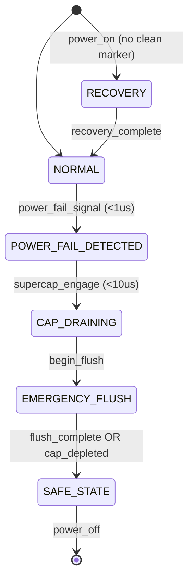

# Unexpected Power Loss Protection (UPLP) Low-Level Design

## Revision History

| Version | Date       | Author | Description     |
|---------|------------|--------|-----------------|
| V1.0    | 2026-03-23 | HFSSS  | Initial release |

## Table of Contents

1. [Overview](#1-overview)
2. [Requirements Traceability](#2-requirements-traceability)
3. [Supercapacitor Model](#3-supercapacitor-model)
4. [UPLP State Machine](#4-uplp-state-machine)
5. [Emergency Metadata Flush](#5-emergency-metadata-flush)
6. [Atomic Write Unit](#6-atomic-write-unit)
7. [Recovery Sequence](#7-recovery-sequence)
8. [Test Hooks](#8-test-hooks)
9. [Architecture Decision Records](#9-architecture-decision-records)
10. [Test Plan](#10-test-plan)

---

## 1. Overview

**Purpose**: Simulate enterprise SSD power loss behavior including supercapacitor-backed emergency flush, atomic write guarantees, and post-power-loss recovery.

**Scope**: This module models the complete unexpected power loss protection (UPLP) lifecycle: detection of power failure, supercapacitor energy budget management, prioritized emergency metadata flush, torn write detection, and recovery on next power-up.

**References**: JEDEC JESD218B (Solid-State Drive Requirements and Endurance Test Method), NVMe Base Specification 2.0 (Power Loss Notification).

---

## 2. Requirements Traceability

| Req ID  | Description | Priority | Target |
|---------|-------------|----------|--------|
| REQ-139 | Supercapacitor energy model: configurable capacitance, ESR, discharge curve | P0 | V3.0 |
| REQ-140 | UPLP state machine: NORMAL -> POWER_FAIL_DETECTED -> CAP_DRAINING -> EMERGENCY_FLUSH -> SAFE_STATE | P0 | V3.0 |
| REQ-141 | Emergency metadata flush priority: in-flight NAND completion -> L2P journal -> BBT -> SMART -> WAL -> SysInfo | P0 | V3.0 |
| REQ-142 | Atomic write unit: 4KB aligned, single NAND page program is atomic | P0 | V3.0 |
| REQ-143 | Torn write detection: sequence numbers + CRC per write unit | P0 | V3.0 |
| REQ-144 | Recovery sequence: detect unclean shutdown -> load checkpoint -> replay WAL -> detect torn writes -> rebuild state | P0 | V3.0 |
| REQ-145 | Recovery time budget: < 5 seconds for 1TB drive | P1 | V3.0 |
| REQ-146 | Test hooks: power fail injection at configurable delay, phase-specific injection | P0 | V3.0 |

---

## 3. Supercapacitor Model

### 3.1 Parameters

```c
struct supercap_model {
    double capacitance_f;    /* 1-10F configurable */
    double esr_ohm;          /* 0.1-1.0 ohm, equivalent series resistance */
    double voltage_v;        /* current voltage, starts at V_charged */
    double v_cutoff;         /* minimum operating voltage (e.g., 2.7V) */
    double energy_j;         /* remaining energy in joules */
    double v_charged;        /* initial charged voltage (e.g., 5.0V) */
    double r_load;           /* load resistance of flush circuitry */
    uint64_t discharge_start_ns; /* timestamp when discharge began */
    bool   discharging;      /* true during power loss event */
};
```

### 3.2 Energy Calculation

Total usable energy:

```
E = 0.5 * C * (V_charged^2 - V_cutoff^2)
```

Example: C=4.7F, V_charged=5.0V, V_cutoff=2.7V:
```
E = 0.5 * 4.7 * (25.0 - 7.29) = 41.6 joules
```

### 3.3 Discharge Curve

The supercapacitor voltage during discharge follows an exponential decay:

```
V(t) = V0 * exp(-t / (R_load * C))
```

### 3.4 Drain Time Estimation

Time until voltage reaches cutoff:

```
t_drain = -R_load * C * ln(V_cutoff / V0)
```

Example: R_load=0.5 ohm, C=4.7F, V0=5.0V, V_cutoff=2.7V:
```
t_drain = -0.5 * 4.7 * ln(2.7/5.0) = -2.35 * (-0.617) = 1.45 seconds
```

### 3.5 Energy Budget Tracking

```c
struct energy_budget {
    double total_energy_j;           /* initial usable energy */
    double consumed_energy_j;        /* energy consumed so far */
    double remaining_energy_j;       /* total - consumed */
    double nand_program_energy_j;    /* energy per NAND page program (~0.001J) */
    double nor_write_energy_j;       /* energy per NOR sector write (~0.0005J) */
    uint32_t max_nand_programs;      /* remaining / nand_program_energy */
    uint32_t max_nor_writes;         /* remaining / nor_write_energy */
};

void supercap_update_energy(struct supercap_model *cap, uint64_t now_ns);
bool supercap_has_energy_for(struct supercap_model *cap, double required_j);
```

---

## 4. UPLP State Machine

### 4.1 States

```c
enum uplp_state {
    UPLP_NORMAL            = 0,  /* Normal operation, supercap charged */
    UPLP_POWER_FAIL_DETECTED = 1, /* Power fail signal received (<1us) */
    UPLP_CAP_DRAINING      = 2,  /* Running on supercap energy */
    UPLP_EMERGENCY_FLUSH   = 3,  /* Flushing metadata to non-volatile storage */
    UPLP_SAFE_STATE        = 4,  /* All critical metadata persisted */
    UPLP_RECOVERY          = 5,  /* Post-power-loss recovery on next boot */
};
```

### 4.2 Transitions with Timing Constraints

```
NORMAL --[power_fail_signal]--> POWER_FAIL_DETECTED (<1us detection)
POWER_FAIL_DETECTED --[cap_init]--> CAP_DRAINING (<10us to start flush)
CAP_DRAINING --[flush_start]--> EMERGENCY_FLUSH (immediate)
EMERGENCY_FLUSH --[flush_complete]--> SAFE_STATE
EMERGENCY_FLUSH --[cap_depleted]--> SAFE_STATE (partial flush)
[Next power-on] --> RECOVERY --[recovery_complete]--> NORMAL
```

### 4.3 State Diagram (Mermaid)



### 4.4 State Context

```c
struct uplp_ctx {
    enum uplp_state state;
    struct supercap_model cap;
    struct energy_budget budget;
    uint64_t power_fail_ns;        /* timestamp of power failure */
    uint64_t flush_start_ns;       /* timestamp when flush began */
    uint64_t safe_state_ns;        /* timestamp when safe state reached */
    uint8_t  flush_progress;       /* bitmask of completed flush steps */
    bool     partial_flush;        /* true if cap depleted before full flush */
    pthread_mutex_t lock;
};

/* flush_progress bitmask */
#define FLUSH_STEP_INFLIGHT_NAND  (1u << 0)
#define FLUSH_STEP_L2P_JOURNAL    (1u << 1)
#define FLUSH_STEP_BBT            (1u << 2)
#define FLUSH_STEP_SMART          (1u << 3)
#define FLUSH_STEP_WAL_COMMIT     (1u << 4)
#define FLUSH_STEP_SYSINFO        (1u << 5)
#define FLUSH_ALL_STEPS           0x3F
```

---

## 5. Emergency Metadata Flush

### 5.1 Priority Order

Flush steps are executed in strict priority order. Each step checks remaining energy before proceeding.

| Priority | Step | Description | Typical Energy | Max Time |
|----------|------|-------------|---------------|----------|
| 1 | In-flight NAND completion | Wait for active NAND program operations to complete | 0 (passive wait) | 800us (tPROG TLC) |
| 2 | L2P journal flush | Write dirty L2P entries to WAL file | ~0.1J | 100ms |
| 3 | BBT update | Write updated bad block table to NOR | ~0.05J | 50ms |
| 4 | SMART counters | Persist SMART statistics to NOR | ~0.01J | 10ms |
| 5 | WAL commit marker | Write WAL sequence commit point | ~0.005J | 5ms |
| 6 | SysInfo clean marker | Write clean shutdown marker to NOR | ~0.005J | 5ms |

### 5.2 Partial Flush Handling

```c
struct flush_progress_record {
    uint8_t  completed_steps;    /* bitmask of steps completed */
    uint64_t last_wal_seq;       /* last WAL sequence successfully written */
    uint64_t l2p_dirty_start;    /* first dirty L2P entry not yet flushed */
    uint64_t l2p_dirty_end;      /* last dirty L2P entry not yet flushed */
    uint32_t bbt_version;        /* BBT version at time of flush */
};
```

If energy runs out mid-flush, the progress record is written to NOR SysInfo (always has enough energy for this small write). On recovery, this record indicates exactly how far the flush progressed.

### 5.3 Energy Budget Allocation

```c
void uplp_emergency_flush(struct uplp_ctx *ctx) {
    /* Step 1: Wait for in-flight NAND (no energy cost, just time) */
    nand_wait_inflight_complete(ctx, 800 /* us timeout */);
    ctx->flush_progress |= FLUSH_STEP_INFLIGHT_NAND;

    /* Step 2: L2P journal flush (highest energy cost) */
    if (supercap_has_energy_for(&ctx->cap, 0.1)) {
        l2p_journal_flush_dirty(ctx);
        ctx->flush_progress |= FLUSH_STEP_L2P_JOURNAL;
    }

    /* Step 3-6: progressively less critical, check energy each time */
    if (supercap_has_energy_for(&ctx->cap, 0.05)) {
        bbt_persist_emergency(ctx);
        ctx->flush_progress |= FLUSH_STEP_BBT;
    }
    /* ... similar for SMART, WAL commit, SysInfo ... */

    /* Always try to write flush progress record (tiny write) */
    write_flush_progress_to_nor(ctx);

    ctx->state = UPLP_SAFE_STATE;
}
```

---

## 6. Atomic Write Unit

### 6.1 Definition

The minimum write granularity guaranteed to be power-safe is the **Atomic Write Unit** (AWU), defined as 4KB aligned to the NAND page boundary. A single NAND page program operation is atomic: it either completes fully or has no effect (the page remains in its prior state).

### 6.2 Multi-Page Write Atomicity

For writes spanning multiple pages, the WAL provides atomicity:

1. Write WAL_REC_L2P_UPDATE entries for all pages in the write
2. Program NAND pages sequentially
3. On power loss mid-write: WAL replay on recovery either replays all entries (if WAL records complete) or ignores the incomplete write

### 6.3 Torn Write Detection

Each write unit carries a sequence number and CRC:

```c
struct write_unit_header {
    uint64_t seq_number;      /* monotonically increasing per-namespace */
    uint32_t crc32;           /* CRC of the data payload */
    uint32_t flags;           /* bit0: committed, bit1: partial */
};
```

On recovery, torn writes are detected by:
1. Reading the write_unit_header from OOB area
2. Recomputing CRC of data payload
3. If CRC mismatch: the page was partially written (torn), invalidate it
4. If seq_number is not in the committed WAL: the write was uncommitted, invalidate it

---

## 7. Recovery Sequence

### 7.1 Boot Detection

On boot, the SysInfo partition is read:
- `clean_shutdown_marker` present -> normal boot (no UPLP recovery needed)
- `clean_shutdown_marker` absent -> UPLP recovery required

### 7.2 Recovery Steps

```
1. Load last valid L2P checkpoint
2. Read flush_progress_record from NOR SysInfo
3. Replay WAL from checkpoint_seq to last committed seq
4. Detect torn writes:
   a. Scan recently-written pages (from WAL entries)
   b. Verify CRC of each page
   c. Invalidate pages with CRC mismatch (mark LPN as unmapped)
5. Rebuild partial state:
   a. If BBT flush was incomplete: reconstruct from NAND scan
   b. If SMART not persisted: recalculate from metadata
6. Write recovery-complete marker to SysInfo
7. Resume normal operation
```

### 7.3 Recovery Time Budget

Target: < 5 seconds for 1TB drive

| Step | Time Budget |
|------|-------------|
| Load checkpoint | 500ms |
| WAL replay | 1000ms (for up to 256K records) |
| Torn write scan | 2000ms (scan last 10K pages) |
| State rebuild | 500ms |
| Total | 4000ms |

---

## 8. Test Hooks

### 8.1 uplp_inject_power_fail

```c
/*
 * Schedule a simulated power failure after delay_us microseconds.
 * The UPLP state machine will transition through all states.
 */
void uplp_inject_power_fail(uint32_t delay_us);
```

### 8.2 uplp_set_cap_drain_time

```c
/*
 * Configure the simulated supercapacitor drain time in milliseconds.
 * This determines how much time is available for emergency flush.
 */
void uplp_set_cap_drain_time(uint32_t drain_time_ms);
```

### 8.3 uplp_inject_at_phase

```c
/*
 * Inject power failure during a specific FTL operation phase.
 * phase: "gc", "checkpoint", "write", "erase", "idle"
 */
void uplp_inject_at_phase(const char *phase);
```

---

## 9. Architecture Decision Records

### ADR-001: Supercapacitor Model Fidelity

**Context**: Real SSDs use supercapacitors with complex discharge characteristics including temperature dependence, aging degradation, and ESR variation.

**Decision**: Use simplified exponential discharge model (V = V0 * exp(-t/RC)) without temperature or aging effects. The model is configurable via parameters to approximate different hardware.

**Rationale**: The simulation goal is to test firmware behavior under constrained energy budgets, not to replicate exact electrical characteristics. The simplified model provides sufficient accuracy for firmware validation while keeping computational overhead minimal.

### ADR-002: Flush Priority Order

**Context**: The order in which metadata is flushed during power loss determines which data can be recovered.

**Decision**: L2P journal has highest priority after in-flight NAND completion, because it is the largest and most critical metadata for recovering the mapping state. BBT and SMART are secondary because they can be reconstructed (at higher cost) from NAND scanning.

**Rationale**: L2P corruption leads to complete data loss, while BBT/SMART corruption leads only to degraded-mode operation. Prioritizing L2P maximizes data recoverability within the energy budget.

### ADR-003: Torn Write Detection via OOB CRC

**Context**: Multiple approaches exist for torn write detection: checksums, sequence numbers, programming order guarantees.

**Decision**: Use CRC32 stored in the NAND OOB area, verified against the data payload on recovery. Combined with WAL sequence numbers for commit tracking.

**Rationale**: CRC in OOB is the most reliable method because it is stored alongside the data and verified independently. WAL sequence numbers provide the commit boundary. Together they detect both torn writes (CRC mismatch) and uncommitted writes (seq not in WAL).

---

## 10. Test Plan

| Test ID | Description | Verification Point |
|---------|-------------|-------------------|
| UP-001 | Supercap energy calculation | E = 0.5*C*(V^2 - Vcut^2) matches expected |
| UP-002 | Discharge curve accuracy | V(t) follows exponential within 2% error |
| UP-003 | Drain time estimation | t_drain prediction within 5% of simulated |
| UP-004 | State machine: NORMAL -> SAFE_STATE | All transitions in correct order |
| UP-005 | Power fail detection latency | < 1us from signal to state transition |
| UP-006 | Flush start latency | < 10us from power fail to first flush op |
| UP-007 | Full flush with sufficient energy | All 6 steps completed; flush_progress == 0x3F |
| UP-008 | Partial flush: energy exhausted at step 3 | Steps 1-2 completed; 3-6 skipped; progress recorded |
| UP-009 | In-flight NAND completion wait | Active programs complete; no torn NAND pages |
| UP-010 | L2P journal flush completeness | All dirty L2P entries persisted to WAL |
| UP-011 | Atomic write unit CRC integrity | 4KB write + power loss: CRC valid or page unchanged |
| UP-012 | Multi-page write atomicity via WAL | 3-page write, power loss after page 2: WAL replay recovers all 3 or none |
| UP-013 | Torn write detection on recovery | Partially-written page detected by CRC mismatch |
| UP-014 | Recovery from clean checkpoint + WAL | All committed data recovered; recovery < 5s |
| UP-015 | Recovery after partial flush | flush_progress_record used; missing steps reconstructed |
| UP-016 | Recovery time budget (1TB) | Total recovery time < 5 seconds |
| UP-017 | Test hook: uplp_inject_power_fail(100) | Power fail occurs after 100us |
| UP-018 | Test hook: uplp_inject_at_phase("gc") | Power fail during GC operation |
| UP-019 | Test hook: uplp_set_cap_drain_time(500) | Drain in 500ms; flush steps limited by time |
| UP-020 | Repeated power cycles (100x) | No data corruption after 100 power loss + recovery cycles |
| UP-021 | SysInfo marker correctness | Clean marker present after full flush; absent after partial |
| UP-022 | BBT reconstruction after incomplete flush | BBT rebuilt from NAND scan; matches pre-crash state |

---

**Document Statistics**:
- Requirements covered: 8 (REQ-139 through REQ-146)
- New header files: `include/common/uplp.h`
- New source files: `src/common/uplp.c`, `src/common/supercap_model.c`, `src/common/emergency_flush.c`
- Function interfaces: 25+
- Test cases: 22

## Appendix: Cross-References

| Reference | Document |
|-----------|----------|
| WAL format and replay | LLD_15_PERSISTENCE_FORMAT |
| Bootloader recovery detection | LLD_09_BOOTLOADER |
| NOR SysInfo partition | LLD_14_NOR_FLASH |
| Fault injection for power loss | LLD_08_FAULT_INJECTION |
| L2P checkpoint management | LLD_11_FTL_RELIABILITY |
